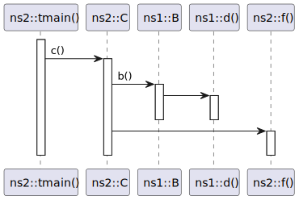
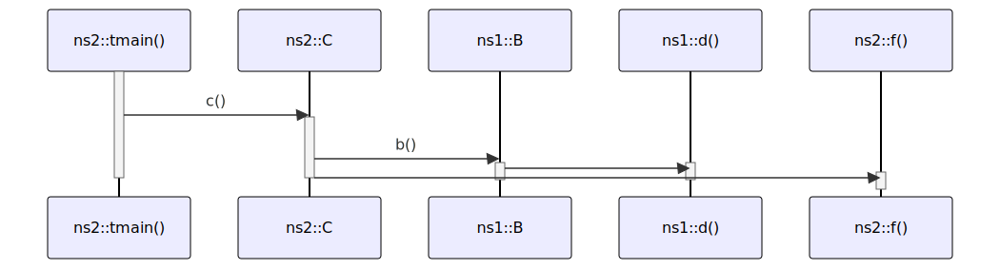

# t20055 - Test case for advanced filter in sequence diagram
## Config
```yaml
diagrams:
  t20055_sequence:
    type: sequence
    filter_mode: advanced
    glob:
      - t20055.cc
    include:
      anyof:
        namespaces:
          - clanguml::t20055::ns2
        elements:
          - clanguml::t20055::ns1::B
          - clanguml::t20055::ns1::d()
    using_namespace: clanguml::t20055
    from:
      - function: "clanguml::t20055::ns2::tmain()"
```
## Source code
File `tests/t20055/t20055.cc`
```cpp
namespace clanguml {
namespace t20055 {
namespace ns1 {

void d() { }

struct A {
    void a() { }
};

struct B {
    A a;
    void b()
    {
        a.a();
        d();
    }
};

} // namespace ns1
namespace ns2 {
void f() { }
struct C {
    ns1::B b;
    void c()
    {
        b.b();
        f();
    }
};

void tmain()
{
    C c;
    c.c();
}

} // namespace ns2
}
}
```
## Generated PlantUML diagrams

## Generated Mermaid diagrams

## Generated JSON models
```json
{
  "diagram_type": "sequence",
  "name": "t20055_sequence",
  "participants": [
    {
      "display_name": "tmain()",
      "full_name": "clanguml::t20055::ns2::tmain()",
      "id": "5694173189272636379",
      "name": "tmain",
      "namespace": "clanguml::t20055::ns2",
      "source_location": {
        "column": 6,
        "file": "t20055.cc",
        "line": 32,
        "translation_unit": "t20055.cc"
      },
      "type": "function"
    },
    {
      "activities": [
        {
          "display_name": "c()",
          "full_name": "clanguml::t20055::ns2::C::c()",
          "id": "10990692099772640575",
          "name": "c",
          "namespace": "clanguml::t20055::ns2",
          "source_location": {
            "column": 10,
            "file": "t20055.cc",
            "line": 25,
            "translation_unit": "t20055.cc"
          },
          "type": "method"
        }
      ],
      "display_name": "ns2::C",
      "full_name": "clanguml::t20055::ns2::C",
      "id": "1420290765769466590",
      "name": "C",
      "namespace": "clanguml::t20055::ns2",
      "source_location": {
        "column": 8,
        "file": "t20055.cc",
        "line": 23,
        "translation_unit": "t20055.cc"
      },
      "type": "class"
    },
    {
      "activities": [
        {
          "display_name": "b()",
          "full_name": "clanguml::t20055::ns1::B::b()",
          "id": "10964116862137631577",
          "name": "b",
          "namespace": "clanguml::t20055::ns1",
          "source_location": {
            "column": 10,
            "file": "t20055.cc",
            "line": 13,
            "translation_unit": "t20055.cc"
          },
          "type": "method"
        }
      ],
      "display_name": "ns1::B",
      "full_name": "clanguml::t20055::ns1::B",
      "id": "805503604450527441",
      "name": "B",
      "namespace": "clanguml::t20055::ns1",
      "source_location": {
        "column": 8,
        "file": "t20055.cc",
        "line": 11,
        "translation_unit": "t20055.cc"
      },
      "type": "class"
    },
    {
      "display_name": "d()",
      "full_name": "clanguml::t20055::ns1::d()",
      "id": "16751186802686619072",
      "name": "d",
      "namespace": "clanguml::t20055::ns1",
      "source_location": {
        "column": 6,
        "file": "t20055.cc",
        "line": 5,
        "translation_unit": "t20055.cc"
      },
      "type": "function"
    },
    {
      "display_name": "f()",
      "full_name": "clanguml::t20055::ns2::f()",
      "id": "13923933757393811605",
      "name": "f",
      "namespace": "clanguml::t20055::ns2",
      "source_location": {
        "column": 6,
        "file": "t20055.cc",
        "line": 22,
        "translation_unit": "t20055.cc"
      },
      "type": "function"
    }
  ],
  "sequences": [
    {
      "messages": [
        {
          "from": {
            "activity_id": "5694173189272636379",
            "participant_id": "5694173189272636379"
          },
          "name": "c()",
          "return_type": "void",
          "scope": "normal",
          "source_location": {
            "column": 5,
            "file": "t20055.cc",
            "line": 35,
            "translation_unit": "t20055.cc"
          },
          "to": {
            "activity_id": "10990692099772640575",
            "participant_id": "1420290765769466590"
          },
          "type": "message"
        },
        {
          "from": {
            "activity_id": "10990692099772640575",
            "participant_id": "1420290765769466590"
          },
          "name": "b()",
          "return_type": "void",
          "scope": "normal",
          "source_location": {
            "column": 9,
            "file": "t20055.cc",
            "line": 27,
            "translation_unit": "t20055.cc"
          },
          "to": {
            "activity_id": "10964116862137631577",
            "participant_id": "805503604450527441"
          },
          "type": "message"
        },
        {
          "from": {
            "activity_id": "10964116862137631577",
            "participant_id": "805503604450527441"
          },
          "name": "",
          "return_type": "void",
          "scope": "normal",
          "source_location": {
            "column": 9,
            "file": "t20055.cc",
            "line": 16,
            "translation_unit": "t20055.cc"
          },
          "to": {
            "activity_id": "16751186802686619072",
            "participant_id": "16751186802686619072"
          },
          "type": "message"
        },
        {
          "from": {
            "activity_id": "10990692099772640575",
            "participant_id": "1420290765769466590"
          },
          "name": "",
          "return_type": "void",
          "scope": "normal",
          "source_location": {
            "column": 9,
            "file": "t20055.cc",
            "line": 28,
            "translation_unit": "t20055.cc"
          },
          "to": {
            "activity_id": "13923933757393811605",
            "participant_id": "13923933757393811605"
          },
          "type": "message"
        }
      ],
      "start_from": {
        "id": "5694173189272636379",
        "location": "clanguml::t20055::ns2::tmain()"
      }
    }
  ],
  "using_namespace": "clanguml::t20055"
}
```
