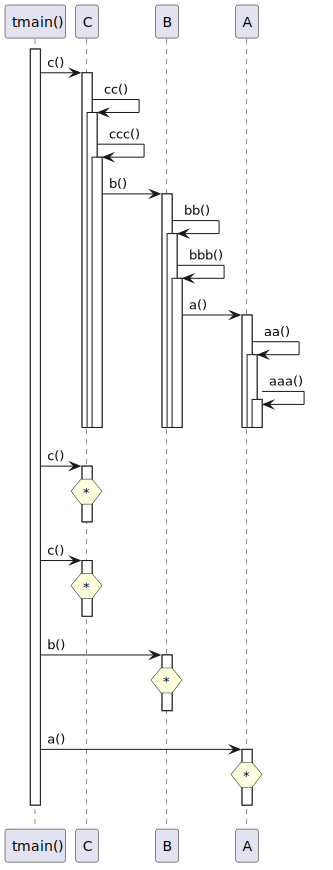
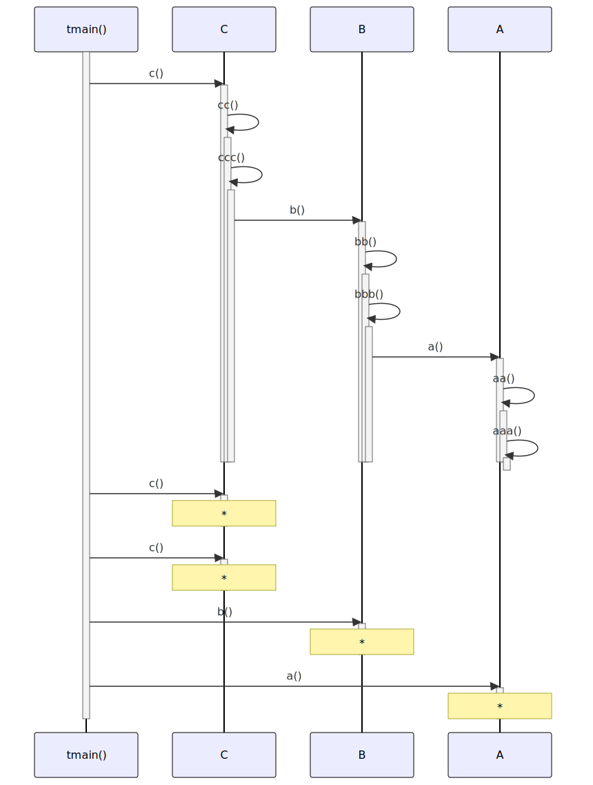

# t20056 - Test case for option to fold repeated activities in sequence diagram
## Config
```yaml
diagrams:
  t20056_sequence:
    type: sequence
    glob:
      - t20056.cc
    include:
      namespaces:
        - clanguml::t20056
    using_namespace: clanguml::t20056
    fold_repeated_activities: true
    from:
      - function: "clanguml::t20056::tmain()"
```
## Source code
File `tests/t20056/t20056.cc`
```cpp
namespace clanguml {
namespace t20056 {
struct A {
    void a() { aa(); }

    void aa() { aaa(); }

    void aaa() { }
};

struct B {
    void b() { bb(); }

    void bb() { bbb(); }

    void bbb() { a.a(); }

    A a;
};

struct C {
    void c() { cc(); }

    void cc() { ccc(); }

    void ccc() { b.b(); }

    B b;
};

void tmain()
{
    A a;
    B b;
    C c;

    c.c();
    c.c();
    c.c();

    b.b();

    a.a();
}
}
}

```
## Generated PlantUML diagrams

## Generated Mermaid diagrams

## Generated JSON models
```json
{
  "diagram_type": "sequence",
  "name": "t20056_sequence",
  "participants": [
    {
      "display_name": "tmain()",
      "full_name": "clanguml::t20056::tmain()",
      "id": "10541962459546081913",
      "name": "tmain",
      "namespace": "clanguml::t20056",
      "source_location": {
        "column": 6,
        "file": "t20056.cc",
        "line": 31,
        "translation_unit": "t20056.cc"
      },
      "type": "function"
    },
    {
      "activities": [
        {
          "display_name": "c()",
          "full_name": "clanguml::t20056::C::c()",
          "id": "11950739467563456716",
          "name": "c",
          "namespace": "clanguml::t20056",
          "source_location": {
            "column": 10,
            "file": "t20056.cc",
            "line": 22,
            "translation_unit": "t20056.cc"
          },
          "type": "method"
        },
        {
          "display_name": "cc()",
          "full_name": "clanguml::t20056::C::cc()",
          "id": "10539225853793705156",
          "name": "cc",
          "namespace": "clanguml::t20056",
          "source_location": {
            "column": 10,
            "file": "t20056.cc",
            "line": 24,
            "translation_unit": "t20056.cc"
          },
          "type": "method"
        },
        {
          "display_name": "ccc()",
          "full_name": "clanguml::t20056::C::ccc()",
          "id": "2410372461849190662",
          "name": "ccc",
          "namespace": "clanguml::t20056",
          "source_location": {
            "column": 10,
            "file": "t20056.cc",
            "line": 26,
            "translation_unit": "t20056.cc"
          },
          "type": "method"
        }
      ],
      "display_name": "C",
      "full_name": "clanguml::t20056::C",
      "id": "15642967843322422621",
      "name": "C",
      "namespace": "clanguml::t20056",
      "source_location": {
        "column": 8,
        "file": "t20056.cc",
        "line": 21,
        "translation_unit": "t20056.cc"
      },
      "type": "class"
    },
    {
      "activities": [
        {
          "display_name": "b()",
          "full_name": "clanguml::t20056::B::b()",
          "id": "7986216733475153161",
          "name": "b",
          "namespace": "clanguml::t20056",
          "source_location": {
            "column": 10,
            "file": "t20056.cc",
            "line": 12,
            "translation_unit": "t20056.cc"
          },
          "type": "method"
        },
        {
          "display_name": "bb()",
          "full_name": "clanguml::t20056::B::bb()",
          "id": "3781555556909464259",
          "name": "bb",
          "namespace": "clanguml::t20056",
          "source_location": {
            "column": 10,
            "file": "t20056.cc",
            "line": 14,
            "translation_unit": "t20056.cc"
          },
          "type": "method"
        },
        {
          "display_name": "bbb()",
          "full_name": "clanguml::t20056::B::bbb()",
          "id": "746554800106899063",
          "name": "bbb",
          "namespace": "clanguml::t20056",
          "source_location": {
            "column": 10,
            "file": "t20056.cc",
            "line": 16,
            "translation_unit": "t20056.cc"
          },
          "type": "method"
        }
      ],
      "display_name": "B",
      "full_name": "clanguml::t20056::B",
      "id": "13758851017544919831",
      "name": "B",
      "namespace": "clanguml::t20056",
      "source_location": {
        "column": 8,
        "file": "t20056.cc",
        "line": 11,
        "translation_unit": "t20056.cc"
      },
      "type": "class"
    },
    {
      "activities": [
        {
          "display_name": "a()",
          "full_name": "clanguml::t20056::A::a()",
          "id": "2882103625311432557",
          "name": "a",
          "namespace": "clanguml::t20056",
          "source_location": {
            "column": 10,
            "file": "t20056.cc",
            "line": 4,
            "translation_unit": "t20056.cc"
          },
          "type": "method"
        },
        {
          "display_name": "aa()",
          "full_name": "clanguml::t20056::A::aa()",
          "id": "6261940749885153451",
          "name": "aa",
          "namespace": "clanguml::t20056",
          "source_location": {
            "column": 10,
            "file": "t20056.cc",
            "line": 6,
            "translation_unit": "t20056.cc"
          },
          "type": "method"
        },
        {
          "display_name": "aaa()",
          "full_name": "clanguml::t20056::A::aaa()",
          "id": "11007241124146846173",
          "name": "aaa",
          "namespace": "clanguml::t20056",
          "source_location": {
            "column": 10,
            "file": "t20056.cc",
            "line": 8,
            "translation_unit": "t20056.cc"
          },
          "type": "method"
        }
      ],
      "display_name": "A",
      "full_name": "clanguml::t20056::A",
      "id": "10505602618831725657",
      "name": "A",
      "namespace": "clanguml::t20056",
      "source_location": {
        "column": 8,
        "file": "t20056.cc",
        "line": 3,
        "translation_unit": "t20056.cc"
      },
      "type": "class"
    }
  ],
  "sequences": [
    {
      "from": {
        "id": "10541962459546081913",
        "location": "clanguml::t20056::tmain()"
      },
      "messages": [
        {
          "from": {
            "activity_id": "10541962459546081913",
            "participant_id": "10541962459546081913"
          },
          "name": "c()",
          "return_type": "void",
          "scope": "normal",
          "source_location": {
            "column": 5,
            "file": "t20056.cc",
            "line": 37,
            "translation_unit": "t20056.cc"
          },
          "to": {
            "activity_id": "11950739467563456716",
            "participant_id": "15642967843322422621"
          },
          "type": "message"
        },
        {
          "from": {
            "activity_id": "11950739467563456716",
            "participant_id": "15642967843322422621"
          },
          "name": "cc()",
          "return_type": "void",
          "scope": "normal",
          "source_location": {
            "column": 16,
            "file": "t20056.cc",
            "line": 22,
            "translation_unit": "t20056.cc"
          },
          "to": {
            "activity_id": "10539225853793705156",
            "participant_id": "15642967843322422621"
          },
          "type": "message"
        },
        {
          "from": {
            "activity_id": "10539225853793705156",
            "participant_id": "15642967843322422621"
          },
          "name": "ccc()",
          "return_type": "void",
          "scope": "normal",
          "source_location": {
            "column": 17,
            "file": "t20056.cc",
            "line": 24,
            "translation_unit": "t20056.cc"
          },
          "to": {
            "activity_id": "2410372461849190662",
            "participant_id": "15642967843322422621"
          },
          "type": "message"
        },
        {
          "from": {
            "activity_id": "2410372461849190662",
            "participant_id": "15642967843322422621"
          },
          "name": "b()",
          "return_type": "void",
          "scope": "normal",
          "source_location": {
            "column": 18,
            "file": "t20056.cc",
            "line": 26,
            "translation_unit": "t20056.cc"
          },
          "to": {
            "activity_id": "7986216733475153161",
            "participant_id": "13758851017544919831"
          },
          "type": "message"
        },
        {
          "from": {
            "activity_id": "7986216733475153161",
            "participant_id": "13758851017544919831"
          },
          "name": "bb()",
          "return_type": "void",
          "scope": "normal",
          "source_location": {
            "column": 16,
            "file": "t20056.cc",
            "line": 12,
            "translation_unit": "t20056.cc"
          },
          "to": {
            "activity_id": "3781555556909464259",
            "participant_id": "13758851017544919831"
          },
          "type": "message"
        },
        {
          "from": {
            "activity_id": "3781555556909464259",
            "participant_id": "13758851017544919831"
          },
          "name": "bbb()",
          "return_type": "void",
          "scope": "normal",
          "source_location": {
            "column": 17,
            "file": "t20056.cc",
            "line": 14,
            "translation_unit": "t20056.cc"
          },
          "to": {
            "activity_id": "746554800106899063",
            "participant_id": "13758851017544919831"
          },
          "type": "message"
        },
        {
          "from": {
            "activity_id": "746554800106899063",
            "participant_id": "13758851017544919831"
          },
          "name": "a()",
          "return_type": "void",
          "scope": "normal",
          "source_location": {
            "column": 18,
            "file": "t20056.cc",
            "line": 16,
            "translation_unit": "t20056.cc"
          },
          "to": {
            "activity_id": "2882103625311432557",
            "participant_id": "10505602618831725657"
          },
          "type": "message"
        },
        {
          "from": {
            "activity_id": "2882103625311432557",
            "participant_id": "10505602618831725657"
          },
          "name": "aa()",
          "return_type": "void",
          "scope": "normal",
          "source_location": {
            "column": 16,
            "file": "t20056.cc",
            "line": 4,
            "translation_unit": "t20056.cc"
          },
          "to": {
            "activity_id": "6261940749885153451",
            "participant_id": "10505602618831725657"
          },
          "type": "message"
        },
        {
          "from": {
            "activity_id": "6261940749885153451",
            "participant_id": "10505602618831725657"
          },
          "name": "aaa()",
          "return_type": "void",
          "scope": "normal",
          "source_location": {
            "column": 17,
            "file": "t20056.cc",
            "line": 6,
            "translation_unit": "t20056.cc"
          },
          "to": {
            "activity_id": "11007241124146846173",
            "participant_id": "10505602618831725657"
          },
          "type": "message"
        },
        {
          "from": {
            "activity_id": "10541962459546081913",
            "participant_id": "10541962459546081913"
          },
          "name": "c()",
          "return_type": "void",
          "scope": "normal",
          "source_location": {
            "column": 5,
            "file": "t20056.cc",
            "line": 38,
            "translation_unit": "t20056.cc"
          },
          "to": {
            "activity_id": "11950739467563456716",
            "participant_id": "15642967843322422621"
          },
          "type": "message"
        },
        {
          "from": {
            "activity_id": "11950739467563456716",
            "participant_id": "15642967843322422621"
          },
          "name": "cc()",
          "return_type": "void",
          "scope": "normal",
          "source_location": {
            "column": 16,
            "file": "t20056.cc",
            "line": 22,
            "translation_unit": "t20056.cc"
          },
          "to": {
            "activity_id": "10539225853793705156",
            "participant_id": "15642967843322422621"
          },
          "type": "message"
        },
        {
          "from": {
            "activity_id": "10539225853793705156",
            "participant_id": "15642967843322422621"
          },
          "name": "ccc()",
          "return_type": "void",
          "scope": "normal",
          "source_location": {
            "column": 17,
            "file": "t20056.cc",
            "line": 24,
            "translation_unit": "t20056.cc"
          },
          "to": {
            "activity_id": "2410372461849190662",
            "participant_id": "15642967843322422621"
          },
          "type": "message"
        },
        {
          "from": {
            "activity_id": "2410372461849190662",
            "participant_id": "15642967843322422621"
          },
          "name": "b()",
          "return_type": "void",
          "scope": "normal",
          "source_location": {
            "column": 18,
            "file": "t20056.cc",
            "line": 26,
            "translation_unit": "t20056.cc"
          },
          "to": {
            "activity_id": "7986216733475153161",
            "participant_id": "13758851017544919831"
          },
          "type": "message"
        },
        {
          "from": {
            "activity_id": "7986216733475153161",
            "participant_id": "13758851017544919831"
          },
          "name": "bb()",
          "return_type": "void",
          "scope": "normal",
          "source_location": {
            "column": 16,
            "file": "t20056.cc",
            "line": 12,
            "translation_unit": "t20056.cc"
          },
          "to": {
            "activity_id": "3781555556909464259",
            "participant_id": "13758851017544919831"
          },
          "type": "message"
        },
        {
          "from": {
            "activity_id": "3781555556909464259",
            "participant_id": "13758851017544919831"
          },
          "name": "bbb()",
          "return_type": "void",
          "scope": "normal",
          "source_location": {
            "column": 17,
            "file": "t20056.cc",
            "line": 14,
            "translation_unit": "t20056.cc"
          },
          "to": {
            "activity_id": "746554800106899063",
            "participant_id": "13758851017544919831"
          },
          "type": "message"
        },
        {
          "from": {
            "activity_id": "746554800106899063",
            "participant_id": "13758851017544919831"
          },
          "name": "a()",
          "return_type": "void",
          "scope": "normal",
          "source_location": {
            "column": 18,
            "file": "t20056.cc",
            "line": 16,
            "translation_unit": "t20056.cc"
          },
          "to": {
            "activity_id": "2882103625311432557",
            "participant_id": "10505602618831725657"
          },
          "type": "message"
        },
        {
          "from": {
            "activity_id": "2882103625311432557",
            "participant_id": "10505602618831725657"
          },
          "name": "aa()",
          "return_type": "void",
          "scope": "normal",
          "source_location": {
            "column": 16,
            "file": "t20056.cc",
            "line": 4,
            "translation_unit": "t20056.cc"
          },
          "to": {
            "activity_id": "6261940749885153451",
            "participant_id": "10505602618831725657"
          },
          "type": "message"
        },
        {
          "from": {
            "activity_id": "6261940749885153451",
            "participant_id": "10505602618831725657"
          },
          "name": "aaa()",
          "return_type": "void",
          "scope": "normal",
          "source_location": {
            "column": 17,
            "file": "t20056.cc",
            "line": 6,
            "translation_unit": "t20056.cc"
          },
          "to": {
            "activity_id": "11007241124146846173",
            "participant_id": "10505602618831725657"
          },
          "type": "message"
        },
        {
          "from": {
            "activity_id": "10541962459546081913",
            "participant_id": "10541962459546081913"
          },
          "name": "c()",
          "return_type": "void",
          "scope": "normal",
          "source_location": {
            "column": 5,
            "file": "t20056.cc",
            "line": 39,
            "translation_unit": "t20056.cc"
          },
          "to": {
            "activity_id": "11950739467563456716",
            "participant_id": "15642967843322422621"
          },
          "type": "message"
        },
        {
          "from": {
            "activity_id": "11950739467563456716",
            "participant_id": "15642967843322422621"
          },
          "name": "cc()",
          "return_type": "void",
          "scope": "normal",
          "source_location": {
            "column": 16,
            "file": "t20056.cc",
            "line": 22,
            "translation_unit": "t20056.cc"
          },
          "to": {
            "activity_id": "10539225853793705156",
            "participant_id": "15642967843322422621"
          },
          "type": "message"
        },
        {
          "from": {
            "activity_id": "10539225853793705156",
            "participant_id": "15642967843322422621"
          },
          "name": "ccc()",
          "return_type": "void",
          "scope": "normal",
          "source_location": {
            "column": 17,
            "file": "t20056.cc",
            "line": 24,
            "translation_unit": "t20056.cc"
          },
          "to": {
            "activity_id": "2410372461849190662",
            "participant_id": "15642967843322422621"
          },
          "type": "message"
        },
        {
          "from": {
            "activity_id": "2410372461849190662",
            "participant_id": "15642967843322422621"
          },
          "name": "b()",
          "return_type": "void",
          "scope": "normal",
          "source_location": {
            "column": 18,
            "file": "t20056.cc",
            "line": 26,
            "translation_unit": "t20056.cc"
          },
          "to": {
            "activity_id": "7986216733475153161",
            "participant_id": "13758851017544919831"
          },
          "type": "message"
        },
        {
          "from": {
            "activity_id": "7986216733475153161",
            "participant_id": "13758851017544919831"
          },
          "name": "bb()",
          "return_type": "void",
          "scope": "normal",
          "source_location": {
            "column": 16,
            "file": "t20056.cc",
            "line": 12,
            "translation_unit": "t20056.cc"
          },
          "to": {
            "activity_id": "3781555556909464259",
            "participant_id": "13758851017544919831"
          },
          "type": "message"
        },
        {
          "from": {
            "activity_id": "3781555556909464259",
            "participant_id": "13758851017544919831"
          },
          "name": "bbb()",
          "return_type": "void",
          "scope": "normal",
          "source_location": {
            "column": 17,
            "file": "t20056.cc",
            "line": 14,
            "translation_unit": "t20056.cc"
          },
          "to": {
            "activity_id": "746554800106899063",
            "participant_id": "13758851017544919831"
          },
          "type": "message"
        },
        {
          "from": {
            "activity_id": "746554800106899063",
            "participant_id": "13758851017544919831"
          },
          "name": "a()",
          "return_type": "void",
          "scope": "normal",
          "source_location": {
            "column": 18,
            "file": "t20056.cc",
            "line": 16,
            "translation_unit": "t20056.cc"
          },
          "to": {
            "activity_id": "2882103625311432557",
            "participant_id": "10505602618831725657"
          },
          "type": "message"
        },
        {
          "from": {
            "activity_id": "2882103625311432557",
            "participant_id": "10505602618831725657"
          },
          "name": "aa()",
          "return_type": "void",
          "scope": "normal",
          "source_location": {
            "column": 16,
            "file": "t20056.cc",
            "line": 4,
            "translation_unit": "t20056.cc"
          },
          "to": {
            "activity_id": "6261940749885153451",
            "participant_id": "10505602618831725657"
          },
          "type": "message"
        },
        {
          "from": {
            "activity_id": "6261940749885153451",
            "participant_id": "10505602618831725657"
          },
          "name": "aaa()",
          "return_type": "void",
          "scope": "normal",
          "source_location": {
            "column": 17,
            "file": "t20056.cc",
            "line": 6,
            "translation_unit": "t20056.cc"
          },
          "to": {
            "activity_id": "11007241124146846173",
            "participant_id": "10505602618831725657"
          },
          "type": "message"
        },
        {
          "from": {
            "activity_id": "10541962459546081913",
            "participant_id": "10541962459546081913"
          },
          "name": "b()",
          "return_type": "void",
          "scope": "normal",
          "source_location": {
            "column": 5,
            "file": "t20056.cc",
            "line": 41,
            "translation_unit": "t20056.cc"
          },
          "to": {
            "activity_id": "7986216733475153161",
            "participant_id": "13758851017544919831"
          },
          "type": "message"
        },
        {
          "from": {
            "activity_id": "7986216733475153161",
            "participant_id": "13758851017544919831"
          },
          "name": "bb()",
          "return_type": "void",
          "scope": "normal",
          "source_location": {
            "column": 16,
            "file": "t20056.cc",
            "line": 12,
            "translation_unit": "t20056.cc"
          },
          "to": {
            "activity_id": "3781555556909464259",
            "participant_id": "13758851017544919831"
          },
          "type": "message"
        },
        {
          "from": {
            "activity_id": "3781555556909464259",
            "participant_id": "13758851017544919831"
          },
          "name": "bbb()",
          "return_type": "void",
          "scope": "normal",
          "source_location": {
            "column": 17,
            "file": "t20056.cc",
            "line": 14,
            "translation_unit": "t20056.cc"
          },
          "to": {
            "activity_id": "746554800106899063",
            "participant_id": "13758851017544919831"
          },
          "type": "message"
        },
        {
          "from": {
            "activity_id": "746554800106899063",
            "participant_id": "13758851017544919831"
          },
          "name": "a()",
          "return_type": "void",
          "scope": "normal",
          "source_location": {
            "column": 18,
            "file": "t20056.cc",
            "line": 16,
            "translation_unit": "t20056.cc"
          },
          "to": {
            "activity_id": "2882103625311432557",
            "participant_id": "10505602618831725657"
          },
          "type": "message"
        },
        {
          "from": {
            "activity_id": "2882103625311432557",
            "participant_id": "10505602618831725657"
          },
          "name": "aa()",
          "return_type": "void",
          "scope": "normal",
          "source_location": {
            "column": 16,
            "file": "t20056.cc",
            "line": 4,
            "translation_unit": "t20056.cc"
          },
          "to": {
            "activity_id": "6261940749885153451",
            "participant_id": "10505602618831725657"
          },
          "type": "message"
        },
        {
          "from": {
            "activity_id": "6261940749885153451",
            "participant_id": "10505602618831725657"
          },
          "name": "aaa()",
          "return_type": "void",
          "scope": "normal",
          "source_location": {
            "column": 17,
            "file": "t20056.cc",
            "line": 6,
            "translation_unit": "t20056.cc"
          },
          "to": {
            "activity_id": "11007241124146846173",
            "participant_id": "10505602618831725657"
          },
          "type": "message"
        },
        {
          "from": {
            "activity_id": "10541962459546081913",
            "participant_id": "10541962459546081913"
          },
          "name": "a()",
          "return_type": "void",
          "scope": "normal",
          "source_location": {
            "column": 5,
            "file": "t20056.cc",
            "line": 43,
            "translation_unit": "t20056.cc"
          },
          "to": {
            "activity_id": "2882103625311432557",
            "participant_id": "10505602618831725657"
          },
          "type": "message"
        },
        {
          "from": {
            "activity_id": "2882103625311432557",
            "participant_id": "10505602618831725657"
          },
          "name": "aa()",
          "return_type": "void",
          "scope": "normal",
          "source_location": {
            "column": 16,
            "file": "t20056.cc",
            "line": 4,
            "translation_unit": "t20056.cc"
          },
          "to": {
            "activity_id": "6261940749885153451",
            "participant_id": "10505602618831725657"
          },
          "type": "message"
        },
        {
          "from": {
            "activity_id": "6261940749885153451",
            "participant_id": "10505602618831725657"
          },
          "name": "aaa()",
          "return_type": "void",
          "scope": "normal",
          "source_location": {
            "column": 17,
            "file": "t20056.cc",
            "line": 6,
            "translation_unit": "t20056.cc"
          },
          "to": {
            "activity_id": "11007241124146846173",
            "participant_id": "10505602618831725657"
          },
          "type": "message"
        }
      ]
    }
  ],
  "using_namespace": "clanguml::t20056"
}
```
## Generated GraphML models
