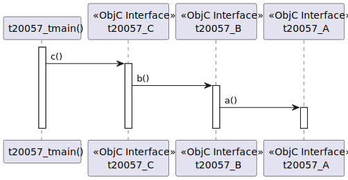
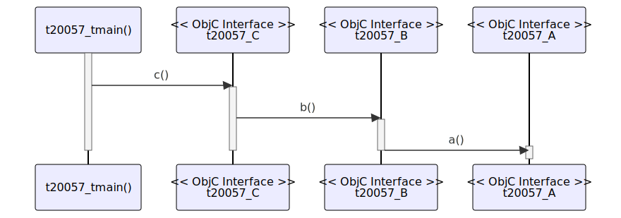

# t20057 - Basic Objective-C sequence diagram test case
## Config
```yaml
diagrams:
  t20057_sequence:
    type: sequence
    glob:
      - t20057.m
    include:
      paths:
        - .
    from:
      - function: "t20057_tmain()"
```
## Source code
File `tests/t20057/t20057.m`
```cpp
#import <Foundation/Foundation.h>

// Interface for t20057_A
@interface t20057_A : NSObject
- (void)a;
@end

// Implementation for t20057_A
@implementation t20057_A
- (void)a
{
}
@end

// Interface for t20057_B
@interface t20057_B : NSObject
- (void)b;
@end

// Implementation for t20057_B
@implementation t20057_B {
    t20057_A *a;
}

- (void)b
{
    [a a]; // Calling method a
}
@end

// Interface for t20057_C
@interface t20057_C : NSObject
- (void)c;
@end

// Implementation for t20057_C
@implementation t20057_C {
    t20057_B *b;
}

- (void)c
{
    [b b]; // Calling method b
}
@end

// Main function
int t20057_tmain()
{
    @autoreleasepool {
        t20057_C *c = [[t20057_C alloc] init];
        [c c];
    }
    return 0;
}
```
## Generated PlantUML diagrams

## Generated Mermaid diagrams

## Generated JSON models
```json
{
  "diagram_type": "sequence",
  "name": "t20057_sequence",
  "participants": [
    {
      "display_name": "t20057_tmain()",
      "full_name": "t20057_tmain()",
      "id": "7367936797724848265",
      "name": "t20057_tmain",
      "namespace": "",
      "source_location": {
        "column": 5,
        "file": "t20057.m",
        "line": 48,
        "translation_unit": "t20057.m"
      },
      "type": "function"
    },
    {
      "activities": [
        {
          "display_name": "c()",
          "full_name": "t20057_C::c()",
          "id": "7164749850054089319",
          "name": "c",
          "namespace": "",
          "source_location": {
            "column": 1,
            "file": "t20057.m",
            "line": 33,
            "translation_unit": "t20057.m"
          },
          "type": "objc_method"
        }
      ],
      "display_name": "t20057_C",
      "full_name": "t20057_C",
      "id": "7340180495646969606",
      "name": "t20057_C",
      "namespace": "",
      "source_location": {
        "column": 12,
        "file": "t20057.m",
        "line": 32,
        "translation_unit": "t20057.m"
      },
      "type": "objc_interface"
    },
    {
      "activities": [
        {
          "display_name": "b()",
          "full_name": "t20057_B::b()",
          "id": "1717545124188320473",
          "name": "b",
          "namespace": "",
          "source_location": {
            "column": 1,
            "file": "t20057.m",
            "line": 17,
            "translation_unit": "t20057.m"
          },
          "type": "objc_method"
        }
      ],
      "display_name": "t20057_B",
      "full_name": "t20057_B",
      "id": "15049583035715682363",
      "name": "t20057_B",
      "namespace": "",
      "source_location": {
        "column": 12,
        "file": "t20057.m",
        "line": 16,
        "translation_unit": "t20057.m"
      },
      "type": "objc_interface"
    },
    {
      "activities": [
        {
          "display_name": "a()",
          "full_name": "t20057_A::a()",
          "id": "7787584773946851018",
          "name": "a",
          "namespace": "",
          "source_location": {
            "column": 1,
            "file": "t20057.m",
            "line": 5,
            "translation_unit": "t20057.m"
          },
          "type": "objc_method"
        }
      ],
      "display_name": "t20057_A",
      "full_name": "t20057_A",
      "id": "14212460538750019099",
      "name": "t20057_A",
      "namespace": "",
      "source_location": {
        "column": 12,
        "file": "t20057.m",
        "line": 4,
        "translation_unit": "t20057.m"
      },
      "type": "objc_interface"
    }
  ],
  "sequences": [
    {
      "from": {
        "id": "7367936797724848265",
        "location": "t20057_tmain()"
      },
      "messages": [
        {
          "from": {
            "activity_id": "7367936797724848265",
            "participant_id": "7367936797724848265"
          },
          "name": "c()",
          "return_type": "void",
          "scope": "normal",
          "source_location": {
            "column": 9,
            "file": "t20057.m",
            "line": 52,
            "translation_unit": "t20057.m"
          },
          "to": {
            "activity_id": "7164749850054089319",
            "participant_id": "7340180495646969606"
          },
          "type": "message"
        },
        {
          "from": {
            "activity_id": "7164749850054089319",
            "participant_id": "7340180495646969606"
          },
          "name": "b()",
          "return_type": "void",
          "scope": "normal",
          "source_location": {
            "column": 5,
            "file": "t20057.m",
            "line": 43,
            "translation_unit": "t20057.m"
          },
          "to": {
            "activity_id": "1717545124188320473",
            "participant_id": "15049583035715682363"
          },
          "type": "message"
        },
        {
          "from": {
            "activity_id": "1717545124188320473",
            "participant_id": "15049583035715682363"
          },
          "name": "a()",
          "return_type": "void",
          "scope": "normal",
          "source_location": {
            "column": 5,
            "file": "t20057.m",
            "line": 27,
            "translation_unit": "t20057.m"
          },
          "to": {
            "activity_id": "7787584773946851018",
            "participant_id": "14212460538750019099"
          },
          "type": "message"
        }
      ]
    }
  ]
}
```
## Generated GraphML models
