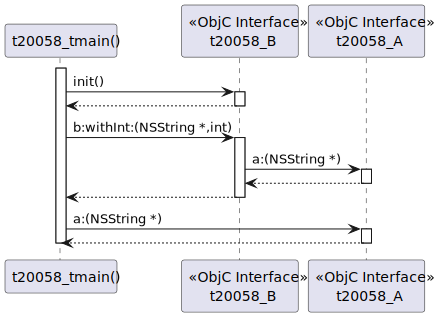
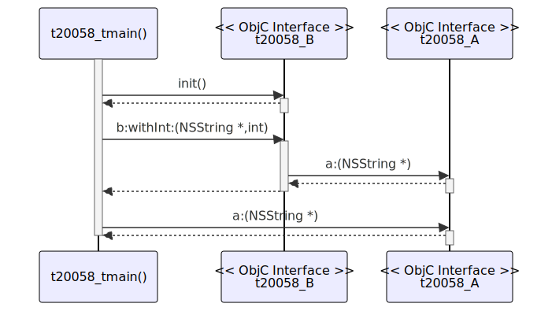

# t20058 - Objective-C sequence diagram with method params test case
## Config
```yaml
diagrams:
  t20058_sequence:
    type: sequence
    glob:
      - t20058.m
    include:
      paths:
        - .
    from:
      - function: "t20058_tmain()"
```
## Source code
File `tests/t20058/t20058.m`
```cpp
#import <Foundation/Foundation.h>

@interface t20058_A : NSObject
- (NSString *)a:(NSString *)inputString;
@end

@implementation t20058_A
- (NSString *)a:(NSString *)inputString
{
    return [NSString stringWithFormat:@"a%@", inputString];
}
@end

@interface t20058_B : NSObject
- (NSString *)b:(NSString *)inputString withInt:(int)number;
@end

@implementation t20058_B {
    t20058_A *a;
}

- (instancetype)init
{
    self = [super init];
    if (self) {
        a = [[t20058_A alloc] init];
    }
    return self;
}

- (NSString *)b:(NSString *)inputString withInt:(int)number
{
    NSString *modifiedString =
        [inputString stringByAppendingFormat:@"%d", number];

    NSString *result = [a a:modifiedString];

    return result;
}
@end

int t20058_tmain()
{
    @autoreleasepool {
        t20058_B *b = [[t20058_B alloc] init];
        NSString *result = [b b:@"t20058_string" withInt:42];

        t20058_A *a = [[t20058_A alloc] init];

        NSString *result2 = [a a:@"t20058_string"];

        (void)result;
        (void)result2;
    }
    return 0;
}
```
## Generated PlantUML diagrams

## Generated Mermaid diagrams

## Generated JSON models
```json
{
  "diagram_type": "sequence",
  "name": "t20058_sequence",
  "participants": [
    {
      "display_name": "t20058_tmain()",
      "full_name": "t20058_tmain()",
      "id": "705623768815145341",
      "name": "t20058_tmain",
      "namespace": "",
      "source_location": {
        "column": 5,
        "file": "t20058.m",
        "line": 42,
        "translation_unit": "t20058.m"
      },
      "type": "function"
    },
    {
      "activities": [
        {
          "display_name": "init()",
          "full_name": "t20058_B::init()",
          "id": "10468086999792048432",
          "name": "init",
          "namespace": "",
          "source_location": {
            "column": 1,
            "file": "t20058.m",
            "line": 22,
            "translation_unit": "t20058.m"
          },
          "type": "objc_method"
        },
        {
          "display_name": "b:withInt:(NSString *,int)",
          "full_name": "t20058_B::b:withInt:(NSString *,int)",
          "id": "2218757877126785553",
          "name": "b:withInt:",
          "namespace": "",
          "source_location": {
            "column": 1,
            "file": "t20058.m",
            "line": 15,
            "translation_unit": "t20058.m"
          },
          "type": "objc_method"
        }
      ],
      "display_name": "t20058_B",
      "full_name": "t20058_B",
      "id": "14022936655374993843",
      "name": "t20058_B",
      "namespace": "",
      "source_location": {
        "column": 12,
        "file": "t20058.m",
        "line": 14,
        "translation_unit": "t20058.m"
      },
      "type": "objc_interface"
    },
    {
      "activities": [
        {
          "display_name": "a:(NSString *)",
          "full_name": "t20058_A::a:(NSString *)",
          "id": "2210474935181323419",
          "name": "a:",
          "namespace": "",
          "source_location": {
            "column": 1,
            "file": "t20058.m",
            "line": 4,
            "translation_unit": "t20058.m"
          },
          "type": "objc_method"
        }
      ],
      "display_name": "t20058_A",
      "full_name": "t20058_A",
      "id": "1831888322037632295",
      "name": "t20058_A",
      "namespace": "",
      "source_location": {
        "column": 12,
        "file": "t20058.m",
        "line": 3,
        "translation_unit": "t20058.m"
      },
      "type": "objc_interface"
    }
  ],
  "sequences": [
    {
      "from": {
        "id": "705623768815145341",
        "location": "t20058_tmain()"
      },
      "messages": [
        {
          "from": {
            "activity_id": "705623768815145341",
            "participant_id": "705623768815145341"
          },
          "name": "init()",
          "return_type": "instancetype",
          "scope": "normal",
          "source_location": {
            "column": 23,
            "file": "t20058.m",
            "line": 45,
            "translation_unit": "t20058.m"
          },
          "to": {
            "activity_id": "10468086999792048432",
            "participant_id": "14022936655374993843"
          },
          "type": "message"
        },
        {
          "from": {
            "activity_id": "10468086999792048432",
            "participant_id": "14022936655374993843"
          },
          "name": "",
          "return_type": "instancetype",
          "scope": "normal",
          "source_location": {
            "column": 5,
            "file": "t20058.m",
            "line": 28,
            "translation_unit": "t20058.m"
          },
          "to": {
            "activity_id": "705623768815145341",
            "participant_id": "705623768815145341"
          },
          "type": "return"
        },
        {
          "from": {
            "activity_id": "705623768815145341",
            "participant_id": "705623768815145341"
          },
          "name": "b:withInt:(NSString *,int)",
          "return_type": "NSString *",
          "scope": "normal",
          "source_location": {
            "column": 28,
            "file": "t20058.m",
            "line": 46,
            "translation_unit": "t20058.m"
          },
          "to": {
            "activity_id": "2218757877126785553",
            "participant_id": "14022936655374993843"
          },
          "type": "message"
        },
        {
          "from": {
            "activity_id": "2218757877126785553",
            "participant_id": "14022936655374993843"
          },
          "name": "a:(NSString *)",
          "return_type": "NSString *",
          "scope": "normal",
          "source_location": {
            "column": 24,
            "file": "t20058.m",
            "line": 36,
            "translation_unit": "t20058.m"
          },
          "to": {
            "activity_id": "2210474935181323419",
            "participant_id": "1831888322037632295"
          },
          "type": "message"
        },
        {
          "from": {
            "activity_id": "2210474935181323419",
            "participant_id": "1831888322037632295"
          },
          "name": "",
          "return_type": "NSString *",
          "scope": "normal",
          "source_location": {
            "column": 5,
            "file": "t20058.m",
            "line": 10,
            "translation_unit": "t20058.m"
          },
          "to": {
            "activity_id": "2218757877126785553",
            "participant_id": "14022936655374993843"
          },
          "type": "return"
        },
        {
          "from": {
            "activity_id": "2218757877126785553",
            "participant_id": "14022936655374993843"
          },
          "name": "",
          "return_type": "NSString *",
          "scope": "normal",
          "source_location": {
            "column": 5,
            "file": "t20058.m",
            "line": 38,
            "translation_unit": "t20058.m"
          },
          "to": {
            "activity_id": "705623768815145341",
            "participant_id": "705623768815145341"
          },
          "type": "return"
        },
        {
          "from": {
            "activity_id": "705623768815145341",
            "participant_id": "705623768815145341"
          },
          "name": "a:(NSString *)",
          "return_type": "NSString *",
          "scope": "normal",
          "source_location": {
            "column": 29,
            "file": "t20058.m",
            "line": 50,
            "translation_unit": "t20058.m"
          },
          "to": {
            "activity_id": "2210474935181323419",
            "participant_id": "1831888322037632295"
          },
          "type": "message"
        },
        {
          "from": {
            "activity_id": "2210474935181323419",
            "participant_id": "1831888322037632295"
          },
          "name": "",
          "return_type": "NSString *",
          "scope": "normal",
          "source_location": {
            "column": 5,
            "file": "t20058.m",
            "line": 10,
            "translation_unit": "t20058.m"
          },
          "to": {
            "activity_id": "705623768815145341",
            "participant_id": "705623768815145341"
          },
          "type": "return"
        }
      ]
    }
  ]
}
```
## Generated GraphML models
