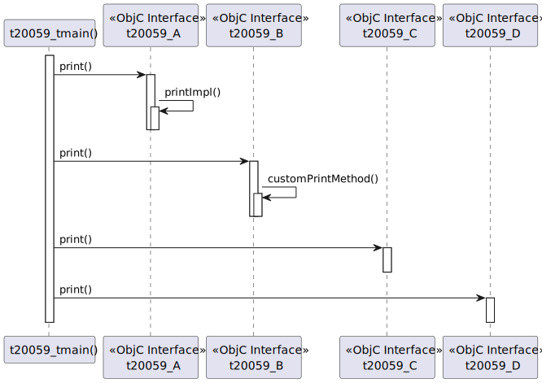
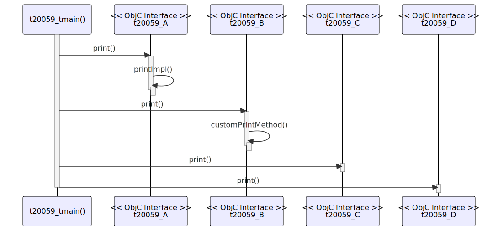

# t20059 - Objective-C sequence diagram with polymorphism test case
## Config
```yaml
diagrams:
  t20059_sequence:
    type: sequence
    glob:
      - t20059.m
    include:
      paths:
        - .
    exclude:
      elements:
        - type: objc_method
          name: t20059_A::logA
    from:
      - function: "t20059_tmain()"
```
## Source code
File `tests/t20059/t20059.m`
```cpp
#import <Foundation/Foundation.h>

@protocol t20059_CommonProtocol <NSObject>
- (void)print;
@end

@interface t20059_A : NSObject <t20059_CommonProtocol>
@end

@implementation t20059_A

- (void)printImpl
{
    NSLog(@"t20059_A: Called print_impl method");
}

- (void)logA {
}

- (void)print
{
    [self logA];
    [self printImpl];
}

@end

@interface t20059_B : NSObject <t20059_CommonProtocol>
@end

@implementation t20059_B

- (void)customPrintMethod
{
    NSLog(@"t20059_B: Called customPrintMethod method");
}

- (void)print
{
    [self customPrintMethod];
}

@end

@interface t20059_Base : NSObject
- (void)print;
@end

@implementation t20059_Base
- (void)print
{
}
@end

@interface t20059_C : t20059_Base
- (void)print;
@end

@implementation t20059_C
- (void)print
{
}
@end

@interface t20059_D : t20059_Base
- (void)print;
@end

@implementation t20059_D
- (void)print
{
}
@end

int t20059_tmain()
{
    @autoreleasepool {
        id<t20059_CommonProtocol> obj1 = [[t20059_A alloc] init];
        t20059_B *obj2 = [[t20059_B alloc] init];

        id obj3 = [[t20059_C alloc] init];
        t20059_D *obj4 = [[t20059_D alloc] init];

        [(t20059_A *)obj1 print];
        [obj2 print];
        [(t20059_C *)obj3 print];
        [obj4 print];
    }
    return 0;
}

```
## Generated PlantUML diagrams

## Generated Mermaid diagrams

## Generated JSON models
```json
{
  "diagram_type": "sequence",
  "name": "t20059_sequence",
  "participants": [
    {
      "display_name": "t20059_tmain()",
      "full_name": "t20059_tmain()",
      "id": "11470030053475532713",
      "name": "t20059_tmain",
      "namespace": "",
      "source_location": {
        "column": 5,
        "file": "t20059.m",
        "line": 75,
        "translation_unit": "t20059.m"
      },
      "type": "function"
    },
    {
      "activities": [
        {
          "display_name": "print()",
          "full_name": "t20059_A::print()",
          "id": "14242365977934220529",
          "name": "print",
          "namespace": "",
          "source_location": {
            "column": 1,
            "file": "t20059.m",
            "line": 20,
            "translation_unit": "t20059.m"
          },
          "type": "objc_method"
        },
        {
          "display_name": "printImpl()",
          "full_name": "t20059_A::printImpl()",
          "id": "13593289532373751402",
          "name": "printImpl",
          "namespace": "",
          "source_location": {
            "column": 1,
            "file": "t20059.m",
            "line": 12,
            "translation_unit": "t20059.m"
          },
          "type": "objc_method"
        }
      ],
      "display_name": "t20059_A",
      "full_name": "t20059_A",
      "id": "395279403108872317",
      "name": "t20059_A",
      "namespace": "",
      "source_location": {
        "column": 12,
        "file": "t20059.m",
        "line": 7,
        "translation_unit": "t20059.m"
      },
      "type": "objc_interface"
    },
    {
      "activities": [
        {
          "display_name": "print()",
          "full_name": "t20059_B::print()",
          "id": "5546669965816089707",
          "name": "print",
          "namespace": "",
          "source_location": {
            "column": 1,
            "file": "t20059.m",
            "line": 38,
            "translation_unit": "t20059.m"
          },
          "type": "objc_method"
        },
        {
          "display_name": "customPrintMethod()",
          "full_name": "t20059_B::customPrintMethod()",
          "id": "15042421686660650982",
          "name": "customPrintMethod",
          "namespace": "",
          "source_location": {
            "column": 1,
            "file": "t20059.m",
            "line": 33,
            "translation_unit": "t20059.m"
          },
          "type": "objc_method"
        }
      ],
      "display_name": "t20059_B",
      "full_name": "t20059_B",
      "id": "84573826834100561",
      "name": "t20059_B",
      "namespace": "",
      "source_location": {
        "column": 12,
        "file": "t20059.m",
        "line": 28,
        "translation_unit": "t20059.m"
      },
      "type": "objc_interface"
    },
    {
      "activities": [
        {
          "display_name": "print()",
          "full_name": "t20059_C::print()",
          "id": "18392901831034032807",
          "name": "print",
          "namespace": "",
          "source_location": {
            "column": 1,
            "file": "t20059.m",
            "line": 56,
            "translation_unit": "t20059.m"
          },
          "type": "objc_method"
        }
      ],
      "display_name": "t20059_C",
      "full_name": "t20059_C",
      "id": "3131183710548078404",
      "name": "t20059_C",
      "namespace": "",
      "source_location": {
        "column": 12,
        "file": "t20059.m",
        "line": 55,
        "translation_unit": "t20059.m"
      },
      "type": "objc_interface"
    },
    {
      "activities": [
        {
          "display_name": "print()",
          "full_name": "t20059_D::print()",
          "id": "9118040142895706017",
          "name": "print",
          "namespace": "",
          "source_location": {
            "column": 1,
            "file": "t20059.m",
            "line": 66,
            "translation_unit": "t20059.m"
          },
          "type": "objc_method"
        }
      ],
      "display_name": "t20059_D",
      "full_name": "t20059_D",
      "id": "6072364496750738059",
      "name": "t20059_D",
      "namespace": "",
      "source_location": {
        "column": 12,
        "file": "t20059.m",
        "line": 65,
        "translation_unit": "t20059.m"
      },
      "type": "objc_interface"
    }
  ],
  "sequences": [
    {
      "messages": [
        {
          "from": {
            "activity_id": "11470030053475532713",
            "participant_id": "11470030053475532713"
          },
          "name": "print()",
          "return_type": "void",
          "scope": "normal",
          "source_location": {
            "column": 9,
            "file": "t20059.m",
            "line": 84,
            "translation_unit": "t20059.m"
          },
          "to": {
            "activity_id": "14242365977934220529",
            "participant_id": "395279403108872317"
          },
          "type": "message"
        },
        {
          "from": {
            "activity_id": "14242365977934220529",
            "participant_id": "395279403108872317"
          },
          "name": "printImpl()",
          "return_type": "void",
          "scope": "normal",
          "source_location": {
            "column": 5,
            "file": "t20059.m",
            "line": 23,
            "translation_unit": "t20059.m"
          },
          "to": {
            "activity_id": "13593289532373751402",
            "participant_id": "395279403108872317"
          },
          "type": "message"
        },
        {
          "from": {
            "activity_id": "11470030053475532713",
            "participant_id": "11470030053475532713"
          },
          "name": "print()",
          "return_type": "void",
          "scope": "normal",
          "source_location": {
            "column": 9,
            "file": "t20059.m",
            "line": 85,
            "translation_unit": "t20059.m"
          },
          "to": {
            "activity_id": "5546669965816089707",
            "participant_id": "84573826834100561"
          },
          "type": "message"
        },
        {
          "from": {
            "activity_id": "5546669965816089707",
            "participant_id": "84573826834100561"
          },
          "name": "customPrintMethod()",
          "return_type": "void",
          "scope": "normal",
          "source_location": {
            "column": 5,
            "file": "t20059.m",
            "line": 40,
            "translation_unit": "t20059.m"
          },
          "to": {
            "activity_id": "15042421686660650982",
            "participant_id": "84573826834100561"
          },
          "type": "message"
        },
        {
          "from": {
            "activity_id": "11470030053475532713",
            "participant_id": "11470030053475532713"
          },
          "name": "print()",
          "return_type": "void",
          "scope": "normal",
          "source_location": {
            "column": 9,
            "file": "t20059.m",
            "line": 86,
            "translation_unit": "t20059.m"
          },
          "to": {
            "activity_id": "18392901831034032807",
            "participant_id": "3131183710548078404"
          },
          "type": "message"
        },
        {
          "from": {
            "activity_id": "11470030053475532713",
            "participant_id": "11470030053475532713"
          },
          "name": "print()",
          "return_type": "void",
          "scope": "normal",
          "source_location": {
            "column": 9,
            "file": "t20059.m",
            "line": 87,
            "translation_unit": "t20059.m"
          },
          "to": {
            "activity_id": "9118040142895706017",
            "participant_id": "6072364496750738059"
          },
          "type": "message"
        }
      ],
      "start_from": {
        "id": "11470030053475532713",
        "location": "t20059_tmain()"
      }
    }
  ]
}
```
## Generated GraphML models
