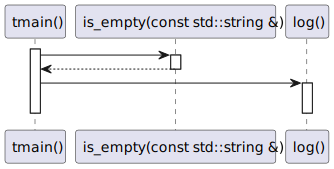

# t20060 - Test case for multiple lambda expressions in function calls arguments
## Config
```yaml
diagrams:
  t20060_sequence:
    type: sequence
    glob:
      - t20060.cc
    include:
      namespaces:
        - clanguml::t20060
    exclude:
      paths:
        - include/t20060.h
    using_namespace: clanguml::t20060
    from:
      - function: "clanguml::t20060::tmain()"
  t20060_sequence_inlined:
    type: sequence
    inline_lambda_messages: true
    glob:
      - t20060.cc
    include:
      namespaces:
        - clanguml::t20060
    exclude:
      paths:
        - include/t20060.h
    using_namespace: clanguml::t20060
    from:
      - function: "clanguml::t20060::tmain()"
```
## Source code
File `tests/t20060/t20060.cc`
```cpp
#include "include/t20060.h"

#include <string>
#include <vector>

namespace clanguml {
namespace t20060 {

bool is_empty(const std::string &t) { return t.empty(); }

void log() { }

void tmain()
{
    std::vector<std::string> vs;

    std::string out;

    util::for_each_if(
        vs, [](const auto &s) { return !is_empty(s); },
        [&](const auto &s) {
            log();
            out += s;
        });
}
}
}
```
File `tests/t20060/include/t20060.h`
```cpp
#include <algorithm>
#include <iterator>

namespace clanguml {
namespace t20060 {

namespace util {

template <typename T, typename C, typename F>
void for_each_if(const T &collection, C &&cond, F &&func)
{
    std::for_each(std::begin(collection), std::end(collection),
        [cond = std::forward<decltype(cond)>(cond),
            func = std::forward<decltype(func)>(func)](auto &e) mutable {
            if (cond(e))
                func(e);
        });
}
}

}
}
```
## Generated PlantUML diagrams


## Generated Mermaid diagrams


## Generated JSON models
```json
{
  "diagram_type": "sequence",
  "name": "t20060_sequence",
  "participants": [
    {
      "display_name": "tmain()",
      "full_name": "clanguml::t20060::tmain()",
      "id": "6272144118974387772",
      "name": "tmain",
      "namespace": "clanguml::t20060",
      "source_location": {
        "column": 6,
        "file": "t20060.cc",
        "line": 13,
        "translation_unit": "t20060.cc"
      },
      "type": "function"
    },
    {
      "activities": [
        {
          "display_name": "operator()(const auto &) const",
          "full_name": "clanguml::t20060::tmain()::(lambda t20060.cc:20:13)::operator()(const auto &) const",
          "id": "6206925177854029834",
          "name": "operator()",
          "namespace": "clanguml::t20060::tmain()",
          "type": "method"
        }
      ],
      "display_name": "tmain()::(lambda t20060.cc:20:13)",
      "full_name": "clanguml::t20060::tmain()::(lambda t20060.cc:20:13)",
      "id": "3098751609515063172",
      "name": "tmain()##(lambda t20060.cc:20:13)",
      "namespace": "clanguml::t20060",
      "source_location": {
        "column": 13,
        "file": "t20060.cc",
        "line": 20,
        "translation_unit": "t20060.cc"
      },
      "type": "lambda"
    },
    {
      "display_name": "is_empty(const std::string &)",
      "full_name": "clanguml::t20060::is_empty(const std::string &)",
      "id": "14984935264988568640",
      "name": "is_empty",
      "namespace": "clanguml::t20060",
      "source_location": {
        "column": 6,
        "file": "t20060.cc",
        "line": 9,
        "translation_unit": "t20060.cc"
      },
      "type": "function"
    },
    {
      "activities": [
        {
          "display_name": "operator()(const auto &) const",
          "full_name": "clanguml::t20060::tmain()::(lambda t20060.cc:21:9)::operator()(const auto &) const",
          "id": "15061693323365383981",
          "name": "operator()",
          "namespace": "clanguml::t20060::tmain()",
          "type": "method"
        }
      ],
      "display_name": "tmain()::(lambda t20060.cc:21:9)",
      "full_name": "clanguml::t20060::tmain()::(lambda t20060.cc:21:9)",
      "id": "15863261833722465427",
      "name": "tmain()##(lambda t20060.cc:21:9)",
      "namespace": "clanguml::t20060",
      "source_location": {
        "column": 9,
        "file": "t20060.cc",
        "line": 21,
        "translation_unit": "t20060.cc"
      },
      "type": "lambda"
    },
    {
      "display_name": "log()",
      "full_name": "clanguml::t20060::log()",
      "id": "3525343840309440075",
      "name": "log",
      "namespace": "clanguml::t20060",
      "source_location": {
        "column": 6,
        "file": "t20060.cc",
        "line": 11,
        "translation_unit": "t20060.cc"
      },
      "type": "function"
    }
  ],
  "sequences": [
    {
      "from": {
        "id": "6272144118974387772",
        "location": "clanguml::t20060::tmain()"
      },
      "messages": [
        {
          "from": {
            "activity_id": "6272144118974387772",
            "participant_id": "6272144118974387772"
          },
          "name": "operator()(const auto &) const",
          "return_type": "auto",
          "scope": "normal",
          "source_location": {
            "column": 13,
            "file": "t20060.cc",
            "line": 20,
            "translation_unit": "t20060.cc"
          },
          "to": {
            "activity_id": "6206925177854029834",
            "participant_id": "3098751609515063172"
          },
          "type": "message"
        },
        {
          "from": {
            "activity_id": "6206925177854029834",
            "participant_id": "3098751609515063172"
          },
          "name": "",
          "return_type": "bool",
          "scope": "normal",
          "source_location": {
            "column": 41,
            "file": "t20060.cc",
            "line": 20,
            "translation_unit": "t20060.cc"
          },
          "to": {
            "activity_id": "14984935264988568640",
            "participant_id": "14984935264988568640"
          },
          "type": "message"
        },
        {
          "from": {
            "activity_id": "6272144118974387772",
            "participant_id": "6272144118974387772"
          },
          "name": "operator()(const auto &) const",
          "return_type": "auto",
          "scope": "normal",
          "source_location": {
            "column": 9,
            "file": "t20060.cc",
            "line": 21,
            "translation_unit": "t20060.cc"
          },
          "to": {
            "activity_id": "15061693323365383981",
            "participant_id": "15863261833722465427"
          },
          "type": "message"
        },
        {
          "from": {
            "activity_id": "15061693323365383981",
            "participant_id": "15863261833722465427"
          },
          "name": "",
          "return_type": "void",
          "scope": "normal",
          "source_location": {
            "column": 13,
            "file": "t20060.cc",
            "line": 22,
            "translation_unit": "t20060.cc"
          },
          "to": {
            "activity_id": "3525343840309440075",
            "participant_id": "3525343840309440075"
          },
          "type": "message"
        }
      ]
    }
  ],
  "using_namespace": "clanguml::t20060"
}
```
```json
{
  "diagram_type": "sequence",
  "name": "t20060_sequence_inlined",
  "participants": [
    {
      "display_name": "tmain()",
      "full_name": "clanguml::t20060::tmain()",
      "id": "6272144118974387772",
      "name": "tmain",
      "namespace": "clanguml::t20060",
      "source_location": {
        "column": 6,
        "file": "t20060.cc",
        "line": 13,
        "translation_unit": "t20060.cc"
      },
      "type": "function"
    },
    {
      "display_name": "is_empty(const std::string &)",
      "full_name": "clanguml::t20060::is_empty(const std::string &)",
      "id": "14984935264988568640",
      "name": "is_empty",
      "namespace": "clanguml::t20060",
      "source_location": {
        "column": 6,
        "file": "t20060.cc",
        "line": 9,
        "translation_unit": "t20060.cc"
      },
      "type": "function"
    },
    {
      "display_name": "log()",
      "full_name": "clanguml::t20060::log()",
      "id": "3525343840309440075",
      "name": "log",
      "namespace": "clanguml::t20060",
      "source_location": {
        "column": 6,
        "file": "t20060.cc",
        "line": 11,
        "translation_unit": "t20060.cc"
      },
      "type": "function"
    }
  ],
  "sequences": [
    {
      "from": {
        "id": "6272144118974387772",
        "location": "clanguml::t20060::tmain()"
      },
      "messages": [
        {
          "from": {
            "activity_id": "6272144118974387772",
            "participant_id": "6272144118974387772"
          },
          "name": "",
          "return_type": "bool",
          "scope": "normal",
          "source_location": {
            "column": 41,
            "file": "t20060.cc",
            "line": 20,
            "translation_unit": "t20060.cc"
          },
          "to": {
            "activity_id": "14984935264988568640",
            "participant_id": "14984935264988568640"
          },
          "type": "message"
        },
        {
          "from": {
            "activity_id": "6272144118974387772",
            "participant_id": "6272144118974387772"
          },
          "name": "",
          "return_type": "void",
          "scope": "normal",
          "source_location": {
            "column": 13,
            "file": "t20060.cc",
            "line": 22,
            "translation_unit": "t20060.cc"
          },
          "to": {
            "activity_id": "3525343840309440075",
            "participant_id": "3525343840309440075"
          },
          "type": "message"
        }
      ]
    }
  ],
  "using_namespace": "clanguml::t20060"
}
```
## Generated GraphML models
