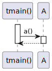

# t20061 - Test case for paths filter in sequence diagrams
## Config
```yaml
diagrams:
  t20061_sequence:
    type: sequence
    glob:
      - t20061.cc
    include:
      paths:
        - t20061.cc
    using_namespace: clanguml::t20061
    from:
      - function: "clanguml::t20061::tmain()"
```
## Source code
File `tests/t20061/t20061.cc`
```cpp
#include "include/t20061.h"

namespace clanguml {
namespace t20061 {
class A {
public:
    int a() { return b.b(); }

    B b;
};

int tmain()
{
    A a;
    return a.a();
}
}
}
```
File `tests/t20061/include/t20061.h`
```cpp
#pragma once

namespace clanguml {
namespace t20061 {
class B {
public:
    int b() { return 0; }
};
}
}
```
## Generated PlantUML diagrams

## Generated Mermaid diagrams

## Generated JSON models
```json
{
  "diagram_type": "sequence",
  "name": "t20061_sequence",
  "participants": [
    {
      "display_name": "tmain()",
      "full_name": "clanguml::t20061::tmain()",
      "id": "5439738381570841930",
      "name": "tmain",
      "namespace": "clanguml::t20061",
      "source_location": {
        "column": 5,
        "file": "t20061.cc",
        "line": 12,
        "translation_unit": "t20061.cc"
      },
      "type": "function"
    },
    {
      "activities": [
        {
          "display_name": "a()",
          "full_name": "clanguml::t20061::A::a()",
          "id": "1474227801340160703",
          "name": "a",
          "namespace": "clanguml::t20061",
          "source_location": {
            "column": 9,
            "file": "t20061.cc",
            "line": 7,
            "translation_unit": "t20061.cc"
          },
          "type": "method"
        }
      ],
      "display_name": "A",
      "full_name": "clanguml::t20061::A",
      "id": "1363859026989456551",
      "name": "A",
      "namespace": "clanguml::t20061",
      "source_location": {
        "column": 7,
        "file": "t20061.cc",
        "line": 5,
        "translation_unit": "t20061.cc"
      },
      "type": "class"
    }
  ],
  "sequences": [
    {
      "messages": [
        {
          "from": {
            "activity_id": "5439738381570841930",
            "participant_id": "5439738381570841930"
          },
          "name": "a()",
          "return_type": "int",
          "scope": "normal",
          "source_location": {
            "column": 12,
            "file": "t20061.cc",
            "line": 15,
            "translation_unit": "t20061.cc"
          },
          "to": {
            "activity_id": "1474227801340160703",
            "participant_id": "1363859026989456551"
          },
          "type": "message"
        }
      ],
      "start_from": {
        "id": "5439738381570841930",
        "location": "clanguml::t20061::tmain()"
      }
    }
  ],
  "using_namespace": "clanguml::t20061"
}
```
