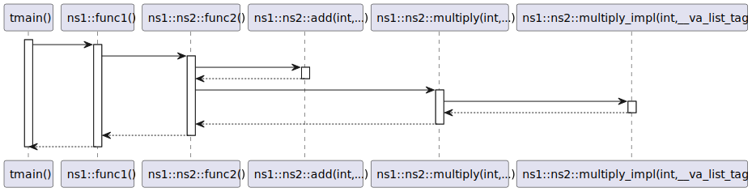
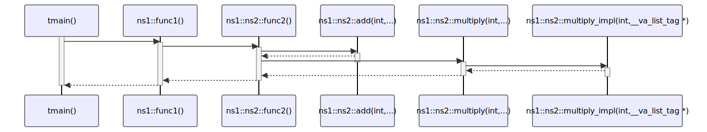

# t20062 - Test case with vaargs function in sequence diagrams
## Config
```yaml
diagrams:
  t20062_sequence:
    type: sequence
    glob:
      - t20062.cc
    include:
      paths:
        - .
    using_namespace: clanguml::t20062
    from:
      - function: "clanguml::t20062::tmain()"
```
## Source code
File `tests/t20062/t20062.cc`
```cpp
#include <cstdarg>

namespace clanguml::t20062 {
namespace ns1 {
namespace ns2 {
int func2();
} // namespace ns2

int func1() { return ns2::func2(); }

namespace ns2 {

int add(int count...)
{
    int result = 0;
    std::va_list args;
    va_start(args, count);
    for (int i = 0; i < count; ++i)
        result += va_arg(args, int);
    va_end(args);
    return result;
}

int multiply_impl(int count, va_list args)
{
    int result = 1;
    for (int i = 0; i < count; ++i)
        result *= va_arg(args, int);

    return result;
}

int multiply(int count, ...)
{
    std::va_list args;
    va_start(args, count);
    int result = multiply_impl(count, args);
    va_end(args);
    return result;
}

int func2() { return add(1, 2, 3, 4, 5) + multiply(6, 7, 8); }
} // namespace ns2
} // namespace ns1

int tmain() { return ns1::func1(); }

} // namespace clanguml::t20062
```
## Generated PlantUML diagrams

## Generated Mermaid diagrams

## Generated JSON models
```json
{
  "diagram_type": "sequence",
  "name": "t20062_sequence",
  "participants": [
    {
      "display_name": "tmain()",
      "full_name": "clanguml::t20062::tmain()",
      "id": "9795775336906338280",
      "name": "tmain",
      "namespace": "clanguml::t20062",
      "source_location": {
        "column": 5,
        "file": "t20062.cc",
        "line": 46,
        "translation_unit": "t20062.cc"
      },
      "type": "function"
    },
    {
      "display_name": "func1()",
      "full_name": "clanguml::t20062::ns1::func1()",
      "id": "3708348073972663213",
      "name": "func1",
      "namespace": "clanguml::t20062::ns1",
      "source_location": {
        "column": 5,
        "file": "t20062.cc",
        "line": 9,
        "translation_unit": "t20062.cc"
      },
      "type": "function"
    },
    {
      "display_name": "func2()",
      "full_name": "clanguml::t20062::ns1::ns2::func2()",
      "id": "16896713882254686823",
      "name": "func2",
      "namespace": "clanguml::t20062::ns1::ns2",
      "source_location": {
        "column": 5,
        "file": "t20062.cc",
        "line": 42,
        "translation_unit": "t20062.cc"
      },
      "type": "function"
    },
    {
      "display_name": "add(int,...)",
      "full_name": "clanguml::t20062::ns1::ns2::add(int,...)",
      "id": "16165132146099138934",
      "name": "add",
      "namespace": "clanguml::t20062::ns1::ns2",
      "source_location": {
        "column": 5,
        "file": "t20062.cc",
        "line": 13,
        "translation_unit": "t20062.cc"
      },
      "type": "function"
    },
    {
      "display_name": "multiply(int,...)",
      "full_name": "clanguml::t20062::ns1::ns2::multiply(int,...)",
      "id": "14782604248799203094",
      "name": "multiply",
      "namespace": "clanguml::t20062::ns1::ns2",
      "source_location": {
        "column": 5,
        "file": "t20062.cc",
        "line": 33,
        "translation_unit": "t20062.cc"
      },
      "type": "function"
    },
    {
      "display_name": "multiply_impl(int,__va_list_tag *)",
      "full_name": "clanguml::t20062::ns1::ns2::multiply_impl(int,__va_list_tag *)",
      "id": "15401965697569695489",
      "name": "multiply_impl",
      "namespace": "clanguml::t20062::ns1::ns2",
      "source_location": {
        "column": 5,
        "file": "t20062.cc",
        "line": 24,
        "translation_unit": "t20062.cc"
      },
      "type": "function"
    }
  ],
  "sequences": [
    {
      "messages": [
        {
          "from": {
            "activity_id": "9795775336906338280",
            "participant_id": "9795775336906338280"
          },
          "name": "",
          "return_type": "int",
          "scope": "normal",
          "source_location": {
            "column": 22,
            "file": "t20062.cc",
            "line": 46,
            "translation_unit": "t20062.cc"
          },
          "to": {
            "activity_id": "3708348073972663213",
            "participant_id": "3708348073972663213"
          },
          "type": "message"
        },
        {
          "from": {
            "activity_id": "3708348073972663213",
            "participant_id": "3708348073972663213"
          },
          "name": "",
          "return_type": "int",
          "scope": "normal",
          "source_location": {
            "column": 22,
            "file": "t20062.cc",
            "line": 9,
            "translation_unit": "t20062.cc"
          },
          "to": {
            "activity_id": "16896713882254686823",
            "participant_id": "16896713882254686823"
          },
          "type": "message"
        },
        {
          "from": {
            "activity_id": "16896713882254686823",
            "participant_id": "16896713882254686823"
          },
          "name": "",
          "return_type": "int",
          "scope": "normal",
          "source_location": {
            "column": 22,
            "file": "t20062.cc",
            "line": 42,
            "translation_unit": "t20062.cc"
          },
          "to": {
            "activity_id": "16165132146099138934",
            "participant_id": "16165132146099138934"
          },
          "type": "message"
        },
        {
          "from": {
            "activity_id": "16896713882254686823",
            "participant_id": "16896713882254686823"
          },
          "name": "",
          "return_type": "int",
          "scope": "normal",
          "source_location": {
            "column": 43,
            "file": "t20062.cc",
            "line": 42,
            "translation_unit": "t20062.cc"
          },
          "to": {
            "activity_id": "14782604248799203094",
            "participant_id": "14782604248799203094"
          },
          "type": "message"
        },
        {
          "from": {
            "activity_id": "14782604248799203094",
            "participant_id": "14782604248799203094"
          },
          "name": "",
          "return_type": "int",
          "scope": "normal",
          "source_location": {
            "column": 18,
            "file": "t20062.cc",
            "line": 37,
            "translation_unit": "t20062.cc"
          },
          "to": {
            "activity_id": "15401965697569695489",
            "participant_id": "15401965697569695489"
          },
          "type": "message"
        }
      ],
      "start_from": {
        "id": "9795775336906338280",
        "location": "clanguml::t20062::tmain()"
      }
    }
  ],
  "using_namespace": "clanguml::t20062"
}
```
## Generated GraphML models
