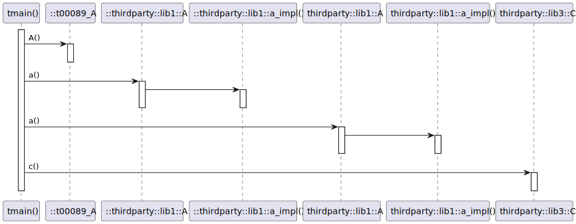
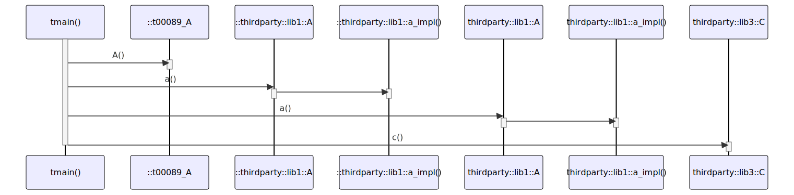

# t20063 - Test case for '::' prefix in sequence diagrams for namespaces outside of using_namespace
## Config
```yaml
diagrams:
  t20063_sequence:
    type: sequence
    glob:
      - t20063.cc
    include:
      paths:
        - .
    using_namespace: clanguml::t20063
    from:
      - function: clanguml::t20063::tmain()
```
## Source code
File `tests/t20063/t20063.cc`
```cpp
class t00089_A {
public:
    void A() { }
};

namespace thirdparty {
namespace lib1 {
void a_impl() { }
class A {
public:
    void a() { a_impl(); }
};
}
}

namespace clanguml {
namespace t20063 {
namespace thirdparty {
namespace lib1 {
void a_impl() { }
class A {
public:
    void a() { a_impl(); }
};
}
namespace lib3 {
class C {
public:
    void c() { }
};
}
}

void tmain()
{
    t00089_A A;
    A.A();

    ::thirdparty::lib1::A root_a;
    root_a.a();

    thirdparty::lib1::A a;
    a.a();

    thirdparty::lib3::C c;
    c.c();
}
}
}
```
## Generated PlantUML diagrams

## Generated Mermaid diagrams

## Generated JSON models
```json
{
  "diagram_type": "sequence",
  "name": "t20063_sequence",
  "participants": [
    {
      "display_name": "tmain()",
      "full_name": "clanguml::t20063::tmain()",
      "id": "10403707100938433402",
      "name": "tmain",
      "namespace": "clanguml::t20063",
      "source_location": {
        "column": 6,
        "file": "t20063.cc",
        "line": 34,
        "translation_unit": "t20063.cc"
      },
      "type": "function"
    },
    {
      "activities": [
        {
          "display_name": "::A()",
          "full_name": "::t00089_A::A()",
          "id": "9440916803132485587",
          "name": "A",
          "namespace": "",
          "source_location": {
            "column": 10,
            "file": "t20063.cc",
            "line": 3,
            "translation_unit": "t20063.cc"
          },
          "type": "method"
        }
      ],
      "display_name": "::t00089_A",
      "full_name": "::t00089_A",
      "id": "10732705655723511888",
      "name": "t00089_A",
      "namespace": "",
      "source_location": {
        "column": 7,
        "file": "t20063.cc",
        "line": 1,
        "translation_unit": "t20063.cc"
      },
      "type": "class"
    },
    {
      "activities": [
        {
          "display_name": "::a()",
          "full_name": "::thirdparty::lib1::A::a()",
          "id": "17693396710857673041",
          "name": "a",
          "namespace": "thirdparty::lib1",
          "source_location": {
            "column": 10,
            "file": "t20063.cc",
            "line": 11,
            "translation_unit": "t20063.cc"
          },
          "type": "method"
        }
      ],
      "display_name": "::thirdparty::lib1::A",
      "full_name": "::thirdparty::lib1::A",
      "id": "17472882252001821525",
      "name": "A",
      "namespace": "thirdparty::lib1",
      "source_location": {
        "column": 7,
        "file": "t20063.cc",
        "line": 9,
        "translation_unit": "t20063.cc"
      },
      "type": "class"
    },
    {
      "display_name": "::thirdparty::lib1::a_impl()",
      "full_name": "::thirdparty::lib1::a_impl()",
      "id": "10571043334877913475",
      "name": "a_impl",
      "namespace": "thirdparty::lib1",
      "source_location": {
        "column": 6,
        "file": "t20063.cc",
        "line": 8,
        "translation_unit": "t20063.cc"
      },
      "type": "function"
    },
    {
      "activities": [
        {
          "display_name": "a()",
          "full_name": "clanguml::t20063::thirdparty::lib1::A::a()",
          "id": "7993225590033950514",
          "name": "a",
          "namespace": "clanguml::t20063::thirdparty::lib1",
          "source_location": {
            "column": 10,
            "file": "t20063.cc",
            "line": 23,
            "translation_unit": "t20063.cc"
          },
          "type": "method"
        }
      ],
      "display_name": "thirdparty::lib1::A",
      "full_name": "clanguml::t20063::thirdparty::lib1::A",
      "id": "9314093354609607193",
      "name": "A",
      "namespace": "clanguml::t20063::thirdparty::lib1",
      "source_location": {
        "column": 7,
        "file": "t20063.cc",
        "line": 21,
        "translation_unit": "t20063.cc"
      },
      "type": "class"
    },
    {
      "display_name": "thirdparty::lib1::a_impl()",
      "full_name": "clanguml::t20063::thirdparty::lib1::a_impl()",
      "id": "17035002210878427355",
      "name": "a_impl",
      "namespace": "clanguml::t20063::thirdparty::lib1",
      "source_location": {
        "column": 6,
        "file": "t20063.cc",
        "line": 20,
        "translation_unit": "t20063.cc"
      },
      "type": "function"
    },
    {
      "activities": [
        {
          "display_name": "c()",
          "full_name": "clanguml::t20063::thirdparty::lib3::C::c()",
          "id": "14550432339255436098",
          "name": "c",
          "namespace": "clanguml::t20063::thirdparty::lib3",
          "source_location": {
            "column": 10,
            "file": "t20063.cc",
            "line": 29,
            "translation_unit": "t20063.cc"
          },
          "type": "method"
        }
      ],
      "display_name": "thirdparty::lib3::C",
      "full_name": "clanguml::t20063::thirdparty::lib3::C",
      "id": "3150835123269166299",
      "name": "C",
      "namespace": "clanguml::t20063::thirdparty::lib3",
      "source_location": {
        "column": 7,
        "file": "t20063.cc",
        "line": 27,
        "translation_unit": "t20063.cc"
      },
      "type": "class"
    }
  ],
  "sequences": [
    {
      "messages": [
        {
          "from": {
            "activity_id": "10403707100938433402",
            "participant_id": "10403707100938433402"
          },
          "name": "A()",
          "return_type": "void",
          "scope": "normal",
          "source_location": {
            "column": 5,
            "file": "t20063.cc",
            "line": 37,
            "translation_unit": "t20063.cc"
          },
          "to": {
            "activity_id": "9440916803132485587",
            "participant_id": "10732705655723511888"
          },
          "type": "message"
        },
        {
          "from": {
            "activity_id": "10403707100938433402",
            "participant_id": "10403707100938433402"
          },
          "name": "a()",
          "return_type": "void",
          "scope": "normal",
          "source_location": {
            "column": 5,
            "file": "t20063.cc",
            "line": 40,
            "translation_unit": "t20063.cc"
          },
          "to": {
            "activity_id": "17693396710857673041",
            "participant_id": "17472882252001821525"
          },
          "type": "message"
        },
        {
          "from": {
            "activity_id": "17693396710857673041",
            "participant_id": "17472882252001821525"
          },
          "name": "",
          "return_type": "void",
          "scope": "normal",
          "source_location": {
            "column": 16,
            "file": "t20063.cc",
            "line": 11,
            "translation_unit": "t20063.cc"
          },
          "to": {
            "activity_id": "10571043334877913475",
            "participant_id": "10571043334877913475"
          },
          "type": "message"
        },
        {
          "from": {
            "activity_id": "10403707100938433402",
            "participant_id": "10403707100938433402"
          },
          "name": "a()",
          "return_type": "void",
          "scope": "normal",
          "source_location": {
            "column": 5,
            "file": "t20063.cc",
            "line": 43,
            "translation_unit": "t20063.cc"
          },
          "to": {
            "activity_id": "7993225590033950514",
            "participant_id": "9314093354609607193"
          },
          "type": "message"
        },
        {
          "from": {
            "activity_id": "7993225590033950514",
            "participant_id": "9314093354609607193"
          },
          "name": "",
          "return_type": "void",
          "scope": "normal",
          "source_location": {
            "column": 16,
            "file": "t20063.cc",
            "line": 23,
            "translation_unit": "t20063.cc"
          },
          "to": {
            "activity_id": "17035002210878427355",
            "participant_id": "17035002210878427355"
          },
          "type": "message"
        },
        {
          "from": {
            "activity_id": "10403707100938433402",
            "participant_id": "10403707100938433402"
          },
          "name": "c()",
          "return_type": "void",
          "scope": "normal",
          "source_location": {
            "column": 5,
            "file": "t20063.cc",
            "line": 46,
            "translation_unit": "t20063.cc"
          },
          "to": {
            "activity_id": "14550432339255436098",
            "participant_id": "3150835123269166299"
          },
          "type": "message"
        }
      ],
      "start_from": {
        "id": "10403707100938433402",
        "location": "clanguml::t20063::tmain()"
      }
    }
  ],
  "using_namespace": "clanguml::t20063"
}
```
## Generated GraphML models
