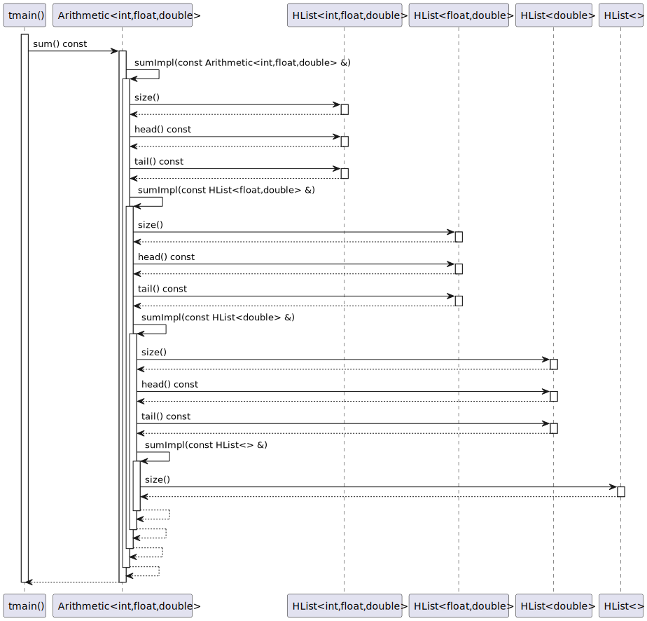
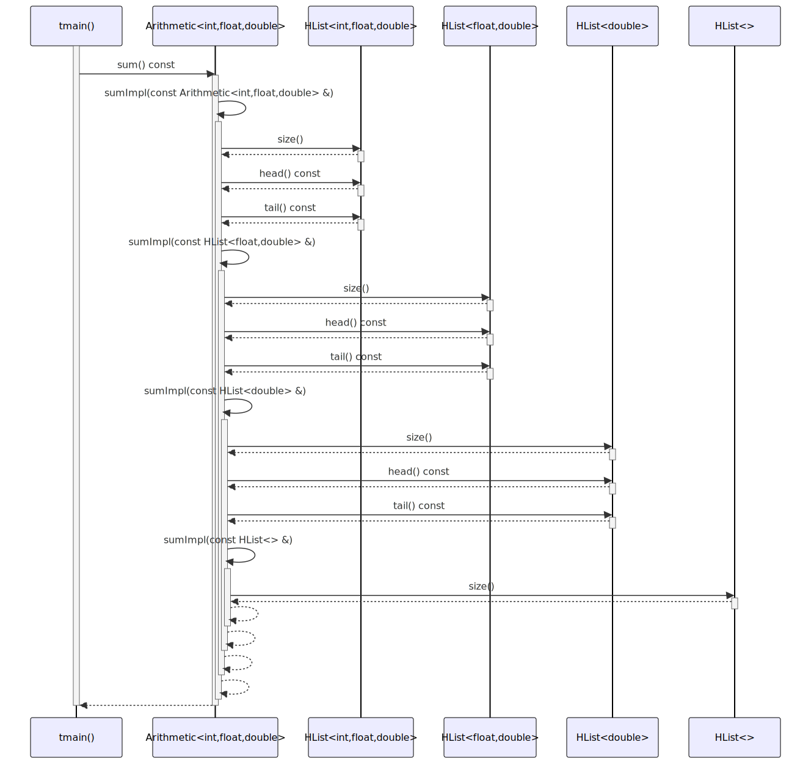

# t20064 - Metaprogramming test case with recursive type list sequence diagram
## Config
```yaml
diagrams:
  t20064_sequence:
    type: sequence
    glob:
      - t20064.cc
    include:
      namespaces:
        - clanguml::t20064
    using_namespace: clanguml::t20064
    from:
      - function: clanguml::t20064::tmain()
```
## Source code
File `tests/t20064/t20064.cc`
```cpp
#include <iostream>
#include <type_traits>

/// Based on recursive-types-through-inheritance example from:
/// https://www.scs.stanford.edu/~dm/blog/param-pack.html

namespace clanguml::t20064 {

template <typename... T> struct HList;

template <> struct HList<> {
    static constexpr std::size_t len = 0;
};

template <typename T0, typename... TRest>
struct HList<T0, TRest...> : HList<TRest...> {
    using head_type = T0;
    using tail_type = HList<TRest...>;

    static constexpr std::size_t len = 1 + sizeof...(TRest);
    [[no_unique_address]] head_type value_{};

    constexpr HList() = default;
    template <typename U0, typename... URest>
    constexpr HList(U0 &&u0, URest &&...urest)
        : tail_type(std::forward<URest>(urest)...)
        , value_(std::forward<U0>(u0))
    {
    }

    head_type &head() & { return value_; }
    const head_type &head() const & { return value_; }
    head_type &&head() && { return value_; }

    tail_type &tail() & { return *this; }
    const tail_type &tail() const & { return *this; }
    tail_type &&tail() && { return *this; }
};

template <typename... T> HList(T...) -> HList<T...>;

template <typename T>
concept IsArithmetic = std::is_arithmetic_v<T>;

template <IsArithmetic... T> class Arithmetic : HList<T...> {
public:
    using HList<T...>::HList;

    constexpr double sum() const { return sumImpl(*this); }

private:
    template <typename L> static constexpr double sumImpl(const L &list)
    {
        if constexpr (L::len == 0) {
            return 0.0;
        }
        else {
            return static_cast<double>(list.head()) + sumImpl(list.tail());
        }
    }
};

int tmain()
{
    constexpr Arithmetic<int, float, double> a{11, 12.0, 13.0};

    return a.sum();
}
}
```
## Generated PlantUML diagrams

## Generated Mermaid diagrams

## Generated JSON models
```json
{
  "diagram_type": "sequence",
  "name": "t20064_sequence",
  "participants": [
    {
      "display_name": "tmain()",
      "full_name": "clanguml::t20064::tmain()",
      "id": "2368236346540714086",
      "name": "tmain",
      "namespace": "clanguml::t20064",
      "source_location": {
        "column": 5,
        "file": "t20064.cc",
        "line": 63,
        "translation_unit": "t20064.cc"
      },
      "type": "function"
    },
    {
      "activities": [
        {
          "display_name": "sum() const",
          "full_name": "clanguml::t20064::Arithmetic<int,float,double>::sum() const",
          "id": "16182429245759959185",
          "name": "sum",
          "namespace": "clanguml::t20064",
          "source_location": {
            "column": 22,
            "file": "t20064.cc",
            "line": 49,
            "translation_unit": "t20064.cc"
          },
          "type": "method"
        },
        {
          "display_name": "sumImpl(const Arithmetic<int,float,double> &)",
          "full_name": "clanguml::t20064::Arithmetic<int,float,double>::sumImpl(const Arithmetic<int,float,double> &)",
          "id": "11620211537632997844",
          "name": "sumImpl",
          "namespace": "clanguml::t20064",
          "source_location": {
            "column": 51,
            "file": "t20064.cc",
            "line": 52,
            "translation_unit": "t20064.cc"
          },
          "type": "method"
        },
        {
          "display_name": "sumImpl(const HList<float,double> &)",
          "full_name": "clanguml::t20064::Arithmetic<int,float,double>::sumImpl(const HList<float,double> &)",
          "id": "4304601041384260545",
          "name": "sumImpl",
          "namespace": "clanguml::t20064",
          "source_location": {
            "column": 51,
            "file": "t20064.cc",
            "line": 52,
            "translation_unit": "t20064.cc"
          },
          "type": "method"
        },
        {
          "display_name": "sumImpl(const HList<double> &)",
          "full_name": "clanguml::t20064::Arithmetic<int,float,double>::sumImpl(const HList<double> &)",
          "id": "13400612297521780324",
          "name": "sumImpl",
          "namespace": "clanguml::t20064",
          "source_location": {
            "column": 51,
            "file": "t20064.cc",
            "line": 52,
            "translation_unit": "t20064.cc"
          },
          "type": "method"
        },
        {
          "display_name": "sumImpl(const HList<> &)",
          "full_name": "clanguml::t20064::Arithmetic<int,float,double>::sumImpl(const HList<> &)",
          "id": "6810994233227855740",
          "name": "sumImpl",
          "namespace": "clanguml::t20064",
          "source_location": {
            "column": 51,
            "file": "t20064.cc",
            "line": 52,
            "translation_unit": "t20064.cc"
          },
          "type": "method"
        }
      ],
      "display_name": "Arithmetic<int,float,double>",
      "full_name": "clanguml::t20064::Arithmetic<int,float,double>",
      "id": "10589400517468651358",
      "name": "Arithmetic",
      "namespace": "clanguml::t20064",
      "source_location": {
        "column": 36,
        "file": "t20064.cc",
        "line": 45,
        "translation_unit": "t20064.cc"
      },
      "type": "class"
    },
    {
      "activities": [
        {
          "display_name": "head() const",
          "full_name": "clanguml::t20064::HList<int,float,double>::head() const",
          "id": "1559261344478687809",
          "name": "head",
          "namespace": "clanguml::t20064",
          "source_location": {
            "column": 22,
            "file": "t20064.cc",
            "line": 32,
            "translation_unit": "t20064.cc"
          },
          "type": "method"
        },
        {
          "display_name": "tail() const",
          "full_name": "clanguml::t20064::HList<int,float,double>::tail() const",
          "id": "6479572047477685119",
          "name": "tail",
          "namespace": "clanguml::t20064",
          "source_location": {
            "column": 22,
            "file": "t20064.cc",
            "line": 36,
            "translation_unit": "t20064.cc"
          },
          "type": "method"
        }
      ],
      "display_name": "HList<int,float,double>",
      "full_name": "clanguml::t20064::HList<int,float,double>",
      "id": "555627480949785351",
      "name": "HList",
      "namespace": "clanguml::t20064",
      "source_location": {
        "column": 8,
        "file": "t20064.cc",
        "line": 16,
        "translation_unit": "t20064.cc"
      },
      "type": "class"
    },
    {
      "activities": [
        {
          "display_name": "head() const",
          "full_name": "clanguml::t20064::HList<float,double>::head() const",
          "id": "5833491545843881820",
          "name": "head",
          "namespace": "clanguml::t20064",
          "source_location": {
            "column": 22,
            "file": "t20064.cc",
            "line": 32,
            "translation_unit": "t20064.cc"
          },
          "type": "method"
        },
        {
          "display_name": "tail() const",
          "full_name": "clanguml::t20064::HList<float,double>::tail() const",
          "id": "5666689227968750221",
          "name": "tail",
          "namespace": "clanguml::t20064",
          "source_location": {
            "column": 22,
            "file": "t20064.cc",
            "line": 36,
            "translation_unit": "t20064.cc"
          },
          "type": "method"
        }
      ],
      "display_name": "HList<float,double>",
      "full_name": "clanguml::t20064::HList<float,double>",
      "id": "17602243789901723113",
      "name": "HList",
      "namespace": "clanguml::t20064",
      "source_location": {
        "column": 8,
        "file": "t20064.cc",
        "line": 16,
        "translation_unit": "t20064.cc"
      },
      "type": "class"
    },
    {
      "activities": [
        {
          "display_name": "head() const",
          "full_name": "clanguml::t20064::HList<double>::head() const",
          "id": "4146903467070883428",
          "name": "head",
          "namespace": "clanguml::t20064",
          "source_location": {
            "column": 22,
            "file": "t20064.cc",
            "line": 32,
            "translation_unit": "t20064.cc"
          },
          "type": "method"
        },
        {
          "display_name": "tail() const",
          "full_name": "clanguml::t20064::HList<double>::tail() const",
          "id": "12061854313885975455",
          "name": "tail",
          "namespace": "clanguml::t20064",
          "source_location": {
            "column": 22,
            "file": "t20064.cc",
            "line": 36,
            "translation_unit": "t20064.cc"
          },
          "type": "method"
        }
      ],
      "display_name": "HList<double>",
      "full_name": "clanguml::t20064::HList<double>",
      "id": "16213980783663873860",
      "name": "HList",
      "namespace": "clanguml::t20064",
      "source_location": {
        "column": 8,
        "file": "t20064.cc",
        "line": 16,
        "translation_unit": "t20064.cc"
      },
      "type": "class"
    }
  ],
  "sequences": [
    {
      "messages": [
        {
          "from": {
            "activity_id": "2368236346540714086",
            "participant_id": "2368236346540714086"
          },
          "name": "sum() const",
          "return_type": "double",
          "scope": "normal",
          "source_location": {
            "column": 12,
            "file": "t20064.cc",
            "line": 67,
            "translation_unit": "t20064.cc"
          },
          "to": {
            "activity_id": "16182429245759959185",
            "participant_id": "10589400517468651358"
          },
          "type": "message"
        },
        {
          "from": {
            "activity_id": "16182429245759959185",
            "participant_id": "10589400517468651358"
          },
          "name": "sumImpl(const Arithmetic<int,float,double> &)",
          "return_type": "double",
          "scope": "normal",
          "source_location": {
            "column": 43,
            "file": "t20064.cc",
            "line": 49,
            "translation_unit": "t20064.cc"
          },
          "to": {
            "activity_id": "11620211537632997844",
            "participant_id": "10589400517468651358"
          },
          "type": "message"
        },
        {
          "from": {
            "activity_id": "11620211537632997844",
            "participant_id": "10589400517468651358"
          },
          "name": "head() const",
          "return_type": "const head_type &",
          "scope": "normal",
          "source_location": {
            "column": 40,
            "file": "t20064.cc",
            "line": 58,
            "translation_unit": "t20064.cc"
          },
          "to": {
            "activity_id": "1559261344478687809",
            "participant_id": "555627480949785351"
          },
          "type": "message"
        },
        {
          "from": {
            "activity_id": "11620211537632997844",
            "participant_id": "10589400517468651358"
          },
          "name": "tail() const",
          "return_type": "const tail_type &",
          "scope": "normal",
          "source_location": {
            "column": 63,
            "file": "t20064.cc",
            "line": 58,
            "translation_unit": "t20064.cc"
          },
          "to": {
            "activity_id": "6479572047477685119",
            "participant_id": "555627480949785351"
          },
          "type": "message"
        },
        {
          "from": {
            "activity_id": "11620211537632997844",
            "participant_id": "10589400517468651358"
          },
          "name": "sumImpl(const HList<float,double> &)",
          "return_type": "double",
          "scope": "normal",
          "source_location": {
            "column": 55,
            "file": "t20064.cc",
            "line": 58,
            "translation_unit": "t20064.cc"
          },
          "to": {
            "activity_id": "4304601041384260545",
            "participant_id": "10589400517468651358"
          },
          "type": "message"
        },
        {
          "from": {
            "activity_id": "4304601041384260545",
            "participant_id": "10589400517468651358"
          },
          "name": "head() const",
          "return_type": "const head_type &",
          "scope": "normal",
          "source_location": {
            "column": 40,
            "file": "t20064.cc",
            "line": 58,
            "translation_unit": "t20064.cc"
          },
          "to": {
            "activity_id": "5833491545843881820",
            "participant_id": "17602243789901723113"
          },
          "type": "message"
        },
        {
          "from": {
            "activity_id": "4304601041384260545",
            "participant_id": "10589400517468651358"
          },
          "name": "tail() const",
          "return_type": "const tail_type &",
          "scope": "normal",
          "source_location": {
            "column": 63,
            "file": "t20064.cc",
            "line": 58,
            "translation_unit": "t20064.cc"
          },
          "to": {
            "activity_id": "5666689227968750221",
            "participant_id": "17602243789901723113"
          },
          "type": "message"
        },
        {
          "from": {
            "activity_id": "4304601041384260545",
            "participant_id": "10589400517468651358"
          },
          "name": "sumImpl(const HList<double> &)",
          "return_type": "double",
          "scope": "normal",
          "source_location": {
            "column": 55,
            "file": "t20064.cc",
            "line": 58,
            "translation_unit": "t20064.cc"
          },
          "to": {
            "activity_id": "13400612297521780324",
            "participant_id": "10589400517468651358"
          },
          "type": "message"
        },
        {
          "from": {
            "activity_id": "13400612297521780324",
            "participant_id": "10589400517468651358"
          },
          "name": "head() const",
          "return_type": "const head_type &",
          "scope": "normal",
          "source_location": {
            "column": 40,
            "file": "t20064.cc",
            "line": 58,
            "translation_unit": "t20064.cc"
          },
          "to": {
            "activity_id": "4146903467070883428",
            "participant_id": "16213980783663873860"
          },
          "type": "message"
        },
        {
          "from": {
            "activity_id": "13400612297521780324",
            "participant_id": "10589400517468651358"
          },
          "name": "tail() const",
          "return_type": "const tail_type &",
          "scope": "normal",
          "source_location": {
            "column": 63,
            "file": "t20064.cc",
            "line": 58,
            "translation_unit": "t20064.cc"
          },
          "to": {
            "activity_id": "12061854313885975455",
            "participant_id": "16213980783663873860"
          },
          "type": "message"
        },
        {
          "from": {
            "activity_id": "13400612297521780324",
            "participant_id": "10589400517468651358"
          },
          "name": "sumImpl(const HList<> &)",
          "return_type": "double",
          "scope": "normal",
          "source_location": {
            "column": 55,
            "file": "t20064.cc",
            "line": 58,
            "translation_unit": "t20064.cc"
          },
          "to": {
            "activity_id": "6810994233227855740",
            "participant_id": "10589400517468651358"
          },
          "type": "message"
        }
      ],
      "start_from": {
        "id": "2368236346540714086",
        "location": "clanguml::t20064::tmain()"
      }
    }
  ],
  "using_namespace": "clanguml::t20064"
}
```
## Generated GraphML models
