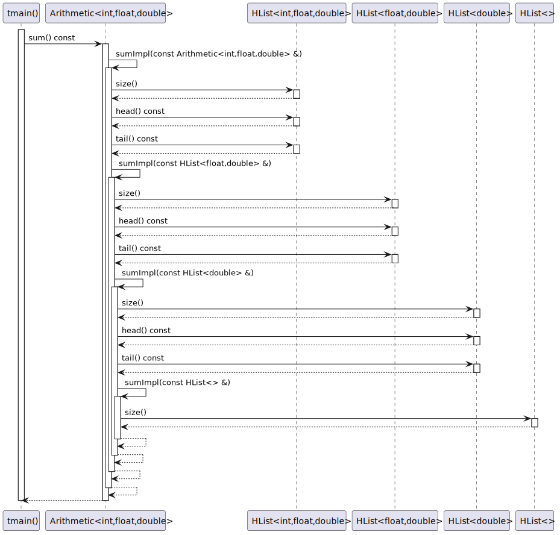
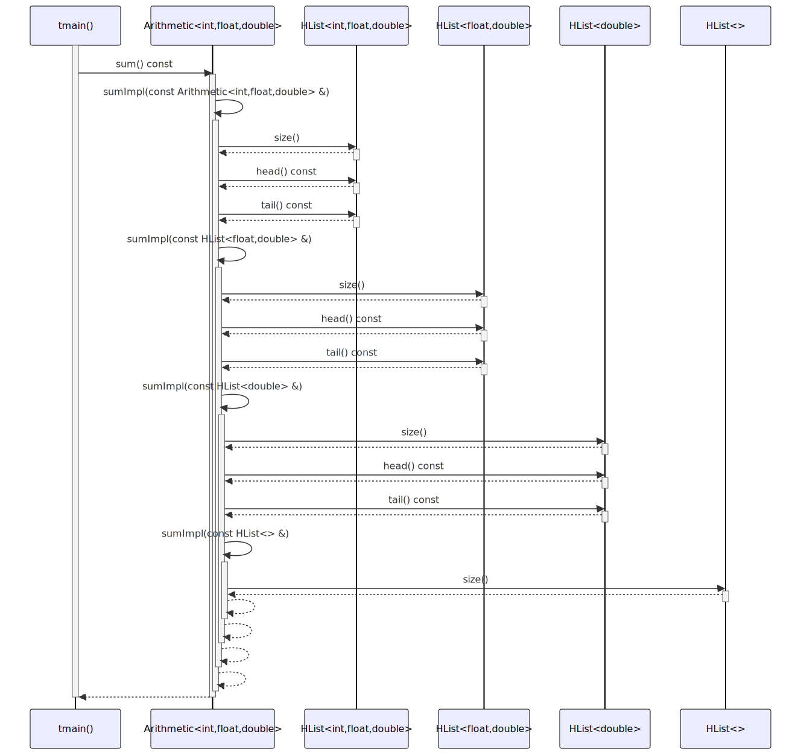

# t20064 - Metaprogramming test case with recursive type list sequence diagram
## Config
```yaml
diagrams:
  t20064_sequence:
    type: sequence
    glob:
      - t20064.cc
    include:
      namespaces:
        - clanguml::t20064
    using_namespace: clanguml::t20064
    from:
      - function: clanguml::t20064::tmain()
```
## Source code
File `tests/t20064/t20064.cc`
```cpp
#include <iostream>
#include <type_traits>

/// Based on recursive-types-through-inheritance example from:
/// https://www.scs.stanford.edu/~dm/blog/param-pack.html

namespace clanguml::t20064 {
template <typename... T> struct HList;

template <> struct HList<> {
    static constexpr std::size_t size() noexcept { return 0; }
};

template <typename T0, typename... TRest>
struct HList<T0, TRest...> : HList<TRest...> {
    using head_type = T0;
    using tail_type = HList<TRest...>;

    static constexpr std::size_t size() noexcept
    {
        return 1 + sizeof...(TRest);
    }

    [[no_unique_address]] head_type value_{};

    constexpr HList() = default;
    template <typename U0, typename... URest>
    constexpr HList(U0 &&u0, URest &&...urest)
        : tail_type(std::forward<URest>(urest)...)
        , value_(std::forward<U0>(u0))
    {
    }

    head_type &head() & { return value_; }
    const head_type &head() const & { return value_; }
    head_type &&head() && { return value_; }

    tail_type &tail() & { return *this; }
    const tail_type &tail() const & { return *this; }
    tail_type &&tail() && { return *this; }
};

template <typename... T> HList(T...) -> HList<T...>;

template <typename T>
concept IsArithmetic = std::is_arithmetic_v<T>;

template <IsArithmetic... T> struct Arithmetic : HList<T...> {

    using HList<T...>::HList;

public:
    constexpr double sum() const { return sumImpl(*this); }

private:
    template <typename L> static constexpr double sumImpl(const L &list)
    {
        if constexpr (L::size() == 0) {
            return 0.0;
        }
        else {
            return static_cast<double>(list.head()) + sumImpl(list.tail());
        }
    }
};

int tmain()
{
    constexpr Arithmetic<int, float, double> a{11, 12, 13};

    return a.sum();
}
}
```
## Generated PlantUML diagrams

## Generated Mermaid diagrams

## Generated JSON models
```json
{
  "diagram_type": "sequence",
  "name": "t20064_sequence",
  "participants": [
    {
      "display_name": "tmain()",
      "full_name": "clanguml::t20064::tmain()",
      "id": "14524204694757572439",
      "name": "tmain",
      "namespace": "clanguml::t20064",
      "source_location": {
        "column": 5,
        "file": "t20064.cc",
        "line": 67,
        "translation_unit": "t20064.cc"
      },
      "type": "function"
    },
    {
      "activities": [
        {
          "display_name": "sum() const",
          "full_name": "clanguml::t20064::Arithmetic<int,float,double>::sum() const",
          "id": "16645143651115788771",
          "name": "sum",
          "namespace": "clanguml::t20064",
          "source_location": {
            "column": 22,
            "file": "t20064.cc",
            "line": 53,
            "translation_unit": "t20064.cc"
          },
          "type": "method"
        },
        {
          "display_name": "sumImpl(const Arithmetic<int,float,double> &)",
          "full_name": "clanguml::t20064::Arithmetic<int,float,double>::sumImpl(const Arithmetic<int,float,double> &)",
          "id": "5661894921428329437",
          "name": "sumImpl",
          "namespace": "clanguml::t20064",
          "source_location": {
            "column": 51,
            "file": "t20064.cc",
            "line": 56,
            "translation_unit": "t20064.cc"
          },
          "type": "method"
        },
        {
          "display_name": "sumImpl(const HList<float,double> &)",
          "full_name": "clanguml::t20064::Arithmetic<int,float,double>::sumImpl(const HList<float,double> &)",
          "id": "4876061963868049665",
          "name": "sumImpl",
          "namespace": "clanguml::t20064",
          "source_location": {
            "column": 51,
            "file": "t20064.cc",
            "line": 56,
            "translation_unit": "t20064.cc"
          },
          "type": "method"
        },
        {
          "display_name": "sumImpl(const HList<double> &)",
          "full_name": "clanguml::t20064::Arithmetic<int,float,double>::sumImpl(const HList<double> &)",
          "id": "5589896233573011852",
          "name": "sumImpl",
          "namespace": "clanguml::t20064",
          "source_location": {
            "column": 51,
            "file": "t20064.cc",
            "line": 56,
            "translation_unit": "t20064.cc"
          },
          "type": "method"
        },
        {
          "display_name": "sumImpl(const HList<> &)",
          "full_name": "clanguml::t20064::Arithmetic<int,float,double>::sumImpl(const HList<> &)",
          "id": "5836451077071961498",
          "name": "sumImpl",
          "namespace": "clanguml::t20064",
          "source_location": {
            "column": 51,
            "file": "t20064.cc",
            "line": 56,
            "translation_unit": "t20064.cc"
          },
          "type": "method"
        }
      ],
      "display_name": "Arithmetic<int,float,double>",
      "full_name": "clanguml::t20064::Arithmetic<int,float,double>",
      "id": "17147808576950581812",
      "name": "Arithmetic",
      "namespace": "clanguml::t20064",
      "source_location": {
        "column": 37,
        "file": "t20064.cc",
        "line": 48,
        "translation_unit": "t20064.cc"
      },
      "type": "class"
    },
    {
      "activities": [
        {
          "display_name": "size()",
          "full_name": "clanguml::t20064::HList<int,float,double>::size()",
          "id": "2569272468000873024",
          "name": "size",
          "namespace": "clanguml::t20064",
          "source_location": {
            "column": 34,
            "file": "t20064.cc",
            "line": 19,
            "translation_unit": "t20064.cc"
          },
          "type": "method"
        },
        {
          "display_name": "head() const",
          "full_name": "clanguml::t20064::HList<int,float,double>::head() const",
          "id": "8922628055849152229",
          "name": "head",
          "namespace": "clanguml::t20064",
          "source_location": {
            "column": 22,
            "file": "t20064.cc",
            "line": 35,
            "translation_unit": "t20064.cc"
          },
          "type": "method"
        },
        {
          "display_name": "tail() const",
          "full_name": "clanguml::t20064::HList<int,float,double>::tail() const",
          "id": "14867763041266224608",
          "name": "tail",
          "namespace": "clanguml::t20064",
          "source_location": {
            "column": 22,
            "file": "t20064.cc",
            "line": 39,
            "translation_unit": "t20064.cc"
          },
          "type": "method"
        }
      ],
      "display_name": "HList<int,float,double>",
      "full_name": "clanguml::t20064::HList<int,float,double>",
      "id": "3429568210195486243",
      "name": "HList",
      "namespace": "clanguml::t20064",
      "source_location": {
        "column": 8,
        "file": "t20064.cc",
        "line": 15,
        "translation_unit": "t20064.cc"
      },
      "type": "class"
    },
    {
      "activities": [
        {
          "display_name": "size()",
          "full_name": "clanguml::t20064::HList<float,double>::size()",
          "id": "10236727261659503431",
          "name": "size",
          "namespace": "clanguml::t20064",
          "source_location": {
            "column": 34,
            "file": "t20064.cc",
            "line": 19,
            "translation_unit": "t20064.cc"
          },
          "type": "method"
        },
        {
          "display_name": "head() const",
          "full_name": "clanguml::t20064::HList<float,double>::head() const",
          "id": "8580327898224337790",
          "name": "head",
          "namespace": "clanguml::t20064",
          "source_location": {
            "column": 22,
            "file": "t20064.cc",
            "line": 35,
            "translation_unit": "t20064.cc"
          },
          "type": "method"
        },
        {
          "display_name": "tail() const",
          "full_name": "clanguml::t20064::HList<float,double>::tail() const",
          "id": "18210840300948860172",
          "name": "tail",
          "namespace": "clanguml::t20064",
          "source_location": {
            "column": 22,
            "file": "t20064.cc",
            "line": 39,
            "translation_unit": "t20064.cc"
          },
          "type": "method"
        }
      ],
      "display_name": "HList<float,double>",
      "full_name": "clanguml::t20064::HList<float,double>",
      "id": "3960553655619737430",
      "name": "HList",
      "namespace": "clanguml::t20064",
      "source_location": {
        "column": 8,
        "file": "t20064.cc",
        "line": 15,
        "translation_unit": "t20064.cc"
      },
      "type": "class"
    },
    {
      "activities": [
        {
          "display_name": "size()",
          "full_name": "clanguml::t20064::HList<double>::size()",
          "id": "12780990472697187153",
          "name": "size",
          "namespace": "clanguml::t20064",
          "source_location": {
            "column": 34,
            "file": "t20064.cc",
            "line": 19,
            "translation_unit": "t20064.cc"
          },
          "type": "method"
        },
        {
          "display_name": "head() const",
          "full_name": "clanguml::t20064::HList<double>::head() const",
          "id": "16603048624208545005",
          "name": "head",
          "namespace": "clanguml::t20064",
          "source_location": {
            "column": 22,
            "file": "t20064.cc",
            "line": 35,
            "translation_unit": "t20064.cc"
          },
          "type": "method"
        },
        {
          "display_name": "tail() const",
          "full_name": "clanguml::t20064::HList<double>::tail() const",
          "id": "2881462437140549658",
          "name": "tail",
          "namespace": "clanguml::t20064",
          "source_location": {
            "column": 22,
            "file": "t20064.cc",
            "line": 39,
            "translation_unit": "t20064.cc"
          },
          "type": "method"
        }
      ],
      "display_name": "HList<double>",
      "full_name": "clanguml::t20064::HList<double>",
      "id": "2054773479704492757",
      "name": "HList",
      "namespace": "clanguml::t20064",
      "source_location": {
        "column": 8,
        "file": "t20064.cc",
        "line": 15,
        "translation_unit": "t20064.cc"
      },
      "type": "class"
    },
    {
      "activities": [
        {
          "display_name": "size()",
          "full_name": "clanguml::t20064::HList<>::size()",
          "id": "562902763372824618",
          "name": "size",
          "namespace": "clanguml::t20064",
          "source_location": {
            "column": 34,
            "file": "t20064.cc",
            "line": 11,
            "translation_unit": "t20064.cc"
          },
          "type": "method"
        }
      ],
      "display_name": "HList<>",
      "full_name": "clanguml::t20064::HList<>",
      "id": "12606903284694200172",
      "name": "HList",
      "namespace": "clanguml::t20064",
      "source_location": {
        "column": 20,
        "file": "t20064.cc",
        "line": 10,
        "translation_unit": "t20064.cc"
      },
      "type": "class"
    }
  ],
  "sequences": [
    {
      "from": {
        "id": "14524204694757572439",
        "location": "clanguml::t20064::tmain()"
      },
      "messages": [
        {
          "from": {
            "activity_id": "14524204694757572439",
            "participant_id": "14524204694757572439"
          },
          "name": "sum() const",
          "return_type": "double",
          "scope": "normal",
          "source_location": {
            "column": 12,
            "file": "t20064.cc",
            "line": 71,
            "translation_unit": "t20064.cc"
          },
          "to": {
            "activity_id": "16645143651115788771",
            "participant_id": "17147808576950581812"
          },
          "type": "message"
        },
        {
          "from": {
            "activity_id": "16645143651115788771",
            "participant_id": "17147808576950581812"
          },
          "name": "sumImpl(const Arithmetic<int,float,double> &)",
          "return_type": "double",
          "scope": "normal",
          "source_location": {
            "column": 43,
            "file": "t20064.cc",
            "line": 53,
            "translation_unit": "t20064.cc"
          },
          "to": {
            "activity_id": "5661894921428329437",
            "participant_id": "17147808576950581812"
          },
          "type": "message"
        },
        {
          "from": {
            "activity_id": "5661894921428329437",
            "participant_id": "17147808576950581812"
          },
          "name": "size()",
          "return_type": "std::size_t",
          "scope": "normal",
          "source_location": {
            "column": 23,
            "file": "t20064.cc",
            "line": 58,
            "translation_unit": "t20064.cc"
          },
          "to": {
            "activity_id": "2569272468000873024",
            "participant_id": "3429568210195486243"
          },
          "type": "message"
        },
        {
          "from": {
            "activity_id": "2569272468000873024",
            "participant_id": "3429568210195486243"
          },
          "name": "",
          "return_type": "std::size_t",
          "scope": "normal",
          "source_location": {
            "column": 9,
            "file": "t20064.cc",
            "line": 21,
            "translation_unit": "t20064.cc"
          },
          "to": {
            "activity_id": "5661894921428329437",
            "participant_id": "17147808576950581812"
          },
          "type": "return"
        },
        {
          "from": {
            "activity_id": "5661894921428329437",
            "participant_id": "17147808576950581812"
          },
          "name": "head() const",
          "return_type": "const head_type &",
          "scope": "normal",
          "source_location": {
            "column": 40,
            "file": "t20064.cc",
            "line": 62,
            "translation_unit": "t20064.cc"
          },
          "to": {
            "activity_id": "8922628055849152229",
            "participant_id": "3429568210195486243"
          },
          "type": "message"
        },
        {
          "from": {
            "activity_id": "8922628055849152229",
            "participant_id": "3429568210195486243"
          },
          "name": "",
          "return_type": "const head_type &",
          "scope": "normal",
          "source_location": {
            "column": 39,
            "file": "t20064.cc",
            "line": 35,
            "translation_unit": "t20064.cc"
          },
          "to": {
            "activity_id": "5661894921428329437",
            "participant_id": "17147808576950581812"
          },
          "type": "return"
        },
        {
          "from": {
            "activity_id": "5661894921428329437",
            "participant_id": "17147808576950581812"
          },
          "name": "tail() const",
          "return_type": "const tail_type &",
          "scope": "normal",
          "source_location": {
            "column": 63,
            "file": "t20064.cc",
            "line": 62,
            "translation_unit": "t20064.cc"
          },
          "to": {
            "activity_id": "14867763041266224608",
            "participant_id": "3429568210195486243"
          },
          "type": "message"
        },
        {
          "from": {
            "activity_id": "14867763041266224608",
            "participant_id": "3429568210195486243"
          },
          "name": "",
          "return_type": "const tail_type &",
          "scope": "normal",
          "source_location": {
            "column": 39,
            "file": "t20064.cc",
            "line": 39,
            "translation_unit": "t20064.cc"
          },
          "to": {
            "activity_id": "5661894921428329437",
            "participant_id": "17147808576950581812"
          },
          "type": "return"
        },
        {
          "from": {
            "activity_id": "5661894921428329437",
            "participant_id": "17147808576950581812"
          },
          "name": "sumImpl(const HList<float,double> &)",
          "return_type": "double",
          "scope": "normal",
          "source_location": {
            "column": 55,
            "file": "t20064.cc",
            "line": 62,
            "translation_unit": "t20064.cc"
          },
          "to": {
            "activity_id": "4876061963868049665",
            "participant_id": "17147808576950581812"
          },
          "type": "message"
        },
        {
          "from": {
            "activity_id": "4876061963868049665",
            "participant_id": "17147808576950581812"
          },
          "name": "size()",
          "return_type": "std::size_t",
          "scope": "normal",
          "source_location": {
            "column": 23,
            "file": "t20064.cc",
            "line": 58,
            "translation_unit": "t20064.cc"
          },
          "to": {
            "activity_id": "10236727261659503431",
            "participant_id": "3960553655619737430"
          },
          "type": "message"
        },
        {
          "from": {
            "activity_id": "10236727261659503431",
            "participant_id": "3960553655619737430"
          },
          "name": "",
          "return_type": "std::size_t",
          "scope": "normal",
          "source_location": {
            "column": 9,
            "file": "t20064.cc",
            "line": 21,
            "translation_unit": "t20064.cc"
          },
          "to": {
            "activity_id": "4876061963868049665",
            "participant_id": "17147808576950581812"
          },
          "type": "return"
        },
        {
          "from": {
            "activity_id": "4876061963868049665",
            "participant_id": "17147808576950581812"
          },
          "name": "head() const",
          "return_type": "const head_type &",
          "scope": "normal",
          "source_location": {
            "column": 40,
            "file": "t20064.cc",
            "line": 62,
            "translation_unit": "t20064.cc"
          },
          "to": {
            "activity_id": "8580327898224337790",
            "participant_id": "3960553655619737430"
          },
          "type": "message"
        },
        {
          "from": {
            "activity_id": "8580327898224337790",
            "participant_id": "3960553655619737430"
          },
          "name": "",
          "return_type": "const head_type &",
          "scope": "normal",
          "source_location": {
            "column": 39,
            "file": "t20064.cc",
            "line": 35,
            "translation_unit": "t20064.cc"
          },
          "to": {
            "activity_id": "4876061963868049665",
            "participant_id": "17147808576950581812"
          },
          "type": "return"
        },
        {
          "from": {
            "activity_id": "4876061963868049665",
            "participant_id": "17147808576950581812"
          },
          "name": "tail() const",
          "return_type": "const tail_type &",
          "scope": "normal",
          "source_location": {
            "column": 63,
            "file": "t20064.cc",
            "line": 62,
            "translation_unit": "t20064.cc"
          },
          "to": {
            "activity_id": "18210840300948860172",
            "participant_id": "3960553655619737430"
          },
          "type": "message"
        },
        {
          "from": {
            "activity_id": "18210840300948860172",
            "participant_id": "3960553655619737430"
          },
          "name": "",
          "return_type": "const tail_type &",
          "scope": "normal",
          "source_location": {
            "column": 39,
            "file": "t20064.cc",
            "line": 39,
            "translation_unit": "t20064.cc"
          },
          "to": {
            "activity_id": "4876061963868049665",
            "participant_id": "17147808576950581812"
          },
          "type": "return"
        },
        {
          "from": {
            "activity_id": "4876061963868049665",
            "participant_id": "17147808576950581812"
          },
          "name": "sumImpl(const HList<double> &)",
          "return_type": "double",
          "scope": "normal",
          "source_location": {
            "column": 55,
            "file": "t20064.cc",
            "line": 62,
            "translation_unit": "t20064.cc"
          },
          "to": {
            "activity_id": "5589896233573011852",
            "participant_id": "17147808576950581812"
          },
          "type": "message"
        },
        {
          "from": {
            "activity_id": "5589896233573011852",
            "participant_id": "17147808576950581812"
          },
          "name": "size()",
          "return_type": "std::size_t",
          "scope": "normal",
          "source_location": {
            "column": 23,
            "file": "t20064.cc",
            "line": 58,
            "translation_unit": "t20064.cc"
          },
          "to": {
            "activity_id": "12780990472697187153",
            "participant_id": "2054773479704492757"
          },
          "type": "message"
        },
        {
          "from": {
            "activity_id": "12780990472697187153",
            "participant_id": "2054773479704492757"
          },
          "name": "",
          "return_type": "std::size_t",
          "scope": "normal",
          "source_location": {
            "column": 9,
            "file": "t20064.cc",
            "line": 21,
            "translation_unit": "t20064.cc"
          },
          "to": {
            "activity_id": "5589896233573011852",
            "participant_id": "17147808576950581812"
          },
          "type": "return"
        },
        {
          "from": {
            "activity_id": "5589896233573011852",
            "participant_id": "17147808576950581812"
          },
          "name": "head() const",
          "return_type": "const head_type &",
          "scope": "normal",
          "source_location": {
            "column": 40,
            "file": "t20064.cc",
            "line": 62,
            "translation_unit": "t20064.cc"
          },
          "to": {
            "activity_id": "16603048624208545005",
            "participant_id": "2054773479704492757"
          },
          "type": "message"
        },
        {
          "from": {
            "activity_id": "16603048624208545005",
            "participant_id": "2054773479704492757"
          },
          "name": "",
          "return_type": "const head_type &",
          "scope": "normal",
          "source_location": {
            "column": 39,
            "file": "t20064.cc",
            "line": 35,
            "translation_unit": "t20064.cc"
          },
          "to": {
            "activity_id": "5589896233573011852",
            "participant_id": "17147808576950581812"
          },
          "type": "return"
        },
        {
          "from": {
            "activity_id": "5589896233573011852",
            "participant_id": "17147808576950581812"
          },
          "name": "tail() const",
          "return_type": "const tail_type &",
          "scope": "normal",
          "source_location": {
            "column": 63,
            "file": "t20064.cc",
            "line": 62,
            "translation_unit": "t20064.cc"
          },
          "to": {
            "activity_id": "2881462437140549658",
            "participant_id": "2054773479704492757"
          },
          "type": "message"
        },
        {
          "from": {
            "activity_id": "2881462437140549658",
            "participant_id": "2054773479704492757"
          },
          "name": "",
          "return_type": "const tail_type &",
          "scope": "normal",
          "source_location": {
            "column": 39,
            "file": "t20064.cc",
            "line": 39,
            "translation_unit": "t20064.cc"
          },
          "to": {
            "activity_id": "5589896233573011852",
            "participant_id": "17147808576950581812"
          },
          "type": "return"
        },
        {
          "from": {
            "activity_id": "5589896233573011852",
            "participant_id": "17147808576950581812"
          },
          "name": "sumImpl(const HList<> &)",
          "return_type": "double",
          "scope": "normal",
          "source_location": {
            "column": 55,
            "file": "t20064.cc",
            "line": 62,
            "translation_unit": "t20064.cc"
          },
          "to": {
            "activity_id": "5836451077071961498",
            "participant_id": "17147808576950581812"
          },
          "type": "message"
        },
        {
          "from": {
            "activity_id": "5836451077071961498",
            "participant_id": "17147808576950581812"
          },
          "name": "size()",
          "return_type": "std::size_t",
          "scope": "normal",
          "source_location": {
            "column": 23,
            "file": "t20064.cc",
            "line": 58,
            "translation_unit": "t20064.cc"
          },
          "to": {
            "activity_id": "562902763372824618",
            "participant_id": "12606903284694200172"
          },
          "type": "message"
        },
        {
          "from": {
            "activity_id": "562902763372824618",
            "participant_id": "12606903284694200172"
          },
          "name": "",
          "return_type": "std::size_t",
          "scope": "normal",
          "source_location": {
            "column": 52,
            "file": "t20064.cc",
            "line": 11,
            "translation_unit": "t20064.cc"
          },
          "to": {
            "activity_id": "5836451077071961498",
            "participant_id": "17147808576950581812"
          },
          "type": "return"
        },
        {
          "from": {
            "activity_id": "5836451077071961498",
            "participant_id": "17147808576950581812"
          },
          "name": "",
          "return_type": "double",
          "scope": "normal",
          "source_location": {
            "column": 13,
            "file": "t20064.cc",
            "line": 59,
            "translation_unit": "t20064.cc"
          },
          "to": {
            "activity_id": "5589896233573011852",
            "participant_id": "17147808576950581812"
          },
          "type": "return"
        },
        {
          "from": {
            "activity_id": "5589896233573011852",
            "participant_id": "17147808576950581812"
          },
          "name": "",
          "return_type": "double",
          "scope": "normal",
          "source_location": {
            "column": 13,
            "file": "t20064.cc",
            "line": 62,
            "translation_unit": "t20064.cc"
          },
          "to": {
            "activity_id": "4876061963868049665",
            "participant_id": "17147808576950581812"
          },
          "type": "return"
        },
        {
          "from": {
            "activity_id": "4876061963868049665",
            "participant_id": "17147808576950581812"
          },
          "name": "",
          "return_type": "double",
          "scope": "normal",
          "source_location": {
            "column": 13,
            "file": "t20064.cc",
            "line": 62,
            "translation_unit": "t20064.cc"
          },
          "to": {
            "activity_id": "5661894921428329437",
            "participant_id": "17147808576950581812"
          },
          "type": "return"
        },
        {
          "from": {
            "activity_id": "5661894921428329437",
            "participant_id": "17147808576950581812"
          },
          "name": "",
          "return_type": "double",
          "scope": "normal",
          "source_location": {
            "column": 13,
            "file": "t20064.cc",
            "line": 62,
            "translation_unit": "t20064.cc"
          },
          "to": {
            "activity_id": "16645143651115788771",
            "participant_id": "17147808576950581812"
          },
          "type": "return"
        },
        {
          "from": {
            "activity_id": "16645143651115788771",
            "participant_id": "17147808576950581812"
          },
          "name": "",
          "return_type": "double",
          "scope": "normal",
          "source_location": {
            "column": 36,
            "file": "t20064.cc",
            "line": 53,
            "translation_unit": "t20064.cc"
          },
          "to": {
            "activity_id": "14524204694757572439",
            "participant_id": "14524204694757572439"
          },
          "type": "return"
        }
      ]
    }
  ],
  "using_namespace": "clanguml::t20064"
}
```
## Generated GraphML models
