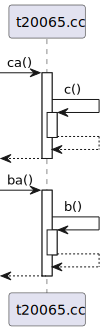
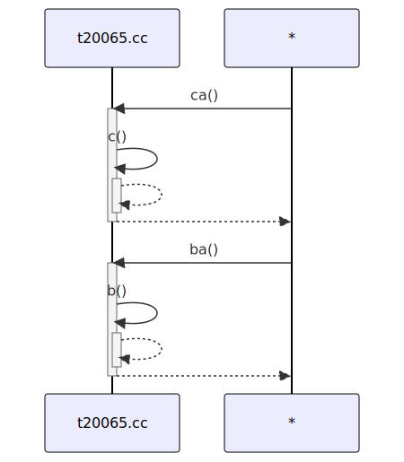

# t20065 - Test case for 'from' condition with regular expression
## Config
```yaml
diagrams:
  t20065_sequence:
    type: sequence
    glob:
      - t20065.cc
    include:
      namespaces:
        - clanguml::t20065
    using_namespace: clanguml::t20065
    combine_free_functions_into_file_participants: true
    from:
      - function:
          r: ".*(ba|ca).*"
```
## Source code
File `tests/t20065/t20065.cc`
```cpp
namespace clanguml::t20065 {

int a() { return 0; }

int aa() { return a(); }

int b() { return 0; }

int ba() { return b(); }

int c() { return 0; }

int ca() { return c(); }

} // namespace clanguml::t20065
```
## Generated PlantUML diagrams

## Generated Mermaid diagrams

## Generated JSON models
```json
{
  "diagram_type": "sequence",
  "name": "t20065_sequence",
  "participants": [
    {
      "activities": [
        {
          "display_name": "ca()",
          "full_name": "clanguml::t20065::ca()",
          "id": "14429216789496624855",
          "name": "ca",
          "namespace": "clanguml::t20065",
          "source_location": {
            "column": 5,
            "file": "t20065.cc",
            "line": 13,
            "translation_unit": "t20065.cc"
          },
          "type": "function"
        },
        {
          "display_name": "c()",
          "full_name": "clanguml::t20065::c()",
          "id": "5757842654596293340",
          "name": "c",
          "namespace": "clanguml::t20065",
          "source_location": {
            "column": 5,
            "file": "t20065.cc",
            "line": 11,
            "translation_unit": "t20065.cc"
          },
          "type": "function"
        },
        {
          "display_name": "ba()",
          "full_name": "clanguml::t20065::ba()",
          "id": "16080339202583079638",
          "name": "ba",
          "namespace": "clanguml::t20065",
          "source_location": {
            "column": 5,
            "file": "t20065.cc",
            "line": 9,
            "translation_unit": "t20065.cc"
          },
          "type": "function"
        },
        {
          "display_name": "b()",
          "full_name": "clanguml::t20065::b()",
          "id": "12011256264930036221",
          "name": "b",
          "namespace": "clanguml::t20065",
          "source_location": {
            "column": 5,
            "file": "t20065.cc",
            "line": 7,
            "translation_unit": "t20065.cc"
          },
          "type": "function"
        }
      ],
      "display_name": "t20065.cc",
      "full_name": "clanguml::t20065::ca()",
      "id": "9678282025371526380",
      "name": "t20065.cc",
      "namespace": "clanguml::t20065",
      "type": "file"
    }
  ],
  "sequences": [
    {
      "from": {
        "id": "14429216789496624855",
        "location": "clanguml::t20065::ca()"
      },
      "messages": [
        {
          "from": {
            "activity_id": "14429216789496624855",
            "participant_id": "9678282025371526380"
          },
          "name": "c()",
          "return_type": "int",
          "scope": "normal",
          "source_location": {
            "column": 19,
            "file": "t20065.cc",
            "line": 13,
            "translation_unit": "t20065.cc"
          },
          "to": {
            "activity_id": "5757842654596293340",
            "participant_id": "9678282025371526380"
          },
          "type": "message"
        },
        {
          "from": {
            "activity_id": "5757842654596293340",
            "participant_id": "9678282025371526380"
          },
          "name": "",
          "return_type": "int",
          "scope": "normal",
          "source_location": {
            "column": 11,
            "file": "t20065.cc",
            "line": 11,
            "translation_unit": "t20065.cc"
          },
          "to": {
            "activity_id": "14429216789496624855",
            "participant_id": "9678282025371526380"
          },
          "type": "return"
        }
      ],
      "return_type": "int"
    },
    {
      "from": {
        "id": "16080339202583079638",
        "location": "clanguml::t20065::ba()"
      },
      "messages": [
        {
          "from": {
            "activity_id": "16080339202583079638",
            "participant_id": "9678282025371526380"
          },
          "name": "b()",
          "return_type": "int",
          "scope": "normal",
          "source_location": {
            "column": 19,
            "file": "t20065.cc",
            "line": 9,
            "translation_unit": "t20065.cc"
          },
          "to": {
            "activity_id": "12011256264930036221",
            "participant_id": "9678282025371526380"
          },
          "type": "message"
        },
        {
          "from": {
            "activity_id": "12011256264930036221",
            "participant_id": "9678282025371526380"
          },
          "name": "",
          "return_type": "int",
          "scope": "normal",
          "source_location": {
            "column": 11,
            "file": "t20065.cc",
            "line": 7,
            "translation_unit": "t20065.cc"
          },
          "to": {
            "activity_id": "16080339202583079638",
            "participant_id": "9678282025371526380"
          },
          "type": "return"
        }
      ],
      "return_type": "int"
    }
  ],
  "using_namespace": "clanguml::t20065"
}
```
## Generated GraphML models
