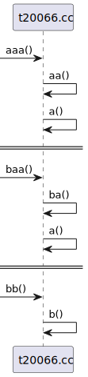
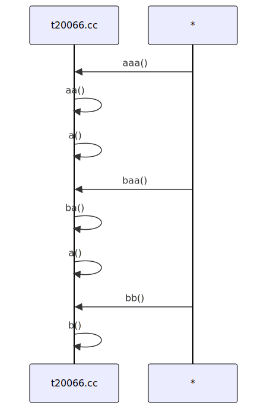

# t20066 - Test case for 'to' condition with regular expression
## Config
```yaml
diagrams:
  t20066_sequence:
    type: sequence
    glob:
      - t20066.cc
    include:
      namespaces:
        - clanguml::t20066
    using_namespace: clanguml::t20066
    combine_free_functions_into_file_participants: true
    to:
      - function:
          r: "clanguml::t20066::(a|b)\\(\\).*"
```
## Source code
File `tests/t20066/t20066.cc`
```cpp
namespace clanguml::t20066 {
int a() { return 0; }

int aa() { return a(); }

int aaa() { return aa(); }

int ba() { return a(); }

int baa() { return ba(); }

int b() { return 0; }

int bb() { return b(); }

int c() { return 0; }

int cc() { return c(); }

int ccc() { return cc(); }
} // namespace clanguml::t20066
```
## Generated PlantUML diagrams

## Generated Mermaid diagrams

## Generated JSON models
```json
{
  "diagram_type": "sequence",
  "name": "t20066_sequence",
  "participants": [
    {
      "activities": [
        {
          "display_name": "aaa()",
          "full_name": "clanguml::t20066::aaa()",
          "id": "6447210121666834391",
          "name": "aaa",
          "namespace": "clanguml::t20066",
          "source_location": {
            "column": 5,
            "file": "t20066.cc",
            "line": 6,
            "translation_unit": "t20066.cc"
          },
          "type": "function"
        },
        {
          "display_name": "aa()",
          "full_name": "clanguml::t20066::aa()",
          "id": "11857328250432187989",
          "name": "aa",
          "namespace": "clanguml::t20066",
          "source_location": {
            "column": 5,
            "file": "t20066.cc",
            "line": 4,
            "translation_unit": "t20066.cc"
          },
          "type": "function"
        },
        {
          "display_name": "a()",
          "full_name": "clanguml::t20066::a()",
          "id": "12799997472096168950",
          "name": "a",
          "namespace": "clanguml::t20066",
          "source_location": {
            "column": 5,
            "file": "t20066.cc",
            "line": 2,
            "translation_unit": "t20066.cc"
          },
          "type": "function"
        },
        {
          "display_name": "baa()",
          "full_name": "clanguml::t20066::baa()",
          "id": "15704555211578692321",
          "name": "baa",
          "namespace": "clanguml::t20066",
          "source_location": {
            "column": 5,
            "file": "t20066.cc",
            "line": 10,
            "translation_unit": "t20066.cc"
          },
          "type": "function"
        },
        {
          "display_name": "ba()",
          "full_name": "clanguml::t20066::ba()",
          "id": "14182587413507718286",
          "name": "ba",
          "namespace": "clanguml::t20066",
          "source_location": {
            "column": 5,
            "file": "t20066.cc",
            "line": 8,
            "translation_unit": "t20066.cc"
          },
          "type": "function"
        },
        {
          "display_name": "bb()",
          "full_name": "clanguml::t20066::bb()",
          "id": "11730218328428911063",
          "name": "bb",
          "namespace": "clanguml::t20066",
          "source_location": {
            "column": 5,
            "file": "t20066.cc",
            "line": 14,
            "translation_unit": "t20066.cc"
          },
          "type": "function"
        },
        {
          "display_name": "b()",
          "full_name": "clanguml::t20066::b()",
          "id": "16481564875566795708",
          "name": "b",
          "namespace": "clanguml::t20066",
          "source_location": {
            "column": 5,
            "file": "t20066.cc",
            "line": 12,
            "translation_unit": "t20066.cc"
          },
          "type": "function"
        }
      ],
      "display_name": "t20066.cc",
      "full_name": "clanguml::t20066::aaa()",
      "id": "11891343756628940705",
      "name": "t20066.cc",
      "namespace": "clanguml::t20066",
      "type": "file"
    }
  ],
  "sequences": [
    {
      "message_chains": [
        {
          "messages": [
            {
              "from": {
                "activity_id": "6447210121666834391",
                "participant_id": "11891343756628940705"
              },
              "name": "aa()",
              "return_type": "int",
              "scope": "normal",
              "source_location": {
                "column": 20,
                "file": "t20066.cc",
                "line": 6,
                "translation_unit": "t20066.cc"
              },
              "to": {
                "activity_id": "11857328250432187989",
                "participant_id": "11891343756628940705"
              },
              "type": "message"
            },
            {
              "from": {
                "activity_id": "11857328250432187989",
                "participant_id": "11891343756628940705"
              },
              "name": "a()",
              "return_type": "int",
              "scope": "normal",
              "source_location": {
                "column": 19,
                "file": "t20066.cc",
                "line": 4,
                "translation_unit": "t20066.cc"
              },
              "to": {
                "activity_id": "12799997472096168950",
                "participant_id": "11891343756628940705"
              },
              "type": "message"
            }
          ]
        },
        {
          "messages": [
            {
              "from": {
                "activity_id": "15704555211578692321",
                "participant_id": "11891343756628940705"
              },
              "name": "ba()",
              "return_type": "int",
              "scope": "normal",
              "source_location": {
                "column": 20,
                "file": "t20066.cc",
                "line": 10,
                "translation_unit": "t20066.cc"
              },
              "to": {
                "activity_id": "14182587413507718286",
                "participant_id": "11891343756628940705"
              },
              "type": "message"
            },
            {
              "from": {
                "activity_id": "14182587413507718286",
                "participant_id": "11891343756628940705"
              },
              "name": "a()",
              "return_type": "int",
              "scope": "normal",
              "source_location": {
                "column": 19,
                "file": "t20066.cc",
                "line": 8,
                "translation_unit": "t20066.cc"
              },
              "to": {
                "activity_id": "12799997472096168950",
                "participant_id": "11891343756628940705"
              },
              "type": "message"
            }
          ]
        }
      ],
      "to": {
        "id": "12799997472096168950",
        "location": "clanguml::t20066::a()"
      }
    },
    {
      "message_chains": [
        {
          "messages": [
            {
              "from": {
                "activity_id": "11730218328428911063",
                "participant_id": "11891343756628940705"
              },
              "name": "b()",
              "return_type": "int",
              "scope": "normal",
              "source_location": {
                "column": 19,
                "file": "t20066.cc",
                "line": 14,
                "translation_unit": "t20066.cc"
              },
              "to": {
                "activity_id": "16481564875566795708",
                "participant_id": "11891343756628940705"
              },
              "type": "message"
            }
          ]
        }
      ],
      "to": {
        "id": "16481564875566795708",
        "location": "clanguml::t20066::b()"
      }
    }
  ],
  "using_namespace": "clanguml::t20066"
}
```
## Generated GraphML models
