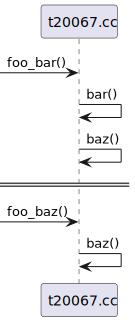
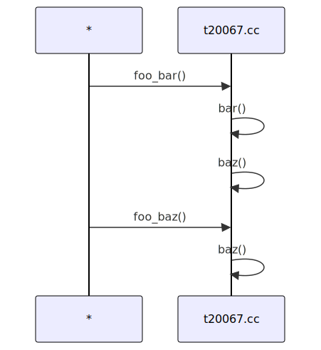

# t20067 - Test case for 'from_to' condition with regular expression
## Config
```yaml
diagrams:
  t20067_sequence:
    type: sequence
    glob:
      - t20067.cc
    include:
      namespaces:
        - clanguml::t20067
    using_namespace: clanguml::t20067
    combine_free_functions_into_file_participants: true
    from_to:
      - - function:
            r: "clanguml::t20067::foo.*"
        - function: "clanguml::t20067::baz()"

```
## Source code
File `tests/t20067/t20067.cc`
```cpp
namespace clanguml::t20067 {
int baz() { return 0; }

int bar() { return baz(); }

int foo_baz() { return baz(); }

int bar_baz() { return baz(); }

int foo_bar() { return bar(); }

int bar_bar() { return bar(); }
} // namespace clanguml::t20067
```
## Generated PlantUML diagrams

## Generated Mermaid diagrams

## Generated JSON models
```json
{
  "diagram_type": "sequence",
  "name": "t20067_sequence",
  "participants": [
    {
      "activities": [
        {
          "display_name": "foo_bar()",
          "full_name": "clanguml::t20067::foo_bar()",
          "id": "2137321769109984009",
          "name": "foo_bar",
          "namespace": "clanguml::t20067",
          "source_location": {
            "column": 5,
            "file": "t20067.cc",
            "line": 10,
            "translation_unit": "t20067.cc"
          },
          "type": "function"
        },
        {
          "display_name": "bar()",
          "full_name": "clanguml::t20067::bar()",
          "id": "3168758480653436984",
          "name": "bar",
          "namespace": "clanguml::t20067",
          "source_location": {
            "column": 5,
            "file": "t20067.cc",
            "line": 4,
            "translation_unit": "t20067.cc"
          },
          "type": "function"
        },
        {
          "display_name": "baz()",
          "full_name": "clanguml::t20067::baz()",
          "id": "18060942475102065128",
          "name": "baz",
          "namespace": "clanguml::t20067",
          "source_location": {
            "column": 5,
            "file": "t20067.cc",
            "line": 2,
            "translation_unit": "t20067.cc"
          },
          "type": "function"
        },
        {
          "display_name": "foo_baz()",
          "full_name": "clanguml::t20067::foo_baz()",
          "id": "16520907361089226344",
          "name": "foo_baz",
          "namespace": "clanguml::t20067",
          "source_location": {
            "column": 5,
            "file": "t20067.cc",
            "line": 6,
            "translation_unit": "t20067.cc"
          },
          "type": "function"
        }
      ],
      "display_name": "t20067.cc",
      "full_name": "clanguml::t20067::foo_bar()",
      "id": "5642785481231637132",
      "name": "t20067.cc",
      "namespace": "clanguml::t20067",
      "type": "file"
    }
  ],
  "sequences": [
    {
      "from_to": {
        "from": {
          "id": "2137321769109984009",
          "location": "clanguml::t20067::foo_bar()"
        },
        "to": {
          "id": "18060942475102065128",
          "location": "clanguml::t20067::baz()"
        }
      },
      "message_chains": [
        {
          "messages": [
            {
              "from": {
                "activity_id": "2137321769109984009",
                "participant_id": "5642785481231637132"
              },
              "name": "bar()",
              "return_type": "int",
              "scope": "normal",
              "source_location": {
                "column": 24,
                "file": "t20067.cc",
                "line": 10,
                "translation_unit": "t20067.cc"
              },
              "to": {
                "activity_id": "3168758480653436984",
                "participant_id": "5642785481231637132"
              },
              "type": "message"
            },
            {
              "from": {
                "activity_id": "3168758480653436984",
                "participant_id": "5642785481231637132"
              },
              "name": "baz()",
              "return_type": "int",
              "scope": "normal",
              "source_location": {
                "column": 20,
                "file": "t20067.cc",
                "line": 4,
                "translation_unit": "t20067.cc"
              },
              "to": {
                "activity_id": "18060942475102065128",
                "participant_id": "5642785481231637132"
              },
              "type": "message"
            }
          ]
        }
      ]
    },
    {
      "from_to": {
        "from": {
          "id": "16520907361089226344",
          "location": "clanguml::t20067::foo_baz()"
        },
        "to": {
          "id": "18060942475102065128",
          "location": "clanguml::t20067::baz()"
        }
      },
      "message_chains": [
        {
          "messages": [
            {
              "from": {
                "activity_id": "16520907361089226344",
                "participant_id": "5642785481231637132"
              },
              "name": "baz()",
              "return_type": "int",
              "scope": "normal",
              "source_location": {
                "column": 24,
                "file": "t20067.cc",
                "line": 6,
                "translation_unit": "t20067.cc"
              },
              "to": {
                "activity_id": "18060942475102065128",
                "participant_id": "5642785481231637132"
              },
              "type": "message"
            }
          ]
        }
      ]
    }
  ],
  "using_namespace": "clanguml::t20067"
}
```
## Generated GraphML models
