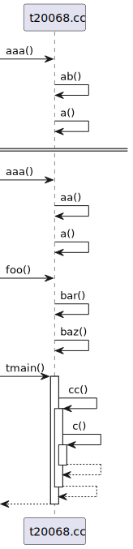
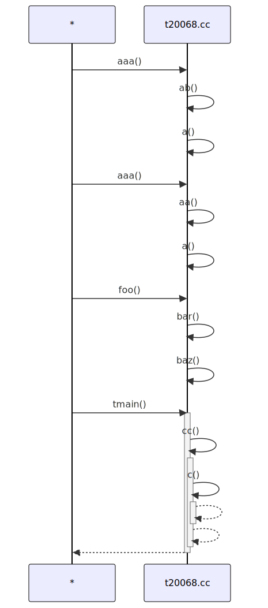

# t20068 - Test case for combine 'from', 'to' and 'from_to' in one diagram
## Config
```yaml
diagrams:
  t20068_sequence:
    type: sequence
    glob:
      - t20068.cc
    include:
      namespaces:
        - clanguml::t20068
    using_namespace: clanguml::t20068
    combine_free_functions_into_file_participants: true
    from:
      - function: "clanguml::t20068::tmain()"
    to:
      - function: "clanguml::t20068::baz()"
    from_to:
      - [ function: "clanguml::t20068::aaa()", function: "clanguml::t20068::a()" ]


```
## Source code
File `tests/t20068/t20068.cc`
```cpp
namespace clanguml::t20068 {

int baz() { return 0; }
int bar() { return baz(); }
int foo() { return bar(); }

int a() { return 1; }
int aa() { return a(); }
int ab() { return a(); }
int aaa() { return aa() + ab(); }

int c() { return 0; }
int cc() { return c(); }
int tmain() { return cc(); }

} // namespace clanguml::t20068

```
## Generated PlantUML diagrams

## Generated Mermaid diagrams

## Generated JSON models
```json
{
  "diagram_type": "sequence",
  "name": "t20068_sequence",
  "participants": [
    {
      "activities": [
        {
          "display_name": "aaa()",
          "full_name": "clanguml::t20068::aaa()",
          "id": "15106131409427270664",
          "name": "aaa",
          "namespace": "clanguml::t20068",
          "source_location": {
            "column": 5,
            "file": "t20068.cc",
            "line": 10,
            "translation_unit": "t20068.cc"
          },
          "type": "function"
        },
        {
          "display_name": "ab()",
          "full_name": "clanguml::t20068::ab()",
          "id": "2369011073586018349",
          "name": "ab",
          "namespace": "clanguml::t20068",
          "source_location": {
            "column": 5,
            "file": "t20068.cc",
            "line": 9,
            "translation_unit": "t20068.cc"
          },
          "type": "function"
        },
        {
          "display_name": "a()",
          "full_name": "clanguml::t20068::a()",
          "id": "12828059281065706436",
          "name": "a",
          "namespace": "clanguml::t20068",
          "source_location": {
            "column": 5,
            "file": "t20068.cc",
            "line": 7,
            "translation_unit": "t20068.cc"
          },
          "type": "function"
        },
        {
          "display_name": "aa()",
          "full_name": "clanguml::t20068::aa()",
          "id": "10271655735300675021",
          "name": "aa",
          "namespace": "clanguml::t20068",
          "source_location": {
            "column": 5,
            "file": "t20068.cc",
            "line": 8,
            "translation_unit": "t20068.cc"
          },
          "type": "function"
        },
        {
          "display_name": "foo()",
          "full_name": "clanguml::t20068::foo()",
          "id": "9163430379525139786",
          "name": "foo",
          "namespace": "clanguml::t20068",
          "source_location": {
            "column": 5,
            "file": "t20068.cc",
            "line": 5,
            "translation_unit": "t20068.cc"
          },
          "type": "function"
        },
        {
          "display_name": "bar()",
          "full_name": "clanguml::t20068::bar()",
          "id": "5455554322393588678",
          "name": "bar",
          "namespace": "clanguml::t20068",
          "source_location": {
            "column": 5,
            "file": "t20068.cc",
            "line": 4,
            "translation_unit": "t20068.cc"
          },
          "type": "function"
        },
        {
          "display_name": "baz()",
          "full_name": "clanguml::t20068::baz()",
          "id": "4424408015151072056",
          "name": "baz",
          "namespace": "clanguml::t20068",
          "source_location": {
            "column": 5,
            "file": "t20068.cc",
            "line": 3,
            "translation_unit": "t20068.cc"
          },
          "type": "function"
        },
        {
          "display_name": "tmain()",
          "full_name": "clanguml::t20068::tmain()",
          "id": "10226666872913118459",
          "name": "tmain",
          "namespace": "clanguml::t20068",
          "source_location": {
            "column": 5,
            "file": "t20068.cc",
            "line": 14,
            "translation_unit": "t20068.cc"
          },
          "type": "function"
        },
        {
          "display_name": "cc()",
          "full_name": "clanguml::t20068::cc()",
          "id": "1298359219273647525",
          "name": "cc",
          "namespace": "clanguml::t20068",
          "source_location": {
            "column": 5,
            "file": "t20068.cc",
            "line": 13,
            "translation_unit": "t20068.cc"
          },
          "type": "function"
        },
        {
          "display_name": "c()",
          "full_name": "clanguml::t20068::c()",
          "id": "12163451889602170257",
          "name": "c",
          "namespace": "clanguml::t20068",
          "source_location": {
            "column": 5,
            "file": "t20068.cc",
            "line": 12,
            "translation_unit": "t20068.cc"
          },
          "type": "function"
        }
      ],
      "display_name": "t20068.cc",
      "full_name": "clanguml::t20068::aaa()",
      "id": "14404306026498162705",
      "name": "t20068.cc",
      "namespace": "clanguml::t20068",
      "type": "file"
    }
  ],
  "sequences": [
    {
      "from_to": {
        "from": {
          "id": "15106131409427270664",
          "location": "clanguml::t20068::aaa()"
        },
        "to": {
          "id": "12828059281065706436",
          "location": "clanguml::t20068::a()"
        }
      },
      "message_chains": [
        {
          "messages": [
            {
              "from": {
                "activity_id": "15106131409427270664",
                "participant_id": "14404306026498162705"
              },
              "name": "ab()",
              "return_type": "int",
              "scope": "normal",
              "source_location": {
                "column": 27,
                "file": "t20068.cc",
                "line": 10,
                "translation_unit": "t20068.cc"
              },
              "to": {
                "activity_id": "2369011073586018349",
                "participant_id": "14404306026498162705"
              },
              "type": "message"
            },
            {
              "from": {
                "activity_id": "2369011073586018349",
                "participant_id": "14404306026498162705"
              },
              "name": "a()",
              "return_type": "int",
              "scope": "normal",
              "source_location": {
                "column": 19,
                "file": "t20068.cc",
                "line": 9,
                "translation_unit": "t20068.cc"
              },
              "to": {
                "activity_id": "12828059281065706436",
                "participant_id": "14404306026498162705"
              },
              "type": "message"
            }
          ]
        },
        {
          "messages": [
            {
              "from": {
                "activity_id": "15106131409427270664",
                "participant_id": "14404306026498162705"
              },
              "name": "aa()",
              "return_type": "int",
              "scope": "normal",
              "source_location": {
                "column": 20,
                "file": "t20068.cc",
                "line": 10,
                "translation_unit": "t20068.cc"
              },
              "to": {
                "activity_id": "10271655735300675021",
                "participant_id": "14404306026498162705"
              },
              "type": "message"
            },
            {
              "from": {
                "activity_id": "10271655735300675021",
                "participant_id": "14404306026498162705"
              },
              "name": "a()",
              "return_type": "int",
              "scope": "normal",
              "source_location": {
                "column": 19,
                "file": "t20068.cc",
                "line": 8,
                "translation_unit": "t20068.cc"
              },
              "to": {
                "activity_id": "12828059281065706436",
                "participant_id": "14404306026498162705"
              },
              "type": "message"
            }
          ]
        }
      ]
    },
    {
      "message_chains": [
        {
          "messages": [
            {
              "from": {
                "activity_id": "9163430379525139786",
                "participant_id": "14404306026498162705"
              },
              "name": "bar()",
              "return_type": "int",
              "scope": "normal",
              "source_location": {
                "column": 20,
                "file": "t20068.cc",
                "line": 5,
                "translation_unit": "t20068.cc"
              },
              "to": {
                "activity_id": "5455554322393588678",
                "participant_id": "14404306026498162705"
              },
              "type": "message"
            },
            {
              "from": {
                "activity_id": "5455554322393588678",
                "participant_id": "14404306026498162705"
              },
              "name": "baz()",
              "return_type": "int",
              "scope": "normal",
              "source_location": {
                "column": 20,
                "file": "t20068.cc",
                "line": 4,
                "translation_unit": "t20068.cc"
              },
              "to": {
                "activity_id": "4424408015151072056",
                "participant_id": "14404306026498162705"
              },
              "type": "message"
            }
          ]
        }
      ],
      "to": {
        "id": "4424408015151072056",
        "location": "clanguml::t20068::baz()"
      }
    },
    {
      "from": {
        "id": "10226666872913118459",
        "location": "clanguml::t20068::tmain()"
      },
      "messages": [
        {
          "from": {
            "activity_id": "10226666872913118459",
            "participant_id": "14404306026498162705"
          },
          "name": "cc()",
          "return_type": "int",
          "scope": "normal",
          "source_location": {
            "column": 22,
            "file": "t20068.cc",
            "line": 14,
            "translation_unit": "t20068.cc"
          },
          "to": {
            "activity_id": "1298359219273647525",
            "participant_id": "14404306026498162705"
          },
          "type": "message"
        },
        {
          "from": {
            "activity_id": "1298359219273647525",
            "participant_id": "14404306026498162705"
          },
          "name": "c()",
          "return_type": "int",
          "scope": "normal",
          "source_location": {
            "column": 19,
            "file": "t20068.cc",
            "line": 13,
            "translation_unit": "t20068.cc"
          },
          "to": {
            "activity_id": "12163451889602170257",
            "participant_id": "14404306026498162705"
          },
          "type": "message"
        }
      ],
      "return_type": "int"
    }
  ],
  "using_namespace": "clanguml::t20068"
}
```
## Generated GraphML models
