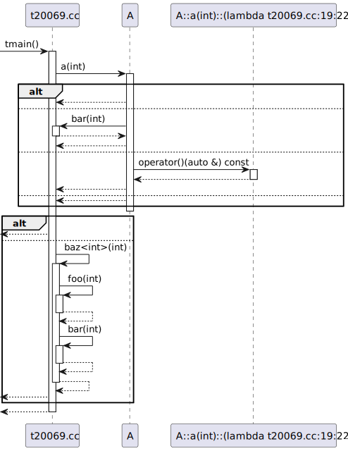

# t20069 - Test case for return messages from all branches and exitpoints
## Config
```yaml
diagrams:
  t20069_sequence:
    type: sequence
    glob:
      - t20069.cc
    include:
      namespaces:
        - clanguml::t20069
    using_namespace: clanguml::t20069
    combine_free_functions_into_file_participants: true
    from:
      - function: "clanguml::t20069::tmain()"
  t20069_sequence_with_return_values:
    type: sequence
    glob:
      - t20069.cc
    include:
      namespaces:
        - clanguml::t20069
    using_namespace: clanguml::t20069
    combine_free_functions_into_file_participants: true
    generate_return_values: true
    from:
      - function: "clanguml::t20069::tmain()"
```
## Source code
File `tests/t20069/t20069.cc`
```cpp
namespace clanguml::t20069 {

int foo(int x) { return x * 2; }

int bar(int x) { return x / 2; }

template <typename T> T baz(T x) { return foo(x) + bar(x); }

struct A {
    int a(int x)
    {
        if (x % 2 == 0) {
            return x;
        }
        else if (x > 2) {
            return bar(x);
        }
        else if (x == 123) {
            auto f = [](auto &v) { return v + 1; };

            return f(x);
        }
        else {
            return 0;
        }
    }
};

int tmain()
{
    A a;

    auto x = a.a(100);
    if (x > 100) {
        return x;
    }
    else if (x == 200) {
        return baz(x);
    }

    return 0;
}
} // namespace clanguml::t20069
```
## Generated PlantUML diagrams


## Generated Mermaid diagrams


## Generated JSON models
```json
{
  "diagram_type": "sequence",
  "name": "t20069_sequence",
  "participants": [
    {
      "activities": [
        {
          "display_name": "tmain()",
          "full_name": "clanguml::t20069::tmain()",
          "id": "12751161514123617720",
          "name": "tmain",
          "namespace": "clanguml::t20069",
          "source_location": {
            "column": 5,
            "file": "t20069.cc",
            "line": 29,
            "translation_unit": "t20069.cc"
          },
          "type": "function"
        },
        {
          "display_name": "bar(int)",
          "full_name": "clanguml::t20069::bar(int)",
          "id": "5015178832671238333",
          "name": "bar",
          "namespace": "clanguml::t20069",
          "source_location": {
            "column": 5,
            "file": "t20069.cc",
            "line": 5,
            "translation_unit": "t20069.cc"
          },
          "type": "function"
        },
        {
          "display_name": "baz<int>(int)",
          "full_name": "clanguml::t20069::baz<int>(int)",
          "id": "12338612800196626036",
          "name": "baz",
          "namespace": "clanguml::t20069",
          "source_location": {
            "column": 25,
            "file": "t20069.cc",
            "line": 7,
            "translation_unit": "t20069.cc"
          },
          "type": "function_template"
        },
        {
          "display_name": "foo(int)",
          "full_name": "clanguml::t20069::foo(int)",
          "id": "1912657663491680984",
          "name": "foo",
          "namespace": "clanguml::t20069",
          "source_location": {
            "column": 5,
            "file": "t20069.cc",
            "line": 3,
            "translation_unit": "t20069.cc"
          },
          "type": "function"
        }
      ],
      "display_name": "t20069.cc",
      "full_name": "clanguml::t20069::tmain()",
      "id": "93056251172097088",
      "name": "t20069.cc",
      "namespace": "clanguml::t20069",
      "type": "file"
    },
    {
      "activities": [
        {
          "display_name": "a(int)",
          "full_name": "clanguml::t20069::A::a(int)",
          "id": "15318933679725022702",
          "name": "a",
          "namespace": "clanguml::t20069",
          "source_location": {
            "column": 9,
            "file": "t20069.cc",
            "line": 10,
            "translation_unit": "t20069.cc"
          },
          "type": "method"
        }
      ],
      "display_name": "A",
      "full_name": "clanguml::t20069::A",
      "id": "6437728601678043259",
      "name": "A",
      "namespace": "clanguml::t20069",
      "source_location": {
        "column": 8,
        "file": "t20069.cc",
        "line": 9,
        "translation_unit": "t20069.cc"
      },
      "type": "class"
    },
    {
      "activities": [
        {
          "display_name": "operator()(auto &) const",
          "full_name": "clanguml::t20069::A::a(int)::(lambda t20069.cc:19:22)::operator()(auto &) const",
          "id": "15752831427609583809",
          "name": "operator()",
          "namespace": "clanguml::t20069::A::a(int)",
          "type": "method"
        }
      ],
      "display_name": "A::a(int)::(lambda t20069.cc:19:22)",
      "full_name": "clanguml::t20069::A::a(int)::(lambda t20069.cc:19:22)",
      "id": "5771227792840476499",
      "name": "A::a(int)##(lambda t20069.cc:19:22)",
      "namespace": "clanguml::t20069",
      "source_location": {
        "column": 22,
        "file": "t20069.cc",
        "line": 19,
        "translation_unit": "t20069.cc"
      },
      "type": "lambda"
    }
  ],
  "sequences": [
    {
      "from": {
        "id": "12751161514123617720",
        "location": "clanguml::t20069::tmain()"
      },
      "messages": [
        {
          "from": {
            "activity_id": "12751161514123617720",
            "participant_id": "93056251172097088"
          },
          "name": "a(int)",
          "return_type": "int",
          "scope": "normal",
          "source_location": {
            "column": 14,
            "file": "t20069.cc",
            "line": 33,
            "translation_unit": "t20069.cc"
          },
          "to": {
            "activity_id": "15318933679725022702",
            "participant_id": "6437728601678043259"
          },
          "type": "message"
        },
        {
          "activity_id": "15318933679725022702",
          "branches": [
            {
              "messages": [
                {
                  "from": {
                    "activity_id": "15318933679725022702",
                    "participant_id": "6437728601678043259"
                  },
                  "name": "",
                  "return_type": "int",
                  "scope": "normal",
                  "source_location": {
                    "column": 13,
                    "file": "t20069.cc",
                    "line": 13,
                    "translation_unit": "t20069.cc"
                  },
                  "to": {
                    "activity_id": "12751161514123617720",
                    "participant_id": "93056251172097088"
                  },
                  "type": "return"
                }
              ],
              "type": "consequent"
            },
            {
              "messages": [
                {
                  "from": {
                    "activity_id": "15318933679725022702",
                    "participant_id": "6437728601678043259"
                  },
                  "name": "bar(int)",
                  "return_type": "int",
                  "scope": "normal",
                  "source_location": {
                    "column": 20,
                    "file": "t20069.cc",
                    "line": 16,
                    "translation_unit": "t20069.cc"
                  },
                  "to": {
                    "activity_id": "5015178832671238333",
                    "participant_id": "93056251172097088"
                  },
                  "type": "message"
                },
                {
                  "from": {
                    "activity_id": "5015178832671238333",
                    "participant_id": "93056251172097088"
                  },
                  "name": "",
                  "return_type": "int",
                  "scope": "normal",
                  "source_location": {
                    "column": 18,
                    "file": "t20069.cc",
                    "line": 5,
                    "translation_unit": "t20069.cc"
                  },
                  "to": {
                    "activity_id": "15318933679725022702",
                    "participant_id": "6437728601678043259"
                  },
                  "type": "return"
                },
                {
                  "from": {
                    "activity_id": "15318933679725022702",
                    "participant_id": "6437728601678043259"
                  },
                  "name": "",
                  "return_type": "int",
                  "scope": "normal",
                  "source_location": {
                    "column": 13,
                    "file": "t20069.cc",
                    "line": 16,
                    "translation_unit": "t20069.cc"
                  },
                  "to": {
                    "activity_id": "12751161514123617720",
                    "participant_id": "93056251172097088"
                  },
                  "type": "return"
                }
              ],
              "type": "alternative"
            },
            {
              "messages": [
                {
                  "from": {
                    "activity_id": "15318933679725022702",
                    "participant_id": "6437728601678043259"
                  },
                  "name": "operator()(auto &) const",
                  "return_type": "auto",
                  "scope": "normal",
                  "source_location": {
                    "column": 20,
                    "file": "t20069.cc",
                    "line": 21,
                    "translation_unit": "t20069.cc"
                  },
                  "to": {
                    "activity_id": "15752831427609583809",
                    "participant_id": "5771227792840476499"
                  },
                  "type": "message"
                },
                {
                  "from": {
                    "activity_id": "15752831427609583809",
                    "participant_id": "5771227792840476499"
                  },
                  "name": "",
                  "return_type": "int",
                  "scope": "normal",
                  "source_location": {
                    "column": 36,
                    "file": "t20069.cc",
                    "line": 19,
                    "translation_unit": "t20069.cc"
                  },
                  "to": {
                    "activity_id": "15318933679725022702",
                    "participant_id": "6437728601678043259"
                  },
                  "type": "return"
                },
                {
                  "from": {
                    "activity_id": "15318933679725022702",
                    "participant_id": "6437728601678043259"
                  },
                  "name": "",
                  "return_type": "int",
                  "scope": "normal",
                  "source_location": {
                    "column": 13,
                    "file": "t20069.cc",
                    "line": 21,
                    "translation_unit": "t20069.cc"
                  },
                  "to": {
                    "activity_id": "12751161514123617720",
                    "participant_id": "93056251172097088"
                  },
                  "type": "return"
                }
              ],
              "type": "alternative"
            },
            {
              "messages": [
                {
                  "from": {
                    "activity_id": "15318933679725022702",
                    "participant_id": "6437728601678043259"
                  },
                  "name": "",
                  "return_type": "int",
                  "scope": "normal",
                  "source_location": {
                    "column": 13,
                    "file": "t20069.cc",
                    "line": 24,
                    "translation_unit": "t20069.cc"
                  },
                  "to": {
                    "activity_id": "12751161514123617720",
                    "participant_id": "93056251172097088"
                  },
                  "type": "return"
                }
              ],
              "type": "alternative"
            }
          ],
          "name": "if",
          "type": "alt"
        },
        {
          "activity_id": "12751161514123617720",
          "branches": [
            {
              "type": "consequent"
            },
            {
              "messages": [
                {
                  "from": {
                    "activity_id": "12751161514123617720",
                    "participant_id": "93056251172097088"
                  },
                  "name": "baz<int>(int)",
                  "return_type": "",
                  "scope": "normal",
                  "source_location": {
                    "column": 16,
                    "file": "t20069.cc",
                    "line": 38,
                    "translation_unit": "t20069.cc"
                  },
                  "to": {
                    "activity_id": "12338612800196626036",
                    "participant_id": "93056251172097088"
                  },
                  "type": "message"
                },
                {
                  "from": {
                    "activity_id": "12338612800196626036",
                    "participant_id": "93056251172097088"
                  },
                  "name": "foo(int)",
                  "return_type": "int",
                  "scope": "normal",
                  "source_location": {
                    "column": 43,
                    "file": "t20069.cc",
                    "line": 7,
                    "translation_unit": "t20069.cc"
                  },
                  "to": {
                    "activity_id": "1912657663491680984",
                    "participant_id": "93056251172097088"
                  },
                  "type": "message"
                },
                {
                  "from": {
                    "activity_id": "1912657663491680984",
                    "participant_id": "93056251172097088"
                  },
                  "name": "",
                  "return_type": "int",
                  "scope": "normal",
                  "source_location": {
                    "column": 18,
                    "file": "t20069.cc",
                    "line": 3,
                    "translation_unit": "t20069.cc"
                  },
                  "to": {
                    "activity_id": "12338612800196626036",
                    "participant_id": "93056251172097088"
                  },
                  "type": "return"
                },
                {
                  "from": {
                    "activity_id": "12338612800196626036",
                    "participant_id": "93056251172097088"
                  },
                  "name": "bar(int)",
                  "return_type": "int",
                  "scope": "normal",
                  "source_location": {
                    "column": 52,
                    "file": "t20069.cc",
                    "line": 7,
                    "translation_unit": "t20069.cc"
                  },
                  "to": {
                    "activity_id": "5015178832671238333",
                    "participant_id": "93056251172097088"
                  },
                  "type": "message"
                },
                {
                  "from": {
                    "activity_id": "5015178832671238333",
                    "participant_id": "93056251172097088"
                  },
                  "name": "",
                  "return_type": "int",
                  "scope": "normal",
                  "source_location": {
                    "column": 18,
                    "file": "t20069.cc",
                    "line": 5,
                    "translation_unit": "t20069.cc"
                  },
                  "to": {
                    "activity_id": "12338612800196626036",
                    "participant_id": "93056251172097088"
                  },
                  "type": "return"
                },
                {
                  "from": {
                    "activity_id": "12338612800196626036",
                    "participant_id": "93056251172097088"
                  },
                  "name": "",
                  "return_type": "int",
                  "scope": "normal",
                  "source_location": {
                    "column": 36,
                    "file": "t20069.cc",
                    "line": 7,
                    "translation_unit": "t20069.cc"
                  },
                  "to": {
                    "activity_id": "12751161514123617720",
                    "participant_id": "93056251172097088"
                  },
                  "type": "return"
                }
              ],
              "type": "alternative"
            }
          ],
          "name": "if",
          "type": "alt"
        }
      ],
      "return_type": "int"
    }
  ],
  "using_namespace": "clanguml::t20069"
}
```
```json
{
  "diagram_type": "sequence",
  "name": "t20069_sequence_with_return_values",
  "participants": [
    {
      "activities": [
        {
          "display_name": "tmain()",
          "full_name": "clanguml::t20069::tmain()",
          "id": "12751161514123617720",
          "name": "tmain",
          "namespace": "clanguml::t20069",
          "source_location": {
            "column": 5,
            "file": "t20069.cc",
            "line": 29,
            "translation_unit": "t20069.cc"
          },
          "type": "function"
        },
        {
          "display_name": "bar(int)",
          "full_name": "clanguml::t20069::bar(int)",
          "id": "5015178832671238333",
          "name": "bar",
          "namespace": "clanguml::t20069",
          "source_location": {
            "column": 5,
            "file": "t20069.cc",
            "line": 5,
            "translation_unit": "t20069.cc"
          },
          "type": "function"
        },
        {
          "display_name": "baz<int>(int)",
          "full_name": "clanguml::t20069::baz<int>(int)",
          "id": "12338612800196626036",
          "name": "baz",
          "namespace": "clanguml::t20069",
          "source_location": {
            "column": 25,
            "file": "t20069.cc",
            "line": 7,
            "translation_unit": "t20069.cc"
          },
          "type": "function_template"
        },
        {
          "display_name": "foo(int)",
          "full_name": "clanguml::t20069::foo(int)",
          "id": "1912657663491680984",
          "name": "foo",
          "namespace": "clanguml::t20069",
          "source_location": {
            "column": 5,
            "file": "t20069.cc",
            "line": 3,
            "translation_unit": "t20069.cc"
          },
          "type": "function"
        }
      ],
      "display_name": "t20069.cc",
      "full_name": "clanguml::t20069::tmain()",
      "id": "93056251172097088",
      "name": "t20069.cc",
      "namespace": "clanguml::t20069",
      "type": "file"
    },
    {
      "activities": [
        {
          "display_name": "a(int)",
          "full_name": "clanguml::t20069::A::a(int)",
          "id": "15318933679725022702",
          "name": "a",
          "namespace": "clanguml::t20069",
          "source_location": {
            "column": 9,
            "file": "t20069.cc",
            "line": 10,
            "translation_unit": "t20069.cc"
          },
          "type": "method"
        }
      ],
      "display_name": "A",
      "full_name": "clanguml::t20069::A",
      "id": "6437728601678043259",
      "name": "A",
      "namespace": "clanguml::t20069",
      "source_location": {
        "column": 8,
        "file": "t20069.cc",
        "line": 9,
        "translation_unit": "t20069.cc"
      },
      "type": "class"
    },
    {
      "activities": [
        {
          "display_name": "operator()(auto &) const",
          "full_name": "clanguml::t20069::A::a(int)::(lambda t20069.cc:19:22)::operator()(auto &) const",
          "id": "15752831427609583809",
          "name": "operator()",
          "namespace": "clanguml::t20069::A::a(int)",
          "type": "method"
        }
      ],
      "display_name": "A::a(int)::(lambda t20069.cc:19:22)",
      "full_name": "clanguml::t20069::A::a(int)::(lambda t20069.cc:19:22)",
      "id": "5771227792840476499",
      "name": "A::a(int)##(lambda t20069.cc:19:22)",
      "namespace": "clanguml::t20069",
      "source_location": {
        "column": 22,
        "file": "t20069.cc",
        "line": 19,
        "translation_unit": "t20069.cc"
      },
      "type": "lambda"
    }
  ],
  "sequences": [
    {
      "from": {
        "id": "12751161514123617720",
        "location": "clanguml::t20069::tmain()"
      },
      "messages": [
        {
          "from": {
            "activity_id": "12751161514123617720",
            "participant_id": "93056251172097088"
          },
          "name": "a(int)",
          "return_type": "int",
          "scope": "normal",
          "source_location": {
            "column": 14,
            "file": "t20069.cc",
            "line": 33,
            "translation_unit": "t20069.cc"
          },
          "to": {
            "activity_id": "15318933679725022702",
            "participant_id": "6437728601678043259"
          },
          "type": "message"
        },
        {
          "activity_id": "15318933679725022702",
          "branches": [
            {
              "messages": [
                {
                  "from": {
                    "activity_id": "15318933679725022702",
                    "participant_id": "6437728601678043259"
                  },
                  "name": "x",
                  "return_type": "int",
                  "scope": "normal",
                  "source_location": {
                    "column": 13,
                    "file": "t20069.cc",
                    "line": 13,
                    "translation_unit": "t20069.cc"
                  },
                  "to": {
                    "activity_id": "12751161514123617720",
                    "participant_id": "93056251172097088"
                  },
                  "type": "return"
                }
              ],
              "type": "consequent"
            },
            {
              "messages": [
                {
                  "from": {
                    "activity_id": "15318933679725022702",
                    "participant_id": "6437728601678043259"
                  },
                  "name": "bar(int)",
                  "return_type": "int",
                  "scope": "normal",
                  "source_location": {
                    "column": 20,
                    "file": "t20069.cc",
                    "line": 16,
                    "translation_unit": "t20069.cc"
                  },
                  "to": {
                    "activity_id": "5015178832671238333",
                    "participant_id": "93056251172097088"
                  },
                  "type": "message"
                },
                {
                  "from": {
                    "activity_id": "5015178832671238333",
                    "participant_id": "93056251172097088"
                  },
                  "name": "x / 2",
                  "return_type": "int",
                  "scope": "normal",
                  "source_location": {
                    "column": 18,
                    "file": "t20069.cc",
                    "line": 5,
                    "translation_unit": "t20069.cc"
                  },
                  "to": {
                    "activity_id": "15318933679725022702",
                    "participant_id": "6437728601678043259"
                  },
                  "type": "return"
                },
                {
                  "from": {
                    "activity_id": "15318933679725022702",
                    "participant_id": "6437728601678043259"
                  },
                  "name": "bar(x)",
                  "return_type": "int",
                  "scope": "normal",
                  "source_location": {
                    "column": 13,
                    "file": "t20069.cc",
                    "line": 16,
                    "translation_unit": "t20069.cc"
                  },
                  "to": {
                    "activity_id": "12751161514123617720",
                    "participant_id": "93056251172097088"
                  },
                  "type": "return"
                }
              ],
              "type": "alternative"
            },
            {
              "messages": [
                {
                  "from": {
                    "activity_id": "15318933679725022702",
                    "participant_id": "6437728601678043259"
                  },
                  "name": "operator()(auto &) const",
                  "return_type": "auto",
                  "scope": "normal",
                  "source_location": {
                    "column": 20,
                    "file": "t20069.cc",
                    "line": 21,
                    "translation_unit": "t20069.cc"
                  },
                  "to": {
                    "activity_id": "15752831427609583809",
                    "participant_id": "5771227792840476499"
                  },
                  "type": "message"
                },
                {
                  "from": {
                    "activity_id": "15752831427609583809",
                    "participant_id": "5771227792840476499"
                  },
                  "name": "v + 1",
                  "return_type": "int",
                  "scope": "normal",
                  "source_location": {
                    "column": 36,
                    "file": "t20069.cc",
                    "line": 19,
                    "translation_unit": "t20069.cc"
                  },
                  "to": {
                    "activity_id": "15318933679725022702",
                    "participant_id": "6437728601678043259"
                  },
                  "type": "return"
                },
                {
                  "from": {
                    "activity_id": "15318933679725022702",
                    "participant_id": "6437728601678043259"
                  },
                  "name": "f(x)",
                  "return_type": "int",
                  "scope": "normal",
                  "source_location": {
                    "column": 13,
                    "file": "t20069.cc",
                    "line": 21,
                    "translation_unit": "t20069.cc"
                  },
                  "to": {
                    "activity_id": "12751161514123617720",
                    "participant_id": "93056251172097088"
                  },
                  "type": "return"
                }
              ],
              "type": "alternative"
            },
            {
              "messages": [
                {
                  "from": {
                    "activity_id": "15318933679725022702",
                    "participant_id": "6437728601678043259"
                  },
                  "name": "0",
                  "return_type": "int",
                  "scope": "normal",
                  "source_location": {
                    "column": 13,
                    "file": "t20069.cc",
                    "line": 24,
                    "translation_unit": "t20069.cc"
                  },
                  "to": {
                    "activity_id": "12751161514123617720",
                    "participant_id": "93056251172097088"
                  },
                  "type": "return"
                }
              ],
              "type": "alternative"
            }
          ],
          "name": "if",
          "type": "alt"
        },
        {
          "activity_id": "12751161514123617720",
          "branches": [
            {
              "type": "consequent"
            },
            {
              "messages": [
                {
                  "from": {
                    "activity_id": "12751161514123617720",
                    "participant_id": "93056251172097088"
                  },
                  "name": "baz<int>(int)",
                  "return_type": "",
                  "scope": "normal",
                  "source_location": {
                    "column": 16,
                    "file": "t20069.cc",
                    "line": 38,
                    "translation_unit": "t20069.cc"
                  },
                  "to": {
                    "activity_id": "12338612800196626036",
                    "participant_id": "93056251172097088"
                  },
                  "type": "message"
                },
                {
                  "from": {
                    "activity_id": "12338612800196626036",
                    "participant_id": "93056251172097088"
                  },
                  "name": "foo(int)",
                  "return_type": "int",
                  "scope": "normal",
                  "source_location": {
                    "column": 43,
                    "file": "t20069.cc",
                    "line": 7,
                    "translation_unit": "t20069.cc"
                  },
                  "to": {
                    "activity_id": "1912657663491680984",
                    "participant_id": "93056251172097088"
                  },
                  "type": "message"
                },
                {
                  "from": {
                    "activity_id": "1912657663491680984",
                    "participant_id": "93056251172097088"
                  },
                  "name": "x * 2",
                  "return_type": "int",
                  "scope": "normal",
                  "source_location": {
                    "column": 18,
                    "file": "t20069.cc",
                    "line": 3,
                    "translation_unit": "t20069.cc"
                  },
                  "to": {
                    "activity_id": "12338612800196626036",
                    "participant_id": "93056251172097088"
                  },
                  "type": "return"
                },
                {
                  "from": {
                    "activity_id": "12338612800196626036",
                    "participant_id": "93056251172097088"
                  },
                  "name": "bar(int)",
                  "return_type": "int",
                  "scope": "normal",
                  "source_location": {
                    "column": 52,
                    "file": "t20069.cc",
                    "line": 7,
                    "translation_unit": "t20069.cc"
                  },
                  "to": {
                    "activity_id": "5015178832671238333",
                    "participant_id": "93056251172097088"
                  },
                  "type": "message"
                },
                {
                  "from": {
                    "activity_id": "5015178832671238333",
                    "participant_id": "93056251172097088"
                  },
                  "name": "x / 2",
                  "return_type": "int",
                  "scope": "normal",
                  "source_location": {
                    "column": 18,
                    "file": "t20069.cc",
                    "line": 5,
                    "translation_unit": "t20069.cc"
                  },
                  "to": {
                    "activity_id": "12338612800196626036",
                    "participant_id": "93056251172097088"
                  },
                  "type": "return"
                },
                {
                  "from": {
                    "activity_id": "12338612800196626036",
                    "participant_id": "93056251172097088"
                  },
                  "name": "foo(x) + bar(x)",
                  "return_type": "int",
                  "scope": "normal",
                  "source_location": {
                    "column": 36,
                    "file": "t20069.cc",
                    "line": 7,
                    "translation_unit": "t20069.cc"
                  },
                  "to": {
                    "activity_id": "12751161514123617720",
                    "participant_id": "93056251172097088"
                  },
                  "type": "return"
                }
              ],
              "type": "alternative"
            }
          ],
          "name": "if",
          "type": "alt"
        }
      ],
      "return_type": "int"
    }
  ],
  "using_namespace": "clanguml::t20069"
}
```
## Generated GraphML models
