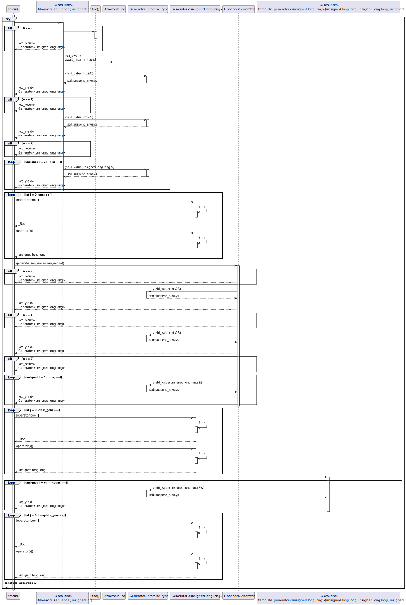
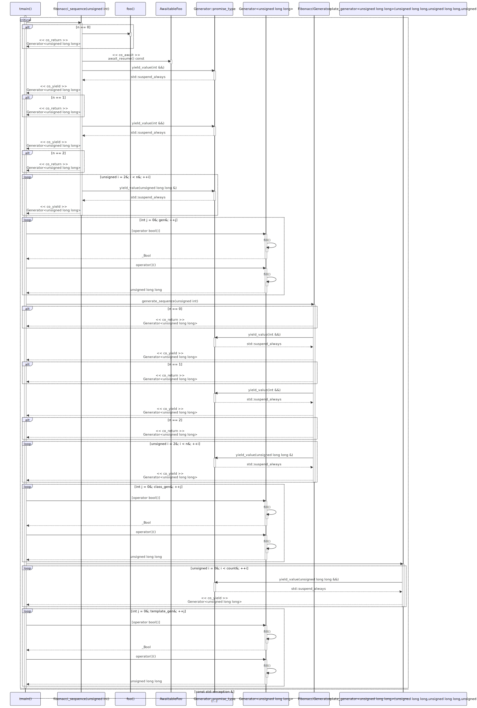

# t20070 - Test case for sequence diagram with coroutines
## Config
```yaml
diagrams:
  t20070_sequence:
    type: sequence
    glob:
      - t20070.cc
    include:
      namespaces:
        - clanguml::t20070
    using_namespace: clanguml::t20070
    generate_condition_statements: true
    generate_return_types: true
    from:
      - function: "clanguml::t20070::tmain()"
```
## Source code
File `tests/t20070/t20070.cc`
```cpp
#include <coroutine>
#include <cstdint>
#include <exception>
#include <iostream>

namespace clanguml::t20070 {

void foo() { }
//
// Based on https://en.cppreference.com/w/cpp/language/coroutines
//

struct AwaitableFoo {
    bool await_ready() const noexcept { return false; }

    void await_suspend(std::coroutine_handle<> h) const noexcept { h.resume(); }

    void await_resume() const noexcept { }
};

template <typename T> struct Generator {
    struct promise_type;
    using handle_type = std::coroutine_handle<promise_type>;

    struct promise_type // required
    {
        T value_;
        std::exception_ptr exception_;

        Generator get_return_object()
        {
            return Generator(handle_type::from_promise(*this));
        }

        std::suspend_always initial_suspend() { return {}; }

        std::suspend_always final_suspend() noexcept { return {}; }

        void unhandled_exception()
        {
            exception_ = std::current_exception();
        } // saving
          // exception

        template <std::convertible_to<T> From> // C++20 concept
        std::suspend_always yield_value(From &&from)
        {
            value_ = std::forward<From>(from); // caching the result in promise
            return {};
        }

        void return_void() { }
    };

    handle_type h_;

    Generator(handle_type h)
        : h_(h)
    {
    }

    ~Generator() { h_.destroy(); }

    explicit operator bool()
    {
        fill();
        return !h_.done();
    }

    T operator()()
    {
        fill();
        full_ = false;
        return std::move(h_.promise().value_);
    }

private:
    bool full_ = false;

    void fill()
    {
        if (!full_) {
            h_();
            if (h_.promise().exception_)
                std::rethrow_exception(h_.promise().exception_);

            full_ = true;
        }
    }
};

Generator<std::uint64_t> fibonacci_sequence(unsigned n)
{
    if (n == 0) {
        foo();
        co_return;
    }

    if (n > 94)
        throw std::runtime_error(
            "Too big Fibonacci sequence. Elements would overflow.");

    co_await AwaitableFoo{};

    co_yield 0;

    if (n == 1)
        co_return;

    co_yield 1;

    if (n == 2)
        co_return;

    std::uint64_t a = 0;
    std::uint64_t b = 1;

    for (unsigned i = 2; i < n; ++i) {
        std::uint64_t s = a + b;
        co_yield s;
        a = b;
        b = s;
    }
}

int tmain()
{
    try {
        auto gen = fibonacci_sequence(10ULL);

        for (int j = 0; gen; ++j)
            std::cout << "fib(" << j << ")=" << gen() << '\n';
    }
    catch (const std::exception &ex) {
        std::cerr << "Exception: " << ex.what() << '\n';
    }
    catch (...) {
        std::cerr << "Unknown exception.\n";
    }

    return 0;
}
} // namespace clanguml::t20070
```
## Generated PlantUML diagrams

## Generated Mermaid diagrams

## Generated JSON models
```json
{
  "diagram_type": "sequence",
  "name": "t20070_sequence",
  "participants": [
    {
      "display_name": "tmain()",
      "full_name": "clanguml::t20070::tmain()",
      "id": "8960354845392757372",
      "name": "tmain",
      "namespace": "clanguml::t20070",
      "source_location": {
        "column": 5,
        "file": "t20070.cc",
        "line": 126,
        "translation_unit": "t20070.cc"
      },
      "type": "function"
    },
    {
      "display_name": "fibonacci_sequence(unsigned int)",
      "full_name": "clanguml::t20070::fibonacci_sequence(unsigned int)",
      "id": "9625317333489462440",
      "is_coroutine": true,
      "name": "fibonacci_sequence",
      "namespace": "clanguml::t20070",
      "source_location": {
        "column": 26,
        "file": "t20070.cc",
        "line": 92,
        "translation_unit": "t20070.cc"
      },
      "type": "function"
    },
    {
      "display_name": "foo()",
      "full_name": "clanguml::t20070::foo()",
      "id": "7120414872781103477",
      "name": "foo",
      "namespace": "clanguml::t20070",
      "source_location": {
        "column": 6,
        "file": "t20070.cc",
        "line": 8,
        "translation_unit": "t20070.cc"
      },
      "type": "function"
    },
    {
      "activities": [
        {
          "display_name": "await_resume() const",
          "full_name": "clanguml::t20070::AwaitableFoo::await_resume() const",
          "id": "13516444512754551609",
          "name": "await_resume",
          "namespace": "clanguml::t20070",
          "source_location": {
            "column": 10,
            "file": "t20070.cc",
            "line": 18,
            "translation_unit": "t20070.cc"
          },
          "type": "method"
        }
      ],
      "display_name": "AwaitableFoo",
      "full_name": "clanguml::t20070::AwaitableFoo",
      "id": "15577419785651234906",
      "name": "AwaitableFoo",
      "namespace": "clanguml::t20070",
      "source_location": {
        "column": 8,
        "file": "t20070.cc",
        "line": 13,
        "translation_unit": "t20070.cc"
      },
      "type": "class"
    },
    {
      "activities": [
        {
          "display_name": "yield_value(int &&)",
          "full_name": "clanguml::t20070::Generator::promise_type::yield_value(int &&)",
          "id": "16066069532260669532",
          "name": "yield_value",
          "namespace": "clanguml::t20070::Generator<unsigned long>",
          "source_location": {
            "column": 29,
            "file": "t20070.cc",
            "line": 46,
            "translation_unit": "t20070.cc"
          },
          "type": "method"
        },
        {
          "display_name": "yield_value(unsigned long &)",
          "full_name": "clanguml::t20070::Generator::promise_type::yield_value(unsigned long &)",
          "id": "18424924965018607765",
          "name": "yield_value",
          "namespace": "clanguml::t20070::Generator<unsigned long>",
          "source_location": {
            "column": 29,
            "file": "t20070.cc",
            "line": 46,
            "translation_unit": "t20070.cc"
          },
          "type": "method"
        }
      ],
      "display_name": "Generator::promise_type",
      "full_name": "clanguml::t20070::Generator::promise_type",
      "id": "3618765333581065245",
      "name": "Generator::promise_type",
      "namespace": "clanguml::t20070",
      "source_location": {
        "column": 12,
        "file": "t20070.cc",
        "line": 25,
        "translation_unit": "t20070.cc"
      },
      "type": "class"
    },
    {
      "activities": [
        {
          "display_name": "operator bool()",
          "full_name": "clanguml::t20070::Generator<unsigned long>::operator bool()",
          "id": "968852265899097772",
          "name": "operator bool",
          "namespace": "clanguml::t20070",
          "source_location": {
            "column": 14,
            "file": "t20070.cc",
            "line": 64,
            "translation_unit": "t20070.cc"
          },
          "type": "method"
        },
        {
          "display_name": "fill()",
          "full_name": "clanguml::t20070::Generator<unsigned long>::fill()",
          "id": "13493523935717657172",
          "name": "fill",
          "namespace": "clanguml::t20070",
          "source_location": {
            "column": 10,
            "file": "t20070.cc",
            "line": 80,
            "translation_unit": "t20070.cc"
          },
          "type": "method"
        },
        {
          "display_name": "operator()()",
          "full_name": "clanguml::t20070::Generator<unsigned long>::operator()()",
          "id": "16344015933024117129",
          "name": "operator()",
          "namespace": "clanguml::t20070",
          "source_location": {
            "column": 7,
            "file": "t20070.cc",
            "line": 70,
            "translation_unit": "t20070.cc"
          },
          "type": "method"
        }
      ],
      "display_name": "Generator<unsigned long>",
      "full_name": "clanguml::t20070::Generator<unsigned long>",
      "id": "15479705320438888135",
      "name": "Generator",
      "namespace": "clanguml::t20070",
      "source_location": {
        "column": 30,
        "file": "t20070.cc",
        "line": 21,
        "translation_unit": "t20070.cc"
      },
      "type": "class"
    }
  ],
  "sequences": [
    {
      "from": {
        "id": "8960354845392757372",
        "location": "clanguml::t20070::tmain()"
      },
      "messages": [
        {
          "activity_id": "8960354845392757372",
          "branches": [
            {
              "messages": [
                {
                  "from": {
                    "activity_id": "8960354845392757372",
                    "participant_id": "8960354845392757372"
                  },
                  "name": "",
                  "return_type": "clanguml::t20070::Generator<std::uint64_t>",
                  "scope": "normal",
                  "source_location": {
                    "column": 20,
                    "file": "t20070.cc",
                    "line": 129,
                    "translation_unit": "t20070.cc"
                  },
                  "to": {
                    "activity_id": "9625317333489462440",
                    "participant_id": "9625317333489462440"
                  },
                  "type": "message"
                },
                {
                  "activity_id": "9625317333489462440",
                  "branches": [
                    {
                      "messages": [
                        {
                          "from": {
                            "activity_id": "9625317333489462440",
                            "participant_id": "9625317333489462440"
                          },
                          "name": "",
                          "return_type": "void",
                          "scope": "normal",
                          "source_location": {
                            "column": 9,
                            "file": "t20070.cc",
                            "line": 95,
                            "translation_unit": "t20070.cc"
                          },
                          "to": {
                            "activity_id": "7120414872781103477",
                            "participant_id": "7120414872781103477"
                          },
                          "type": "message"
                        },
                        {
                          "from": {
                            "activity_id": "9625317333489462440",
                            "participant_id": "9625317333489462440"
                          },
                          "name": "Generator<std::uint64_t>",
                          "return_type": "Generator<std::uint64_t>",
                          "scope": "normal",
                          "source_location": {
                            "column": 9,
                            "file": "t20070.cc",
                            "line": 96,
                            "translation_unit": "t20070.cc"
                          },
                          "to": {
                            "activity_id": "8960354845392757372",
                            "participant_id": "8960354845392757372"
                          },
                          "type": "co_return"
                        }
                      ],
                      "type": "consequent"
                    }
                  ],
                  "condition_text": "n == 0",
                  "name": "if",
                  "type": "alt"
                },
                {
                  "from": {
                    "activity_id": "9625317333489462440",
                    "participant_id": "9625317333489462440"
                  },
                  "name": "await_resume() const",
                  "return_type": "void",
                  "scope": "normal",
                  "source_location": {
                    "column": 5,
                    "file": "t20070.cc",
                    "line": 103,
                    "translation_unit": "t20070.cc"
                  },
                  "to": {
                    "activity_id": "13516444512754551609",
                    "participant_id": "15577419785651234906"
                  },
                  "type": "co_await"
                },
                {
                  "from": {
                    "activity_id": "9625317333489462440",
                    "participant_id": "9625317333489462440"
                  },
                  "name": "yield_value(int &&)",
                  "return_type": "std::suspend_always",
                  "scope": "normal",
                  "source_location": {
                    "column": 5,
                    "file": "t20070.cc",
                    "line": 105,
                    "translation_unit": "t20070.cc"
                  },
                  "to": {
                    "activity_id": "16066069532260669532",
                    "participant_id": "3618765333581065245"
                  },
                  "type": "message"
                },
                {
                  "from": {
                    "activity_id": "16066069532260669532",
                    "participant_id": "3618765333581065245"
                  },
                  "name": "std::suspend_always",
                  "return_type": "std::suspend_always",
                  "scope": "normal",
                  "source_location": {
                    "column": 13,
                    "file": "t20070.cc",
                    "line": 49,
                    "translation_unit": "t20070.cc"
                  },
                  "to": {
                    "activity_id": "9625317333489462440",
                    "participant_id": "9625317333489462440"
                  },
                  "type": "return"
                },
                {
                  "from": {
                    "activity_id": "9625317333489462440",
                    "participant_id": "9625317333489462440"
                  },
                  "name": "Generator<std::uint64_t>",
                  "return_type": "Generator<std::uint64_t>",
                  "scope": "normal",
                  "source_location": {
                    "column": 5,
                    "file": "t20070.cc",
                    "line": 105,
                    "translation_unit": "t20070.cc"
                  },
                  "to": {
                    "activity_id": "8960354845392757372",
                    "participant_id": "8960354845392757372"
                  },
                  "type": "co_yield"
                },
                {
                  "activity_id": "9625317333489462440",
                  "branches": [
                    {
                      "messages": [
                        {
                          "from": {
                            "activity_id": "9625317333489462440",
                            "participant_id": "9625317333489462440"
                          },
                          "name": "Generator<std::uint64_t>",
                          "return_type": "Generator<std::uint64_t>",
                          "scope": "normal",
                          "source_location": {
                            "column": 9,
                            "file": "t20070.cc",
                            "line": 108,
                            "translation_unit": "t20070.cc"
                          },
                          "to": {
                            "activity_id": "8960354845392757372",
                            "participant_id": "8960354845392757372"
                          },
                          "type": "co_return"
                        }
                      ],
                      "type": "consequent"
                    }
                  ],
                  "condition_text": "n == 1",
                  "name": "if",
                  "type": "alt"
                },
                {
                  "from": {
                    "activity_id": "9625317333489462440",
                    "participant_id": "9625317333489462440"
                  },
                  "name": "yield_value(int &&)",
                  "return_type": "std::suspend_always",
                  "scope": "normal",
                  "source_location": {
                    "column": 5,
                    "file": "t20070.cc",
                    "line": 110,
                    "translation_unit": "t20070.cc"
                  },
                  "to": {
                    "activity_id": "16066069532260669532",
                    "participant_id": "3618765333581065245"
                  },
                  "type": "message"
                },
                {
                  "from": {
                    "activity_id": "16066069532260669532",
                    "participant_id": "3618765333581065245"
                  },
                  "name": "std::suspend_always",
                  "return_type": "std::suspend_always",
                  "scope": "normal",
                  "source_location": {
                    "column": 13,
                    "file": "t20070.cc",
                    "line": 49,
                    "translation_unit": "t20070.cc"
                  },
                  "to": {
                    "activity_id": "9625317333489462440",
                    "participant_id": "9625317333489462440"
                  },
                  "type": "return"
                },
                {
                  "from": {
                    "activity_id": "9625317333489462440",
                    "participant_id": "9625317333489462440"
                  },
                  "name": "Generator<std::uint64_t>",
                  "return_type": "Generator<std::uint64_t>",
                  "scope": "normal",
                  "source_location": {
                    "column": 5,
                    "file": "t20070.cc",
                    "line": 110,
                    "translation_unit": "t20070.cc"
                  },
                  "to": {
                    "activity_id": "8960354845392757372",
                    "participant_id": "8960354845392757372"
                  },
                  "type": "co_yield"
                },
                {
                  "activity_id": "9625317333489462440",
                  "branches": [
                    {
                      "messages": [
                        {
                          "from": {
                            "activity_id": "9625317333489462440",
                            "participant_id": "9625317333489462440"
                          },
                          "name": "Generator<std::uint64_t>",
                          "return_type": "Generator<std::uint64_t>",
                          "scope": "normal",
                          "source_location": {
                            "column": 9,
                            "file": "t20070.cc",
                            "line": 113,
                            "translation_unit": "t20070.cc"
                          },
                          "to": {
                            "activity_id": "8960354845392757372",
                            "participant_id": "8960354845392757372"
                          },
                          "type": "co_return"
                        }
                      ],
                      "type": "consequent"
                    }
                  ],
                  "condition_text": "n == 2",
                  "name": "if",
                  "type": "alt"
                },
                {
                  "activity_id": "9625317333489462440",
                  "condition_text": "unsigned i = 2; i < n; ++i",
                  "messages": [
                    {
                      "from": {
                        "activity_id": "9625317333489462440",
                        "participant_id": "9625317333489462440"
                      },
                      "name": "yield_value(unsigned long &)",
                      "return_type": "std::suspend_always",
                      "scope": "normal",
                      "source_location": {
                        "column": 9,
                        "file": "t20070.cc",
                        "line": 120,
                        "translation_unit": "t20070.cc"
                      },
                      "to": {
                        "activity_id": "18424924965018607765",
                        "participant_id": "3618765333581065245"
                      },
                      "type": "message"
                    },
                    {
                      "from": {
                        "activity_id": "18424924965018607765",
                        "participant_id": "3618765333581065245"
                      },
                      "name": "std::suspend_always",
                      "return_type": "std::suspend_always",
                      "scope": "normal",
                      "source_location": {
                        "column": 13,
                        "file": "t20070.cc",
                        "line": 49,
                        "translation_unit": "t20070.cc"
                      },
                      "to": {
                        "activity_id": "9625317333489462440",
                        "participant_id": "9625317333489462440"
                      },
                      "type": "return"
                    },
                    {
                      "from": {
                        "activity_id": "9625317333489462440",
                        "participant_id": "9625317333489462440"
                      },
                      "name": "Generator<std::uint64_t>",
                      "return_type": "Generator<std::uint64_t>",
                      "scope": "normal",
                      "source_location": {
                        "column": 9,
                        "file": "t20070.cc",
                        "line": 120,
                        "translation_unit": "t20070.cc"
                      },
                      "to": {
                        "activity_id": "8960354845392757372",
                        "participant_id": "8960354845392757372"
                      },
                      "type": "co_yield"
                    }
                  ],
                  "name": "for",
                  "type": "loop"
                },
                {
                  "activity_id": "8960354845392757372",
                  "condition_text": "int j = 0; gen; ++j",
                  "messages": [
                    {
                      "from": {
                        "activity_id": "8960354845392757372",
                        "participant_id": "8960354845392757372"
                      },
                      "name": "operator bool()",
                      "return_type": "bool",
                      "scope": "condition",
                      "source_location": {
                        "column": 25,
                        "file": "t20070.cc",
                        "line": 131,
                        "translation_unit": "t20070.cc"
                      },
                      "to": {
                        "activity_id": "968852265899097772",
                        "participant_id": "15479705320438888135"
                      },
                      "type": "message"
                    },
                    {
                      "from": {
                        "activity_id": "968852265899097772",
                        "participant_id": "15479705320438888135"
                      },
                      "name": "fill()",
                      "return_type": "void",
                      "scope": "normal",
                      "source_location": {
                        "column": 9,
                        "file": "t20070.cc",
                        "line": 66,
                        "translation_unit": "t20070.cc"
                      },
                      "to": {
                        "activity_id": "13493523935717657172",
                        "participant_id": "15479705320438888135"
                      },
                      "type": "message"
                    },
                    {
                      "from": {
                        "activity_id": "968852265899097772",
                        "participant_id": "15479705320438888135"
                      },
                      "name": "_Bool",
                      "return_type": "_Bool",
                      "scope": "normal",
                      "source_location": {
                        "column": 9,
                        "file": "t20070.cc",
                        "line": 67,
                        "translation_unit": "t20070.cc"
                      },
                      "to": {
                        "activity_id": "8960354845392757372",
                        "participant_id": "8960354845392757372"
                      },
                      "type": "return"
                    },
                    {
                      "from": {
                        "activity_id": "8960354845392757372",
                        "participant_id": "8960354845392757372"
                      },
                      "name": "operator()()",
                      "return_type": "unsigned long",
                      "scope": "normal",
                      "source_location": {
                        "column": 49,
                        "file": "t20070.cc",
                        "line": 132,
                        "translation_unit": "t20070.cc"
                      },
                      "to": {
                        "activity_id": "16344015933024117129",
                        "participant_id": "15479705320438888135"
                      },
                      "type": "message"
                    },
                    {
                      "from": {
                        "activity_id": "16344015933024117129",
                        "participant_id": "15479705320438888135"
                      },
                      "name": "fill()",
                      "return_type": "void",
                      "scope": "normal",
                      "source_location": {
                        "column": 9,
                        "file": "t20070.cc",
                        "line": 72,
                        "translation_unit": "t20070.cc"
                      },
                      "to": {
                        "activity_id": "13493523935717657172",
                        "participant_id": "15479705320438888135"
                      },
                      "type": "message"
                    },
                    {
                      "from": {
                        "activity_id": "16344015933024117129",
                        "participant_id": "15479705320438888135"
                      },
                      "name": "unsigned long",
                      "return_type": "unsigned long",
                      "scope": "normal",
                      "source_location": {
                        "column": 9,
                        "file": "t20070.cc",
                        "line": 74,
                        "translation_unit": "t20070.cc"
                      },
                      "to": {
                        "activity_id": "8960354845392757372",
                        "participant_id": "8960354845392757372"
                      },
                      "type": "return"
                    }
                  ],
                  "name": "for",
                  "type": "loop"
                }
              ],
              "type": "main"
            },
            {
              "type": "catch"
            },
            {
              "type": "catch"
            }
          ],
          "name": "try",
          "type": "break"
        }
      ]
    }
  ],
  "using_namespace": "clanguml::t20070"
}
```
## Generated GraphML models
