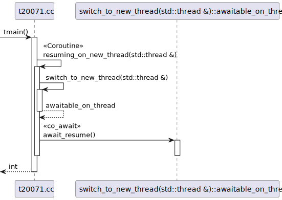
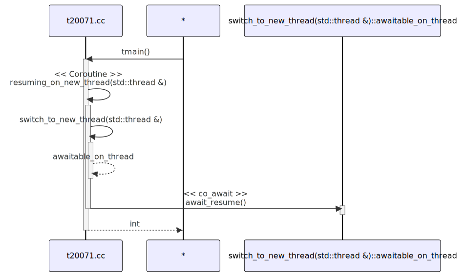

# t20071 - Test case for sequence diagram with coroutines and combined participants
## Config
```yaml
diagrams:
  t20071_sequence:
    type: sequence
    glob:
      - t20071.cc
    include:
      namespaces:
        - clanguml::t20071
    using_namespace: clanguml::t20071
    combine_free_functions_into_file_participants: true
    generate_return_types: true
    generate_condition_statements: true
    from:
      - function: "clanguml::t20071::tmain()"

```
## Source code
File `tests/t20071/t20071.cc`
```cpp
#include <coroutine>
#include <iostream>
#include <stdexcept>
#include <thread>

namespace clanguml::t20071 {

auto switch_to_new_thread(std::thread &out)
{
    struct awaitable_on_thread {
        std::thread *p_out;
        bool await_ready() { return false; }
        void await_suspend(std::coroutine_handle<> h)
        {
            auto &out = *p_out;
            if (out.joinable())
                throw std::runtime_error("Output thread parameter not empty");
            out = std::thread([h] { h.resume(); });
        }
        void await_resume() { }
    };

    return awaitable_on_thread{&out};
}

struct task {
    struct promise_type {
        task get_return_object() { return {}; }
        std::suspend_never initial_suspend() { return {}; }
        std::suspend_never final_suspend() noexcept { return {}; }
        void return_void() { }
        void unhandled_exception() { }
    };
};

task resuming_on_new_thread(std::thread &out)
{
    std::cout << "Coroutine started on thread: " << std::this_thread::get_id()
              << '\n';
    co_await switch_to_new_thread(out);
    // awaiter destroyed here
    std::cout << "Coroutine resumed on thread: " << std::this_thread::get_id()
              << '\n';
}

int tmain()
{
    std::thread out;
    resuming_on_new_thread(out);
    return 0;
}
} // namespace clanguml::t20071

```
## Generated PlantUML diagrams

## Generated Mermaid diagrams

## Generated JSON models
```json
{
  "diagram_type": "sequence",
  "name": "t20071_sequence",
  "participants": [
    {
      "activities": [
        {
          "display_name": "tmain()",
          "full_name": "clanguml::t20071::tmain()",
          "id": "14109190740851967889",
          "name": "tmain",
          "namespace": "clanguml::t20071",
          "source_location": {
            "column": 5,
            "file": "t20071.cc",
            "line": 46,
            "translation_unit": "t20071.cc"
          },
          "type": "function"
        },
        {
          "display_name": "resuming_on_new_thread(std::thread &)",
          "full_name": "clanguml::t20071::resuming_on_new_thread(std::thread &)",
          "id": "140641379733118204",
          "is_coroutine": true,
          "name": "resuming_on_new_thread",
          "namespace": "clanguml::t20071",
          "source_location": {
            "column": 6,
            "file": "t20071.cc",
            "line": 36,
            "translation_unit": "t20071.cc"
          },
          "type": "function"
        },
        {
          "display_name": "switch_to_new_thread(std::thread &)",
          "full_name": "clanguml::t20071::switch_to_new_thread(std::thread &)",
          "id": "12590632157390526092",
          "name": "switch_to_new_thread",
          "namespace": "clanguml::t20071",
          "source_location": {
            "column": 6,
            "file": "t20071.cc",
            "line": 8,
            "translation_unit": "t20071.cc"
          },
          "type": "function"
        }
      ],
      "display_name": "t20071.cc",
      "full_name": "clanguml::t20071::tmain()",
      "id": "10951613648106865712",
      "name": "t20071.cc",
      "namespace": "clanguml::t20071",
      "type": "file"
    },
    {
      "activities": [
        {
          "display_name": "await_resume()",
          "full_name": "clanguml::t20071::switch_to_new_thread(std::thread &)::awaitable_on_thread::await_resume()",
          "id": "3843090677682834966",
          "name": "await_resume",
          "namespace": "clanguml::t20071::switch_to_new_thread(std::thread &)",
          "source_location": {
            "column": 14,
            "file": "t20071.cc",
            "line": 20,
            "translation_unit": "t20071.cc"
          },
          "type": "method"
        }
      ],
      "display_name": "switch_to_new_thread(std::thread &)::awaitable_on_thread",
      "full_name": "clanguml::t20071::switch_to_new_thread(std::thread &)::awaitable_on_thread",
      "id": "1837645032261779240",
      "name": "switch_to_new_thread(std::thread &)##awaitable_on_thread",
      "namespace": "clanguml::t20071",
      "source_location": {
        "column": 12,
        "file": "t20071.cc",
        "line": 10,
        "translation_unit": "t20071.cc"
      },
      "type": "class"
    }
  ],
  "sequences": [
    {
      "from": {
        "id": "14109190740851967889",
        "location": "clanguml::t20071::tmain()"
      },
      "messages": [
        {
          "from": {
            "activity_id": "14109190740851967889",
            "participant_id": "10951613648106865712"
          },
          "name": "resuming_on_new_thread(std::thread &)",
          "return_type": "task",
          "scope": "normal",
          "source_location": {
            "column": 5,
            "file": "t20071.cc",
            "line": 49,
            "translation_unit": "t20071.cc"
          },
          "to": {
            "activity_id": "140641379733118204",
            "participant_id": "10951613648106865712"
          },
          "type": "message"
        },
        {
          "from": {
            "activity_id": "140641379733118204",
            "participant_id": "10951613648106865712"
          },
          "name": "switch_to_new_thread(std::thread &)",
          "return_type": "awaitable_on_thread",
          "scope": "normal",
          "source_location": {
            "column": 14,
            "file": "t20071.cc",
            "line": 40,
            "translation_unit": "t20071.cc"
          },
          "to": {
            "activity_id": "12590632157390526092",
            "participant_id": "10951613648106865712"
          },
          "type": "message"
        },
        {
          "from": {
            "activity_id": "12590632157390526092",
            "participant_id": "10951613648106865712"
          },
          "name": "awaitable_on_thread",
          "return_type": "awaitable_on_thread",
          "scope": "normal",
          "source_location": {
            "column": 5,
            "file": "t20071.cc",
            "line": 23,
            "translation_unit": "t20071.cc"
          },
          "to": {
            "activity_id": "140641379733118204",
            "participant_id": "10951613648106865712"
          },
          "type": "return"
        },
        {
          "from": {
            "activity_id": "140641379733118204",
            "participant_id": "10951613648106865712"
          },
          "name": "await_resume()",
          "return_type": "void",
          "scope": "normal",
          "source_location": {
            "column": 5,
            "file": "t20071.cc",
            "line": 40,
            "translation_unit": "t20071.cc"
          },
          "to": {
            "activity_id": "3843090677682834966",
            "participant_id": "1837645032261779240"
          },
          "type": "co_await"
        }
      ],
      "return_type": "int"
    }
  ],
  "using_namespace": "clanguml::t20071"
}
```
## Generated GraphML models
