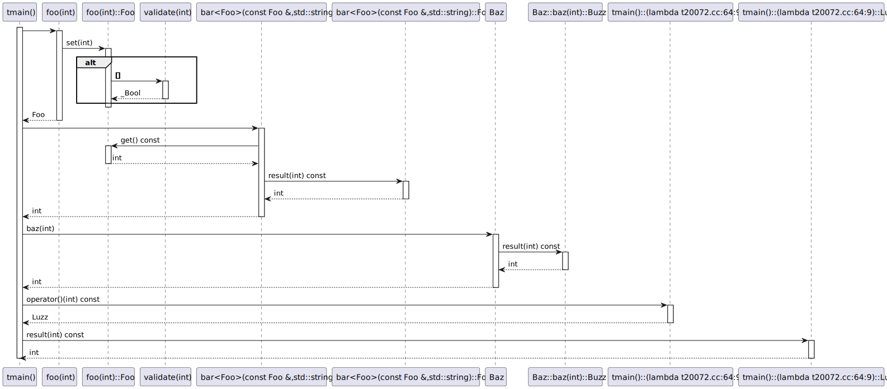
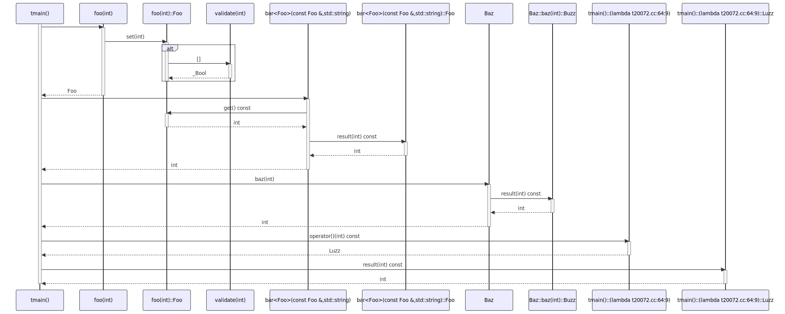

# t20072 - Test case for sequence diagram with local classes defined in function bodies
## Config
```yaml
diagrams:
  t20072_sequence:
    type: sequence
    glob:
      - t20072.cc
    include:
      namespaces:
        - clanguml::t20072
    using_namespace: clanguml::t20072
    generate_return_types: true
    from:
      - function: "clanguml::t20072::tmain()"
```
## Source code
File `tests/t20072/t20072.cc`
```cpp
#include <string>

namespace clanguml::t20072 {

bool validate(int v) { return v != 0; }

auto foo(int f)
{
    class Foo {
    public:
        void set(int value)
        {
            if (validate(value))
                value_ = value;
        }

        int get() const { return value_; }

    private:
        int value_;
    };

    Foo result;
    result.set(f);

    return result;
}

template <typename T> auto bar(const T &b, std::string msg = "two")
{
    struct Foo {
        int result(int c) const { return value / c; }

        int value;
    };

    Foo foo{b.get() + 10};

    return foo.result(msg.size());
}

struct Baz {
    auto baz(int b)
    {
        struct Buzz {
            int result(int c) const { return value * c; }

            int value;
        };

        Buzz buzz{100};

        return buzz.result(10);
    }
};

int tmain()
{
    Baz baz;

    auto v = baz.baz(bar(foo(1)));

    auto f =
        [](int value) {
            struct Luzz {
                int result(int c) const { return value + c; }

                int value;
            };

            Luzz luzz{100};
            return luzz;
        }(10)
            .result(2);

    return 0;
}
} // namespace clanguml::t20072
```
## Generated PlantUML diagrams

## Generated Mermaid diagrams

## Generated JSON models
```json
{
  "diagram_type": "sequence",
  "name": "t20072_sequence",
  "participants": [
    {
      "display_name": "tmain()",
      "full_name": "clanguml::t20072::tmain()",
      "id": "12591197815004111245",
      "name": "tmain",
      "namespace": "clanguml::t20072",
      "source_location": {
        "column": 5,
        "file": "t20072.cc",
        "line": 57,
        "translation_unit": "t20072.cc"
      },
      "type": "function"
    },
    {
      "display_name": "foo(int)",
      "full_name": "clanguml::t20072::foo(int)",
      "id": "15901512234841805552",
      "name": "foo",
      "namespace": "clanguml::t20072",
      "source_location": {
        "column": 6,
        "file": "t20072.cc",
        "line": 7,
        "translation_unit": "t20072.cc"
      },
      "type": "function"
    },
    {
      "activities": [
        {
          "display_name": "set(int)",
          "full_name": "clanguml::t20072::foo(int)::Foo::set(int)",
          "id": "7590227368248288835",
          "name": "set",
          "namespace": "clanguml::t20072::foo(int)",
          "source_location": {
            "column": 14,
            "file": "t20072.cc",
            "line": 11,
            "translation_unit": "t20072.cc"
          },
          "type": "method"
        },
        {
          "display_name": "get() const",
          "full_name": "clanguml::t20072::foo(int)::Foo::get() const",
          "id": "17355390296943913336",
          "name": "get",
          "namespace": "clanguml::t20072::foo(int)",
          "source_location": {
            "column": 13,
            "file": "t20072.cc",
            "line": 17,
            "translation_unit": "t20072.cc"
          },
          "type": "method"
        }
      ],
      "display_name": "foo(int)::Foo",
      "full_name": "clanguml::t20072::foo(int)::Foo",
      "id": "18427027110482304965",
      "name": "foo(int)##Foo",
      "namespace": "clanguml::t20072",
      "source_location": {
        "column": 11,
        "file": "t20072.cc",
        "line": 9,
        "translation_unit": "t20072.cc"
      },
      "type": "class"
    },
    {
      "display_name": "validate(int)",
      "full_name": "clanguml::t20072::validate(int)",
      "id": "5385611197192077815",
      "name": "validate",
      "namespace": "clanguml::t20072",
      "source_location": {
        "column": 6,
        "file": "t20072.cc",
        "line": 5,
        "translation_unit": "t20072.cc"
      },
      "type": "function"
    },
    {
      "display_name": "bar<Foo>(const Foo &,std::string)",
      "full_name": "clanguml::t20072::bar<Foo>(const Foo &,std::string)",
      "id": "4794546187074870268",
      "name": "bar",
      "namespace": "clanguml::t20072",
      "source_location": {
        "column": 28,
        "file": "t20072.cc",
        "line": 29,
        "translation_unit": "t20072.cc"
      },
      "type": "function_template"
    },
    {
      "activities": [
        {
          "display_name": "result(int) const",
          "full_name": "clanguml::t20072::bar<Foo>(const Foo &,std::string)::Foo::result(int) const",
          "id": "6852464337472368360",
          "name": "result",
          "namespace": "clanguml::t20072::bar(const Foo &, std::string)",
          "source_location": {
            "column": 13,
            "file": "t20072.cc",
            "line": 32,
            "translation_unit": "t20072.cc"
          },
          "type": "method"
        }
      ],
      "display_name": "bar<Foo>(const Foo &,std::string)::Foo",
      "full_name": "clanguml::t20072::bar<Foo>(const Foo &,std::string)::Foo",
      "id": "9961827986890750125",
      "name": "bar<Foo>(const Foo &,std::string)##Foo",
      "namespace": "clanguml::t20072",
      "source_location": {
        "column": 12,
        "file": "t20072.cc",
        "line": 31,
        "translation_unit": "t20072.cc"
      },
      "type": "class"
    },
    {
      "activities": [
        {
          "display_name": "baz(int)",
          "full_name": "clanguml::t20072::Baz::baz(int)",
          "id": "5810984896987412842",
          "name": "baz",
          "namespace": "clanguml::t20072",
          "source_location": {
            "column": 10,
            "file": "t20072.cc",
            "line": 43,
            "translation_unit": "t20072.cc"
          },
          "type": "method"
        }
      ],
      "display_name": "Baz",
      "full_name": "clanguml::t20072::Baz",
      "id": "4826286430095177676",
      "name": "Baz",
      "namespace": "clanguml::t20072",
      "source_location": {
        "column": 8,
        "file": "t20072.cc",
        "line": 42,
        "translation_unit": "t20072.cc"
      },
      "type": "class"
    },
    {
      "activities": [
        {
          "display_name": "result(int) const",
          "full_name": "clanguml::t20072::Baz::baz(int)::Buzz::result(int) const",
          "id": "6777946266074496792",
          "name": "result",
          "namespace": "clanguml::t20072::Baz::baz(int)",
          "source_location": {
            "column": 17,
            "file": "t20072.cc",
            "line": 46,
            "translation_unit": "t20072.cc"
          },
          "type": "method"
        }
      ],
      "display_name": "Baz::baz(int)::Buzz",
      "full_name": "clanguml::t20072::Baz::baz(int)::Buzz",
      "id": "6933934019950221954",
      "name": "Baz::baz(int)##Buzz",
      "namespace": "clanguml::t20072",
      "source_location": {
        "column": 16,
        "file": "t20072.cc",
        "line": 45,
        "translation_unit": "t20072.cc"
      },
      "type": "class"
    },
    {
      "activities": [
        {
          "display_name": "operator()(int) const",
          "full_name": "clanguml::t20072::tmain()::(lambda t20072.cc:64:9)::operator()(int) const",
          "id": "9324005151899507806",
          "name": "operator()",
          "namespace": "clanguml::t20072::tmain()",
          "type": "method"
        }
      ],
      "display_name": "tmain()::(lambda t20072.cc:64:9)",
      "full_name": "clanguml::t20072::tmain()::(lambda t20072.cc:64:9)",
      "id": "1206402300175125179",
      "name": "tmain()##(lambda t20072.cc:64:9)",
      "namespace": "clanguml::t20072",
      "source_location": {
        "column": 9,
        "file": "t20072.cc",
        "line": 64,
        "translation_unit": "t20072.cc"
      },
      "type": "lambda"
    },
    {
      "activities": [
        {
          "display_name": "result(int) const",
          "full_name": "clanguml::t20072::tmain()::(lambda t20072.cc:64:9)::Luzz::result(int) const",
          "id": "16861379060918955417",
          "name": "result",
          "namespace": "clanguml::t20072::tmain()::(anonymous class)::operator()(int)",
          "source_location": {
            "column": 21,
            "file": "t20072.cc",
            "line": 66,
            "translation_unit": "t20072.cc"
          },
          "type": "method"
        }
      ],
      "display_name": "tmain()::(lambda t20072.cc:64:9)::Luzz",
      "full_name": "clanguml::t20072::tmain()::(lambda t20072.cc:64:9)::Luzz",
      "id": "7538269699090722315",
      "name": "tmain()##(lambda t20072.cc:64:9)##Luzz",
      "namespace": "clanguml::t20072",
      "source_location": {
        "column": 20,
        "file": "t20072.cc",
        "line": 65,
        "translation_unit": "t20072.cc"
      },
      "type": "class"
    }
  ],
  "sequences": [
    {
      "from": {
        "id": "12591197815004111245",
        "location": "clanguml::t20072::tmain()"
      },
      "messages": [
        {
          "from": {
            "activity_id": "12591197815004111245",
            "participant_id": "12591197815004111245"
          },
          "name": "",
          "return_type": "Foo",
          "scope": "normal",
          "source_location": {
            "column": 26,
            "file": "t20072.cc",
            "line": 61,
            "translation_unit": "t20072.cc"
          },
          "to": {
            "activity_id": "15901512234841805552",
            "participant_id": "15901512234841805552"
          },
          "type": "message"
        },
        {
          "from": {
            "activity_id": "15901512234841805552",
            "participant_id": "15901512234841805552"
          },
          "name": "set(int)",
          "return_type": "void",
          "scope": "normal",
          "source_location": {
            "column": 5,
            "file": "t20072.cc",
            "line": 24,
            "translation_unit": "t20072.cc"
          },
          "to": {
            "activity_id": "7590227368248288835",
            "participant_id": "18427027110482304965"
          },
          "type": "message"
        },
        {
          "activity_id": "7590227368248288835",
          "branches": [
            {
              "messages": [
                {
                  "from": {
                    "activity_id": "7590227368248288835",
                    "participant_id": "18427027110482304965"
                  },
                  "name": "",
                  "return_type": "bool",
                  "scope": "condition",
                  "source_location": {
                    "column": 17,
                    "file": "t20072.cc",
                    "line": 13,
                    "translation_unit": "t20072.cc"
                  },
                  "to": {
                    "activity_id": "5385611197192077815",
                    "participant_id": "5385611197192077815"
                  },
                  "type": "message"
                },
                {
                  "from": {
                    "activity_id": "5385611197192077815",
                    "participant_id": "5385611197192077815"
                  },
                  "name": "_Bool",
                  "return_type": "_Bool",
                  "scope": "normal",
                  "source_location": {
                    "column": 24,
                    "file": "t20072.cc",
                    "line": 5,
                    "translation_unit": "t20072.cc"
                  },
                  "to": {
                    "activity_id": "7590227368248288835",
                    "participant_id": "18427027110482304965"
                  },
                  "type": "return"
                }
              ],
              "type": "consequent"
            }
          ],
          "name": "if",
          "type": "alt"
        },
        {
          "from": {
            "activity_id": "15901512234841805552",
            "participant_id": "15901512234841805552"
          },
          "name": "Foo",
          "return_type": "Foo",
          "scope": "normal",
          "source_location": {
            "column": 5,
            "file": "t20072.cc",
            "line": 26,
            "translation_unit": "t20072.cc"
          },
          "to": {
            "activity_id": "12591197815004111245",
            "participant_id": "12591197815004111245"
          },
          "type": "return"
        },
        {
          "from": {
            "activity_id": "12591197815004111245",
            "participant_id": "12591197815004111245"
          },
          "name": "",
          "return_type": "",
          "scope": "normal",
          "source_location": {
            "column": 22,
            "file": "t20072.cc",
            "line": 61,
            "translation_unit": "t20072.cc"
          },
          "to": {
            "activity_id": "4794546187074870268",
            "participant_id": "4794546187074870268"
          },
          "type": "message"
        },
        {
          "from": {
            "activity_id": "4794546187074870268",
            "participant_id": "4794546187074870268"
          },
          "name": "get() const",
          "return_type": "int",
          "scope": "normal",
          "source_location": {
            "column": 13,
            "file": "t20072.cc",
            "line": 37,
            "translation_unit": "t20072.cc"
          },
          "to": {
            "activity_id": "17355390296943913336",
            "participant_id": "18427027110482304965"
          },
          "type": "message"
        },
        {
          "from": {
            "activity_id": "17355390296943913336",
            "participant_id": "18427027110482304965"
          },
          "name": "int",
          "return_type": "int",
          "scope": "normal",
          "source_location": {
            "column": 27,
            "file": "t20072.cc",
            "line": 17,
            "translation_unit": "t20072.cc"
          },
          "to": {
            "activity_id": "4794546187074870268",
            "participant_id": "4794546187074870268"
          },
          "type": "return"
        },
        {
          "from": {
            "activity_id": "4794546187074870268",
            "participant_id": "4794546187074870268"
          },
          "name": "result(int) const",
          "return_type": "int",
          "scope": "normal",
          "source_location": {
            "column": 12,
            "file": "t20072.cc",
            "line": 39,
            "translation_unit": "t20072.cc"
          },
          "to": {
            "activity_id": "6852464337472368360",
            "participant_id": "9961827986890750125"
          },
          "type": "message"
        },
        {
          "from": {
            "activity_id": "6852464337472368360",
            "participant_id": "9961827986890750125"
          },
          "name": "int",
          "return_type": "int",
          "scope": "normal",
          "source_location": {
            "column": 35,
            "file": "t20072.cc",
            "line": 32,
            "translation_unit": "t20072.cc"
          },
          "to": {
            "activity_id": "4794546187074870268",
            "participant_id": "4794546187074870268"
          },
          "type": "return"
        },
        {
          "from": {
            "activity_id": "4794546187074870268",
            "participant_id": "4794546187074870268"
          },
          "name": "int",
          "return_type": "int",
          "scope": "normal",
          "source_location": {
            "column": 5,
            "file": "t20072.cc",
            "line": 39,
            "translation_unit": "t20072.cc"
          },
          "to": {
            "activity_id": "12591197815004111245",
            "participant_id": "12591197815004111245"
          },
          "type": "return"
        },
        {
          "from": {
            "activity_id": "12591197815004111245",
            "participant_id": "12591197815004111245"
          },
          "name": "baz(int)",
          "return_type": "int",
          "scope": "normal",
          "source_location": {
            "column": 14,
            "file": "t20072.cc",
            "line": 61,
            "translation_unit": "t20072.cc"
          },
          "to": {
            "activity_id": "5810984896987412842",
            "participant_id": "4826286430095177676"
          },
          "type": "message"
        },
        {
          "from": {
            "activity_id": "5810984896987412842",
            "participant_id": "4826286430095177676"
          },
          "name": "result(int) const",
          "return_type": "int",
          "scope": "normal",
          "source_location": {
            "column": 16,
            "file": "t20072.cc",
            "line": 53,
            "translation_unit": "t20072.cc"
          },
          "to": {
            "activity_id": "6777946266074496792",
            "participant_id": "6933934019950221954"
          },
          "type": "message"
        },
        {
          "from": {
            "activity_id": "6777946266074496792",
            "participant_id": "6933934019950221954"
          },
          "name": "int",
          "return_type": "int",
          "scope": "normal",
          "source_location": {
            "column": 39,
            "file": "t20072.cc",
            "line": 46,
            "translation_unit": "t20072.cc"
          },
          "to": {
            "activity_id": "5810984896987412842",
            "participant_id": "4826286430095177676"
          },
          "type": "return"
        },
        {
          "from": {
            "activity_id": "5810984896987412842",
            "participant_id": "4826286430095177676"
          },
          "name": "int",
          "return_type": "int",
          "scope": "normal",
          "source_location": {
            "column": 9,
            "file": "t20072.cc",
            "line": 53,
            "translation_unit": "t20072.cc"
          },
          "to": {
            "activity_id": "12591197815004111245",
            "participant_id": "12591197815004111245"
          },
          "type": "return"
        },
        {
          "from": {
            "activity_id": "12591197815004111245",
            "participant_id": "12591197815004111245"
          },
          "name": "operator()(int) const",
          "return_type": "Luzz",
          "scope": "normal",
          "source_location": {
            "column": 9,
            "file": "t20072.cc",
            "line": 64,
            "translation_unit": "t20072.cc"
          },
          "to": {
            "activity_id": "9324005151899507806",
            "participant_id": "1206402300175125179"
          },
          "type": "message"
        },
        {
          "from": {
            "activity_id": "9324005151899507806",
            "participant_id": "1206402300175125179"
          },
          "name": "Luzz",
          "return_type": "Luzz",
          "scope": "normal",
          "source_location": {
            "column": 13,
            "file": "t20072.cc",
            "line": 72,
            "translation_unit": "t20072.cc"
          },
          "to": {
            "activity_id": "12591197815004111245",
            "participant_id": "12591197815004111245"
          },
          "type": "return"
        },
        {
          "from": {
            "activity_id": "12591197815004111245",
            "participant_id": "12591197815004111245"
          },
          "name": "result(int) const",
          "return_type": "int",
          "scope": "normal",
          "source_location": {
            "column": 9,
            "file": "t20072.cc",
            "line": 64,
            "translation_unit": "t20072.cc"
          },
          "to": {
            "activity_id": "16861379060918955417",
            "participant_id": "7538269699090722315"
          },
          "type": "message"
        },
        {
          "from": {
            "activity_id": "16861379060918955417",
            "participant_id": "7538269699090722315"
          },
          "name": "int",
          "return_type": "int",
          "scope": "normal",
          "source_location": {
            "column": 43,
            "file": "t20072.cc",
            "line": 66,
            "translation_unit": "t20072.cc"
          },
          "to": {
            "activity_id": "12591197815004111245",
            "participant_id": "12591197815004111245"
          },
          "type": "return"
        }
      ]
    }
  ],
  "using_namespace": "clanguml::t20072"
}
```
## Generated GraphML models
