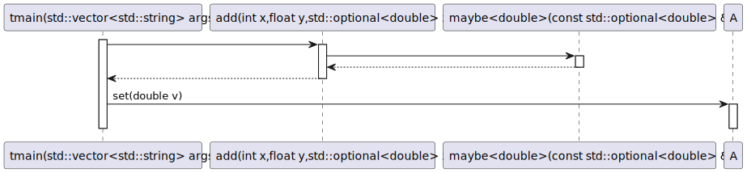
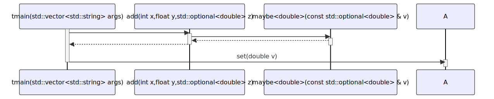

# t20073 - Test case for sequence diagram with argument names in message signatures
## Config
```yaml
diagrams:
  t20073_sequence:
    type: sequence
    glob:
      - t20073.cc
    include:
      namespaces:
        - clanguml::t20073
    generate_method_arguments: full
    generate_method_argument_names: true
    using_namespace: clanguml::t20073
    from:
      - function: "clanguml::t20073::tmain(std::vector<std::string> args)"

```
## Source code
File `tests/t20073/t20073.cc`
```cpp
#include <optional>
#include <string>
#include <vector>

namespace clanguml::t20073 {

template <typename T> auto maybe(const std::optional<T> &v) -> T
{
    return v.has_value() ? *v : T{};
}

double add(int x, float y, std::optional<double> z) { return x + y + maybe(z); }

struct A {
    void set(double v) { a = v; }

    double a;
};

int tmain(std::vector<std::string> args)
{
    A a;

    a.set(add(1, 2.0, std::make_optional<double>(3.0)));

    return 0;
}
}

```
## Generated PlantUML diagrams

## Generated Mermaid diagrams

## Generated JSON models
```json
{
  "diagram_type": "sequence",
  "name": "t20073_sequence",
  "participants": [
    {
      "display_name": "tmain(std::vector<std::string> args)",
      "full_name": "clanguml::t20073::tmain(std::vector<std::string> args)",
      "id": "10795144028736992056",
      "name": "tmain",
      "namespace": "clanguml::t20073",
      "source_location": {
        "column": 5,
        "file": "t20073.cc",
        "line": 20,
        "translation_unit": "t20073.cc"
      },
      "type": "function"
    },
    {
      "display_name": "add(int x,float y,std::optional<double> z)",
      "full_name": "clanguml::t20073::add(int x,float y,std::optional<double> z)",
      "id": "14899411901108493275",
      "name": "add",
      "namespace": "clanguml::t20073",
      "source_location": {
        "column": 8,
        "file": "t20073.cc",
        "line": 12,
        "translation_unit": "t20073.cc"
      },
      "type": "function"
    },
    {
      "display_name": "maybe<double>(const std::optional<double> & v)",
      "full_name": "clanguml::t20073::maybe<double>(const std::optional<double> & v)",
      "id": "3294490702487026275",
      "name": "maybe",
      "namespace": "clanguml::t20073",
      "source_location": {
        "column": 28,
        "file": "t20073.cc",
        "line": 7,
        "translation_unit": "t20073.cc"
      },
      "type": "function_template"
    },
    {
      "activities": [
        {
          "display_name": "set(double v)",
          "full_name": "clanguml::t20073::A::set(double v)",
          "id": "13735046612342394443",
          "name": "set",
          "namespace": "clanguml::t20073",
          "source_location": {
            "column": 10,
            "file": "t20073.cc",
            "line": 15,
            "translation_unit": "t20073.cc"
          },
          "type": "method"
        }
      ],
      "display_name": "A",
      "full_name": "clanguml::t20073::A",
      "id": "12322974894231904392",
      "name": "A",
      "namespace": "clanguml::t20073",
      "source_location": {
        "column": 8,
        "file": "t20073.cc",
        "line": 14,
        "translation_unit": "t20073.cc"
      },
      "type": "class"
    }
  ],
  "sequences": [
    {
      "from": {
        "id": "10795144028736992056",
        "location": "clanguml::t20073::tmain(std::vector<std::string> args)"
      },
      "messages": [
        {
          "from": {
            "activity_id": "10795144028736992056",
            "participant_id": "10795144028736992056"
          },
          "name": "",
          "return_type": "double",
          "scope": "normal",
          "source_location": {
            "column": 11,
            "file": "t20073.cc",
            "line": 24,
            "translation_unit": "t20073.cc"
          },
          "to": {
            "activity_id": "14899411901108493275",
            "participant_id": "14899411901108493275"
          },
          "type": "message"
        },
        {
          "from": {
            "activity_id": "14899411901108493275",
            "participant_id": "14899411901108493275"
          },
          "name": "",
          "return_type": "",
          "scope": "normal",
          "source_location": {
            "column": 70,
            "file": "t20073.cc",
            "line": 12,
            "translation_unit": "t20073.cc"
          },
          "to": {
            "activity_id": "3294490702487026275",
            "participant_id": "3294490702487026275"
          },
          "type": "message"
        },
        {
          "from": {
            "activity_id": "3294490702487026275",
            "participant_id": "3294490702487026275"
          },
          "name": "",
          "return_type": "double",
          "scope": "normal",
          "source_location": {
            "column": 5,
            "file": "t20073.cc",
            "line": 9,
            "translation_unit": "t20073.cc"
          },
          "to": {
            "activity_id": "14899411901108493275",
            "participant_id": "14899411901108493275"
          },
          "type": "return"
        },
        {
          "from": {
            "activity_id": "14899411901108493275",
            "participant_id": "14899411901108493275"
          },
          "name": "",
          "return_type": "double",
          "scope": "normal",
          "source_location": {
            "column": 55,
            "file": "t20073.cc",
            "line": 12,
            "translation_unit": "t20073.cc"
          },
          "to": {
            "activity_id": "10795144028736992056",
            "participant_id": "10795144028736992056"
          },
          "type": "return"
        },
        {
          "from": {
            "activity_id": "10795144028736992056",
            "participant_id": "10795144028736992056"
          },
          "name": "set(double v)",
          "return_type": "void",
          "scope": "normal",
          "source_location": {
            "column": 5,
            "file": "t20073.cc",
            "line": 24,
            "translation_unit": "t20073.cc"
          },
          "to": {
            "activity_id": "13735046612342394443",
            "participant_id": "12322974894231904392"
          },
          "type": "message"
        }
      ]
    }
  ],
  "using_namespace": "clanguml::t20073"
}
```
## Generated GraphML models
