# t30001 - Basic package diagram test case
## Config
```yaml
diagrams:
  t30001_package:
    type: package
    generate_links:
      link: 'https://github.com/bkryza/clang-uml/blob/{{ git.commit }}/{{ element.source.path }}#L{{ element.source.line }}'
      tooltip: '{{ abbrv(trim(replace(element.comment.brief.0, "\n+", " ")), 256) }}{{ element.name }}'
    title: Basic package diagram example
    glob:
      - t30001.cc
    include:
      namespaces:
        - clanguml::t30001
    exclude:
      namespaces:
        - clanguml::t30001::detail
    using_namespace: clanguml::t30001
    plantuml:
      before:
        - "' t30001 test diagram of type {{ diagram.type }}"
      after:
        - ' note right of {{ alias("A::AA::AAA") }} : A AAA note...'
        - ' note top of {{ alias("A::AA") }} : {{ e.comment.formatted }}'
        - ' note top of {{ alias("B::AA") }} : {{ e.comment.formatted }}'
    mermaid:
      before:
        - "%% t30001 test diagram of type {{ diagram.type }}"
      after:
        - 'N_0001(A AAA note...)'
        - 'N_0001 -.- {{ alias("A::AA::AAA") }}'
        - 'N_0002({{ e.comment.formatted }})'
        - 'N_0003({{ e.comment.formatted }})'
        - 'N_0002 -.- {{ alias("A::AA") }}'
        - 'N_0003 -.- {{ alias("B::AA") }}'
    graphml:
      notes:
        'clanguml::t30001::A::AA::AAA':
          - 'A AAA note...'
        'clanguml::t30001::A::AA':
          - '{{ e.comment.formatted }}'
        'clanguml::t30001::B::AA':
          - '{{ e.comment.formatted }}'
```
## Source code
File `tests/t30001/t30001.cc`
```cpp
namespace clanguml {
namespace t30001 {
namespace A {
/// This is namespace AA in namespace A
namespace AA {
namespace AAA {
} // namespace AAA
namespace BBB {
} // namespace BBB
} // namespace AA
namespace BB {
} // namespace BB
} // namespace A
namespace B {
/// This is namespace AA in namespace B
namespace AA {
namespace AAA {
} // namespace AAA
namespace BBB {
} // namespace BBB
} // namespace AA
namespace BB {
} // namespace BB
} // namespace B
} // namespace t30001
} // namespace clanguml

```
## Generated PlantUML diagrams

## Generated Mermaid diagrams

## Generated JSON models
```json
{
  "diagram_type": "package",
  "elements": [
    {
      "display_name": "A",
      "elements": [
        {
          "comment": {
            "formatted": "This is namespace AA in namespace A",
            "raw": "/// This is namespace AA in namespace A"
          },
          "display_name": "AA",
          "elements": [
            {
              "display_name": "AAA",
              "id": "2197105901921995395",
              "is_deprecated": false,
              "name": "AAA",
              "namespace": "clanguml::t30001::A::AA",
              "source_location": {
                "column": 11,
                "file": "t30001.cc",
                "line": 6,
                "translation_unit": "t30001.cc"
              },
              "type": "namespace"
            },
            {
              "display_name": "BBB",
              "id": "17033235056192100504",
              "is_deprecated": false,
              "name": "BBB",
              "namespace": "clanguml::t30001::A::AA",
              "source_location": {
                "column": 11,
                "file": "t30001.cc",
                "line": 8,
                "translation_unit": "t30001.cc"
              },
              "type": "namespace"
            }
          ],
          "id": "12228143927913313240",
          "is_deprecated": false,
          "name": "AA",
          "namespace": "clanguml::t30001::A",
          "source_location": {
            "column": 11,
            "file": "t30001.cc",
            "line": 5,
            "translation_unit": "t30001.cc"
          },
          "type": "namespace"
        },
        {
          "display_name": "BB",
          "id": "7865596516197786253",
          "is_deprecated": false,
          "name": "BB",
          "namespace": "clanguml::t30001::A",
          "source_location": {
            "column": 11,
            "file": "t30001.cc",
            "line": 11,
            "translation_unit": "t30001.cc"
          },
          "type": "namespace"
        }
      ],
      "id": "9476917164253278318",
      "is_deprecated": false,
      "name": "A",
      "namespace": "clanguml::t30001",
      "source_location": {
        "column": 11,
        "file": "t30001.cc",
        "line": 3,
        "translation_unit": "t30001.cc"
      },
      "type": "namespace"
    },
    {
      "display_name": "B",
      "elements": [
        {
          "comment": {
            "formatted": "This is namespace AA in namespace B",
            "raw": "/// This is namespace AA in namespace B"
          },
          "display_name": "AA",
          "elements": [
            {
              "display_name": "AAA",
              "id": "2097299882461872226",
              "is_deprecated": false,
              "name": "AAA",
              "namespace": "clanguml::t30001::B::AA",
              "source_location": {
                "column": 11,
                "file": "t30001.cc",
                "line": 17,
                "translation_unit": "t30001.cc"
              },
              "type": "namespace"
            },
            {
              "display_name": "BBB",
              "id": "148338679937902424",
              "is_deprecated": false,
              "name": "BBB",
              "namespace": "clanguml::t30001::B::AA",
              "source_location": {
                "column": 11,
                "file": "t30001.cc",
                "line": 19,
                "translation_unit": "t30001.cc"
              },
              "type": "namespace"
            }
          ],
          "id": "7167309657456718972",
          "is_deprecated": false,
          "name": "AA",
          "namespace": "clanguml::t30001::B",
          "source_location": {
            "column": 11,
            "file": "t30001.cc",
            "line": 16,
            "translation_unit": "t30001.cc"
          },
          "type": "namespace"
        },
        {
          "display_name": "BB",
          "id": "17843714573570435906",
          "is_deprecated": false,
          "name": "BB",
          "namespace": "clanguml::t30001::B",
          "source_location": {
            "column": 11,
            "file": "t30001.cc",
            "line": 22,
            "translation_unit": "t30001.cc"
          },
          "type": "namespace"
        }
      ],
      "id": "15453881680896435444",
      "is_deprecated": false,
      "name": "B",
      "namespace": "clanguml::t30001",
      "source_location": {
        "column": 11,
        "file": "t30001.cc",
        "line": 14,
        "translation_unit": "t30001.cc"
      },
      "type": "namespace"
    }
  ],
  "name": "t30001_package",
  "package_type": "namespace",
  "relationships": [],
  "title": "Basic package diagram example",
  "using_namespace": "clanguml::t30001"
}
```
## Generated GraphML models
```xml
<?xml version="1.0"?>
<graphml xmlns="http://graphml.graphdrawing.org/xmlns" xmlns:xsi="http://www.w3.org/2001/XMLSchema-instance" xsi:schemaLocation="http://graphml.graphdrawing.org/xmlns http://graphml.graphdrawing.org/xmlns/1.0/graphml.xsd">
 <desc><![CDATA[Basic package diagram example]]></desc>
 <key attr.name="id" attr.type="string" for="graph" id="gd0" />
 <key attr.name="diagram_type" attr.type="string" for="graph" id="gd1" />
 <key attr.name="name" attr.type="string" for="graph" id="gd2" />
 <key attr.name="using_namespace" attr.type="string" for="graph" id="gd3" />
 <key attr.name="id" attr.type="string" for="node" id="nd0" />
 <key attr.name="type" attr.type="string" for="node" id="nd1" />
 <key attr.name="name" attr.type="string" for="node" id="nd2" />
 <key attr.name="stereotype" attr.type="string" for="node" id="nd3" />
 <key attr.name="url" attr.type="string" for="node" id="nd4" />
 <key attr.name="tooltip" attr.type="string" for="node" id="nd5" />
 <key attr.name="type" attr.type="string" for="edge" id="ed0" />
 <key attr.name="access" attr.type="string" for="edge" id="ed1" />
 <key attr.name="label" attr.type="string" for="edge" id="ed2" />
 <key attr.name="url" attr.type="string" for="edge" id="ed3" />
 <graph id="g0" edgedefault="directed" parse.nodeids="canonical" parse.edgeids="canonical" parse.order="nodesfirst">
  <data key="gd3">clanguml::t30001</data>
  <node id="n0">
   <data key="nd2">A</data>
   <data key="nd1">namespace</data>
   <data key="nd4">https://github.com/bkryza/clang-uml/blob/3938b2ee66bd0616942008a46264579c64c5bf2b/tests/t30001/t30001.cc#L3</data>
   <data key="nd5">A</data>
   <graph id="g1" edgedefault="directed" parse.nodeids="canonical" parse.edgeids="canonical" parse.order="nodesfirst">
    <node id="n1">
     <data key="nd2">AA</data>
     <data key="nd1">namespace</data>
     <data key="nd4">https://github.com/bkryza/clang-uml/blob/3938b2ee66bd0616942008a46264579c64c5bf2b/tests/t30001/t30001.cc#L5</data>
     <data key="nd5">AA</data>
     <graph id="g2" edgedefault="directed" parse.nodeids="canonical" parse.edgeids="canonical" parse.order="nodesfirst">
      <node id="n2">
       <data key="nd2">AAA</data>
       <data key="nd1">namespace</data>
       <data key="nd4">https://github.com/bkryza/clang-uml/blob/3938b2ee66bd0616942008a46264579c64c5bf2b/tests/t30001/t30001.cc#L6</data>
       <data key="nd5">AAA</data>
       <graph id="g3" edgedefault="directed" parse.nodeids="canonical" parse.edgeids="canonical" parse.order="nodesfirst" />
      </node>
      <node id="n3">
       <data key="nd2">BBB</data>
       <data key="nd1">namespace</data>
       <data key="nd4">https://github.com/bkryza/clang-uml/blob/3938b2ee66bd0616942008a46264579c64c5bf2b/tests/t30001/t30001.cc#L8</data>
       <data key="nd5">BBB</data>
       <graph id="g4" edgedefault="directed" parse.nodeids="canonical" parse.edgeids="canonical" parse.order="nodesfirst" />
      </node>
      <node id="n4">
       <data key="nd1">note</data>
       <data key="nd2"><![CDATA[A AAA note...]]></data>
      </node>
      <edge id="e0" source="n4" target="n2">
       <data key="ed0">none</data>
      </edge>
     </graph>
    </node>
    <node id="n5">
     <data key="nd2">BB</data>
     <data key="nd1">namespace</data>
     <data key="nd4">https://github.com/bkryza/clang-uml/blob/3938b2ee66bd0616942008a46264579c64c5bf2b/tests/t30001/t30001.cc#L11</data>
     <data key="nd5">BB</data>
     <graph id="g5" edgedefault="directed" parse.nodeids="canonical" parse.edgeids="canonical" parse.order="nodesfirst" />
    </node>
    <node id="n6">
     <data key="nd1">note</data>
     <data key="nd2"><![CDATA[This is namespace AA in namespace A]]></data>
    </node>
    <edge id="e1" source="n6" target="n1">
     <data key="ed0">none</data>
    </edge>
   </graph>
  </node>
  <node id="n7">
   <data key="nd2">B</data>
   <data key="nd1">namespace</data>
   <data key="nd4">https://github.com/bkryza/clang-uml/blob/3938b2ee66bd0616942008a46264579c64c5bf2b/tests/t30001/t30001.cc#L14</data>
   <data key="nd5">B</data>
   <graph id="g6" edgedefault="directed" parse.nodeids="canonical" parse.edgeids="canonical" parse.order="nodesfirst">
    <node id="n8">
     <data key="nd2">AA</data>
     <data key="nd1">namespace</data>
     <data key="nd4">https://github.com/bkryza/clang-uml/blob/3938b2ee66bd0616942008a46264579c64c5bf2b/tests/t30001/t30001.cc#L16</data>
     <data key="nd5">AA</data>
     <graph id="g7" edgedefault="directed" parse.nodeids="canonical" parse.edgeids="canonical" parse.order="nodesfirst">
      <node id="n9">
       <data key="nd2">AAA</data>
       <data key="nd1">namespace</data>
       <data key="nd4">https://github.com/bkryza/clang-uml/blob/3938b2ee66bd0616942008a46264579c64c5bf2b/tests/t30001/t30001.cc#L17</data>
       <data key="nd5">AAA</data>
       <graph id="g8" edgedefault="directed" parse.nodeids="canonical" parse.edgeids="canonical" parse.order="nodesfirst" />
      </node>
      <node id="n10">
       <data key="nd2">BBB</data>
       <data key="nd1">namespace</data>
       <data key="nd4">https://github.com/bkryza/clang-uml/blob/3938b2ee66bd0616942008a46264579c64c5bf2b/tests/t30001/t30001.cc#L19</data>
       <data key="nd5">BBB</data>
       <graph id="g9" edgedefault="directed" parse.nodeids="canonical" parse.edgeids="canonical" parse.order="nodesfirst" />
      </node>
     </graph>
    </node>
    <node id="n11">
     <data key="nd2">BB</data>
     <data key="nd1">namespace</data>
     <data key="nd4">https://github.com/bkryza/clang-uml/blob/3938b2ee66bd0616942008a46264579c64c5bf2b/tests/t30001/t30001.cc#L22</data>
     <data key="nd5">BB</data>
     <graph id="g10" edgedefault="directed" parse.nodeids="canonical" parse.edgeids="canonical" parse.order="nodesfirst" />
    </node>
    <node id="n12">
     <data key="nd1">note</data>
     <data key="nd2"><![CDATA[This is namespace AA in namespace B]]></data>
    </node>
    <edge id="e2" source="n12" target="n8">
     <data key="ed0">none</data>
    </edge>
   </graph>
  </node>
 </graph>
</graphml>

```
