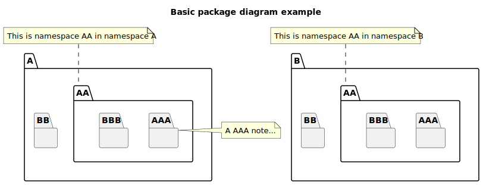

# t30001 - Basic package diagram test case
## Config
```yaml
compilation_database_dir: ..
output_directory: puml
diagrams:
  t30001_package:
    type: package
    glob:
      - ../../tests/t30001/t30001.cc
    include:
      namespaces:
        - clanguml::t30001
    exclude:
      namespaces:
        - clanguml::t30001::detail
    using_namespace:
      - clanguml::t30001
    plantuml:
      before:
        - "' t30001 test diagram of type {{ diagram.type }}"
      after:
        - 'note right of {{ alias("A::AA::AAA") }}: A AAA note...'
        - ' note top of {{ alias("A::AA") }} : {{ e.comment.formatted }}'
        - ' note top of {{ alias("B::AA") }} : {{ e.comment.formatted }}'

```
## Source code
File t30001.cc
```cpp
namespace clanguml {
namespace t30001 {
namespace A {
/// This is namespace AA in namespace A
namespace AA {
namespace AAA {
} // namespace AAA
namespace BBB {
} // namespace BBB
} // namespace AA
namespace BB {
} // namespace BB
} // namespace A
namespace B {
/// This is namespace AA in namespace B
namespace AA {
namespace AAA {
} // namespace AAA
namespace BBB {
} // namespace BBB
} // namespace AA
namespace BB {
} // namespace BB
} // namespace B
} // namespace t30001
} // namespace clanguml

```
## Generated UML diagrams

## Generated JSON models
```json
{
  "diagram_type": "package",
  "elements": [
    {
      "display_name": "clanguml::t30001::A",
      "elements": [
        {
          "comment": {
            "formatted": "This is namespace AA in namespace A",
            "raw": "/// This is namespace AA in namespace A"
          },
          "display_name": "clanguml::t30001::A::AA",
          "elements": [
            {
              "display_name": "clanguml::t30001::A::AA::AAA",
              "id": "274638237740249424",
              "is_deprecated": false,
              "name": "AAA",
              "source_location": {
                "file": "../../tests/t30001/t30001.cc",
                "line": 6
              },
              "type": "namespace"
            },
            {
              "display_name": "clanguml::t30001::A::AA::BBB",
              "id": "2129154382024012563",
              "is_deprecated": false,
              "name": "BBB",
              "source_location": {
                "file": "../../tests/t30001/t30001.cc",
                "line": 8
              },
              "type": "namespace"
            }
          ],
          "id": "1528517990989164155",
          "is_deprecated": false,
          "name": "AA",
          "source_location": {
            "file": "../../tests/t30001/t30001.cc",
            "line": 5
          },
          "type": "namespace"
        },
        {
          "display_name": "clanguml::t30001::A::BB",
          "id": "983199564524723281",
          "is_deprecated": false,
          "name": "BB",
          "source_location": {
            "file": "../../tests/t30001/t30001.cc",
            "line": 11
          },
          "type": "namespace"
        }
      ],
      "id": "1184614645531659789",
      "is_deprecated": false,
      "name": "A",
      "source_location": {
        "file": "../../tests/t30001/t30001.cc",
        "line": 3
      },
      "type": "namespace"
    },
    {
      "display_name": "clanguml::t30001::B",
      "elements": [
        {
          "comment": {
            "formatted": "This is namespace AA in namespace B",
            "raw": "/// This is namespace AA in namespace B"
          },
          "display_name": "clanguml::t30001::B::AA",
          "elements": [
            {
              "display_name": "clanguml::t30001::B::AA::AAA",
              "id": "262162485307734028",
              "is_deprecated": false,
              "name": "AAA",
              "source_location": {
                "file": "../../tests/t30001/t30001.cc",
                "line": 17
              },
              "type": "namespace"
            },
            {
              "display_name": "clanguml::t30001::B::AA::BBB",
              "id": "18542334992237803",
              "is_deprecated": false,
              "name": "BBB",
              "source_location": {
                "file": "../../tests/t30001/t30001.cc",
                "line": 19
              },
              "type": "namespace"
            }
          ],
          "id": "895913707182089871",
          "is_deprecated": false,
          "name": "AA",
          "source_location": {
            "file": "../../tests/t30001/t30001.cc",
            "line": 16
          },
          "type": "namespace"
        },
        {
          "display_name": "clanguml::t30001::B::BB",
          "id": "2230464321696304488",
          "is_deprecated": false,
          "name": "BB",
          "source_location": {
            "file": "../../tests/t30001/t30001.cc",
            "line": 22
          },
          "type": "namespace"
        }
      ],
      "id": "1931735210112054430",
      "is_deprecated": false,
      "name": "B",
      "source_location": {
        "file": "../../tests/t30001/t30001.cc",
        "line": 14
      },
      "type": "namespace"
    }
  ],
  "metadata": {
    "clang_uml_version": "0.3.6-31-g01ef3dc",
    "llvm_version": "Ubuntu clang version 15.0.6",
    "schema_version": 1
  },
  "name": "t30001_package",
  "relationships": [],
  "using_namespace": "clanguml::t30001"
}
```
