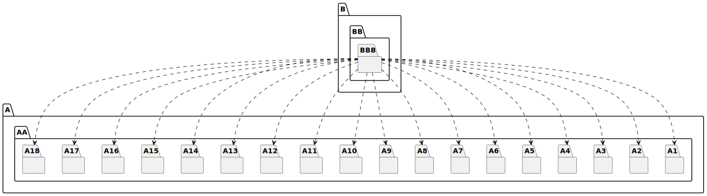

# t30002 - Package dependency test case
## Config
```yaml
diagrams:
  t30002_package:
    type: package
    glob:
      - t30002.cc
    include:
      namespaces:
        - clanguml::t30002
    exclude:
      namespaces:
        - clanguml::t30002::detail
    using_namespace: clanguml::t30002
    plantuml:
      before:
        - "' t30002 test package diagram"
```
## Source code
File `tests/t30002/t30002.cc`
```cpp
#include <array>
#include <map>
#include <memory>
#include <string>
#include <vector>

namespace clanguml {
namespace t30002 {
namespace A::AA {
namespace A1 {
struct CA { };
}
namespace A2 {
template <typename T> struct CB {
    T cb;
};
}
namespace A3 {
struct CC { };
}
namespace A4 {
struct CD { };
}
namespace A5 {
struct CE { };
}
namespace A6 {
struct CF { };
}
namespace A7 {
struct CG { };
}
namespace A8 {
struct CH { };
}
namespace A9 {
struct CI { };
}
namespace A10 {
struct CJ { };
}
namespace A11 {
struct CK { };
}
namespace A12 {
struct CL { };
}
namespace A13 {
struct CM { };
}
namespace A14 {
struct CN { };
}
namespace A15 {
struct CO { };
}
namespace A16 {
struct CP { };
}
namespace A17 {
struct CR { };
}
namespace A18 {
enum class S { s1, s2, s3 };
}
}
namespace B::BB::BBB {
class CBA : public A::AA::A6::CF {
public:
    A::AA::A1::CA *ca_;
    A::AA::A2::CB<int> cb_;
    std::shared_ptr<A::AA::A3::CC> cc_;
    std::map<std::string, std::unique_ptr<A::AA::A4::CD>> *cd_;
    std::array<A::AA::A15::CO, 5> co_;
    static A::AA::A16::CP *cp_;

    CBA() = default;

    CBA(A::AA::A14::CN *cn) { }

    friend A::AA::A17::CR;

    template <typename... Item> CBA(std::tuple<Item...> &items) { }

    void ce(const std::vector<A::AA::A5::CE> /*ce_*/) { }

    std::shared_ptr<A::AA::A7::CG> cg() { return {}; }

    template <typename T>
    void ch(std::map<T, std::shared_ptr<A::AA::A8::CH>> &ch_)
    {
    }

    template <typename T>
    std::map<T, std::shared_ptr<A::AA::A9::CI>> ci(T * /*t*/)
    {
        return {};
    }

    A::AA::A18::S s;
};

void cj(std::unique_ptr<A::AA::A10::CJ> /*cj_*/) { }

std::unique_ptr<A::AA::A11::CK> ck() { return {}; }

template <typename T>
void cl(std::map<T, std::shared_ptr<A::AA::A12::CL>> & /*ch_*/)
{
}

template <typename T> std::map<T, std::shared_ptr<A::AA::A13::CM>> cm()
{
    return {};
}
}
} // namespace t30002
} // namespace clanguml

```
## Generated PlantUML diagrams

## Generated Mermaid diagrams

## Generated JSON models
```json
{
  "diagram_type": "package",
  "elements": [
    {
      "display_name": "A",
      "elements": [
        {
          "display_name": "AA",
          "elements": [
            {
              "display_name": "A1",
              "id": "1164966689017271053",
              "is_deprecated": false,
              "name": "A1",
              "namespace": "clanguml::t30002::A::AA",
              "source_location": {
                "column": 11,
                "file": "t30002.cc",
                "line": 10,
                "translation_unit": "t30002.cc"
              },
              "type": "namespace"
            },
            {
              "display_name": "A2",
              "id": "695366113361481509",
              "is_deprecated": false,
              "name": "A2",
              "namespace": "clanguml::t30002::A::AA",
              "source_location": {
                "column": 11,
                "file": "t30002.cc",
                "line": 13,
                "translation_unit": "t30002.cc"
              },
              "type": "namespace"
            },
            {
              "display_name": "A3",
              "id": "1267709074800873528",
              "is_deprecated": false,
              "name": "A3",
              "namespace": "clanguml::t30002::A::AA",
              "source_location": {
                "column": 11,
                "file": "t30002.cc",
                "line": 18,
                "translation_unit": "t30002.cc"
              },
              "type": "namespace"
            },
            {
              "display_name": "A4",
              "id": "299262817531370604",
              "is_deprecated": false,
              "name": "A4",
              "namespace": "clanguml::t30002::A::AA",
              "source_location": {
                "column": 11,
                "file": "t30002.cc",
                "line": 21,
                "translation_unit": "t30002.cc"
              },
              "type": "namespace"
            },
            {
              "display_name": "A5",
              "id": "1207764290216680521",
              "is_deprecated": false,
              "name": "A5",
              "namespace": "clanguml::t30002::A::AA",
              "source_location": {
                "column": 11,
                "file": "t30002.cc",
                "line": 24,
                "translation_unit": "t30002.cc"
              },
              "type": "namespace"
            },
            {
              "display_name": "A6",
              "id": "899091126727901939",
              "is_deprecated": false,
              "name": "A6",
              "namespace": "clanguml::t30002::A::AA",
              "source_location": {
                "column": 11,
                "file": "t30002.cc",
                "line": 27,
                "translation_unit": "t30002.cc"
              },
              "type": "namespace"
            },
            {
              "display_name": "A7",
              "id": "563861734550555261",
              "is_deprecated": false,
              "name": "A7",
              "namespace": "clanguml::t30002::A::AA",
              "source_location": {
                "column": 11,
                "file": "t30002.cc",
                "line": 30,
                "translation_unit": "t30002.cc"
              },
              "type": "namespace"
            },
            {
              "display_name": "A8",
              "id": "839146342143718390",
              "is_deprecated": false,
              "name": "A8",
              "namespace": "clanguml::t30002::A::AA",
              "source_location": {
                "column": 11,
                "file": "t30002.cc",
                "line": 33,
                "translation_unit": "t30002.cc"
              },
              "type": "namespace"
            },
            {
              "display_name": "A9",
              "id": "1650835159458422245",
              "is_deprecated": false,
              "name": "A9",
              "namespace": "clanguml::t30002::A::AA",
              "source_location": {
                "column": 11,
                "file": "t30002.cc",
                "line": 36,
                "translation_unit": "t30002.cc"
              },
              "type": "namespace"
            },
            {
              "display_name": "A10",
              "id": "1453242941322376182",
              "is_deprecated": false,
              "name": "A10",
              "namespace": "clanguml::t30002::A::AA",
              "source_location": {
                "column": 11,
                "file": "t30002.cc",
                "line": 39,
                "translation_unit": "t30002.cc"
              },
              "type": "namespace"
            },
            {
              "display_name": "A11",
              "id": "384833776371876986",
              "is_deprecated": false,
              "name": "A11",
              "namespace": "clanguml::t30002::A::AA",
              "source_location": {
                "column": 11,
                "file": "t30002.cc",
                "line": 42,
                "translation_unit": "t30002.cc"
              },
              "type": "namespace"
            },
            {
              "display_name": "A12",
              "id": "1199527037490355138",
              "is_deprecated": false,
              "name": "A12",
              "namespace": "clanguml::t30002::A::AA",
              "source_location": {
                "column": 11,
                "file": "t30002.cc",
                "line": 45,
                "translation_unit": "t30002.cc"
              },
              "type": "namespace"
            },
            {
              "display_name": "A13",
              "id": "620689743711615190",
              "is_deprecated": false,
              "name": "A13",
              "namespace": "clanguml::t30002::A::AA",
              "source_location": {
                "column": 11,
                "file": "t30002.cc",
                "line": 48,
                "translation_unit": "t30002.cc"
              },
              "type": "namespace"
            },
            {
              "display_name": "A14",
              "id": "301858476377711436",
              "is_deprecated": false,
              "name": "A14",
              "namespace": "clanguml::t30002::A::AA",
              "source_location": {
                "column": 11,
                "file": "t30002.cc",
                "line": 51,
                "translation_unit": "t30002.cc"
              },
              "type": "namespace"
            },
            {
              "display_name": "A15",
              "id": "561239706327729436",
              "is_deprecated": false,
              "name": "A15",
              "namespace": "clanguml::t30002::A::AA",
              "source_location": {
                "column": 11,
                "file": "t30002.cc",
                "line": 54,
                "translation_unit": "t30002.cc"
              },
              "type": "namespace"
            },
            {
              "display_name": "A16",
              "id": "1415398383158410524",
              "is_deprecated": false,
              "name": "A16",
              "namespace": "clanguml::t30002::A::AA",
              "source_location": {
                "column": 11,
                "file": "t30002.cc",
                "line": 57,
                "translation_unit": "t30002.cc"
              },
              "type": "namespace"
            },
            {
              "display_name": "A17",
              "id": "532437874530119999",
              "is_deprecated": false,
              "name": "A17",
              "namespace": "clanguml::t30002::A::AA",
              "source_location": {
                "column": 11,
                "file": "t30002.cc",
                "line": 60,
                "translation_unit": "t30002.cc"
              },
              "type": "namespace"
            },
            {
              "display_name": "A18",
              "id": "405712335116487393",
              "is_deprecated": false,
              "name": "A18",
              "namespace": "clanguml::t30002::A::AA",
              "source_location": {
                "column": 11,
                "file": "t30002.cc",
                "line": 63,
                "translation_unit": "t30002.cc"
              },
              "type": "namespace"
            }
          ],
          "id": "1669745471968085401",
          "is_deprecated": false,
          "name": "AA",
          "namespace": "clanguml::t30002::A",
          "source_location": {
            "column": 14,
            "file": "t30002.cc",
            "line": 9,
            "translation_unit": "t30002.cc"
          },
          "type": "namespace"
        }
      ],
      "id": "1543480715632256641",
      "is_deprecated": false,
      "name": "A",
      "namespace": "clanguml::t30002",
      "source_location": {
        "column": 11,
        "file": "t30002.cc",
        "line": 9,
        "translation_unit": "t30002.cc"
      },
      "type": "namespace"
    },
    {
      "display_name": "B",
      "elements": [
        {
          "display_name": "BB",
          "elements": [
            {
              "display_name": "BBB",
              "id": "2255521339657425355",
              "is_deprecated": false,
              "name": "BBB",
              "namespace": "clanguml::t30002::B::BB",
              "source_location": {
                "column": 18,
                "file": "t30002.cc",
                "line": 67,
                "translation_unit": "t30002.cc"
              },
              "type": "namespace"
            }
          ],
          "id": "1938861639623819235",
          "is_deprecated": false,
          "name": "BB",
          "namespace": "clanguml::t30002::B",
          "source_location": {
            "column": 14,
            "file": "t30002.cc",
            "line": 67,
            "translation_unit": "t30002.cc"
          },
          "type": "namespace"
        }
      ],
      "id": "145302773464360955",
      "is_deprecated": false,
      "name": "B",
      "namespace": "clanguml::t30002",
      "source_location": {
        "column": 11,
        "file": "t30002.cc",
        "line": 67,
        "translation_unit": "t30002.cc"
      },
      "type": "namespace"
    }
  ],
  "name": "t30002_package",
  "package_type": "namespace",
  "relationships": [
    {
      "destination": "839146342143718390",
      "source": "2255521339657425355",
      "type": "dependency"
    },
    {
      "destination": "1650835159458422245",
      "source": "2255521339657425355",
      "type": "dependency"
    },
    {
      "destination": "1164966689017271053",
      "source": "2255521339657425355",
      "type": "dependency"
    },
    {
      "destination": "695366113361481509",
      "source": "2255521339657425355",
      "type": "dependency"
    },
    {
      "destination": "1267709074800873528",
      "source": "2255521339657425355",
      "type": "dependency"
    },
    {
      "destination": "299262817531370604",
      "source": "2255521339657425355",
      "type": "dependency"
    },
    {
      "destination": "561239706327729436",
      "source": "2255521339657425355",
      "type": "dependency"
    },
    {
      "destination": "405712335116487393",
      "source": "2255521339657425355",
      "type": "dependency"
    },
    {
      "destination": "1415398383158410524",
      "source": "2255521339657425355",
      "type": "dependency"
    },
    {
      "destination": "301858476377711436",
      "source": "2255521339657425355",
      "type": "dependency"
    },
    {
      "destination": "1207764290216680521",
      "source": "2255521339657425355",
      "type": "dependency"
    },
    {
      "destination": "563861734550555261",
      "source": "2255521339657425355",
      "type": "dependency"
    },
    {
      "destination": "532437874530119999",
      "source": "2255521339657425355",
      "type": "dependency"
    },
    {
      "destination": "899091126727901939",
      "source": "2255521339657425355",
      "type": "dependency"
    },
    {
      "destination": "1453242941322376182",
      "source": "2255521339657425355",
      "type": "dependency"
    },
    {
      "destination": "384833776371876986",
      "source": "2255521339657425355",
      "type": "dependency"
    },
    {
      "destination": "1199527037490355138",
      "source": "2255521339657425355",
      "type": "dependency"
    },
    {
      "destination": "620689743711615190",
      "source": "2255521339657425355",
      "type": "dependency"
    }
  ],
  "using_namespace": "clanguml::t30002"
}
```
