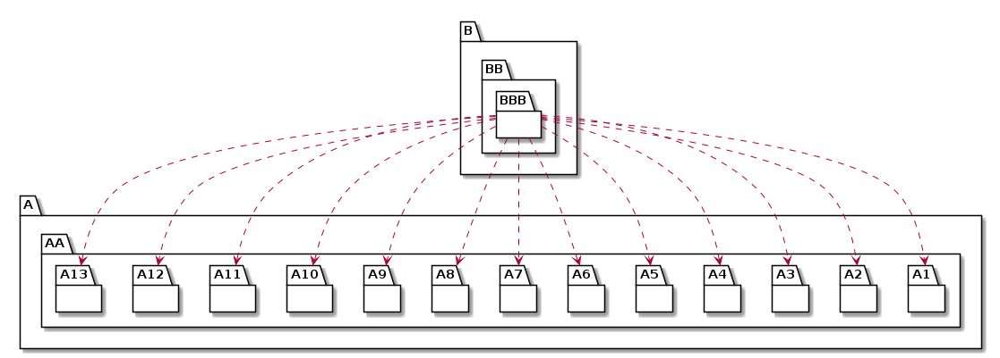

# t30002 - Package dependency test case
## Config
```yaml
compilation_database_dir: ..
output_directory: puml
diagrams:
  t30002_package:
    type: package
    glob:
      - ../../tests/t30002/t30002.cc
    include:
      namespaces:
        - clanguml::t30002
    exclude:
      namespaces:
        - clanguml::t30002::detail
    using_namespace:
      - clanguml::t30002
    plantuml:
      before:
        - "' t30002 test package diagram"
```
## Source code
File t30002.cc
```cpp
#include <memory>

namespace clanguml {
namespace t30002 {
namespace A::AA::AAA {
struct CA {
};
}
namespace B::BB::BBB {
struct CBA {
    A::AA::AAA::CA *ca_;
};
}
} // namespace t30002
} // namespace clanguml

```
## Generated UML diagrams

