# t30003 - Package deprecated attribute test case
## Config
```yaml
diagrams:
  t30003_package:
    type: package
    glob:
      - t30003.cc
    include:
      namespaces:
        - clanguml::t30003
    using_namespace: clanguml::t30003
    plantuml:
      before:
        - "' t30003 test package diagram"
```
## Source code
File `tests/t30003/t30003.cc`
```cpp
namespace clanguml {
namespace t30003 {

namespace ns1 {
namespace ns2_v1_0_0 {
class A { };
} // namespace ns2_v1_0_0

namespace [[deprecated]] ns2_v0_9_0 {
class A { };
} // namespace ns2_v0_9_0

namespace {
class Anon final { };
} // namespace
} // namespace ns1

namespace [[deprecated]] ns3 {

namespace ns1::ns2 {
class Anon : public t30003::ns1::ns2_v1_0_0::A { };
} // namespace ns1::ns2

class B : public ns1::ns2::Anon { };
} // namespace ns3
} // namespace t30003
} // namespace clanguml
```
## Generated PlantUML diagrams

## Generated Mermaid diagrams

## Generated JSON models
```json
{
  "diagram_type": "package",
  "elements": [
    {
      "display_name": "ns1",
      "elements": [
        {
          "display_name": "ns2_v1_0_0",
          "id": "5182047603605949099",
          "is_deprecated": false,
          "name": "ns2_v1_0_0",
          "namespace": "clanguml::t30003::ns1",
          "source_location": {
            "column": 11,
            "file": "t30003.cc",
            "line": 5,
            "translation_unit": "t30003.cc"
          },
          "type": "namespace"
        },
        {
          "display_name": "ns2_v0_9_0",
          "id": "8107253179963379254",
          "is_deprecated": true,
          "name": "ns2_v0_9_0",
          "namespace": "clanguml::t30003::ns1",
          "source_location": {
            "column": 26,
            "file": "t30003.cc",
            "line": 9,
            "translation_unit": "t30003.cc"
          },
          "type": "namespace"
        }
      ],
      "id": "4803622968556372712",
      "is_deprecated": false,
      "name": "ns1",
      "namespace": "clanguml::t30003",
      "source_location": {
        "column": 11,
        "file": "t30003.cc",
        "line": 4,
        "translation_unit": "t30003.cc"
      },
      "type": "namespace"
    },
    {
      "display_name": "ns3",
      "elements": [
        {
          "display_name": "ns1",
          "elements": [
            {
              "display_name": "ns2",
              "id": "6563701284189814015",
              "is_deprecated": false,
              "name": "ns2",
              "namespace": "clanguml::t30003::ns3::ns1",
              "source_location": {
                "column": 16,
                "file": "t30003.cc",
                "line": 20,
                "translation_unit": "t30003.cc"
              },
              "type": "namespace"
            }
          ],
          "id": "9673158889130672490",
          "is_deprecated": false,
          "name": "ns1",
          "namespace": "clanguml::t30003::ns3",
          "source_location": {
            "column": 11,
            "file": "t30003.cc",
            "line": 20,
            "translation_unit": "t30003.cc"
          },
          "type": "namespace"
        }
      ],
      "id": "3416835237916214549",
      "is_deprecated": true,
      "name": "ns3",
      "namespace": "clanguml::t30003",
      "source_location": {
        "column": 26,
        "file": "t30003.cc",
        "line": 18,
        "translation_unit": "t30003.cc"
      },
      "type": "namespace"
    }
  ],
  "name": "t30003_package",
  "package_type": "namespace",
  "relationships": [
    {
      "destination": "5182047603605949099",
      "source": "6563701284189814015",
      "type": "dependency"
    }
  ],
  "using_namespace": "clanguml::t30003"
}
```
## Generated GraphML models
```xml
<?xml version="1.0"?>
<graphml xmlns="http://graphml.graphdrawing.org/xmlns" xmlns:xsi="http://www.w3.org/2001/XMLSchema-instance" xsi:schemaLocation="http://graphml.graphdrawing.org/xmlns http://graphml.graphdrawing.org/xmlns/1.0/graphml.xsd">
 <key attr.name="id" attr.type="string" for="graph" id="gd0" />
 <key attr.name="type" attr.type="string" for="graph" id="gd1" />
 <key attr.name="using_namespace" attr.type="string" for="graph" id="gd2" />
 <key attr.name="id" attr.type="string" for="node" id="nd0" />
 <key attr.name="type" attr.type="string" for="node" id="nd1" />
 <key attr.name="name" attr.type="string" for="node" id="nd2" />
 <key attr.name="stereotype" attr.type="string" for="node" id="nd3" />
 <key attr.name="url" attr.type="string" for="node" id="nd4" />
 <key attr.name="tooltip" attr.type="string" for="node" id="nd5" />
 <key attr.name="type" attr.type="string" for="edge" id="ed0" />
 <key attr.name="access" attr.type="string" for="edge" id="ed1" />
 <key attr.name="label" attr.type="string" for="edge" id="ed2" />
 <key attr.name="url" attr.type="string" for="edge" id="ed3" />
 <graph id="g0" edgedefault="directed" parse.nodeids="canonical" parse.edgeids="canonical" parse.order="nodesfirst">
  <data key="gd2">clanguml::t30003</data>
  <node id="n0">
   <data key="nd2">ns1</data>
   <data key="nd1">namespace</data>
   <data key="nd4">https://github.com/bkryza/clang-uml/blob/974c6f4a38a48a553ba3f79495af6c960d22884f/tests/t30003/t30003.cc#L4</data>
   <data key="nd5">ns1</data>
   <graph id="g1" edgedefault="directed" parse.nodeids="canonical" parse.edgeids="canonical" parse.order="nodesfirst">
    <node id="n1">
     <data key="nd2">ns2_v1_0_0</data>
     <data key="nd1">namespace</data>
     <data key="nd4">https://github.com/bkryza/clang-uml/blob/974c6f4a38a48a553ba3f79495af6c960d22884f/tests/t30003/t30003.cc#L5</data>
     <data key="nd5">ns2_v1_0_0</data>
     <graph id="g2" edgedefault="directed" parse.nodeids="canonical" parse.edgeids="canonical" parse.order="nodesfirst" />
    </node>
    <node id="n2">
     <data key="nd2">ns2_v0_9_0</data>
     <data key="nd1">namespace</data>
     <data key="nd4">https://github.com/bkryza/clang-uml/blob/974c6f4a38a48a553ba3f79495af6c960d22884f/tests/t30003/t30003.cc#L9</data>
     <data key="nd5">ns2_v0_9_0</data>
     <data key="nd3">deprecated</data>
     <graph id="g3" edgedefault="directed" parse.nodeids="canonical" parse.edgeids="canonical" parse.order="nodesfirst" />
    </node>
   </graph>
  </node>
  <node id="n3">
   <data key="nd2">ns3</data>
   <data key="nd1">namespace</data>
   <data key="nd4">https://github.com/bkryza/clang-uml/blob/974c6f4a38a48a553ba3f79495af6c960d22884f/tests/t30003/t30003.cc#L18</data>
   <data key="nd5">ns3</data>
   <data key="nd3">deprecated</data>
   <graph id="g4" edgedefault="directed" parse.nodeids="canonical" parse.edgeids="canonical" parse.order="nodesfirst">
    <node id="n4">
     <data key="nd2">ns1</data>
     <data key="nd1">namespace</data>
     <data key="nd4">https://github.com/bkryza/clang-uml/blob/974c6f4a38a48a553ba3f79495af6c960d22884f/tests/t30003/t30003.cc#L20</data>
     <data key="nd5">ns1</data>
     <graph id="g5" edgedefault="directed" parse.nodeids="canonical" parse.edgeids="canonical" parse.order="nodesfirst">
      <node id="n5">
       <data key="nd2">ns2</data>
       <data key="nd1">namespace</data>
       <data key="nd4">https://github.com/bkryza/clang-uml/blob/974c6f4a38a48a553ba3f79495af6c960d22884f/tests/t30003/t30003.cc#L20</data>
       <data key="nd5">ns2</data>
       <graph id="g6" edgedefault="directed" parse.nodeids="canonical" parse.edgeids="canonical" parse.order="nodesfirst" />
      </node>
     </graph>
    </node>
   </graph>
  </node>
  <edge id="e0" source="n5" target="n1">
   <data key="ed0">dependency</data>
  </edge>
 </graph>
</graphml>

```
