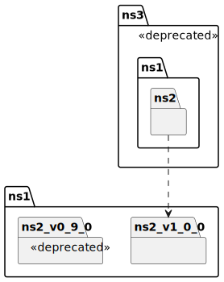

# t30003 - Package deprecated attribute test case
## Config
```yaml
compilation_database_dir: ..
output_directory: puml
diagrams:
  t30003_package:
    type: package
    glob:
      - ../../tests/t30003/t30003.cc
    include:
      namespaces:
        - clanguml::t30003
    using_namespace:
      - clanguml::t30003
    plantuml:
      before:
        - "' t30003 test package diagram"
```
## Source code
File t30003.cc
```cpp
namespace clanguml {
namespace t30003 {

namespace ns1 {
namespace ns2_v1_0_0 {
class A {
};
}

namespace [[deprecated]] ns2_v0_9_0 {
class A {
};
}

namespace {
class Anon final {
};
}
}

namespace [[deprecated]] ns3 {

namespace ns1::ns2 {
class Anon : public t30003::ns1::ns2_v1_0_0::A {
};
}

class B : public ns1::ns2::Anon {
};
}
}
}
```
## Generated UML diagrams

