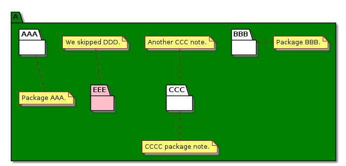

# t30004 - PlantUML package decorators test case
## Config
```yaml
compilation_database_dir: ..
output_directory: puml
diagrams:
  t30004_package:
    type: package
    glob:
      - ../../tests/t30004/t30004.cc
    include:
      namespaces:
        - clanguml::t30004
    using_namespace:
      - clanguml::t30004
    plantuml:
      before:
        - "' t30004 test package diagram"
```
## Source code
File t30004.cc
```cpp
namespace clanguml {
namespace t30004 {

/// @uml{style[#green]}
namespace A {

/// @uml{note[ bottom ] Package AAA.}
namespace AAA {
}

/// \uml{note[right] Package BBB.}
namespace BBB {
}

///
/// @uml{note:t30004_package[bottom] CCCC package note.}
/// This is package CCC.
namespace CCC {
}

/// \uml{skip}
namespace DDD {
}

/// @uml{style[#pink;line:red;line.bold;text:red]}
/// \uml{note[top] We skipped DDD.}
namespace EEE {
}
}
}
}
```
## Generated UML diagrams

