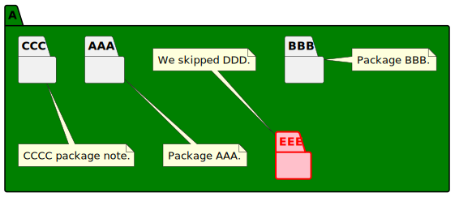

# t30004 - PlantUML package decorators test case
## Config
```yaml
diagrams:
  t30004_package:
    type: package
    glob:
      - t30004.cc
    include:
      namespaces:
        - clanguml::t30004
    using_namespace: clanguml::t30004
    plantuml:
      before:
        - "' t30004 test package diagram"
```
## Source code
File `tests/t30004/t30004.cc`
```cpp
namespace clanguml {
namespace t30004 {

/// @uml{style[#green]}
namespace A {

/// @uml{note[ bottom ] Package AAA.}
namespace AAA {
}

/// \uml{note[right] Package BBB.}
namespace BBB {
}

///
/// @uml{note:t30004_package[bottom] CCCC package note.}
/// This is package CCC.
namespace CCC {
}

/// \uml{skip}
namespace DDD {
}

/// @uml{style[#pink;line:red;line.bold;text:red]}
/// \uml{note[top] We skipped DDD.}
namespace EEE {
}

/// \uml{note[top] Another CCC note.}
namespace CCC {
}
}
}
}
```
## Generated PlantUML diagrams

## Generated Mermaid diagrams

## Generated JSON models
```json
{
  "diagram_type": "package",
  "elements": [
    {
      "comment": {
        "formatted": "@uml{style[#green]}",
        "raw": "/// @uml{style[#green]}"
      },
      "display_name": "A",
      "elements": [
        {
          "comment": {
            "formatted": "@uml{note[ bottom ] Package AAA.}",
            "raw": "/// @uml{note[ bottom ] Package AAA.}"
          },
          "display_name": "AAA",
          "id": "1517185300862579159",
          "is_deprecated": false,
          "name": "AAA",
          "namespace": "clanguml::t30004::A",
          "source_location": {
            "column": 11,
            "file": "t30004.cc",
            "line": 8,
            "translation_unit": "t30004.cc"
          },
          "type": "namespace"
        },
        {
          "comment": {
            "formatted": "\\uml{note[right] Package BBB.}",
            "raw": "/// \\uml{note[right] Package BBB.}"
          },
          "display_name": "BBB",
          "id": "1982379087062354928",
          "is_deprecated": false,
          "name": "BBB",
          "namespace": "clanguml::t30004::A",
          "source_location": {
            "column": 11,
            "file": "t30004.cc",
            "line": 12,
            "translation_unit": "t30004.cc"
          },
          "type": "namespace"
        },
        {
          "comment": {
            "formatted": "\n @uml{note:t30004_package[bottom] CCCC package note.}\n This is package CCC.",
            "raw": "///\n/// @uml{note:t30004_package[bottom] CCCC package note.}\n/// This is package CCC."
          },
          "display_name": "CCC",
          "id": "2304726195556701567",
          "is_deprecated": false,
          "name": "CCC",
          "namespace": "clanguml::t30004::A",
          "source_location": {
            "column": 11,
            "file": "t30004.cc",
            "line": 18,
            "translation_unit": "t30004.cc"
          },
          "type": "namespace"
        },
        {
          "comment": {
            "formatted": "@uml{style[#pink;line:red;line.bold;text:red]}\n\\uml{note[top] We skipped DDD.}",
            "raw": "/// @uml{style[#pink;line:red;line.bold;text:red]}\n/// \\uml{note[top] We skipped DDD.}"
          },
          "display_name": "EEE",
          "id": "1084924732216290779",
          "is_deprecated": false,
          "name": "EEE",
          "namespace": "clanguml::t30004::A",
          "source_location": {
            "column": 11,
            "file": "t30004.cc",
            "line": 27,
            "translation_unit": "t30004.cc"
          },
          "type": "namespace"
        }
      ],
      "id": "33410665874039845",
      "is_deprecated": false,
      "name": "A",
      "namespace": "clanguml::t30004",
      "source_location": {
        "column": 11,
        "file": "t30004.cc",
        "line": 5,
        "translation_unit": "t30004.cc"
      },
      "type": "namespace"
    }
  ],
  "name": "t30004_package",
  "package_type": "namespace",
  "relationships": [],
  "using_namespace": "clanguml::t30004"
}
```
