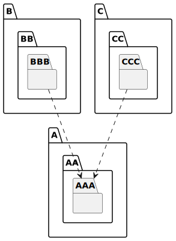

# t30005 - Package namespace alias test case
## Config
```yaml
diagrams:
  t30005_package:
    type: package
    glob:
      - t30005.cc
    include:
      namespaces:
        - clanguml::t30005
    using_namespace: clanguml::t30005
    plantuml:
      before:
        - "' t30005 test package diagram"
```
## Source code
File `tests/t30005/t30005.cc`
```cpp
namespace clanguml {
namespace t30005 {

namespace A::AA::AAA {
struct C1 { };
}

namespace B::BB::BBB {
namespace A6 = A::AA::AAA;
namespace ASix = A6;
struct C2 {
    ASix::C1 *cb;
};
}

namespace C::CC::CCC {
namespace A6 = A::AA::AAA;
namespace ASix = A6;
using ADSix = ASix::C1;
struct C2 {
    ADSix *cc;
};
}
}

}

```
## Generated PlantUML diagrams

## Generated Mermaid diagrams

## Generated JSON models
```json
{
  "diagram_type": "package",
  "elements": [
    {
      "display_name": "A",
      "elements": [
        {
          "display_name": "AA",
          "elements": [
            {
              "display_name": "AAA",
              "id": "914090901927655181",
              "is_deprecated": false,
              "name": "AAA",
              "namespace": "clanguml::t30005::A::AA",
              "source_location": {
                "column": 18,
                "file": "t30005.cc",
                "line": 4,
                "translation_unit": "t30005.cc"
              },
              "type": "namespace"
            }
          ],
          "id": "1777547159021391040",
          "is_deprecated": false,
          "name": "AA",
          "namespace": "clanguml::t30005::A",
          "source_location": {
            "column": 14,
            "file": "t30005.cc",
            "line": 4,
            "translation_unit": "t30005.cc"
          },
          "type": "namespace"
        }
      ],
      "id": "1768303675686131578",
      "is_deprecated": false,
      "name": "A",
      "namespace": "clanguml::t30005",
      "source_location": {
        "column": 11,
        "file": "t30005.cc",
        "line": 4,
        "translation_unit": "t30005.cc"
      },
      "type": "namespace"
    },
    {
      "display_name": "B",
      "elements": [
        {
          "display_name": "BB",
          "elements": [
            {
              "display_name": "BBB",
              "id": "1871026935460001668",
              "is_deprecated": false,
              "name": "BBB",
              "namespace": "clanguml::t30005::B::BB",
              "source_location": {
                "column": 18,
                "file": "t30005.cc",
                "line": 8,
                "translation_unit": "t30005.cc"
              },
              "type": "namespace"
            }
          ],
          "id": "1696631362104244809",
          "is_deprecated": false,
          "name": "BB",
          "namespace": "clanguml::t30005::B",
          "source_location": {
            "column": 14,
            "file": "t30005.cc",
            "line": 8,
            "translation_unit": "t30005.cc"
          },
          "type": "namespace"
        }
      ],
      "id": "378529216628023051",
      "is_deprecated": false,
      "name": "B",
      "namespace": "clanguml::t30005",
      "source_location": {
        "column": 11,
        "file": "t30005.cc",
        "line": 8,
        "translation_unit": "t30005.cc"
      },
      "type": "namespace"
    },
    {
      "display_name": "C",
      "elements": [
        {
          "display_name": "CC",
          "elements": [
            {
              "display_name": "CCC",
              "id": "1763279540133487999",
              "is_deprecated": false,
              "name": "CCC",
              "namespace": "clanguml::t30005::C::CC",
              "source_location": {
                "column": 18,
                "file": "t30005.cc",
                "line": 16,
                "translation_unit": "t30005.cc"
              },
              "type": "namespace"
            }
          ],
          "id": "2134234141727442046",
          "is_deprecated": false,
          "name": "CC",
          "namespace": "clanguml::t30005::C",
          "source_location": {
            "column": 14,
            "file": "t30005.cc",
            "line": 16,
            "translation_unit": "t30005.cc"
          },
          "type": "namespace"
        }
      ],
      "id": "1041076320925403190",
      "is_deprecated": false,
      "name": "C",
      "namespace": "clanguml::t30005",
      "source_location": {
        "column": 11,
        "file": "t30005.cc",
        "line": 16,
        "translation_unit": "t30005.cc"
      },
      "type": "namespace"
    }
  ],
  "name": "t30005_package",
  "package_type": "namespace",
  "relationships": [
    {
      "destination": "914090901927655181",
      "source": "1871026935460001668",
      "type": "dependency"
    },
    {
      "destination": "914090901927655181",
      "source": "1763279540133487999",
      "type": "dependency"
    }
  ],
  "using_namespace": "clanguml::t30005"
}
```
