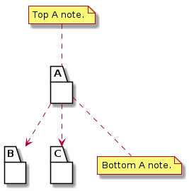

# t30006 - Package split namespace test case
## Config
```yaml
compilation_database_dir: ..
output_directory: puml
diagrams:
  t30006_package:
    type: package
    glob:
      - ../../tests/t30006/t30006.cc
    include:
      namespaces:
        - clanguml::t30006
    using_namespace:
      - clanguml::t30006
    plantuml:
      before:
        - "' t30006 test package diagram"
```
## Source code
File t30006.cc
```cpp
namespace clanguml {
namespace t30006 {

namespace B {
struct BB {
};
}

/// \uml{note[top] Top A note.}
namespace A {
struct A1 {
    B::BB *b;
};
}

namespace C {
struct CC {
};
}

/// \uml{note[bottom] Bottom A note.}
namespace A {
struct A2 {
    C::CC *c;
};
}

}
}
```
## Generated UML diagrams

