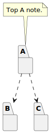

# t30006 - Package split namespace test case
## Config
```yaml
diagrams:
  t30006_package:
    type: package
    glob:
      - t30006.cc
    include:
      namespaces:
        - clanguml::t30006
    using_namespace: clanguml::t30006
    plantuml:
      before:
        - "' t30006 test package diagram"
```
## Source code
File `tests/t30006/t30006.cc`
```cpp
namespace clanguml {
namespace t30006 {

namespace B {
struct BB { };
}

/// \uml{note[top] Top A note.}
namespace A {
struct A1 {
    B::BB *b;
};
}

namespace C {
struct CC { };
}

/// \uml{note[bottom] Bottom A note.}
namespace A {
struct A2 {
    C::CC *c;
};
}

}
}
```
## Generated PlantUML diagrams

## Generated Mermaid diagrams

## Generated JSON models
```json
{
  "diagram_type": "package",
  "elements": [
    {
      "display_name": "B",
      "id": "13272721377695553156",
      "is_deprecated": false,
      "name": "B",
      "namespace": "clanguml::t30006",
      "source_location": {
        "column": 11,
        "file": "t30006.cc",
        "line": 4,
        "translation_unit": "t30006.cc"
      },
      "type": "namespace"
    },
    {
      "comment": {
        "formatted": "\\uml{note[top] Top A note.}",
        "raw": "/// \\uml{note[top] Top A note.}"
      },
      "display_name": "A",
      "id": "11999355388220637599",
      "is_deprecated": false,
      "name": "A",
      "namespace": "clanguml::t30006",
      "source_location": {
        "column": 11,
        "file": "t30006.cc",
        "line": 9,
        "translation_unit": "t30006.cc"
      },
      "type": "namespace"
    },
    {
      "display_name": "C",
      "id": "11044539711888922958",
      "is_deprecated": false,
      "name": "C",
      "namespace": "clanguml::t30006",
      "source_location": {
        "column": 11,
        "file": "t30006.cc",
        "line": 15,
        "translation_unit": "t30006.cc"
      },
      "type": "namespace"
    }
  ],
  "name": "t30006_package",
  "package_type": "namespace",
  "relationships": [
    {
      "destination": "13272721377695553156",
      "source": "11999355388220637599",
      "type": "dependency"
    },
    {
      "destination": "11044539711888922958",
      "source": "11999355388220637599",
      "type": "dependency"
    }
  ],
  "using_namespace": "clanguml::t30006"
}
```
## Generated GraphML models
```xml
<?xml version="1.0"?>
<graphml xmlns="http://graphml.graphdrawing.org/xmlns" xmlns:xsi="http://www.w3.org/2001/XMLSchema-instance" xsi:schemaLocation="http://graphml.graphdrawing.org/xmlns http://graphml.graphdrawing.org/xmlns/1.0/graphml.xsd">
 <key attr.name="id" attr.type="string" for="graph" id="gd0" />
 <key attr.name="diagram_type" attr.type="string" for="graph" id="gd1" />
 <key attr.name="name" attr.type="string" for="graph" id="gd2" />
 <key attr.name="using_namespace" attr.type="string" for="graph" id="gd3" />
 <key attr.name="id" attr.type="string" for="node" id="nd0" />
 <key attr.name="type" attr.type="string" for="node" id="nd1" />
 <key attr.name="name" attr.type="string" for="node" id="nd2" />
 <key attr.name="stereotype" attr.type="string" for="node" id="nd3" />
 <key attr.name="url" attr.type="string" for="node" id="nd4" />
 <key attr.name="tooltip" attr.type="string" for="node" id="nd5" />
 <key attr.name="type" attr.type="string" for="edge" id="ed0" />
 <key attr.name="access" attr.type="string" for="edge" id="ed1" />
 <key attr.name="label" attr.type="string" for="edge" id="ed2" />
 <key attr.name="url" attr.type="string" for="edge" id="ed3" />
 <graph id="g0" edgedefault="directed" parse.nodeids="canonical" parse.edgeids="canonical" parse.order="nodesfirst">
  <data key="gd3">clanguml::t30006</data>
  <node id="n0">
   <data key="nd2">B</data>
   <data key="nd1">namespace</data>
   <data key="nd4">https://github.com/bkryza/clang-uml/blob/1fa698c8f418c67d7d8c4f8e23c3e56636a93f97/tests/t30006/t30006.cc#L4</data>
   <data key="nd5">B</data>
   <graph id="g1" edgedefault="directed" parse.nodeids="canonical" parse.edgeids="canonical" parse.order="nodesfirst" />
  </node>
  <node id="n1">
   <data key="nd2">A</data>
   <data key="nd1">namespace</data>
   <data key="nd4">https://github.com/bkryza/clang-uml/blob/1fa698c8f418c67d7d8c4f8e23c3e56636a93f97/tests/t30006/t30006.cc#L9</data>
   <data key="nd5">A</data>
   <graph id="g2" edgedefault="directed" parse.nodeids="canonical" parse.edgeids="canonical" parse.order="nodesfirst" />
  </node>
  <node id="n2">
   <data key="nd2">C</data>
   <data key="nd1">namespace</data>
   <data key="nd4">https://github.com/bkryza/clang-uml/blob/1fa698c8f418c67d7d8c4f8e23c3e56636a93f97/tests/t30006/t30006.cc#L15</data>
   <data key="nd5">C</data>
   <graph id="g3" edgedefault="directed" parse.nodeids="canonical" parse.edgeids="canonical" parse.order="nodesfirst" />
  </node>
  <node id="n3">
   <data key="nd1">note</data>
   <data key="nd2"><![CDATA[Top A note.]]></data>
  </node>
  <edge id="e0" source="n3" target="n1">
   <data key="ed0">none</data>
  </edge>
  <node id="n4">
   <data key="nd1">note</data>
   <data key="nd2"><![CDATA[Top A note.]]></data>
  </node>
  <edge id="e1" source="n4" target="n1">
   <data key="ed0">none</data>
  </edge>
  <edge id="e2" source="n1" target="n0">
   <data key="ed0">dependency</data>
  </edge>
  <edge id="e3" source="n1" target="n2">
   <data key="ed0">dependency</data>
  </edge>
 </graph>
</graphml>

```
