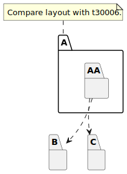

# t30007 - Package diagram layout hints test case
## Config
```yaml
compilation_database_dir: ..
output_directory: puml
diagrams:
  t30007_package:
    type: package
    glob:
      - ../../tests/t30007/t30007.cc
    include:
      namespaces:
        - clanguml::t30007
    using_namespace:
      - clanguml::t30007
    layout:
      C:
        - up: 'A::AA'
        - left: B
    plantuml:
      before:
        - "' t30007 test package diagram"
```
## Source code
File t30007.cc
```cpp
namespace clanguml {
namespace t30007 {

namespace B {
struct BB {
};
}

/// \uml{note[top] Compare layout with t30006.}
namespace A {
namespace AA {
struct A1 {
    B::BB *b;
};
}
}

namespace C {
struct CC {
};
}

/// \uml{note[bottom] Bottom A note.}
namespace A {
namespace AA {
struct A2 {
    C::CC *c;
};
}
}

}
}
```
## Generated UML diagrams

