# t30007 - Package diagram layout hints test case
## Config
```yaml
diagrams:
  t30007_package:
    type: package
    glob:
      - t30007.cc
    include:
      namespaces:
        - clanguml::t30007
    using_namespace: clanguml::t30007
    layout:
      C:
        - up: 'A::AA'
        - left: B
    plantuml:
      before:
        - "' t30007 test package diagram"
```
## Source code
File `tests/t30007/t30007.cc`
```cpp
namespace clanguml {
namespace t30007 {

namespace B {
struct BB { };
}

/// \uml{note[top] Compare layout with t30006.}
namespace A {
namespace AA {
struct A1 {
    B::BB *b;
};
}
}

namespace C {
struct CC { };
}

/// \uml{note[bottom] Bottom A note.}
namespace A {
namespace AA {
struct A2 {
    C::CC *c;
};
}
}

}
}
```
## Generated PlantUML diagrams

## Generated Mermaid diagrams

## Generated JSON models
```json
{
  "diagram_type": "package",
  "elements": [
    {
      "display_name": "B",
      "id": "14821633768042844406",
      "is_deprecated": false,
      "name": "B",
      "namespace": "clanguml::t30007",
      "source_location": {
        "column": 11,
        "file": "t30007.cc",
        "line": 4,
        "translation_unit": "t30007.cc"
      },
      "type": "namespace"
    },
    {
      "comment": {
        "formatted": "\\uml{note[top] Compare layout with t30006.}",
        "raw": "/// \\uml{note[top] Compare layout with t30006.}"
      },
      "display_name": "A",
      "elements": [
        {
          "display_name": "AA",
          "id": "2861780046545905366",
          "is_deprecated": false,
          "name": "AA",
          "namespace": "clanguml::t30007::A",
          "source_location": {
            "column": 11,
            "file": "t30007.cc",
            "line": 10,
            "translation_unit": "t30007.cc"
          },
          "type": "namespace"
        }
      ],
      "id": "6966996923110930767",
      "is_deprecated": false,
      "name": "A",
      "namespace": "clanguml::t30007",
      "source_location": {
        "column": 11,
        "file": "t30007.cc",
        "line": 9,
        "translation_unit": "t30007.cc"
      },
      "type": "namespace"
    },
    {
      "display_name": "C",
      "id": "7502332303098546906",
      "is_deprecated": false,
      "name": "C",
      "namespace": "clanguml::t30007",
      "source_location": {
        "column": 11,
        "file": "t30007.cc",
        "line": 17,
        "translation_unit": "t30007.cc"
      },
      "type": "namespace"
    }
  ],
  "name": "t30007_package",
  "package_type": "namespace",
  "relationships": [
    {
      "destination": "14821633768042844406",
      "source": "2861780046545905366",
      "type": "dependency"
    },
    {
      "destination": "7502332303098546906",
      "source": "2861780046545905366",
      "type": "dependency"
    }
  ],
  "using_namespace": "clanguml::t30007"
}
```
## Generated GraphML models
```xml
<?xml version="1.0"?>
<graphml xmlns="http://graphml.graphdrawing.org/xmlns" xmlns:xsi="http://www.w3.org/2001/XMLSchema-instance" xsi:schemaLocation="http://graphml.graphdrawing.org/xmlns http://graphml.graphdrawing.org/xmlns/1.0/graphml.xsd">
 <key attr.name="id" attr.type="string" for="graph" id="gd0" />
 <key attr.name="diagram_type" attr.type="string" for="graph" id="gd1" />
 <key attr.name="name" attr.type="string" for="graph" id="gd2" />
 <key attr.name="using_namespace" attr.type="string" for="graph" id="gd3" />
 <key attr.name="id" attr.type="string" for="node" id="nd0" />
 <key attr.name="type" attr.type="string" for="node" id="nd1" />
 <key attr.name="name" attr.type="string" for="node" id="nd2" />
 <key attr.name="stereotype" attr.type="string" for="node" id="nd3" />
 <key attr.name="url" attr.type="string" for="node" id="nd4" />
 <key attr.name="tooltip" attr.type="string" for="node" id="nd5" />
 <key attr.name="type" attr.type="string" for="edge" id="ed0" />
 <key attr.name="access" attr.type="string" for="edge" id="ed1" />
 <key attr.name="label" attr.type="string" for="edge" id="ed2" />
 <key attr.name="url" attr.type="string" for="edge" id="ed3" />
 <graph id="g0" edgedefault="directed" parse.nodeids="canonical" parse.edgeids="canonical" parse.order="nodesfirst">
  <data key="gd3">clanguml::t30007</data>
  <node id="n0">
   <data key="nd2">B</data>
   <data key="nd1">namespace</data>
   <data key="nd4">https://github.com/bkryza/clang-uml/blob/5a99d524aefa5b8d2a48d1d679ccb9ae351323ba/tests/t30007/t30007.cc#L4</data>
   <data key="nd5">B</data>
   <graph id="g1" edgedefault="directed" parse.nodeids="canonical" parse.edgeids="canonical" parse.order="nodesfirst" />
  </node>
  <node id="n1">
   <data key="nd2">A</data>
   <data key="nd1">namespace</data>
   <data key="nd4">https://github.com/bkryza/clang-uml/blob/5a99d524aefa5b8d2a48d1d679ccb9ae351323ba/tests/t30007/t30007.cc#L9</data>
   <data key="nd5">A</data>
   <graph id="g2" edgedefault="directed" parse.nodeids="canonical" parse.edgeids="canonical" parse.order="nodesfirst">
    <node id="n2">
     <data key="nd2">AA</data>
     <data key="nd1">namespace</data>
     <data key="nd4">https://github.com/bkryza/clang-uml/blob/5a99d524aefa5b8d2a48d1d679ccb9ae351323ba/tests/t30007/t30007.cc#L10</data>
     <data key="nd5">AA</data>
     <graph id="g3" edgedefault="directed" parse.nodeids="canonical" parse.edgeids="canonical" parse.order="nodesfirst" />
    </node>
   </graph>
  </node>
  <node id="n3">
   <data key="nd2">C</data>
   <data key="nd1">namespace</data>
   <data key="nd4">https://github.com/bkryza/clang-uml/blob/5a99d524aefa5b8d2a48d1d679ccb9ae351323ba/tests/t30007/t30007.cc#L17</data>
   <data key="nd5">C</data>
   <graph id="g4" edgedefault="directed" parse.nodeids="canonical" parse.edgeids="canonical" parse.order="nodesfirst" />
  </node>
  <node id="n4">
   <data key="nd1">note</data>
   <data key="nd2"><![CDATA[Compare layout with t30006.]]></data>
  </node>
  <edge id="e0" source="n4" target="n1">
   <data key="ed0">none</data>
  </edge>
  <node id="n5">
   <data key="nd1">note</data>
   <data key="nd2"><![CDATA[Compare layout with t30006.]]></data>
  </node>
  <edge id="e1" source="n5" target="n1">
   <data key="ed0">none</data>
  </edge>
  <edge id="e2" source="n2" target="n0">
   <data key="ed0">dependency</data>
  </edge>
  <edge id="e3" source="n2" target="n3">
   <data key="ed0">dependency</data>
  </edge>
 </graph>
</graphml>

```
