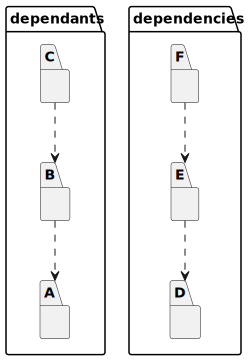

# t30008 - Dependants and dependencies package diagram filter test
## Config
```yaml
diagrams:
  t30008_package:
    type: package
    glob:
      - t30008.cc
    include:
      dependants:
        - clanguml::t30008::dependants::A
      dependencies:
        - clanguml::t30008::dependencies::F
    using_namespace: clanguml::t30008
    plantuml:
      before:
        - "' t30008 test package diagram"
```
## Source code
File `tests/t30008/t30008.cc`
```cpp
namespace clanguml {
namespace t30008 {

namespace dependants {
namespace X {
}
namespace A {
struct AA { };
}
namespace B {
struct BB {
    A::AA *aa;
};
}
namespace C {
struct CC {
    B::BB *bb;
};
}

} // namespace dependants

namespace dependencies {
namespace Y {
}

namespace D {
struct DD { };
}
namespace E {
struct EE {
    D::DD *dd;
};
}
namespace F {
struct FF {
    E::EE *ee;
};
}
} // namespace dependencies

} // namespace t30008
} // namespace clanguml
```
## Generated PlantUML diagrams

## Generated Mermaid diagrams

## Generated JSON models
```json
{
  "diagram_type": "package",
  "elements": [
    {
      "display_name": "dependants",
      "elements": [
        {
          "display_name": "A",
          "id": "2096441629244782012",
          "is_deprecated": false,
          "name": "A",
          "namespace": "clanguml::t30008::dependants",
          "source_location": {
            "column": 11,
            "file": "t30008.cc",
            "line": 7,
            "translation_unit": "t30008.cc"
          },
          "type": "namespace"
        },
        {
          "display_name": "B",
          "id": "500208250168931957",
          "is_deprecated": false,
          "name": "B",
          "namespace": "clanguml::t30008::dependants",
          "source_location": {
            "column": 11,
            "file": "t30008.cc",
            "line": 10,
            "translation_unit": "t30008.cc"
          },
          "type": "namespace"
        },
        {
          "display_name": "C",
          "id": "1095841247154575825",
          "is_deprecated": false,
          "name": "C",
          "namespace": "clanguml::t30008::dependants",
          "source_location": {
            "column": 11,
            "file": "t30008.cc",
            "line": 15,
            "translation_unit": "t30008.cc"
          },
          "type": "namespace"
        }
      ],
      "id": "1601960042765615222",
      "is_deprecated": false,
      "name": "dependants",
      "namespace": "clanguml::t30008",
      "source_location": {
        "column": 11,
        "file": "t30008.cc",
        "line": 4,
        "translation_unit": "t30008.cc"
      },
      "type": "namespace"
    },
    {
      "display_name": "dependencies",
      "elements": [
        {
          "display_name": "D",
          "id": "912387297717034254",
          "is_deprecated": false,
          "name": "D",
          "namespace": "clanguml::t30008::dependencies",
          "source_location": {
            "column": 11,
            "file": "t30008.cc",
            "line": 27,
            "translation_unit": "t30008.cc"
          },
          "type": "namespace"
        },
        {
          "display_name": "E",
          "id": "1114997990364518938",
          "is_deprecated": false,
          "name": "E",
          "namespace": "clanguml::t30008::dependencies",
          "source_location": {
            "column": 11,
            "file": "t30008.cc",
            "line": 30,
            "translation_unit": "t30008.cc"
          },
          "type": "namespace"
        },
        {
          "display_name": "F",
          "id": "1062827161678172094",
          "is_deprecated": false,
          "name": "F",
          "namespace": "clanguml::t30008::dependencies",
          "source_location": {
            "column": 11,
            "file": "t30008.cc",
            "line": 35,
            "translation_unit": "t30008.cc"
          },
          "type": "namespace"
        }
      ],
      "id": "2103969167872217960",
      "is_deprecated": false,
      "name": "dependencies",
      "namespace": "clanguml::t30008",
      "source_location": {
        "column": 11,
        "file": "t30008.cc",
        "line": 23,
        "translation_unit": "t30008.cc"
      },
      "type": "namespace"
    }
  ],
  "name": "t30008_package",
  "package_type": "namespace",
  "relationships": [
    {
      "destination": "2096441629244782012",
      "source": "500208250168931957",
      "type": "dependency"
    },
    {
      "destination": "500208250168931957",
      "source": "1095841247154575825",
      "type": "dependency"
    },
    {
      "destination": "912387297717034254",
      "source": "1114997990364518938",
      "type": "dependency"
    },
    {
      "destination": "1114997990364518938",
      "source": "1062827161678172094",
      "type": "dependency"
    }
  ],
  "using_namespace": "clanguml::t30008"
}
```
