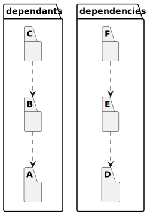

# t30008 - Dependants and dependencies package diagram filter test
## Config
```yaml
diagrams:
  t30008_package:
    type: package
    glob:
      - t30008.cc
    include:
      dependants:
        - clanguml::t30008::dependants::A
      dependencies:
        - clanguml::t30008::dependencies::F
    using_namespace: clanguml::t30008
    plantuml:
      before:
        - "' t30008 test package diagram"
```
## Source code
File `tests/t30008/t30008.cc`
```cpp
namespace clanguml {
namespace t30008 {

namespace dependants {
namespace X {
}
namespace A {
struct AA { };
}
namespace B {
struct BB {
    A::AA *aa;
};
}
namespace C {
struct CC {
    B::BB *bb;
};
}

} // namespace dependants

namespace dependencies {
namespace Y {
}

namespace D {
struct DD { };
}
namespace E {
struct EE {
    D::DD *dd;
};
}
namespace F {
struct FF {
    E::EE *ee;
};
}
} // namespace dependencies

} // namespace t30008
} // namespace clanguml
```
## Generated PlantUML diagrams

## Generated Mermaid diagrams

## Generated JSON models
```json
{
  "diagram_type": "package",
  "elements": [
    {
      "display_name": "dependants",
      "elements": [
        {
          "display_name": "A",
          "id": "10258176831283500490",
          "is_deprecated": false,
          "name": "A",
          "namespace": "clanguml::t30008::dependants",
          "source_location": {
            "column": 11,
            "file": "t30008.cc",
            "line": 7,
            "translation_unit": "t30008.cc"
          },
          "type": "namespace"
        },
        {
          "display_name": "B",
          "id": "4663101978652273865",
          "is_deprecated": false,
          "name": "B",
          "namespace": "clanguml::t30008::dependants",
          "source_location": {
            "column": 11,
            "file": "t30008.cc",
            "line": 10,
            "translation_unit": "t30008.cc"
          },
          "type": "namespace"
        },
        {
          "display_name": "C",
          "id": "17430875140461873179",
          "is_deprecated": false,
          "name": "C",
          "namespace": "clanguml::t30008::dependants",
          "source_location": {
            "column": 11,
            "file": "t30008.cc",
            "line": 15,
            "translation_unit": "t30008.cc"
          },
          "type": "namespace"
        }
      ],
      "id": "11562739961098909313",
      "is_deprecated": false,
      "name": "dependants",
      "namespace": "clanguml::t30008",
      "source_location": {
        "column": 11,
        "file": "t30008.cc",
        "line": 4,
        "translation_unit": "t30008.cc"
      },
      "type": "namespace"
    },
    {
      "display_name": "dependencies",
      "elements": [
        {
          "display_name": "D",
          "id": "2151941703563189146",
          "is_deprecated": false,
          "name": "D",
          "namespace": "clanguml::t30008::dependencies",
          "source_location": {
            "column": 11,
            "file": "t30008.cc",
            "line": 27,
            "translation_unit": "t30008.cc"
          },
          "type": "namespace"
        },
        {
          "display_name": "E",
          "id": "3486788951406963600",
          "is_deprecated": false,
          "name": "E",
          "namespace": "clanguml::t30008::dependencies",
          "source_location": {
            "column": 11,
            "file": "t30008.cc",
            "line": 30,
            "translation_unit": "t30008.cc"
          },
          "type": "namespace"
        },
        {
          "display_name": "F",
          "id": "10582395952714567488",
          "is_deprecated": false,
          "name": "F",
          "namespace": "clanguml::t30008::dependencies",
          "source_location": {
            "column": 11,
            "file": "t30008.cc",
            "line": 35,
            "translation_unit": "t30008.cc"
          },
          "type": "namespace"
        }
      ],
      "id": "6202880126124245479",
      "is_deprecated": false,
      "name": "dependencies",
      "namespace": "clanguml::t30008",
      "source_location": {
        "column": 11,
        "file": "t30008.cc",
        "line": 23,
        "translation_unit": "t30008.cc"
      },
      "type": "namespace"
    }
  ],
  "name": "t30008_package",
  "package_type": "namespace",
  "relationships": [
    {
      "destination": "10258176831283500490",
      "source": "4663101978652273865",
      "type": "dependency"
    },
    {
      "destination": "4663101978652273865",
      "source": "17430875140461873179",
      "type": "dependency"
    },
    {
      "destination": "2151941703563189146",
      "source": "3486788951406963600",
      "type": "dependency"
    },
    {
      "destination": "3486788951406963600",
      "source": "10582395952714567488",
      "type": "dependency"
    }
  ],
  "using_namespace": "clanguml::t30008"
}
```
## Generated GraphML models
```xml
<?xml version="1.0"?>
<graphml xmlns="http://graphml.graphdrawing.org/xmlns" xmlns:xsi="http://www.w3.org/2001/XMLSchema-instance" xsi:schemaLocation="http://graphml.graphdrawing.org/xmlns http://graphml.graphdrawing.org/xmlns/1.0/graphml.xsd">
 <key attr.name="id" attr.type="string" for="graph" id="gd0" />
 <key attr.name="diagram_type" attr.type="string" for="graph" id="gd1" />
 <key attr.name="name" attr.type="string" for="graph" id="gd2" />
 <key attr.name="using_namespace" attr.type="string" for="graph" id="gd3" />
 <key attr.name="id" attr.type="string" for="node" id="nd0" />
 <key attr.name="type" attr.type="string" for="node" id="nd1" />
 <key attr.name="name" attr.type="string" for="node" id="nd2" />
 <key attr.name="stereotype" attr.type="string" for="node" id="nd3" />
 <key attr.name="url" attr.type="string" for="node" id="nd4" />
 <key attr.name="tooltip" attr.type="string" for="node" id="nd5" />
 <key attr.name="type" attr.type="string" for="edge" id="ed0" />
 <key attr.name="access" attr.type="string" for="edge" id="ed1" />
 <key attr.name="label" attr.type="string" for="edge" id="ed2" />
 <key attr.name="url" attr.type="string" for="edge" id="ed3" />
 <graph id="g0" edgedefault="directed" parse.nodeids="canonical" parse.edgeids="canonical" parse.order="nodesfirst">
  <data key="gd3">clanguml::t30008</data>
  <node id="n0">
   <data key="nd2">dependants</data>
   <data key="nd1">namespace</data>
   <graph id="g1" edgedefault="directed" parse.nodeids="canonical" parse.edgeids="canonical" parse.order="nodesfirst">
    <node id="n1">
     <data key="nd2">A</data>
     <data key="nd1">namespace</data>
     <graph id="g2" edgedefault="directed" parse.nodeids="canonical" parse.edgeids="canonical" parse.order="nodesfirst" />
    </node>
    <node id="n2">
     <data key="nd2">B</data>
     <data key="nd1">namespace</data>
     <graph id="g3" edgedefault="directed" parse.nodeids="canonical" parse.edgeids="canonical" parse.order="nodesfirst" />
    </node>
    <node id="n3">
     <data key="nd2">C</data>
     <data key="nd1">namespace</data>
     <graph id="g4" edgedefault="directed" parse.nodeids="canonical" parse.edgeids="canonical" parse.order="nodesfirst" />
    </node>
   </graph>
  </node>
  <node id="n4">
   <data key="nd2">dependencies</data>
   <data key="nd1">namespace</data>
   <graph id="g5" edgedefault="directed" parse.nodeids="canonical" parse.edgeids="canonical" parse.order="nodesfirst">
    <node id="n5">
     <data key="nd2">D</data>
     <data key="nd1">namespace</data>
     <graph id="g6" edgedefault="directed" parse.nodeids="canonical" parse.edgeids="canonical" parse.order="nodesfirst" />
    </node>
    <node id="n6">
     <data key="nd2">E</data>
     <data key="nd1">namespace</data>
     <graph id="g7" edgedefault="directed" parse.nodeids="canonical" parse.edgeids="canonical" parse.order="nodesfirst" />
    </node>
    <node id="n7">
     <data key="nd2">F</data>
     <data key="nd1">namespace</data>
     <graph id="g8" edgedefault="directed" parse.nodeids="canonical" parse.edgeids="canonical" parse.order="nodesfirst" />
    </node>
   </graph>
  </node>
  <edge id="e0" source="n2" target="n1">
   <data key="ed0">dependency</data>
  </edge>
  <edge id="e1" source="n3" target="n2">
   <data key="ed0">dependency</data>
  </edge>
  <edge id="e2" source="n6" target="n5">
   <data key="ed0">dependency</data>
  </edge>
  <edge id="e3" source="n7" target="n6">
   <data key="ed0">dependency</data>
  </edge>
 </graph>
</graphml>

```
