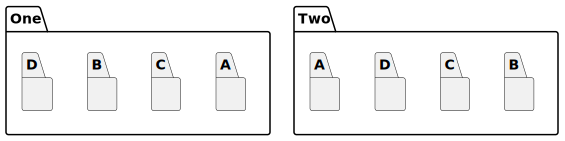

# t30009 - Together layout hint test
## Config
```yaml
diagrams:
  t30009_package:
    type: package
    glob:
      - t30009.cc
    include:
      namespaces:
        - clanguml::t30009
    using_namespace: clanguml::t30009
    layout:
      One::A:
        - together: [One::C]
      Two::B:
        - together: [Two::C, Two::D]
```
## Source code
File `tests/t30009/t30009.cc`
```cpp
namespace clanguml::t30009 {
namespace One {
namespace A {
}
namespace B {
}
namespace C {
}
namespace D {
}
}
namespace Two {
namespace A {
}
namespace B {
}
namespace C {
}
namespace D {
}
}
}

```
## Generated PlantUML diagrams

## Generated Mermaid diagrams

## Generated JSON models
```json
{
  "diagram_type": "package",
  "elements": [
    {
      "display_name": "One",
      "elements": [
        {
          "display_name": "A",
          "id": "1189741240939898414",
          "is_deprecated": false,
          "name": "A",
          "namespace": "clanguml::t30009::One",
          "source_location": {
            "column": 11,
            "file": "t30009.cc",
            "line": 3,
            "translation_unit": "t30009.cc"
          },
          "type": "namespace"
        },
        {
          "display_name": "B",
          "id": "209763670816643341",
          "is_deprecated": false,
          "name": "B",
          "namespace": "clanguml::t30009::One",
          "source_location": {
            "column": 11,
            "file": "t30009.cc",
            "line": 5,
            "translation_unit": "t30009.cc"
          },
          "type": "namespace"
        },
        {
          "display_name": "C",
          "id": "946522260503371974",
          "is_deprecated": false,
          "name": "C",
          "namespace": "clanguml::t30009::One",
          "source_location": {
            "column": 11,
            "file": "t30009.cc",
            "line": 7,
            "translation_unit": "t30009.cc"
          },
          "type": "namespace"
        },
        {
          "display_name": "D",
          "id": "1181245940399690936",
          "is_deprecated": false,
          "name": "D",
          "namespace": "clanguml::t30009::One",
          "source_location": {
            "column": 11,
            "file": "t30009.cc",
            "line": 9,
            "translation_unit": "t30009.cc"
          },
          "type": "namespace"
        }
      ],
      "id": "1187941209208108244",
      "is_deprecated": false,
      "name": "One",
      "namespace": "clanguml::t30009",
      "source_location": {
        "column": 11,
        "file": "t30009.cc",
        "line": 2,
        "translation_unit": "t30009.cc"
      },
      "type": "namespace"
    },
    {
      "display_name": "Two",
      "elements": [
        {
          "display_name": "A",
          "id": "986505573514384282",
          "is_deprecated": false,
          "name": "A",
          "namespace": "clanguml::t30009::Two",
          "source_location": {
            "column": 11,
            "file": "t30009.cc",
            "line": 13,
            "translation_unit": "t30009.cc"
          },
          "type": "namespace"
        },
        {
          "display_name": "B",
          "id": "2156827588463114203",
          "is_deprecated": false,
          "name": "B",
          "namespace": "clanguml::t30009::Two",
          "source_location": {
            "column": 11,
            "file": "t30009.cc",
            "line": 15,
            "translation_unit": "t30009.cc"
          },
          "type": "namespace"
        },
        {
          "display_name": "C",
          "id": "1653274432960093632",
          "is_deprecated": false,
          "name": "C",
          "namespace": "clanguml::t30009::Two",
          "source_location": {
            "column": 11,
            "file": "t30009.cc",
            "line": 17,
            "translation_unit": "t30009.cc"
          },
          "type": "namespace"
        },
        {
          "display_name": "D",
          "id": "263095551354153183",
          "is_deprecated": false,
          "name": "D",
          "namespace": "clanguml::t30009::Two",
          "source_location": {
            "column": 11,
            "file": "t30009.cc",
            "line": 19,
            "translation_unit": "t30009.cc"
          },
          "type": "namespace"
        }
      ],
      "id": "1940839474792549233",
      "is_deprecated": false,
      "name": "Two",
      "namespace": "clanguml::t30009",
      "source_location": {
        "column": 11,
        "file": "t30009.cc",
        "line": 12,
        "translation_unit": "t30009.cc"
      },
      "type": "namespace"
    }
  ],
  "name": "t30009_package",
  "package_type": "namespace",
  "relationships": [],
  "using_namespace": "clanguml::t30009"
}
```
