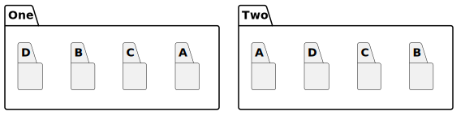

# t30009 - Together layout hint test
## Config
```yaml
diagrams:
  t30009_package:
    type: package
    glob:
      - t30009.cc
    include:
      namespaces:
        - clanguml::t30009
    using_namespace: clanguml::t30009
    layout:
      One::A:
        - together: [One::C]
      Two::B:
        - together: [Two::C, Two::D]
```
## Source code
File `tests/t30009/t30009.cc`
```cpp
namespace clanguml::t30009 {
namespace One {
namespace A {
}
namespace B {
}
namespace C {
}
namespace D {
}
}
namespace Two {
namespace A {
}
namespace B {
}
namespace C {
}
namespace D {
}
}
}

```
## Generated PlantUML diagrams

## Generated Mermaid diagrams

## Generated JSON models
```json
{
  "diagram_type": "package",
  "elements": [
    {
      "display_name": "One",
      "elements": [
        {
          "display_name": "A",
          "id": "6488814242773708731",
          "is_deprecated": false,
          "name": "A",
          "namespace": "clanguml::t30009::One",
          "source_location": {
            "column": 11,
            "file": "t30009.cc",
            "line": 3,
            "translation_unit": "t30009.cc"
          },
          "type": "namespace"
        },
        {
          "display_name": "B",
          "id": "17706951888637128511",
          "is_deprecated": false,
          "name": "B",
          "namespace": "clanguml::t30009::One",
          "source_location": {
            "column": 11,
            "file": "t30009.cc",
            "line": 5,
            "translation_unit": "t30009.cc"
          },
          "type": "namespace"
        },
        {
          "display_name": "C",
          "id": "1786387967061012187",
          "is_deprecated": false,
          "name": "C",
          "namespace": "clanguml::t30009::One",
          "source_location": {
            "column": 11,
            "file": "t30009.cc",
            "line": 7,
            "translation_unit": "t30009.cc"
          },
          "type": "namespace"
        },
        {
          "display_name": "D",
          "id": "3596773965021093110",
          "is_deprecated": false,
          "name": "D",
          "namespace": "clanguml::t30009::One",
          "source_location": {
            "column": 11,
            "file": "t30009.cc",
            "line": 9,
            "translation_unit": "t30009.cc"
          },
          "type": "namespace"
        }
      ],
      "id": "13874893902298532400",
      "is_deprecated": false,
      "name": "One",
      "namespace": "clanguml::t30009",
      "source_location": {
        "column": 11,
        "file": "t30009.cc",
        "line": 2,
        "translation_unit": "t30009.cc"
      },
      "type": "namespace"
    },
    {
      "display_name": "Two",
      "elements": [
        {
          "display_name": "A",
          "id": "8211563996207963861",
          "is_deprecated": false,
          "name": "A",
          "namespace": "clanguml::t30009::Two",
          "source_location": {
            "column": 11,
            "file": "t30009.cc",
            "line": 13,
            "translation_unit": "t30009.cc"
          },
          "type": "namespace"
        },
        {
          "display_name": "B",
          "id": "12876342387143873454",
          "is_deprecated": false,
          "name": "B",
          "namespace": "clanguml::t30009::Two",
          "source_location": {
            "column": 11,
            "file": "t30009.cc",
            "line": 15,
            "translation_unit": "t30009.cc"
          },
          "type": "namespace"
        },
        {
          "display_name": "C",
          "id": "2674603042290210571",
          "is_deprecated": false,
          "name": "C",
          "namespace": "clanguml::t30009::Two",
          "source_location": {
            "column": 11,
            "file": "t30009.cc",
            "line": 17,
            "translation_unit": "t30009.cc"
          },
          "type": "namespace"
        },
        {
          "display_name": "D",
          "id": "16997282310006453673",
          "is_deprecated": false,
          "name": "D",
          "namespace": "clanguml::t30009::Two",
          "source_location": {
            "column": 11,
            "file": "t30009.cc",
            "line": 19,
            "translation_unit": "t30009.cc"
          },
          "type": "namespace"
        }
      ],
      "id": "4775725222617571354",
      "is_deprecated": false,
      "name": "Two",
      "namespace": "clanguml::t30009",
      "source_location": {
        "column": 11,
        "file": "t30009.cc",
        "line": 12,
        "translation_unit": "t30009.cc"
      },
      "type": "namespace"
    }
  ],
  "name": "t30009_package",
  "package_type": "namespace",
  "relationships": [],
  "using_namespace": "clanguml::t30009"
}
```
## Generated GraphML models
```xml
<?xml version="1.0"?>
<graphml xmlns="http://graphml.graphdrawing.org/xmlns" xmlns:xsi="http://www.w3.org/2001/XMLSchema-instance" xsi:schemaLocation="http://graphml.graphdrawing.org/xmlns http://graphml.graphdrawing.org/xmlns/1.0/graphml.xsd">
 <key attr.name="id" attr.type="string" for="graph" id="gd0" />
 <key attr.name="diagram_type" attr.type="string" for="graph" id="gd1" />
 <key attr.name="name" attr.type="string" for="graph" id="gd2" />
 <key attr.name="using_namespace" attr.type="string" for="graph" id="gd3" />
 <key attr.name="id" attr.type="string" for="node" id="nd0" />
 <key attr.name="type" attr.type="string" for="node" id="nd1" />
 <key attr.name="name" attr.type="string" for="node" id="nd2" />
 <key attr.name="stereotype" attr.type="string" for="node" id="nd3" />
 <key attr.name="url" attr.type="string" for="node" id="nd4" />
 <key attr.name="tooltip" attr.type="string" for="node" id="nd5" />
 <key attr.name="type" attr.type="string" for="edge" id="ed0" />
 <key attr.name="access" attr.type="string" for="edge" id="ed1" />
 <key attr.name="label" attr.type="string" for="edge" id="ed2" />
 <key attr.name="url" attr.type="string" for="edge" id="ed3" />
 <graph id="g0" edgedefault="directed" parse.nodeids="canonical" parse.edgeids="canonical" parse.order="nodesfirst">
  <data key="gd3">clanguml::t30009</data>
  <node id="n0">
   <data key="nd2">One</data>
   <data key="nd1">namespace</data>
   <graph id="g1" edgedefault="directed" parse.nodeids="canonical" parse.edgeids="canonical" parse.order="nodesfirst">
    <node id="n1">
     <data key="nd2">A</data>
     <data key="nd1">namespace</data>
     <graph id="g2" edgedefault="directed" parse.nodeids="canonical" parse.edgeids="canonical" parse.order="nodesfirst" />
    </node>
    <node id="n2">
     <data key="nd2">B</data>
     <data key="nd1">namespace</data>
     <graph id="g3" edgedefault="directed" parse.nodeids="canonical" parse.edgeids="canonical" parse.order="nodesfirst" />
    </node>
    <node id="n3">
     <data key="nd2">C</data>
     <data key="nd1">namespace</data>
     <graph id="g4" edgedefault="directed" parse.nodeids="canonical" parse.edgeids="canonical" parse.order="nodesfirst" />
    </node>
    <node id="n4">
     <data key="nd2">D</data>
     <data key="nd1">namespace</data>
     <graph id="g5" edgedefault="directed" parse.nodeids="canonical" parse.edgeids="canonical" parse.order="nodesfirst" />
    </node>
   </graph>
  </node>
  <node id="n5">
   <data key="nd2">Two</data>
   <data key="nd1">namespace</data>
   <graph id="g6" edgedefault="directed" parse.nodeids="canonical" parse.edgeids="canonical" parse.order="nodesfirst">
    <node id="n6">
     <data key="nd2">A</data>
     <data key="nd1">namespace</data>
     <graph id="g7" edgedefault="directed" parse.nodeids="canonical" parse.edgeids="canonical" parse.order="nodesfirst" />
    </node>
    <node id="n7">
     <data key="nd2">B</data>
     <data key="nd1">namespace</data>
     <graph id="g8" edgedefault="directed" parse.nodeids="canonical" parse.edgeids="canonical" parse.order="nodesfirst" />
    </node>
    <node id="n8">
     <data key="nd2">C</data>
     <data key="nd1">namespace</data>
     <graph id="g9" edgedefault="directed" parse.nodeids="canonical" parse.edgeids="canonical" parse.order="nodesfirst" />
    </node>
    <node id="n9">
     <data key="nd2">D</data>
     <data key="nd1">namespace</data>
     <graph id="g10" edgedefault="directed" parse.nodeids="canonical" parse.edgeids="canonical" parse.order="nodesfirst" />
    </node>
   </graph>
  </node>
 </graph>
</graphml>

```
