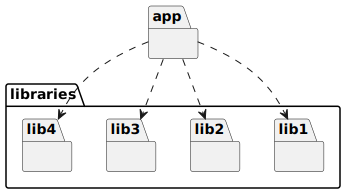

# t30010 - Package diagram with packages from directory structure
## Config
```yaml
diagrams:
  t30010_package:
    type: package
    generate_packages: true
    package_type: directory
    glob:
      - t30010.cc
    include:
      paths:
        - app
        - libraries
    using_namespace: clanguml::t30010
```
## Source code
File `tests/t30010/t30010.cc`
```cpp
#include "app/app.h"

namespace clanguml {
namespace t30010 {

App app;

} // namespace t30002
} // namespace clanguml

```
File `tests/t30010/libraries/lib1/lib1.h`
```cpp
#pragma once

namespace clanguml {
namespace t30010 {
namespace library1 {

struct A { };

}
}
}
```
File `tests/t30010/libraries/lib2/lib2.h`
```cpp
#pragma once

namespace clanguml {
namespace t30010 {
namespace library2 {

template <typename T> struct B {
    T b;
};

}
}
}
```
File `tests/t30010/libraries/lib3/lib3.h`
```cpp
#pragma once

namespace clanguml {
namespace t30010 {
namespace library3 {

enum E { e1, e2, e3 };

}
}
}
```
File `tests/t30010/libraries/lib4/lib4.h`
```cpp
#pragma once

namespace clanguml {
namespace t30010 {
namespace library4 {

struct C { };

}
}
}
```
File `tests/t30010/app/app.h`
```cpp
#pragma once

#include "../libraries/lib1/lib1.h"
#include "../libraries/lib2/lib2.h"
#include "../libraries/lib3/lib3.h"
#include "../libraries/lib4/lib4.h"

namespace clanguml {
namespace t30010 {

struct App {
    library1::A *a;
    library2::B<int> *b;
    library3::E e;

    void c(library4::C *) { }
};

}
}
```
## Generated PlantUML diagrams

## Generated Mermaid diagrams

## Generated JSON models
```json
{
  "diagram_type": "package",
  "elements": [
    {
      "display_name": "libraries",
      "elements": [
        {
          "display_name": "lib1",
          "id": "879212264535378961",
          "is_deprecated": false,
          "name": "lib1",
          "path": "",
          "source_location": {
            "column": 8,
            "file": "libraries/lib1/lib1.h",
            "line": 7,
            "translation_unit": "t30010.cc"
          },
          "type": "directory"
        },
        {
          "display_name": "lib2",
          "id": "1522606219626203424",
          "is_deprecated": false,
          "name": "lib2",
          "path": "",
          "source_location": {
            "column": 30,
            "file": "libraries/lib2/lib2.h",
            "line": 7,
            "translation_unit": "t30010.cc"
          },
          "type": "directory"
        },
        {
          "display_name": "lib3",
          "id": "2263709579652581325",
          "is_deprecated": false,
          "name": "lib3",
          "path": "",
          "source_location": {
            "column": 6,
            "file": "libraries/lib3/lib3.h",
            "line": 7,
            "translation_unit": "t30010.cc"
          },
          "type": "directory"
        },
        {
          "display_name": "lib4",
          "id": "1103453030023410219",
          "is_deprecated": false,
          "name": "lib4",
          "path": "",
          "source_location": {
            "column": 8,
            "file": "libraries/lib4/lib4.h",
            "line": 7,
            "translation_unit": "t30010.cc"
          },
          "type": "directory"
        }
      ],
      "id": "879401191375500756",
      "is_deprecated": false,
      "name": "libraries",
      "path": "",
      "type": "directory"
    },
    {
      "display_name": "app",
      "id": "2001320261642080149",
      "is_deprecated": false,
      "name": "app",
      "path": "",
      "source_location": {
        "column": 8,
        "file": "app/app.h",
        "line": 11,
        "translation_unit": "t30010.cc"
      },
      "type": "directory"
    }
  ],
  "name": "t30010_package",
  "package_type": "directory",
  "relationships": [
    {
      "destination": "879212264535378961",
      "source": "2001320261642080149",
      "type": "dependency"
    },
    {
      "destination": "1522606219626203424",
      "source": "2001320261642080149",
      "type": "dependency"
    },
    {
      "destination": "2263709579652581325",
      "source": "2001320261642080149",
      "type": "dependency"
    },
    {
      "destination": "1103453030023410219",
      "source": "2001320261642080149",
      "type": "dependency"
    }
  ],
  "using_namespace": "clanguml::t30010"
}
```
