# t30010 - Package diagram with packages from directory structure
## Config
```yaml
compilation_database_dir: ..
output_directory: diagrams
diagrams:
  t30010_package:
    type: package
    generate_packages: true
    package_type: directory
    glob:
      - t30010.cc
    relative_to: ../../../tests/t30010
    include:
      paths:
        - app
        - libraries
    using_namespace:
      - clanguml::t30010
```
## Source code
File t30010.cc
```cpp
#include "app/app.h"

namespace clanguml {
namespace t30010 {

App app;

} // namespace t30002
} // namespace clanguml

```
## Generated PlantUML diagrams

## Generated Mermaid diagrams

## Generated JSON models
```json
{
  "diagram_type": "package",
  "elements": [
    {
      "display_name": "libraries",
      "elements": [
        {
          "display_name": "lib1",
          "id": "879212264535378961",
          "is_deprecated": false,
          "name": "lib1",
          "source_location": {
            "column": 8,
            "file": "../../clang-uml/tests/t30010/libraries/lib1/lib1.h",
            "line": 7,
            "translation_unit": "../../clang-uml/tests/t30010/t30010.cc"
          },
          "type": "namespace"
        },
        {
          "display_name": "lib2",
          "id": "1522606219626203424",
          "is_deprecated": false,
          "name": "lib2",
          "source_location": {
            "column": 30,
            "file": "../../clang-uml/tests/t30010/libraries/lib2/lib2.h",
            "line": 7,
            "translation_unit": "../../clang-uml/tests/t30010/t30010.cc"
          },
          "type": "namespace"
        },
        {
          "display_name": "lib3",
          "id": "2263709579652581325",
          "is_deprecated": false,
          "name": "lib3",
          "source_location": {
            "column": 6,
            "file": "../../clang-uml/tests/t30010/libraries/lib3/lib3.h",
            "line": 7,
            "translation_unit": "../../clang-uml/tests/t30010/t30010.cc"
          },
          "type": "namespace"
        },
        {
          "display_name": "lib4",
          "id": "1103453030023410219",
          "is_deprecated": false,
          "name": "lib4",
          "source_location": {
            "column": 8,
            "file": "../../clang-uml/tests/t30010/libraries/lib4/lib4.h",
            "line": 7,
            "translation_unit": "../../clang-uml/tests/t30010/t30010.cc"
          },
          "type": "namespace"
        }
      ],
      "id": "879401191375500756",
      "is_deprecated": false,
      "name": "libraries",
      "type": "namespace"
    },
    {
      "display_name": "app",
      "id": "2001320261642080149",
      "is_deprecated": false,
      "name": "app",
      "source_location": {
        "column": 8,
        "file": "../../clang-uml/tests/t30010/app/app.h",
        "line": 11,
        "translation_unit": "../../clang-uml/tests/t30010/t30010.cc"
      },
      "type": "namespace"
    }
  ],
  "metadata": {
    "clang_uml_version": "0.4.0-32-g701b2c5",
    "llvm_version": "Ubuntu clang version 16.0.6 (++20230710042027+7cbf1a259152-1~exp1~20230710162048.105)",
    "schema_version": 1
  },
  "name": "t30010_package",
  "relationships": [
    {
      "destination": "879212264535378961",
      "source": "2001320261642080149",
      "type": "dependency"
    },
    {
      "destination": "1522606219626203424",
      "source": "2001320261642080149",
      "type": "dependency"
    },
    {
      "destination": "2263709579652581325",
      "source": "2001320261642080149",
      "type": "dependency"
    },
    {
      "destination": "1103453030023410219",
      "source": "2001320261642080149",
      "type": "dependency"
    }
  ],
  "using_namespace": "clanguml::t30010"
}
```
