# t30011 - Package diagram with packages from directory structure for plain C
## Config
```yaml
diagrams:
  t30011_package:
    type: package
    package_type: directory
    glob:
      - t30011.c
    include:
      paths:
        - .
```
## Source code
File t30011.c
```cpp
#include "app/app.h"

struct t30011_App app;

```
## Generated PlantUML diagrams

## Generated Mermaid diagrams

## Generated JSON models
```json
{
  "diagram_type": "package",
  "elements": [
    {
      "display_name": "libraries",
      "elements": [
        {
          "display_name": "lib1",
          "id": "879212264535378961",
          "is_deprecated": false,
          "name": "lib1",
          "source_location": {
            "column": 8,
            "file": "libraries/lib1/lib1.h",
            "line": 3,
            "translation_unit": "t30011.c"
          },
          "type": "namespace"
        },
        {
          "display_name": "lib2",
          "id": "1522606219626203424",
          "is_deprecated": false,
          "name": "lib2",
          "source_location": {
            "column": 8,
            "file": "libraries/lib2/lib2.h",
            "line": 3,
            "translation_unit": "t30011.c"
          },
          "type": "namespace"
        },
        {
          "display_name": "lib3",
          "id": "2263709579652581325",
          "is_deprecated": false,
          "name": "lib3",
          "source_location": {
            "column": 6,
            "file": "libraries/lib3/lib3.h",
            "line": 3,
            "translation_unit": "t30011.c"
          },
          "type": "namespace"
        },
        {
          "display_name": "lib4",
          "id": "1103453030023410219",
          "is_deprecated": false,
          "name": "lib4",
          "source_location": {
            "column": 8,
            "file": "libraries/lib4/lib4.h",
            "line": 3,
            "translation_unit": "t30011.c"
          },
          "type": "namespace"
        }
      ],
      "id": "879401191375500756",
      "is_deprecated": false,
      "name": "libraries",
      "type": "namespace"
    },
    {
      "display_name": "app",
      "id": "2001320261642080149",
      "is_deprecated": false,
      "name": "app",
      "source_location": {
        "column": 8,
        "file": "app/app.h",
        "line": 8,
        "translation_unit": "t30011.c"
      },
      "type": "namespace"
    }
  ],
  "name": "t30011_package",
  "relationships": [
    {
      "destination": "879212264535378961",
      "source": "2001320261642080149",
      "type": "dependency"
    },
    {
      "destination": "1522606219626203424",
      "source": "2001320261642080149",
      "type": "dependency"
    },
    {
      "destination": "2263709579652581325",
      "source": "2001320261642080149",
      "type": "dependency"
    },
    {
      "destination": "1103453030023410219",
      "source": "2001320261642080149",
      "type": "dependency"
    }
  ]
}
```
