# t30012 - C++20 modules package diagram test
## Config
```yaml
diagrams:
  t30012_package:
    type: package
    glob:
      - t30012.cc
    package_type: module
    include:
      modules:
        - t30012
    using_module: t30012
```
## Source code
File `tests/t30012/t30012.cc`
```cpp
import t30012.app;
import t30012.app.lib1;
import t30012.app.lib1.mod1;
import t30012.app.lib1.mod2;
import t30012.app.lib2;

namespace clanguml {
namespace t30012 {
class R {
    A *a;
    B *b;
    C *c;
};
}
}
```
File `tests/t30012/src/lib1mod2.cppm`
```cpp
export module t30012.app.lib1.mod2;

export namespace clanguml::t30012 {
class E { };
}
```
File `tests/t30012/src/lib2.cppm`
```cpp
export module t30012.app.lib2;

export namespace clanguml::t30012 {
class C { };

template <typename T> class CC {
    T t;
};

namespace detail {
enum class CCC { ccc1, ccc2 };
}
}
```
File `tests/t30012/src/lib1.cppm`
```cpp
export module t30012.app.lib1;

export namespace clanguml::t30012 {
class B { };

template <typename T> class BB {
    T t;
};

namespace detail {
enum class BBB { bbb1, bbb2 };
} // namespace detail
}
```
File `tests/t30012/src/t30012_mod.cppm`
```cpp
export module t30012.app;
export import t30012.app.lib1;
export import t30012.app.lib2;

export namespace clanguml::t30012 {
class A {
    int get() { return a; }

    int a;
};
}
```
File `tests/t30012/src/lib1mod1.cppm`
```cpp
export module t30012.app.lib1.mod1;

export namespace clanguml::t30012 {
class D { };
}
```
## Generated PlantUML diagrams

## Generated Mermaid diagrams

## Generated JSON models
```json
{
  "diagram_type": "package",
  "elements": [
    {
      "display_name": "app",
      "elements": [
        {
          "display_name": "lib1",
          "elements": [
            {
              "display_name": "mod1",
              "id": "1890617159212924206",
              "is_deprecated": false,
              "name": "mod1",
              "namespace": "t30012.app.lib1",
              "source_location": {
                "column": 7,
                "file": "src/lib1mod1.cppm",
                "line": 4,
                "translation_unit": "t30012.cc"
              },
              "type": "module"
            },
            {
              "display_name": "mod2",
              "id": "206451677325228178",
              "is_deprecated": false,
              "name": "mod2",
              "namespace": "t30012.app.lib1",
              "source_location": {
                "column": 7,
                "file": "src/lib1mod2.cppm",
                "line": 4,
                "translation_unit": "t30012.cc"
              },
              "type": "module"
            }
          ],
          "id": "2078388864960203240",
          "is_deprecated": false,
          "name": "lib1",
          "namespace": "t30012.app",
          "source_location": {
            "column": 7,
            "file": "src/lib1.cppm",
            "line": 4,
            "translation_unit": "t30012.cc"
          },
          "type": "module"
        },
        {
          "display_name": "lib2",
          "id": "765684581621927632",
          "is_deprecated": false,
          "name": "lib2",
          "namespace": "t30012.app",
          "source_location": {
            "column": 7,
            "file": "src/lib2.cppm",
            "line": 4,
            "translation_unit": "t30012.cc"
          },
          "type": "module"
        }
      ],
      "id": "381866731754697815",
      "is_deprecated": false,
      "name": "app",
      "namespace": "t30012",
      "type": "module"
    }
  ],
  "name": "t30012_package",
  "package_type": "module",
  "relationships": [],
  "using_module": "t30012"
}
```
