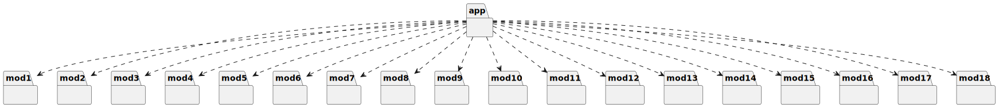

# t30013 - C++20 modules package dependencies diagram test
## Config
```yaml
diagrams:
  t30013_package:
    type: package
    glob:
      - t30013.cc
    package_type: module
    include:
      modules:
        - t30013
    using_module: t30013
```
## Source code
File `tests/t30013/t30013.cc`
```cpp
import t30013.app;
import t30013.mod1;
import t30013.mod2;
import t30013.mod3;
import t30013.mod4;
import t30013.mod5;
import t30013.mod6;
import t30013.mod7;
import t30013.mod8;
import t30013.mod9;
import t30013.mod10;
import t30013.mod11;
import t30013.mod12;
import t30013.mod13;
import t30013.mod14;
import t30013.mod15;
import t30013.mod16;
import t30013.mod17;
import t30013.mod18;

namespace clanguml::t30013 {
class R {
    CBA cba;
};
} // namespace clanguml::t30013
```
File `tests/t30013/src/mod7.cppm`
```cpp
export module t30013.mod7;

export namespace clanguml::t30013 {
struct CG { };
}
```
File `tests/t30013/src/mod11.cppm`
```cpp
export module t30013.mod11;

export namespace clanguml::t30013 {
struct CK { };
}
```
File `tests/t30013/src/mod17.cppm`
```cpp
export module t30013.mod17;

export namespace clanguml::t30013 {
struct CR { };
}
```
File `tests/t30013/src/mod16.cppm`
```cpp
export module t30013.mod16;

export namespace clanguml::t30013 {
struct CP { };
}
```
File `tests/t30013/src/mod10.cppm`
```cpp
export module t30013.mod10;

export namespace clanguml::t30013 {
struct CJ { };
}
```
File `tests/t30013/src/mod4.cppm`
```cpp
export module t30013.mod4;

export namespace clanguml::t30013 {
struct CD { };
}
```
File `tests/t30013/src/mod1.cppm`
```cpp
export module t30013.mod1;

export namespace clanguml::t30013 {
struct CA { };
}
```
File `tests/t30013/src/app.cppm`
```cpp
module;

#include <array>
#include <map>
#include <memory>
#include <string>
#include <vector>

export module t30013.app;

import t30013.mod1;
import t30013.mod2;
import t30013.mod3;
import t30013.mod4;
import t30013.mod5;
import t30013.mod6;
import t30013.mod7;
import t30013.mod8;
import t30013.mod9;
import t30013.mod10;
import t30013.mod11;
import t30013.mod12;
import t30013.mod13;
import t30013.mod14;
import t30013.mod15;
import t30013.mod16;
import t30013.mod17;
import t30013.mod18;

export namespace clanguml::t30013 {

class CBA : public CF {
public:
    CA *ca_;
    CB<int> cb_;
    std::shared_ptr<CC> cc_;
    std::map<std::string, std::unique_ptr<CD>> *cd_;
    std::array<CO, 5> co_;
    static CP *cp_;

    CBA() = default;

    CBA(CN *cn) { }

    friend CR;

    template <typename... Item> CBA(std::tuple<Item...> &items) { }

    void ce(const std::vector<CE> /*ce_*/) { }

    std::shared_ptr<CG> cg() { return {}; }

    template <typename T> void ch(std::map<T, std::shared_ptr<CH>> &ch_) { }

    template <typename T> std::map<T, std::shared_ptr<CI>> ci(T * /*t*/)
    {
        return {};
    }

    S s;
};

void cj(std::unique_ptr<CJ> /*cj_*/) { }

std::unique_ptr<CK> ck() { return {}; }

template <typename T> void cl(std::map<T, std::shared_ptr<CL>> & /*ch_*/) { }

template <typename T> std::map<T, std::shared_ptr<CM>> cm() { return {}; }

} // namespace clanguml::t30013
```
File `tests/t30013/src/mod13.cppm`
```cpp
export module t30013.mod13;

export namespace clanguml::t30013 {
struct CM { };
}
```
File `tests/t30013/src/mod9.cppm`
```cpp
export module t30013.mod9;

export namespace clanguml::t30013 {
struct CI { };
}
```
File `tests/t30013/src/mod5.cppm`
```cpp
export module t30013.mod5;

export namespace clanguml::t30013 {
struct CE { };
}
```
File `tests/t30013/src/mod18.cppm`
```cpp
export module t30013.mod18;

export namespace clanguml::t30013 {
enum class S { s1, s2, s3 };
}
```
File `tests/t30013/src/mod2.cppm`
```cpp
export module t30013.mod2;

export namespace clanguml::t30013 {
template <typename T> struct CB {
    T cb;
};
}
```
File `tests/t30013/src/mod14.cppm`
```cpp
export module t30013.mod14;

export namespace clanguml::t30013 {
struct CN { };
}
```
File `tests/t30013/src/mod12.cppm`
```cpp
export module t30013.mod12;

export namespace clanguml::t30013 {
struct CL { };
}
```
File `tests/t30013/src/mod6.cppm`
```cpp
export module t30013.mod6;

export namespace clanguml::t30013 {
struct CF { };
}
```
File `tests/t30013/src/mod8.cppm`
```cpp
export module t30013.mod8;

export namespace clanguml::t30013 {
struct CH { };
}
```
File `tests/t30013/src/mod3.cppm`
```cpp
export module t30013.mod3;

export namespace clanguml::t30013 {
struct CC { };
}
```
File `tests/t30013/src/mod15.cppm`
```cpp
export module t30013.mod15;

export namespace clanguml::t30013 {
struct CO { };
}
```
## Generated PlantUML diagrams

## Generated Mermaid diagrams

## Generated JSON models
```json
{
  "diagram_type": "package",
  "elements": [
    {
      "display_name": "mod1",
      "id": "16354370259755556752",
      "is_deprecated": false,
      "name": "mod1",
      "namespace": "t30013",
      "source_location": {
        "column": 8,
        "file": "src/mod1.cppm",
        "line": 4,
        "translation_unit": "t30013.cc"
      },
      "type": "module"
    },
    {
      "display_name": "mod2",
      "id": "12261981417433734998",
      "is_deprecated": false,
      "name": "mod2",
      "namespace": "t30013",
      "source_location": {
        "column": 30,
        "file": "src/mod2.cppm",
        "line": 4,
        "translation_unit": "t30013.cc"
      },
      "type": "module"
    },
    {
      "display_name": "mod3",
      "id": "17449695885156764068",
      "is_deprecated": false,
      "name": "mod3",
      "namespace": "t30013",
      "source_location": {
        "column": 8,
        "file": "src/mod3.cppm",
        "line": 4,
        "translation_unit": "t30013.cc"
      },
      "type": "module"
    },
    {
      "display_name": "mod4",
      "id": "15956600742249650841",
      "is_deprecated": false,
      "name": "mod4",
      "namespace": "t30013",
      "source_location": {
        "column": 8,
        "file": "src/mod4.cppm",
        "line": 4,
        "translation_unit": "t30013.cc"
      },
      "type": "module"
    },
    {
      "display_name": "mod5",
      "id": "668374793965413715",
      "is_deprecated": false,
      "name": "mod5",
      "namespace": "t30013",
      "source_location": {
        "column": 8,
        "file": "src/mod5.cppm",
        "line": 4,
        "translation_unit": "t30013.cc"
      },
      "type": "module"
    },
    {
      "display_name": "mod6",
      "id": "3532962956793359726",
      "is_deprecated": false,
      "name": "mod6",
      "namespace": "t30013",
      "source_location": {
        "column": 8,
        "file": "src/mod6.cppm",
        "line": 4,
        "translation_unit": "t30013.cc"
      },
      "type": "module"
    },
    {
      "display_name": "mod7",
      "id": "6691481082218553213",
      "is_deprecated": false,
      "name": "mod7",
      "namespace": "t30013",
      "source_location": {
        "column": 8,
        "file": "src/mod7.cppm",
        "line": 4,
        "translation_unit": "t30013.cc"
      },
      "type": "module"
    },
    {
      "display_name": "mod8",
      "id": "3366323606953772100",
      "is_deprecated": false,
      "name": "mod8",
      "namespace": "t30013",
      "source_location": {
        "column": 8,
        "file": "src/mod8.cppm",
        "line": 4,
        "translation_unit": "t30013.cc"
      },
      "type": "module"
    },
    {
      "display_name": "mod9",
      "id": "3171967637463918724",
      "is_deprecated": false,
      "name": "mod9",
      "namespace": "t30013",
      "source_location": {
        "column": 8,
        "file": "src/mod9.cppm",
        "line": 4,
        "translation_unit": "t30013.cc"
      },
      "type": "module"
    },
    {
      "display_name": "mod10",
      "id": "17417302768367072513",
      "is_deprecated": false,
      "name": "mod10",
      "namespace": "t30013",
      "source_location": {
        "column": 8,
        "file": "src/mod10.cppm",
        "line": 4,
        "translation_unit": "t30013.cc"
      },
      "type": "module"
    },
    {
      "display_name": "mod11",
      "id": "11319093924020824163",
      "is_deprecated": false,
      "name": "mod11",
      "namespace": "t30013",
      "source_location": {
        "column": 8,
        "file": "src/mod11.cppm",
        "line": 4,
        "translation_unit": "t30013.cc"
      },
      "type": "module"
    },
    {
      "display_name": "mod12",
      "id": "10499516697614746202",
      "is_deprecated": false,
      "name": "mod12",
      "namespace": "t30013",
      "source_location": {
        "column": 8,
        "file": "src/mod12.cppm",
        "line": 4,
        "translation_unit": "t30013.cc"
      },
      "type": "module"
    },
    {
      "display_name": "mod13",
      "id": "8702094278482792177",
      "is_deprecated": false,
      "name": "mod13",
      "namespace": "t30013",
      "source_location": {
        "column": 8,
        "file": "src/mod13.cppm",
        "line": 4,
        "translation_unit": "t30013.cc"
      },
      "type": "module"
    },
    {
      "display_name": "mod14",
      "id": "4907284671342522495",
      "is_deprecated": false,
      "name": "mod14",
      "namespace": "t30013",
      "source_location": {
        "column": 8,
        "file": "src/mod14.cppm",
        "line": 4,
        "translation_unit": "t30013.cc"
      },
      "type": "module"
    },
    {
      "display_name": "mod15",
      "id": "9815610442040805091",
      "is_deprecated": false,
      "name": "mod15",
      "namespace": "t30013",
      "source_location": {
        "column": 8,
        "file": "src/mod15.cppm",
        "line": 4,
        "translation_unit": "t30013.cc"
      },
      "type": "module"
    },
    {
      "display_name": "mod16",
      "id": "15454545641416021896",
      "is_deprecated": false,
      "name": "mod16",
      "namespace": "t30013",
      "source_location": {
        "column": 8,
        "file": "src/mod16.cppm",
        "line": 4,
        "translation_unit": "t30013.cc"
      },
      "type": "module"
    },
    {
      "display_name": "mod17",
      "id": "15637586295358470019",
      "is_deprecated": false,
      "name": "mod17",
      "namespace": "t30013",
      "source_location": {
        "column": 8,
        "file": "src/mod17.cppm",
        "line": 4,
        "translation_unit": "t30013.cc"
      },
      "type": "module"
    },
    {
      "display_name": "mod18",
      "id": "7875093953356543116",
      "is_deprecated": false,
      "name": "mod18",
      "namespace": "t30013",
      "source_location": {
        "column": 12,
        "file": "src/mod18.cppm",
        "line": 4,
        "translation_unit": "t30013.cc"
      },
      "type": "module"
    },
    {
      "display_name": "app",
      "id": "361788263763984082",
      "is_deprecated": false,
      "name": "app",
      "namespace": "t30013",
      "source_location": {
        "column": 7,
        "file": "src/app.cppm",
        "line": 32,
        "translation_unit": "t30013.cc"
      },
      "type": "module"
    }
  ],
  "name": "t30013_package",
  "package_type": "module",
  "relationships": [
    {
      "destination": "3366323606953772100",
      "source": "361788263763984082",
      "type": "dependency"
    },
    {
      "destination": "3171967637463918724",
      "source": "361788263763984082",
      "type": "dependency"
    },
    {
      "destination": "16354370259755556752",
      "source": "361788263763984082",
      "type": "dependency"
    },
    {
      "destination": "12261981417433734998",
      "source": "361788263763984082",
      "type": "dependency"
    },
    {
      "destination": "17449695885156764068",
      "source": "361788263763984082",
      "type": "dependency"
    },
    {
      "destination": "15956600742249650841",
      "source": "361788263763984082",
      "type": "dependency"
    },
    {
      "destination": "9815610442040805091",
      "source": "361788263763984082",
      "type": "dependency"
    },
    {
      "destination": "7875093953356543116",
      "source": "361788263763984082",
      "type": "dependency"
    },
    {
      "destination": "15454545641416021896",
      "source": "361788263763984082",
      "type": "dependency"
    },
    {
      "destination": "4907284671342522495",
      "source": "361788263763984082",
      "type": "dependency"
    },
    {
      "destination": "668374793965413715",
      "source": "361788263763984082",
      "type": "dependency"
    },
    {
      "destination": "6691481082218553213",
      "source": "361788263763984082",
      "type": "dependency"
    },
    {
      "destination": "15637586295358470019",
      "source": "361788263763984082",
      "type": "dependency"
    },
    {
      "destination": "3532962956793359726",
      "source": "361788263763984082",
      "type": "dependency"
    },
    {
      "destination": "17417302768367072513",
      "source": "361788263763984082",
      "type": "dependency"
    },
    {
      "destination": "11319093924020824163",
      "source": "361788263763984082",
      "type": "dependency"
    },
    {
      "destination": "10499516697614746202",
      "source": "361788263763984082",
      "type": "dependency"
    },
    {
      "destination": "8702094278482792177",
      "source": "361788263763984082",
      "type": "dependency"
    }
  ],
  "using_module": "t30013"
}
```
## Generated GraphML models
```xml
<?xml version="1.0"?>
<graphml xmlns="http://graphml.graphdrawing.org/xmlns" xmlns:xsi="http://www.w3.org/2001/XMLSchema-instance" xsi:schemaLocation="http://graphml.graphdrawing.org/xmlns http://graphml.graphdrawing.org/xmlns/1.0/graphml.xsd">
 <key attr.name="id" attr.type="string" for="graph" id="gd0" />
 <key attr.name="diagram_type" attr.type="string" for="graph" id="gd1" />
 <key attr.name="name" attr.type="string" for="graph" id="gd2" />
 <key attr.name="using_namespace" attr.type="string" for="graph" id="gd3" />
 <key attr.name="id" attr.type="string" for="node" id="nd0" />
 <key attr.name="type" attr.type="string" for="node" id="nd1" />
 <key attr.name="name" attr.type="string" for="node" id="nd2" />
 <key attr.name="stereotype" attr.type="string" for="node" id="nd3" />
 <key attr.name="url" attr.type="string" for="node" id="nd4" />
 <key attr.name="tooltip" attr.type="string" for="node" id="nd5" />
 <key attr.name="type" attr.type="string" for="edge" id="ed0" />
 <key attr.name="access" attr.type="string" for="edge" id="ed1" />
 <key attr.name="label" attr.type="string" for="edge" id="ed2" />
 <key attr.name="url" attr.type="string" for="edge" id="ed3" />
 <graph id="g0" edgedefault="directed" parse.nodeids="canonical" parse.edgeids="canonical" parse.order="nodesfirst">
  <node id="n0">
   <data key="nd2">mod1</data>
   <data key="nd1">module</data>
   <data key="nd4">https://github.com/bkryza/clang-uml/blob/669b30ea491fc93aa680d5303b8c092431ff11ce/tests/t30013/src/mod1.cppm#L4</data>
   <data key="nd5">mod1</data>
   <graph id="g1" edgedefault="directed" parse.nodeids="canonical" parse.edgeids="canonical" parse.order="nodesfirst" />
  </node>
  <node id="n1">
   <data key="nd2">mod2</data>
   <data key="nd1">module</data>
   <data key="nd4">https://github.com/bkryza/clang-uml/blob/669b30ea491fc93aa680d5303b8c092431ff11ce/tests/t30013/src/mod2.cppm#L4</data>
   <data key="nd5">mod2</data>
   <graph id="g2" edgedefault="directed" parse.nodeids="canonical" parse.edgeids="canonical" parse.order="nodesfirst" />
  </node>
  <node id="n2">
   <data key="nd2">mod3</data>
   <data key="nd1">module</data>
   <data key="nd4">https://github.com/bkryza/clang-uml/blob/669b30ea491fc93aa680d5303b8c092431ff11ce/tests/t30013/src/mod3.cppm#L4</data>
   <data key="nd5">mod3</data>
   <graph id="g3" edgedefault="directed" parse.nodeids="canonical" parse.edgeids="canonical" parse.order="nodesfirst" />
  </node>
  <node id="n3">
   <data key="nd2">mod4</data>
   <data key="nd1">module</data>
   <data key="nd4">https://github.com/bkryza/clang-uml/blob/669b30ea491fc93aa680d5303b8c092431ff11ce/tests/t30013/src/mod4.cppm#L4</data>
   <data key="nd5">mod4</data>
   <graph id="g4" edgedefault="directed" parse.nodeids="canonical" parse.edgeids="canonical" parse.order="nodesfirst" />
  </node>
  <node id="n4">
   <data key="nd2">mod5</data>
   <data key="nd1">module</data>
   <data key="nd4">https://github.com/bkryza/clang-uml/blob/669b30ea491fc93aa680d5303b8c092431ff11ce/tests/t30013/src/mod5.cppm#L4</data>
   <data key="nd5">mod5</data>
   <graph id="g5" edgedefault="directed" parse.nodeids="canonical" parse.edgeids="canonical" parse.order="nodesfirst" />
  </node>
  <node id="n5">
   <data key="nd2">mod6</data>
   <data key="nd1">module</data>
   <data key="nd4">https://github.com/bkryza/clang-uml/blob/669b30ea491fc93aa680d5303b8c092431ff11ce/tests/t30013/src/mod6.cppm#L4</data>
   <data key="nd5">mod6</data>
   <graph id="g6" edgedefault="directed" parse.nodeids="canonical" parse.edgeids="canonical" parse.order="nodesfirst" />
  </node>
  <node id="n6">
   <data key="nd2">mod7</data>
   <data key="nd1">module</data>
   <data key="nd4">https://github.com/bkryza/clang-uml/blob/669b30ea491fc93aa680d5303b8c092431ff11ce/tests/t30013/src/mod7.cppm#L4</data>
   <data key="nd5">mod7</data>
   <graph id="g7" edgedefault="directed" parse.nodeids="canonical" parse.edgeids="canonical" parse.order="nodesfirst" />
  </node>
  <node id="n7">
   <data key="nd2">mod8</data>
   <data key="nd1">module</data>
   <data key="nd4">https://github.com/bkryza/clang-uml/blob/669b30ea491fc93aa680d5303b8c092431ff11ce/tests/t30013/src/mod8.cppm#L4</data>
   <data key="nd5">mod8</data>
   <graph id="g8" edgedefault="directed" parse.nodeids="canonical" parse.edgeids="canonical" parse.order="nodesfirst" />
  </node>
  <node id="n8">
   <data key="nd2">mod9</data>
   <data key="nd1">module</data>
   <data key="nd4">https://github.com/bkryza/clang-uml/blob/669b30ea491fc93aa680d5303b8c092431ff11ce/tests/t30013/src/mod9.cppm#L4</data>
   <data key="nd5">mod9</data>
   <graph id="g9" edgedefault="directed" parse.nodeids="canonical" parse.edgeids="canonical" parse.order="nodesfirst" />
  </node>
  <node id="n9">
   <data key="nd2">mod10</data>
   <data key="nd1">module</data>
   <data key="nd4">https://github.com/bkryza/clang-uml/blob/669b30ea491fc93aa680d5303b8c092431ff11ce/tests/t30013/src/mod10.cppm#L4</data>
   <data key="nd5">mod10</data>
   <graph id="g10" edgedefault="directed" parse.nodeids="canonical" parse.edgeids="canonical" parse.order="nodesfirst" />
  </node>
  <node id="n10">
   <data key="nd2">mod11</data>
   <data key="nd1">module</data>
   <data key="nd4">https://github.com/bkryza/clang-uml/blob/669b30ea491fc93aa680d5303b8c092431ff11ce/tests/t30013/src/mod11.cppm#L4</data>
   <data key="nd5">mod11</data>
   <graph id="g11" edgedefault="directed" parse.nodeids="canonical" parse.edgeids="canonical" parse.order="nodesfirst" />
  </node>
  <node id="n11">
   <data key="nd2">mod12</data>
   <data key="nd1">module</data>
   <data key="nd4">https://github.com/bkryza/clang-uml/blob/669b30ea491fc93aa680d5303b8c092431ff11ce/tests/t30013/src/mod12.cppm#L4</data>
   <data key="nd5">mod12</data>
   <graph id="g12" edgedefault="directed" parse.nodeids="canonical" parse.edgeids="canonical" parse.order="nodesfirst" />
  </node>
  <node id="n12">
   <data key="nd2">mod13</data>
   <data key="nd1">module</data>
   <data key="nd4">https://github.com/bkryza/clang-uml/blob/669b30ea491fc93aa680d5303b8c092431ff11ce/tests/t30013/src/mod13.cppm#L4</data>
   <data key="nd5">mod13</data>
   <graph id="g13" edgedefault="directed" parse.nodeids="canonical" parse.edgeids="canonical" parse.order="nodesfirst" />
  </node>
  <node id="n13">
   <data key="nd2">mod14</data>
   <data key="nd1">module</data>
   <data key="nd4">https://github.com/bkryza/clang-uml/blob/669b30ea491fc93aa680d5303b8c092431ff11ce/tests/t30013/src/mod14.cppm#L4</data>
   <data key="nd5">mod14</data>
   <graph id="g14" edgedefault="directed" parse.nodeids="canonical" parse.edgeids="canonical" parse.order="nodesfirst" />
  </node>
  <node id="n14">
   <data key="nd2">mod15</data>
   <data key="nd1">module</data>
   <data key="nd4">https://github.com/bkryza/clang-uml/blob/669b30ea491fc93aa680d5303b8c092431ff11ce/tests/t30013/src/mod15.cppm#L4</data>
   <data key="nd5">mod15</data>
   <graph id="g15" edgedefault="directed" parse.nodeids="canonical" parse.edgeids="canonical" parse.order="nodesfirst" />
  </node>
  <node id="n15">
   <data key="nd2">mod16</data>
   <data key="nd1">module</data>
   <data key="nd4">https://github.com/bkryza/clang-uml/blob/669b30ea491fc93aa680d5303b8c092431ff11ce/tests/t30013/src/mod16.cppm#L4</data>
   <data key="nd5">mod16</data>
   <graph id="g16" edgedefault="directed" parse.nodeids="canonical" parse.edgeids="canonical" parse.order="nodesfirst" />
  </node>
  <node id="n16">
   <data key="nd2">mod17</data>
   <data key="nd1">module</data>
   <data key="nd4">https://github.com/bkryza/clang-uml/blob/669b30ea491fc93aa680d5303b8c092431ff11ce/tests/t30013/src/mod17.cppm#L4</data>
   <data key="nd5">mod17</data>
   <graph id="g17" edgedefault="directed" parse.nodeids="canonical" parse.edgeids="canonical" parse.order="nodesfirst" />
  </node>
  <node id="n17">
   <data key="nd2">mod18</data>
   <data key="nd1">module</data>
   <data key="nd4">https://github.com/bkryza/clang-uml/blob/669b30ea491fc93aa680d5303b8c092431ff11ce/tests/t30013/src/mod18.cppm#L4</data>
   <data key="nd5">mod18</data>
   <graph id="g18" edgedefault="directed" parse.nodeids="canonical" parse.edgeids="canonical" parse.order="nodesfirst" />
  </node>
  <node id="n18">
   <data key="nd2">app</data>
   <data key="nd1">module</data>
   <data key="nd4">https://github.com/bkryza/clang-uml/blob/669b30ea491fc93aa680d5303b8c092431ff11ce/tests/t30013/src/app.cppm#L32</data>
   <data key="nd5">app</data>
   <graph id="g19" edgedefault="directed" parse.nodeids="canonical" parse.edgeids="canonical" parse.order="nodesfirst" />
  </node>
  <edge id="e0" source="n18" target="n7">
   <data key="ed0">dependency</data>
  </edge>
  <edge id="e1" source="n18" target="n8">
   <data key="ed0">dependency</data>
  </edge>
  <edge id="e2" source="n18" target="n0">
   <data key="ed0">dependency</data>
  </edge>
  <edge id="e3" source="n18" target="n1">
   <data key="ed0">dependency</data>
  </edge>
  <edge id="e4" source="n18" target="n2">
   <data key="ed0">dependency</data>
  </edge>
  <edge id="e5" source="n18" target="n3">
   <data key="ed0">dependency</data>
  </edge>
  <edge id="e6" source="n18" target="n14">
   <data key="ed0">dependency</data>
  </edge>
  <edge id="e7" source="n18" target="n17">
   <data key="ed0">dependency</data>
  </edge>
  <edge id="e8" source="n18" target="n15">
   <data key="ed0">dependency</data>
  </edge>
  <edge id="e9" source="n18" target="n13">
   <data key="ed0">dependency</data>
  </edge>
  <edge id="e10" source="n18" target="n4">
   <data key="ed0">dependency</data>
  </edge>
  <edge id="e11" source="n18" target="n6">
   <data key="ed0">dependency</data>
  </edge>
  <edge id="e12" source="n18" target="n16">
   <data key="ed0">dependency</data>
  </edge>
  <edge id="e13" source="n18" target="n5">
   <data key="ed0">dependency</data>
  </edge>
  <edge id="e14" source="n18" target="n9">
   <data key="ed0">dependency</data>
  </edge>
  <edge id="e15" source="n18" target="n10">
   <data key="ed0">dependency</data>
  </edge>
  <edge id="e16" source="n18" target="n11">
   <data key="ed0">dependency</data>
  </edge>
  <edge id="e17" source="n18" target="n12">
   <data key="ed0">dependency</data>
  </edge>
 </graph>
</graphml>

```
