# t30014 - C++20 modules package diagram test with partitions
## Config
```yaml
diagrams:
  t30014_package:
    type: package
    glob:
      - t30014.cc
    package_type: module
    include:
      modules:
        - t30014
    exclude:
      modules:
        - t30014.app:lib1.mod2
    using_module: t30014
```
## Source code
File `tests/t30014/t30014.cc`
```cpp
import t30014.app;

namespace clanguml {
namespace t30014 {
}
}
```
File `tests/t30014/src/lib1mod2.cppm`
```cpp
export module t30014.app:lib1.mod2;

export namespace clanguml::t30014 {
class E { };
} // namespace clanguml::t30014
```
File `tests/t30014/src/t30014_mod.cppm`
```cpp
export module t30014.app;
import :lib1;
import :lib1.mod1;
import :lib1.mod2;
import :lib2;

export namespace clanguml::t30014 {
class A {
    int get() { return a; }

    int a;
};
} // namespace clanguml::t30014
```
File `tests/t30014/src/lib2.cppm`
```cpp
export module t30014.app:lib2;

export namespace clanguml::t30014 {
class C { };

template <typename T> class CC {
    T t;
};

namespace detail {
enum class CCC { ccc1, ccc2 };
} // namespace detail
} // namespace clanguml::t30014
```
File `tests/t30014/src/lib1.cppm`
```cpp
export module t30014.app:lib1;

export namespace clanguml::t30014 {
class B { };

template <typename T> class BB {
    T t;
};

namespace detail {
enum class BBB { bbb1, bbb2 };
} // namespace detail
} // namespace clanguml::t30014
```
File `tests/t30014/src/lib1mod1.cppm`
```cpp
export module t30014.app:lib1.mod1;

export namespace clanguml::t30014 {
class D { };
} // namespace clanguml::t30014
```
## Generated PlantUML diagrams

## Generated Mermaid diagrams

## Generated JSON models
```json
{
  "diagram_type": "package",
  "elements": [
    {
      "display_name": "app",
      "elements": [
        {
          "display_name": ":lib1",
          "elements": [
            {
              "display_name": "mod1",
              "id": "2034114360803168801",
              "is_deprecated": false,
              "name": "mod1",
              "namespace": "t30014.app:lib1",
              "source_location": {
                "column": 7,
                "file": "src/lib1mod1.cppm",
                "line": 4,
                "translation_unit": "t30014.cc"
              },
              "type": "module"
            }
          ],
          "id": "1618985722491582169",
          "is_deprecated": false,
          "name": ":lib1",
          "namespace": "t30014.app",
          "source_location": {
            "column": 7,
            "file": "src/lib1.cppm",
            "line": 4,
            "translation_unit": "t30014.cc"
          },
          "type": "module"
        },
        {
          "display_name": ":lib2",
          "id": "1569901875704270760",
          "is_deprecated": false,
          "name": ":lib2",
          "namespace": "t30014.app",
          "source_location": {
            "column": 7,
            "file": "src/lib2.cppm",
            "line": 4,
            "translation_unit": "t30014.cc"
          },
          "type": "module"
        }
      ],
      "id": "1932503454610788726",
      "is_deprecated": false,
      "name": "app",
      "namespace": "t30014",
      "type": "module"
    }
  ],
  "name": "t30014_package",
  "package_type": "module",
  "relationships": [],
  "using_module": "t30014"
}
```
