# t30015 - C++20 modules package diagram test with partition dependencies
## Config
```yaml
diagrams:
  t30015_package:
    type: package
    glob:
      - t30015.cc
    package_type: module
    include:
      modules:
        - t30015
    using_module: t30015
```
## Source code
File `tests/t30015/t30015.cc`
```cpp
import t30015.app;

namespace clanguml {
namespace t30015 {
}
}
```
File `tests/t30015/src/mod7.cppm`
```cpp
export module t30015.lib1:mod7;

export namespace clanguml::t30015 {
struct CG { };
}
```
File `tests/t30015/src/mod11.cppm`
```cpp
export module t30015.lib1:mod11;

export namespace clanguml::t30015 {
struct CK { };
}
```
File `tests/t30015/src/mod17.cppm`
```cpp
export module t30015.lib1:mod17;

export namespace clanguml::t30015 {
struct CR { };
}
```
File `tests/t30015/src/mod16.cppm`
```cpp
export module t30015.lib1:mod16;

export namespace clanguml::t30015 {
struct CP { };
}
```
File `tests/t30015/src/mod10.cppm`
```cpp
export module t30015.lib1:mod10;

export namespace clanguml::t30015 {
struct CJ { };
}
```
File `tests/t30015/src/mod4.cppm`
```cpp
export module t30015.lib1:mod4;

export namespace clanguml::t30015 {
struct CD { };
}
```
File `tests/t30015/src/mod1.cppm`
```cpp
export module t30015.lib1:mod1;

export namespace clanguml::t30015 {
struct CA { };
}
```
File `tests/t30015/src/app.cppm`
```cpp
module;

#include <array>
#include <map>
#include <memory>
#include <string>
#include <vector>

export module t30015.app;
import t30015.lib1;

// import t30015.app;
// import t30015.mod2;
// import t30015.mod3;
// import t30015.mod4;
// import t30015.mod5;
// import t30015.mod6;
// import t30015.mod7;
// import t30015.mod8;
// import t30015.mod9;
// import t30015.mod10;
// import t30015.mod11;
// import t30015.mod12;
// import t30015.mod13;
// import t30015.mod14;
// import t30015.mod15;
// import t30015.mod16;
// import t30015.mod17;
// import t30015.mod18;

export namespace clanguml::t30015 {

class CBA : public CF {
public:
    CA *ca_;
    CB<int> cb_;
    std::shared_ptr<CC> cc_;
    std::map<std::string, std::unique_ptr<CD>> *cd_;
    std::array<CO, 5> co_;
    static CP *cp_;

    CBA() = default;

    CBA(CN *cn) { }

    friend CR;

    template <typename... Item> CBA(std::tuple<Item...> &items) { }

    void ce(const std::vector<CE> /*ce_*/) { }

    std::shared_ptr<CG> cg() { return {}; }

    template <typename T> void ch(std::map<T, std::shared_ptr<CH>> &ch_) { }

    template <typename T> std::map<T, std::shared_ptr<CI>> ci(T * /*t*/)
    {
        return {};
    }

    S s;
};

void cj(std::unique_ptr<CJ> /*cj_*/) { }

std::unique_ptr<CK> ck() { return {}; }

template <typename T> void cl(std::map<T, std::shared_ptr<CL>> & /*ch_*/) { }

template <typename T> std::map<T, std::shared_ptr<CM>> cm() { return {}; }

} // namespace clanguml::t30013
```
File `tests/t30015/src/mod13.cppm`
```cpp
export module t30015.lib1:mod13;

export namespace clanguml::t30015 {
struct CM { };
}
```
File `tests/t30015/src/mod9.cppm`
```cpp
export module t30015.lib1:mod9;

export namespace clanguml::t30015 {
struct CI { };
}
```
File `tests/t30015/src/mod5.cppm`
```cpp
export module t30015.lib1:mod5;

export namespace clanguml::t30015 {
struct CE { };
}
```
File `tests/t30015/src/mod18.cppm`
```cpp
export module t30015.lib1:mod18;

export namespace clanguml::t30015 {
enum class S { s1, s2, s3 };
}
```
File `tests/t30015/src/mod2.cppm`
```cpp
export module t30015.lib1:mod2;

export namespace clanguml::t30015 {
template <typename T> struct CB {
    T cb;
};
}
```
File `tests/t30015/src/mod14.cppm`
```cpp
export module t30015.lib1:mod14;

export namespace clanguml::t30015 {
struct CN { };
}
```
File `tests/t30015/src/mod12.cppm`
```cpp
export module t30015.lib1:mod12;

export namespace clanguml::t30015 {
struct CL { };
}
```
File `tests/t30015/src/mod6.cppm`
```cpp
export module t30015.lib1:mod6;

export namespace clanguml::t30015 {
struct CF { };
}
```
File `tests/t30015/src/mod8.cppm`
```cpp
export module t30015.lib1:mod8;

export namespace clanguml::t30015 {
struct CH { };
}
```
File `tests/t30015/src/mod3.cppm`
```cpp
export module t30015.lib1:mod3;

export namespace clanguml::t30015 {
struct CC { };
}
```
File `tests/t30015/src/lib1.cppm`
```cpp
export module t30015.lib1;

export import :mod1;
export import :mod2;
export import :mod3;
export import :mod4;
export import :mod5;
export import :mod6;
export import :mod7;
export import :mod8;
export import :mod9;
export import :mod10;
export import :mod11;
export import :mod12;
export import :mod13;
export import :mod14;
export import :mod15;
export import :mod16;
export import :mod17;
export import :mod18;

export namespace clanguml::t30015 {

}
```
File `tests/t30015/src/mod15.cppm`
```cpp
export module t30015.lib1:mod15;

export namespace clanguml::t30015 {
struct CO { };
}
```
## Generated PlantUML diagrams

## Generated Mermaid diagrams

## Generated JSON models
```json
{
  "diagram_type": "package",
  "elements": [
    {
      "display_name": "lib1",
      "elements": [
        {
          "display_name": ":mod1",
          "id": "2078789731210233181",
          "is_deprecated": false,
          "name": ":mod1",
          "namespace": "t30015.lib1",
          "source_location": {
            "column": 8,
            "file": "src/mod1.cppm",
            "line": 4,
            "translation_unit": "t30015.cc"
          },
          "type": "module"
        },
        {
          "display_name": ":mod2",
          "id": "108157285110421434",
          "is_deprecated": false,
          "name": ":mod2",
          "namespace": "t30015.lib1",
          "source_location": {
            "column": 30,
            "file": "src/mod2.cppm",
            "line": 4,
            "translation_unit": "t30015.cc"
          },
          "type": "module"
        },
        {
          "display_name": ":mod3",
          "id": "1466337333501241721",
          "is_deprecated": false,
          "name": ":mod3",
          "namespace": "t30015.lib1",
          "source_location": {
            "column": 8,
            "file": "src/mod3.cppm",
            "line": 4,
            "translation_unit": "t30015.cc"
          },
          "type": "module"
        },
        {
          "display_name": ":mod4",
          "id": "2181077882404368936",
          "is_deprecated": false,
          "name": ":mod4",
          "namespace": "t30015.lib1",
          "source_location": {
            "column": 8,
            "file": "src/mod4.cppm",
            "line": 4,
            "translation_unit": "t30015.cc"
          },
          "type": "module"
        },
        {
          "display_name": ":mod5",
          "id": "1045004042628075747",
          "is_deprecated": false,
          "name": ":mod5",
          "namespace": "t30015.lib1",
          "source_location": {
            "column": 8,
            "file": "src/mod5.cppm",
            "line": 4,
            "translation_unit": "t30015.cc"
          },
          "type": "module"
        },
        {
          "display_name": ":mod6",
          "id": "536067780214444138",
          "is_deprecated": false,
          "name": ":mod6",
          "namespace": "t30015.lib1",
          "source_location": {
            "column": 8,
            "file": "src/mod6.cppm",
            "line": 4,
            "translation_unit": "t30015.cc"
          },
          "type": "module"
        },
        {
          "display_name": ":mod7",
          "id": "1678616733221858020",
          "is_deprecated": false,
          "name": ":mod7",
          "namespace": "t30015.lib1",
          "source_location": {
            "column": 8,
            "file": "src/mod7.cppm",
            "line": 4,
            "translation_unit": "t30015.cc"
          },
          "type": "module"
        },
        {
          "display_name": ":mod8",
          "id": "240013230569803405",
          "is_deprecated": false,
          "name": ":mod8",
          "namespace": "t30015.lib1",
          "source_location": {
            "column": 8,
            "file": "src/mod8.cppm",
            "line": 4,
            "translation_unit": "t30015.cc"
          },
          "type": "module"
        },
        {
          "display_name": ":mod9",
          "id": "179175577447017767",
          "is_deprecated": false,
          "name": ":mod9",
          "namespace": "t30015.lib1",
          "source_location": {
            "column": 8,
            "file": "src/mod9.cppm",
            "line": 4,
            "translation_unit": "t30015.cc"
          },
          "type": "module"
        },
        {
          "display_name": ":mod10",
          "id": "485628131931062884",
          "is_deprecated": false,
          "name": ":mod10",
          "namespace": "t30015.lib1",
          "source_location": {
            "column": 8,
            "file": "src/mod10.cppm",
            "line": 4,
            "translation_unit": "t30015.cc"
          },
          "type": "module"
        },
        {
          "display_name": ":mod11",
          "id": "791090113373006765",
          "is_deprecated": false,
          "name": ":mod11",
          "namespace": "t30015.lib1",
          "source_location": {
            "column": 8,
            "file": "src/mod11.cppm",
            "line": 4,
            "translation_unit": "t30015.cc"
          },
          "type": "module"
        },
        {
          "display_name": ":mod12",
          "id": "500107934060144677",
          "is_deprecated": false,
          "name": ":mod12",
          "namespace": "t30015.lib1",
          "source_location": {
            "column": 8,
            "file": "src/mod12.cppm",
            "line": 4,
            "translation_unit": "t30015.cc"
          },
          "type": "module"
        },
        {
          "display_name": ":mod13",
          "id": "1195842122299166493",
          "is_deprecated": false,
          "name": ":mod13",
          "namespace": "t30015.lib1",
          "source_location": {
            "column": 8,
            "file": "src/mod13.cppm",
            "line": 4,
            "translation_unit": "t30015.cc"
          },
          "type": "module"
        },
        {
          "display_name": ":mod14",
          "id": "581129920847850526",
          "is_deprecated": false,
          "name": ":mod14",
          "namespace": "t30015.lib1",
          "source_location": {
            "column": 8,
            "file": "src/mod14.cppm",
            "line": 4,
            "translation_unit": "t30015.cc"
          },
          "type": "module"
        },
        {
          "display_name": ":mod15",
          "id": "1715856257738182160",
          "is_deprecated": false,
          "name": ":mod15",
          "namespace": "t30015.lib1",
          "source_location": {
            "column": 8,
            "file": "src/mod15.cppm",
            "line": 4,
            "translation_unit": "t30015.cc"
          },
          "type": "module"
        },
        {
          "display_name": ":mod16",
          "id": "1435303665523039114",
          "is_deprecated": false,
          "name": ":mod16",
          "namespace": "t30015.lib1",
          "source_location": {
            "column": 8,
            "file": "src/mod16.cppm",
            "line": 4,
            "translation_unit": "t30015.cc"
          },
          "type": "module"
        },
        {
          "display_name": ":mod17",
          "id": "1327885001907982070",
          "is_deprecated": false,
          "name": ":mod17",
          "namespace": "t30015.lib1",
          "source_location": {
            "column": 8,
            "file": "src/mod17.cppm",
            "line": 4,
            "translation_unit": "t30015.cc"
          },
          "type": "module"
        },
        {
          "display_name": ":mod18",
          "id": "2193691762152553973",
          "is_deprecated": false,
          "name": ":mod18",
          "namespace": "t30015.lib1",
          "source_location": {
            "column": 12,
            "file": "src/mod18.cppm",
            "line": 4,
            "translation_unit": "t30015.cc"
          },
          "type": "module"
        }
      ],
      "id": "1208975031146850353",
      "is_deprecated": false,
      "name": "lib1",
      "namespace": "t30015",
      "type": "module"
    },
    {
      "display_name": "app",
      "id": "1200268042616700255",
      "is_deprecated": false,
      "name": "app",
      "namespace": "t30015",
      "source_location": {
        "column": 7,
        "file": "src/app.cppm",
        "line": 33,
        "translation_unit": "t30015.cc"
      },
      "type": "module"
    }
  ],
  "name": "t30015_package",
  "package_type": "module",
  "relationships": [
    {
      "destination": "240013230569803405",
      "source": "1200268042616700255",
      "type": "dependency"
    },
    {
      "destination": "179175577447017767",
      "source": "1200268042616700255",
      "type": "dependency"
    },
    {
      "destination": "2078789731210233181",
      "source": "1200268042616700255",
      "type": "dependency"
    },
    {
      "destination": "108157285110421434",
      "source": "1200268042616700255",
      "type": "dependency"
    },
    {
      "destination": "1466337333501241721",
      "source": "1200268042616700255",
      "type": "dependency"
    },
    {
      "destination": "2181077882404368936",
      "source": "1200268042616700255",
      "type": "dependency"
    },
    {
      "destination": "1715856257738182160",
      "source": "1200268042616700255",
      "type": "dependency"
    },
    {
      "destination": "2193691762152553973",
      "source": "1200268042616700255",
      "type": "dependency"
    },
    {
      "destination": "1435303665523039114",
      "source": "1200268042616700255",
      "type": "dependency"
    },
    {
      "destination": "581129920847850526",
      "source": "1200268042616700255",
      "type": "dependency"
    },
    {
      "destination": "1045004042628075747",
      "source": "1200268042616700255",
      "type": "dependency"
    },
    {
      "destination": "1678616733221858020",
      "source": "1200268042616700255",
      "type": "dependency"
    },
    {
      "destination": "1327885001907982070",
      "source": "1200268042616700255",
      "type": "dependency"
    },
    {
      "destination": "536067780214444138",
      "source": "1200268042616700255",
      "type": "dependency"
    },
    {
      "destination": "485628131931062884",
      "source": "1200268042616700255",
      "type": "dependency"
    },
    {
      "destination": "791090113373006765",
      "source": "1200268042616700255",
      "type": "dependency"
    },
    {
      "destination": "500107934060144677",
      "source": "1200268042616700255",
      "type": "dependency"
    },
    {
      "destination": "1195842122299166493",
      "source": "1200268042616700255",
      "type": "dependency"
    }
  ],
  "using_module": "t30015"
}
```
