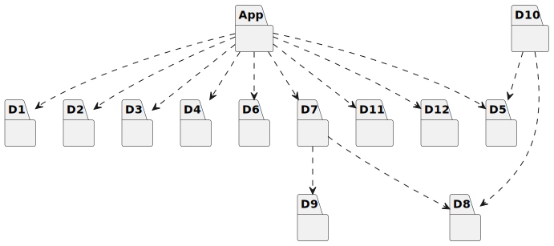

# t30016 - Objective-C directory package diagram test
## Config
```yaml
diagrams:
  t30016_package:
    type: package
    package_type: directory
    glob:
      - App/t30016.m
    include:
      paths:
        - .
```
## Source code
File `tests/t30016/D3/d3.h`
```cpp
#pragma once

struct D3 { };
```
File `tests/t30016/D2/d2.h`
```cpp
#pragma once

#include <Foundation/Foundation.h>

@interface D2 : NSObject

@end
```
File `tests/t30016/D7/d7.h`
```cpp
#pragma once

#include "../D8/d8.h"
#include "../D9/d9.h"

@protocol D7 <D9>
- (void)withD8:(D8 *)d8;
@end
```
File `tests/t30016/App/t30016.m`
```cpp
#include "../D1/d1.h"
#include "../D2/d2.h"
#include "../D3/d3.h"
#include "../D4/d4.h"
#include "../D5/d5.h"
#include "../D6/d6.h"
#include "../D7/d7.h"
#include "../D10/d10.h"
#include "../D11/d11.h"
#include "../D12/d12.h"

@interface t30016_D : NSObject<D6> {
    struct D4 *d4_;
}

@property (nonatomic, assign) D1 *d1_;
@property (nonatomic, assign) struct D3 *d3_;
@property (class, strong, nonatomic) D12 *d12;

@property (weak) id <D7> d7;

+ (void)fromD11:(D11 *)d11;
- (void)withD2:(D2 *)d2;

- (D5*)getD5;

@end
```
File `tests/t30016/D10/d10.h`
```cpp
#pragma once

#include "../D5/d5.h"
#include "../D8/d8.h"

@interface D8 (D10)
- (void)withD5:(D5 *)d5;
@end
```
File `tests/t30016/D4/d4.h`
```cpp
#pragma once

struct D4 { };
```
File `tests/t30016/D1/d1.h`
```cpp
#pragma once

#include <Foundation/Foundation.h>

@interface D1 : NSObject

@end
```
File `tests/t30016/D8/d8.h`
```cpp
#pragma once

#include <Foundation/Foundation.h>

@interface D8 : NSObject

@end
```
File `tests/t30016/D9/d9.h`
```cpp
#pragma once

@protocol D9

@end
```
File `tests/t30016/D5/d5.h`
```cpp
#pragma once

#include <Foundation/Foundation.h>

@interface D5 : NSObject

@end
```
File `tests/t30016/D6/d6.h`
```cpp
#pragma once

@protocol D6

@end
```
File `tests/t30016/D11/d11.h`
```cpp
#pragma once

#include <Foundation/Foundation.h>

@interface D11 : NSObject

@end
```
File `tests/t30016/D12/d12.h`
```cpp
#pragma once

#include <Foundation/Foundation.h>

@interface D12 : NSObject

@end
```
## Generated PlantUML diagrams

## Generated Mermaid diagrams

## Generated JSON models
```json
{
  "diagram_type": "package",
  "elements": [
    {
      "display_name": "D1",
      "id": "8145674847707809832",
      "is_deprecated": false,
      "name": "D1",
      "path": "",
      "source_location": {
        "column": 12,
        "file": "D1/d1.h",
        "line": 5,
        "translation_unit": "App/t30016.m"
      },
      "type": "directory"
    },
    {
      "display_name": "D2",
      "id": "4016670604363101459",
      "is_deprecated": false,
      "name": "D2",
      "path": "",
      "source_location": {
        "column": 12,
        "file": "D2/d2.h",
        "line": 5,
        "translation_unit": "App/t30016.m"
      },
      "type": "directory"
    },
    {
      "display_name": "D3",
      "id": "15345915066622466639",
      "is_deprecated": false,
      "name": "D3",
      "path": "",
      "source_location": {
        "column": 8,
        "file": "D3/d3.h",
        "line": 3,
        "translation_unit": "App/t30016.m"
      },
      "type": "directory"
    },
    {
      "display_name": "D4",
      "id": "9240956528654827288",
      "is_deprecated": false,
      "name": "D4",
      "path": "",
      "source_location": {
        "column": 8,
        "file": "D4/d4.h",
        "line": 3,
        "translation_unit": "App/t30016.m"
      },
      "type": "directory"
    },
    {
      "display_name": "D5",
      "id": "15274359154554496283",
      "is_deprecated": false,
      "name": "D5",
      "path": "",
      "source_location": {
        "column": 12,
        "file": "D5/d5.h",
        "line": 5,
        "translation_unit": "App/t30016.m"
      },
      "type": "directory"
    },
    {
      "display_name": "D6",
      "id": "9096403707992398714",
      "is_deprecated": false,
      "name": "D6",
      "path": "",
      "source_location": {
        "column": 11,
        "file": "D6/d6.h",
        "line": 3,
        "translation_unit": "App/t30016.m"
      },
      "type": "directory"
    },
    {
      "display_name": "D8",
      "id": "13646440721401523685",
      "is_deprecated": false,
      "name": "D8",
      "path": "",
      "source_location": {
        "column": 12,
        "file": "D8/d8.h",
        "line": 5,
        "translation_unit": "App/t30016.m"
      },
      "type": "directory"
    },
    {
      "display_name": "D9",
      "id": "6045708087941638182",
      "is_deprecated": false,
      "name": "D9",
      "path": "",
      "source_location": {
        "column": 11,
        "file": "D9/d9.h",
        "line": 3,
        "translation_unit": "App/t30016.m"
      },
      "type": "directory"
    },
    {
      "display_name": "D7",
      "id": "3917242483967779402",
      "is_deprecated": false,
      "name": "D7",
      "path": "",
      "source_location": {
        "column": 11,
        "file": "D7/d7.h",
        "line": 6,
        "translation_unit": "App/t30016.m"
      },
      "type": "directory"
    },
    {
      "display_name": "D10",
      "id": "4803038142734301331",
      "is_deprecated": false,
      "name": "D10",
      "path": "",
      "source_location": {
        "column": 12,
        "file": "D10/d10.h",
        "line": 6,
        "translation_unit": "App/t30016.m"
      },
      "type": "directory"
    },
    {
      "display_name": "D11",
      "id": "13207687560751002161",
      "is_deprecated": false,
      "name": "D11",
      "path": "",
      "source_location": {
        "column": 12,
        "file": "D11/d11.h",
        "line": 5,
        "translation_unit": "App/t30016.m"
      },
      "type": "directory"
    },
    {
      "display_name": "D12",
      "id": "6665702631759206601",
      "is_deprecated": false,
      "name": "D12",
      "path": "",
      "source_location": {
        "column": 12,
        "file": "D12/d12.h",
        "line": 5,
        "translation_unit": "App/t30016.m"
      },
      "type": "directory"
    },
    {
      "display_name": "App",
      "id": "18282610363821501524",
      "is_deprecated": false,
      "name": "App",
      "path": "",
      "source_location": {
        "column": 12,
        "file": "App/t30016.m",
        "line": 12,
        "translation_unit": "App/t30016.m"
      },
      "type": "directory"
    }
  ],
  "name": "t30016_package",
  "package_type": "directory",
  "relationships": [
    {
      "destination": "6045708087941638182",
      "source": "3917242483967779402",
      "type": "dependency"
    },
    {
      "destination": "13646440721401523685",
      "source": "3917242483967779402",
      "type": "dependency"
    },
    {
      "destination": "13646440721401523685",
      "source": "4803038142734301331",
      "type": "dependency"
    },
    {
      "destination": "15274359154554496283",
      "source": "4803038142734301331",
      "type": "dependency"
    },
    {
      "destination": "9096403707992398714",
      "source": "18282610363821501524",
      "type": "dependency"
    },
    {
      "destination": "9240956528654827288",
      "source": "18282610363821501524",
      "type": "dependency"
    },
    {
      "destination": "8145674847707809832",
      "source": "18282610363821501524",
      "type": "dependency"
    },
    {
      "destination": "15345915066622466639",
      "source": "18282610363821501524",
      "type": "dependency"
    },
    {
      "destination": "6665702631759206601",
      "source": "18282610363821501524",
      "type": "dependency"
    },
    {
      "destination": "3917242483967779402",
      "source": "18282610363821501524",
      "type": "dependency"
    },
    {
      "destination": "13207687560751002161",
      "source": "18282610363821501524",
      "type": "dependency"
    },
    {
      "destination": "4016670604363101459",
      "source": "18282610363821501524",
      "type": "dependency"
    },
    {
      "destination": "15274359154554496283",
      "source": "18282610363821501524",
      "type": "dependency"
    }
  ]
}
```
## Generated GraphML models
```xml
<?xml version="1.0"?>
<graphml xmlns="http://graphml.graphdrawing.org/xmlns" xmlns:xsi="http://www.w3.org/2001/XMLSchema-instance" xsi:schemaLocation="http://graphml.graphdrawing.org/xmlns http://graphml.graphdrawing.org/xmlns/1.0/graphml.xsd">
 <key attr.name="id" attr.type="string" for="graph" id="gd0" />
 <key attr.name="diagram_type" attr.type="string" for="graph" id="gd1" />
 <key attr.name="name" attr.type="string" for="graph" id="gd2" />
 <key attr.name="using_namespace" attr.type="string" for="graph" id="gd3" />
 <key attr.name="id" attr.type="string" for="node" id="nd0" />
 <key attr.name="type" attr.type="string" for="node" id="nd1" />
 <key attr.name="name" attr.type="string" for="node" id="nd2" />
 <key attr.name="stereotype" attr.type="string" for="node" id="nd3" />
 <key attr.name="url" attr.type="string" for="node" id="nd4" />
 <key attr.name="tooltip" attr.type="string" for="node" id="nd5" />
 <key attr.name="type" attr.type="string" for="edge" id="ed0" />
 <key attr.name="access" attr.type="string" for="edge" id="ed1" />
 <key attr.name="label" attr.type="string" for="edge" id="ed2" />
 <key attr.name="url" attr.type="string" for="edge" id="ed3" />
 <graph id="g0" edgedefault="directed" parse.nodeids="canonical" parse.edgeids="canonical" parse.order="nodesfirst">
  <node id="n0">
   <data key="nd2">D1</data>
   <data key="nd1">directory</data>
   <graph id="g1" edgedefault="directed" parse.nodeids="canonical" parse.edgeids="canonical" parse.order="nodesfirst" />
  </node>
  <node id="n1">
   <data key="nd2">D2</data>
   <data key="nd1">directory</data>
   <graph id="g2" edgedefault="directed" parse.nodeids="canonical" parse.edgeids="canonical" parse.order="nodesfirst" />
  </node>
  <node id="n2">
   <data key="nd2">D3</data>
   <data key="nd1">directory</data>
   <graph id="g3" edgedefault="directed" parse.nodeids="canonical" parse.edgeids="canonical" parse.order="nodesfirst" />
  </node>
  <node id="n3">
   <data key="nd2">D4</data>
   <data key="nd1">directory</data>
   <graph id="g4" edgedefault="directed" parse.nodeids="canonical" parse.edgeids="canonical" parse.order="nodesfirst" />
  </node>
  <node id="n4">
   <data key="nd2">D5</data>
   <data key="nd1">directory</data>
   <graph id="g5" edgedefault="directed" parse.nodeids="canonical" parse.edgeids="canonical" parse.order="nodesfirst" />
  </node>
  <node id="n5">
   <data key="nd2">D6</data>
   <data key="nd1">directory</data>
   <graph id="g6" edgedefault="directed" parse.nodeids="canonical" parse.edgeids="canonical" parse.order="nodesfirst" />
  </node>
  <node id="n6">
   <data key="nd2">D8</data>
   <data key="nd1">directory</data>
   <graph id="g7" edgedefault="directed" parse.nodeids="canonical" parse.edgeids="canonical" parse.order="nodesfirst" />
  </node>
  <node id="n7">
   <data key="nd2">D9</data>
   <data key="nd1">directory</data>
   <graph id="g8" edgedefault="directed" parse.nodeids="canonical" parse.edgeids="canonical" parse.order="nodesfirst" />
  </node>
  <node id="n8">
   <data key="nd2">D7</data>
   <data key="nd1">directory</data>
   <graph id="g9" edgedefault="directed" parse.nodeids="canonical" parse.edgeids="canonical" parse.order="nodesfirst" />
  </node>
  <node id="n9">
   <data key="nd2">D10</data>
   <data key="nd1">directory</data>
   <graph id="g10" edgedefault="directed" parse.nodeids="canonical" parse.edgeids="canonical" parse.order="nodesfirst" />
  </node>
  <node id="n10">
   <data key="nd2">D11</data>
   <data key="nd1">directory</data>
   <graph id="g11" edgedefault="directed" parse.nodeids="canonical" parse.edgeids="canonical" parse.order="nodesfirst" />
  </node>
  <node id="n11">
   <data key="nd2">D12</data>
   <data key="nd1">directory</data>
   <graph id="g12" edgedefault="directed" parse.nodeids="canonical" parse.edgeids="canonical" parse.order="nodesfirst" />
  </node>
  <node id="n12">
   <data key="nd2">App</data>
   <data key="nd1">directory</data>
   <graph id="g13" edgedefault="directed" parse.nodeids="canonical" parse.edgeids="canonical" parse.order="nodesfirst" />
  </node>
  <edge id="e0" source="n8" target="n7">
   <data key="ed0">dependency</data>
  </edge>
  <edge id="e1" source="n8" target="n6">
   <data key="ed0">dependency</data>
  </edge>
  <edge id="e2" source="n9" target="n6">
   <data key="ed0">dependency</data>
  </edge>
  <edge id="e3" source="n9" target="n4">
   <data key="ed0">dependency</data>
  </edge>
  <edge id="e4" source="n12" target="n5">
   <data key="ed0">dependency</data>
  </edge>
  <edge id="e5" source="n12" target="n3">
   <data key="ed0">dependency</data>
  </edge>
  <edge id="e6" source="n12" target="n0">
   <data key="ed0">dependency</data>
  </edge>
  <edge id="e7" source="n12" target="n2">
   <data key="ed0">dependency</data>
  </edge>
  <edge id="e8" source="n12" target="n11">
   <data key="ed0">dependency</data>
  </edge>
  <edge id="e9" source="n12" target="n8">
   <data key="ed0">dependency</data>
  </edge>
  <edge id="e10" source="n12" target="n10">
   <data key="ed0">dependency</data>
  </edge>
  <edge id="e11" source="n12" target="n1">
   <data key="ed0">dependency</data>
  </edge>
  <edge id="e12" source="n12" target="n4">
   <data key="ed0">dependency</data>
  </edge>
 </graph>
</graphml>

```
