# t30016 - Objective-C directory package diagram test
## Config
```yaml
diagrams:
  t30016_package:
    type: package
    package_type: directory
    glob:
      - App/t30016.m
    include:
      paths:
        - .
```
## Source code
File `tests/t30016/D3/d3.h`
```cpp
#pragma once

struct D3 { };
```
File `tests/t30016/D2/d2.h`
```cpp
#pragma once

#include <Foundation/Foundation.h>

@interface D2 : NSObject

@end
```
File `tests/t30016/D7/d7.h`
```cpp
#pragma once

#include "../D8/d8.h"
#include "../D9/d9.h"

@protocol D7 <D9>
- (void)withD8:(D8 *)d8;
@end
```
File `tests/t30016/App/t30016.m`
```cpp
#include "../D1/d1.h"
#include "../D2/d2.h"
#include "../D3/d3.h"
#include "../D4/d4.h"
#include "../D5/d5.h"
#include "../D6/d6.h"
#include "../D7/d7.h"
#include "../D10/d10.h"
#include "../D11/d11.h"
#include "../D12/d12.h"

@interface t30016_D : NSObject<D6> {
    struct D4 *d4_;
}

@property (nonatomic, assign) D1 *d1_;
@property (nonatomic, assign) struct D3 *d3_;
@property (class, strong, nonatomic) D12 *d12;

@property (weak) id <D7> d7;

+ (void)fromD11:(D11 *)d11;
- (void)withD2:(D2 *)d2;

- (D5*)getD5;

@end
```
File `tests/t30016/D10/d10.h`
```cpp
#pragma once

#include "../D5/d5.h"
#include "../D8/d8.h"

@interface D8 (D10)
- (void)withD5:(D5 *)d5;
@end
```
File `tests/t30016/D4/d4.h`
```cpp
#pragma once

struct D4 { };
```
File `tests/t30016/D1/d1.h`
```cpp
#pragma once

#include <Foundation/Foundation.h>

@interface D1 : NSObject

@end
```
File `tests/t30016/D8/d8.h`
```cpp
#pragma once

#include <Foundation/Foundation.h>

@interface D8 : NSObject

@end
```
File `tests/t30016/D9/d9.h`
```cpp
#pragma once

@protocol D9

@end
```
File `tests/t30016/D5/d5.h`
```cpp
#pragma once

#include <Foundation/Foundation.h>

@interface D5 : NSObject

@end
```
File `tests/t30016/D6/d6.h`
```cpp
#pragma once

@protocol D6

@end
```
File `tests/t30016/D11/d11.h`
```cpp
#pragma once

#include <Foundation/Foundation.h>

@interface D11 : NSObject

@end
```
File `tests/t30016/D12/d12.h`
```cpp
#pragma once

#include <Foundation/Foundation.h>

@interface D12 : NSObject

@end
```
## Generated PlantUML diagrams

## Generated Mermaid diagrams

## Generated JSON models
```json
{
  "diagram_type": "package",
  "elements": [
    {
      "display_name": "D1",
      "id": "8145674847707809832",
      "is_deprecated": false,
      "name": "D1",
      "path": "",
      "source_location": {
        "column": 12,
        "file": "D1/d1.h",
        "line": 5,
        "translation_unit": "App/t30016.m"
      },
      "type": "directory"
    },
    {
      "display_name": "D2",
      "id": "4016670604363101459",
      "is_deprecated": false,
      "name": "D2",
      "path": "",
      "source_location": {
        "column": 12,
        "file": "D2/d2.h",
        "line": 5,
        "translation_unit": "App/t30016.m"
      },
      "type": "directory"
    },
    {
      "display_name": "D3",
      "id": "15345915066622466639",
      "is_deprecated": false,
      "name": "D3",
      "path": "",
      "source_location": {
        "column": 8,
        "file": "D3/d3.h",
        "line": 3,
        "translation_unit": "App/t30016.m"
      },
      "type": "directory"
    },
    {
      "display_name": "D4",
      "id": "9240956528654827288",
      "is_deprecated": false,
      "name": "D4",
      "path": "",
      "source_location": {
        "column": 8,
        "file": "D4/d4.h",
        "line": 3,
        "translation_unit": "App/t30016.m"
      },
      "type": "directory"
    },
    {
      "display_name": "D5",
      "id": "15274359154554496283",
      "is_deprecated": false,
      "name": "D5",
      "path": "",
      "source_location": {
        "column": 12,
        "file": "D5/d5.h",
        "line": 5,
        "translation_unit": "App/t30016.m"
      },
      "type": "directory"
    },
    {
      "display_name": "D6",
      "id": "9096403707992398714",
      "is_deprecated": false,
      "name": "D6",
      "path": "",
      "source_location": {
        "column": 11,
        "file": "D6/d6.h",
        "line": 3,
        "translation_unit": "App/t30016.m"
      },
      "type": "directory"
    },
    {
      "display_name": "D8",
      "id": "13646440721401523685",
      "is_deprecated": false,
      "name": "D8",
      "path": "",
      "source_location": {
        "column": 12,
        "file": "D8/d8.h",
        "line": 5,
        "translation_unit": "App/t30016.m"
      },
      "type": "directory"
    },
    {
      "display_name": "D9",
      "id": "6045708087941638182",
      "is_deprecated": false,
      "name": "D9",
      "path": "",
      "source_location": {
        "column": 11,
        "file": "D9/d9.h",
        "line": 3,
        "translation_unit": "App/t30016.m"
      },
      "type": "directory"
    },
    {
      "display_name": "D7",
      "id": "3917242483967779402",
      "is_deprecated": false,
      "name": "D7",
      "path": "",
      "source_location": {
        "column": 11,
        "file": "D7/d7.h",
        "line": 6,
        "translation_unit": "App/t30016.m"
      },
      "type": "directory"
    },
    {
      "display_name": "D10",
      "id": "4803038142734301331",
      "is_deprecated": false,
      "name": "D10",
      "path": "",
      "source_location": {
        "column": 12,
        "file": "D10/d10.h",
        "line": 6,
        "translation_unit": "App/t30016.m"
      },
      "type": "directory"
    },
    {
      "display_name": "D11",
      "id": "13207687560751002161",
      "is_deprecated": false,
      "name": "D11",
      "path": "",
      "source_location": {
        "column": 12,
        "file": "D11/d11.h",
        "line": 5,
        "translation_unit": "App/t30016.m"
      },
      "type": "directory"
    },
    {
      "display_name": "D12",
      "id": "6665702631759206601",
      "is_deprecated": false,
      "name": "D12",
      "path": "",
      "source_location": {
        "column": 12,
        "file": "D12/d12.h",
        "line": 5,
        "translation_unit": "App/t30016.m"
      },
      "type": "directory"
    },
    {
      "display_name": "App",
      "id": "18282610363821501524",
      "is_deprecated": false,
      "name": "App",
      "path": "",
      "source_location": {
        "column": 12,
        "file": "App/t30016.m",
        "line": 12,
        "translation_unit": "App/t30016.m"
      },
      "type": "directory"
    }
  ],
  "name": "t30016_package",
  "package_type": "directory",
  "relationships": [
    {
      "destination": "6045708087941638182",
      "source": "3917242483967779402",
      "type": "dependency"
    },
    {
      "destination": "13646440721401523685",
      "source": "3917242483967779402",
      "type": "dependency"
    },
    {
      "destination": "13646440721401523685",
      "source": "4803038142734301331",
      "type": "dependency"
    },
    {
      "destination": "15274359154554496283",
      "source": "4803038142734301331",
      "type": "dependency"
    },
    {
      "destination": "9096403707992398714",
      "source": "18282610363821501524",
      "type": "dependency"
    },
    {
      "destination": "9240956528654827288",
      "source": "18282610363821501524",
      "type": "dependency"
    },
    {
      "destination": "8145674847707809832",
      "source": "18282610363821501524",
      "type": "dependency"
    },
    {
      "destination": "15345915066622466639",
      "source": "18282610363821501524",
      "type": "dependency"
    },
    {
      "destination": "6665702631759206601",
      "source": "18282610363821501524",
      "type": "dependency"
    },
    {
      "destination": "3917242483967779402",
      "source": "18282610363821501524",
      "type": "dependency"
    },
    {
      "destination": "13207687560751002161",
      "source": "18282610363821501524",
      "type": "dependency"
    },
    {
      "destination": "4016670604363101459",
      "source": "18282610363821501524",
      "type": "dependency"
    },
    {
      "destination": "15274359154554496283",
      "source": "18282610363821501524",
      "type": "dependency"
    }
  ]
}
```
