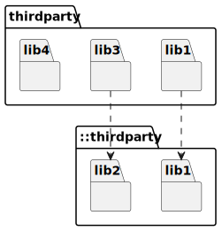

# t30017 - Test case for '::' prefix in packages diagrams for namespaces outside of using_namespace
## Config
```yaml
diagrams:
  t30017_package:
    type: package
    glob:
      - t30017.cc
    include:
      paths:
        - .
    using_namespace: clanguml::t30017
```
## Source code
File `tests/t30017/t30017.cc`
```cpp
namespace thirdparty {
namespace lib1 {
class A { };
}
namespace lib2 {
class B { };
}
}

namespace clanguml {
namespace t30017 {
namespace thirdparty {
namespace lib1 {
class A {
    ::thirdparty::lib1::A *a;
};
}
namespace lib3 {
class C {
    ::thirdparty::lib2::B *b;
};
}
namespace lib4 {
class D { };
}
}
}
}
```
## Generated PlantUML diagrams

## Generated Mermaid diagrams

## Generated JSON models
```json
{
  "diagram_type": "package",
  "elements": [
    {
      "display_name": "::thirdparty",
      "elements": [
        {
          "display_name": "lib1",
          "id": "13850353202625979941",
          "is_deprecated": false,
          "name": "lib1",
          "namespace": "thirdparty",
          "source_location": {
            "column": 11,
            "file": "t30017.cc",
            "line": 2,
            "translation_unit": "t30017.cc"
          },
          "type": "namespace"
        },
        {
          "display_name": "lib2",
          "id": "824003856459488564",
          "is_deprecated": false,
          "name": "lib2",
          "namespace": "thirdparty",
          "source_location": {
            "column": 11,
            "file": "t30017.cc",
            "line": 5,
            "translation_unit": "t30017.cc"
          },
          "type": "namespace"
        }
      ],
      "id": "10822617922104082325",
      "is_deprecated": false,
      "name": "thirdparty",
      "namespace": "",
      "source_location": {
        "column": 11,
        "file": "t30017.cc",
        "line": 1,
        "translation_unit": "t30017.cc"
      },
      "type": "namespace"
    },
    {
      "display_name": "thirdparty",
      "elements": [
        {
          "display_name": "lib1",
          "id": "2386387795857881716",
          "is_deprecated": false,
          "name": "lib1",
          "namespace": "clanguml::t30017::thirdparty",
          "source_location": {
            "column": 11,
            "file": "t30017.cc",
            "line": 13,
            "translation_unit": "t30017.cc"
          },
          "type": "namespace"
        },
        {
          "display_name": "lib3",
          "id": "7547352743118528133",
          "is_deprecated": false,
          "name": "lib3",
          "namespace": "clanguml::t30017::thirdparty",
          "source_location": {
            "column": 11,
            "file": "t30017.cc",
            "line": 18,
            "translation_unit": "t30017.cc"
          },
          "type": "namespace"
        },
        {
          "display_name": "lib4",
          "id": "15265419804710451825",
          "is_deprecated": false,
          "name": "lib4",
          "namespace": "clanguml::t30017::thirdparty",
          "source_location": {
            "column": 11,
            "file": "t30017.cc",
            "line": 23,
            "translation_unit": "t30017.cc"
          },
          "type": "namespace"
        }
      ],
      "id": "17784581637457454288",
      "is_deprecated": false,
      "name": "thirdparty",
      "namespace": "clanguml::t30017",
      "source_location": {
        "column": 11,
        "file": "t30017.cc",
        "line": 12,
        "translation_unit": "t30017.cc"
      },
      "type": "namespace"
    }
  ],
  "name": "t30017_package",
  "package_type": "namespace",
  "relationships": [
    {
      "destination": "13850353202625979941",
      "source": "2386387795857881716",
      "type": "dependency"
    },
    {
      "destination": "824003856459488564",
      "source": "7547352743118528133",
      "type": "dependency"
    }
  ],
  "using_namespace": "clanguml::t30017"
}
```
## Generated GraphML models
```xml
<?xml version="1.0"?>
<graphml xmlns="http://graphml.graphdrawing.org/xmlns" xmlns:xsi="http://www.w3.org/2001/XMLSchema-instance" xsi:schemaLocation="http://graphml.graphdrawing.org/xmlns http://graphml.graphdrawing.org/xmlns/1.0/graphml.xsd">
 <key attr.name="id" attr.type="string" for="graph" id="gd0" />
 <key attr.name="diagram_type" attr.type="string" for="graph" id="gd1" />
 <key attr.name="name" attr.type="string" for="graph" id="gd2" />
 <key attr.name="using_namespace" attr.type="string" for="graph" id="gd3" />
 <key attr.name="id" attr.type="string" for="node" id="nd0" />
 <key attr.name="type" attr.type="string" for="node" id="nd1" />
 <key attr.name="name" attr.type="string" for="node" id="nd2" />
 <key attr.name="stereotype" attr.type="string" for="node" id="nd3" />
 <key attr.name="url" attr.type="string" for="node" id="nd4" />
 <key attr.name="tooltip" attr.type="string" for="node" id="nd5" />
 <key attr.name="type" attr.type="string" for="edge" id="ed0" />
 <key attr.name="access" attr.type="string" for="edge" id="ed1" />
 <key attr.name="label" attr.type="string" for="edge" id="ed2" />
 <key attr.name="url" attr.type="string" for="edge" id="ed3" />
 <graph id="g0" edgedefault="directed" parse.nodeids="canonical" parse.edgeids="canonical" parse.order="nodesfirst">
  <data key="gd3">clanguml::t30017</data>
  <node id="n0">
   <data key="nd2">::thirdparty</data>
   <data key="nd1">namespace</data>
   <data key="nd4">https://github.com/bkryza/clang-uml/blob/1fa698c8f418c67d7d8c4f8e23c3e56636a93f97/tests/t30017/t30017.cc#L1</data>
   <data key="nd5">thirdparty</data>
   <graph id="g1" edgedefault="directed" parse.nodeids="canonical" parse.edgeids="canonical" parse.order="nodesfirst">
    <node id="n1">
     <data key="nd2">lib1</data>
     <data key="nd1">namespace</data>
     <data key="nd4">https://github.com/bkryza/clang-uml/blob/1fa698c8f418c67d7d8c4f8e23c3e56636a93f97/tests/t30017/t30017.cc#L2</data>
     <data key="nd5">lib1</data>
     <graph id="g2" edgedefault="directed" parse.nodeids="canonical" parse.edgeids="canonical" parse.order="nodesfirst" />
    </node>
    <node id="n2">
     <data key="nd2">lib2</data>
     <data key="nd1">namespace</data>
     <data key="nd4">https://github.com/bkryza/clang-uml/blob/1fa698c8f418c67d7d8c4f8e23c3e56636a93f97/tests/t30017/t30017.cc#L5</data>
     <data key="nd5">lib2</data>
     <graph id="g3" edgedefault="directed" parse.nodeids="canonical" parse.edgeids="canonical" parse.order="nodesfirst" />
    </node>
   </graph>
  </node>
  <node id="n3">
   <data key="nd2">thirdparty</data>
   <data key="nd1">namespace</data>
   <data key="nd4">https://github.com/bkryza/clang-uml/blob/1fa698c8f418c67d7d8c4f8e23c3e56636a93f97/tests/t30017/t30017.cc#L12</data>
   <data key="nd5">thirdparty</data>
   <graph id="g4" edgedefault="directed" parse.nodeids="canonical" parse.edgeids="canonical" parse.order="nodesfirst">
    <node id="n4">
     <data key="nd2">lib1</data>
     <data key="nd1">namespace</data>
     <data key="nd4">https://github.com/bkryza/clang-uml/blob/1fa698c8f418c67d7d8c4f8e23c3e56636a93f97/tests/t30017/t30017.cc#L13</data>
     <data key="nd5">lib1</data>
     <graph id="g5" edgedefault="directed" parse.nodeids="canonical" parse.edgeids="canonical" parse.order="nodesfirst" />
    </node>
    <node id="n5">
     <data key="nd2">lib3</data>
     <data key="nd1">namespace</data>
     <data key="nd4">https://github.com/bkryza/clang-uml/blob/1fa698c8f418c67d7d8c4f8e23c3e56636a93f97/tests/t30017/t30017.cc#L18</data>
     <data key="nd5">lib3</data>
     <graph id="g6" edgedefault="directed" parse.nodeids="canonical" parse.edgeids="canonical" parse.order="nodesfirst" />
    </node>
    <node id="n6">
     <data key="nd2">lib4</data>
     <data key="nd1">namespace</data>
     <data key="nd4">https://github.com/bkryza/clang-uml/blob/1fa698c8f418c67d7d8c4f8e23c3e56636a93f97/tests/t30017/t30017.cc#L23</data>
     <data key="nd5">lib4</data>
     <graph id="g7" edgedefault="directed" parse.nodeids="canonical" parse.edgeids="canonical" parse.order="nodesfirst" />
    </node>
   </graph>
  </node>
  <edge id="e0" source="n4" target="n1">
   <data key="ed0">dependency</data>
  </edge>
  <edge id="e1" source="n5" target="n2">
   <data key="ed0">dependency</data>
  </edge>
 </graph>
</graphml>

```
