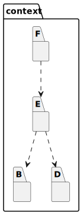

# t30018 - Test case for context filter in package diagram
## Config
```yaml
diagrams:
  t30018_package:
    generate_links:
      link: 'https://github.com/bkryza/clang-uml/blob/{{ git.commit }}/{{ element.source.path }}#L{{ element.source.line }}'
      tooltip: '{{ abbrv(trim(replace(element.comment.brief.0, "\n+", " ")), 256) }}{{ element.name }}'
    type: package
    glob:
      - t30018.cc
    include:
      namespaces:
        - clanguml::t30018
      context:
        - clanguml::t30018::context::E
    using_namespace: clanguml::t30018
```
## Source code
File `tests/t30018/t30018.cc`
```cpp
namespace clanguml::t30018 {
namespace context {
namespace X {
}
namespace A {
struct AA { };
} // namespace A

namespace B {
struct BB {
    A::AA *aa;
};
} // namespace B

namespace C {
struct CC {
    B::BB *bb;
};
namespace Y {
namespace YY {
namespace YYY {
} // namespace YYY
} // namespace YY
} // namespace Y
} // namespace C

namespace D {
struct DD { };
} // namespace D

namespace E {
struct EE {
    B::BB *bb;
    D::DD *dd;
};
} // namespace E

namespace F {
struct FF {
    E::EE *ee;
};
} // namespace F
} // namespace context
} // namespace clanguml::t30018
```
## Generated PlantUML diagrams

## Generated Mermaid diagrams

## Generated JSON models
```json
{
  "diagram_type": "package",
  "elements": [
    {
      "display_name": "context",
      "elements": [
        {
          "display_name": "B",
          "id": "3355864554476120606",
          "is_deprecated": false,
          "name": "B",
          "namespace": "clanguml::t30018::context",
          "source_location": {
            "column": 11,
            "file": "t30018.cc",
            "line": 9,
            "translation_unit": "t30018.cc"
          },
          "type": "namespace"
        },
        {
          "display_name": "D",
          "id": "17076543520870634420",
          "is_deprecated": false,
          "name": "D",
          "namespace": "clanguml::t30018::context",
          "source_location": {
            "column": 11,
            "file": "t30018.cc",
            "line": 27,
            "translation_unit": "t30018.cc"
          },
          "type": "namespace"
        },
        {
          "display_name": "E",
          "id": "2248550955268609788",
          "is_deprecated": false,
          "name": "E",
          "namespace": "clanguml::t30018::context",
          "source_location": {
            "column": 11,
            "file": "t30018.cc",
            "line": 31,
            "translation_unit": "t30018.cc"
          },
          "type": "namespace"
        },
        {
          "display_name": "F",
          "id": "12969559982727096966",
          "is_deprecated": false,
          "name": "F",
          "namespace": "clanguml::t30018::context",
          "source_location": {
            "column": 11,
            "file": "t30018.cc",
            "line": 38,
            "translation_unit": "t30018.cc"
          },
          "type": "namespace"
        }
      ],
      "id": "3843859098646855966",
      "is_deprecated": false,
      "name": "context",
      "namespace": "clanguml::t30018",
      "source_location": {
        "column": 11,
        "file": "t30018.cc",
        "line": 2,
        "translation_unit": "t30018.cc"
      },
      "type": "namespace"
    }
  ],
  "name": "t30018_package",
  "package_type": "namespace",
  "relationships": [
    {
      "destination": "3355864554476120606",
      "source": "2248550955268609788",
      "type": "dependency"
    },
    {
      "destination": "17076543520870634420",
      "source": "2248550955268609788",
      "type": "dependency"
    },
    {
      "destination": "2248550955268609788",
      "source": "12969559982727096966",
      "type": "dependency"
    }
  ],
  "using_namespace": "clanguml::t30018"
}
```
## Generated GraphML models
```xml
<?xml version="1.0"?>
<graphml xmlns="http://graphml.graphdrawing.org/xmlns" xmlns:xsi="http://www.w3.org/2001/XMLSchema-instance" xsi:schemaLocation="http://graphml.graphdrawing.org/xmlns http://graphml.graphdrawing.org/xmlns/1.0/graphml.xsd">
 <key attr.name="id" attr.type="string" for="graph" id="gd0" />
 <key attr.name="diagram_type" attr.type="string" for="graph" id="gd1" />
 <key attr.name="name" attr.type="string" for="graph" id="gd2" />
 <key attr.name="using_namespace" attr.type="string" for="graph" id="gd3" />
 <key attr.name="id" attr.type="string" for="node" id="nd0" />
 <key attr.name="type" attr.type="string" for="node" id="nd1" />
 <key attr.name="name" attr.type="string" for="node" id="nd2" />
 <key attr.name="stereotype" attr.type="string" for="node" id="nd3" />
 <key attr.name="url" attr.type="string" for="node" id="nd4" />
 <key attr.name="tooltip" attr.type="string" for="node" id="nd5" />
 <key attr.name="type" attr.type="string" for="edge" id="ed0" />
 <key attr.name="access" attr.type="string" for="edge" id="ed1" />
 <key attr.name="label" attr.type="string" for="edge" id="ed2" />
 <key attr.name="url" attr.type="string" for="edge" id="ed3" />
 <graph id="g0" edgedefault="directed" parse.nodeids="canonical" parse.edgeids="canonical" parse.order="nodesfirst">
  <data key="gd3">clanguml::t30018</data>
  <node id="n0">
   <data key="nd2">context</data>
   <data key="nd1">namespace</data>
   <data key="nd4">https://github.com/bkryza/clang-uml/blob/f9dc92716f708427995c19ec36d9af89e7bfd921/tests/t30018/t30018.cc#L2</data>
   <data key="nd5">context</data>
   <graph id="g1" edgedefault="directed" parse.nodeids="canonical" parse.edgeids="canonical" parse.order="nodesfirst">
    <node id="n1">
     <data key="nd2">B</data>
     <data key="nd1">namespace</data>
     <data key="nd4">https://github.com/bkryza/clang-uml/blob/f9dc92716f708427995c19ec36d9af89e7bfd921/tests/t30018/t30018.cc#L9</data>
     <data key="nd5">B</data>
     <graph id="g2" edgedefault="directed" parse.nodeids="canonical" parse.edgeids="canonical" parse.order="nodesfirst" />
    </node>
    <node id="n2">
     <data key="nd2">D</data>
     <data key="nd1">namespace</data>
     <data key="nd4">https://github.com/bkryza/clang-uml/blob/f9dc92716f708427995c19ec36d9af89e7bfd921/tests/t30018/t30018.cc#L27</data>
     <data key="nd5">D</data>
     <graph id="g3" edgedefault="directed" parse.nodeids="canonical" parse.edgeids="canonical" parse.order="nodesfirst" />
    </node>
    <node id="n3">
     <data key="nd2">E</data>
     <data key="nd1">namespace</data>
     <data key="nd4">https://github.com/bkryza/clang-uml/blob/f9dc92716f708427995c19ec36d9af89e7bfd921/tests/t30018/t30018.cc#L31</data>
     <data key="nd5">E</data>
     <graph id="g4" edgedefault="directed" parse.nodeids="canonical" parse.edgeids="canonical" parse.order="nodesfirst" />
    </node>
    <node id="n4">
     <data key="nd2">F</data>
     <data key="nd1">namespace</data>
     <data key="nd4">https://github.com/bkryza/clang-uml/blob/f9dc92716f708427995c19ec36d9af89e7bfd921/tests/t30018/t30018.cc#L38</data>
     <data key="nd5">F</data>
     <graph id="g5" edgedefault="directed" parse.nodeids="canonical" parse.edgeids="canonical" parse.order="nodesfirst" />
    </node>
   </graph>
  </node>
  <edge id="e0" source="n3" target="n1">
   <data key="ed3">https://github.com/bkryza/clang-uml/blob/f9dc92716f708427995c19ec36d9af89e7bfd921/tests/t30018/t30018.cc#L33</data>
   <data key="ed0">dependency</data>
  </edge>
  <edge id="e1" source="n3" target="n2">
   <data key="ed3">https://github.com/bkryza/clang-uml/blob/f9dc92716f708427995c19ec36d9af89e7bfd921/tests/t30018/t30018.cc#L34</data>
   <data key="ed0">dependency</data>
  </edge>
  <edge id="e2" source="n4" target="n3">
   <data key="ed3">https://github.com/bkryza/clang-uml/blob/f9dc92716f708427995c19ec36d9af89e7bfd921/tests/t30018/t30018.cc#L40</data>
   <data key="ed0">dependency</data>
  </edge>
 </graph>
</graphml>

```
