# t40001 - Basic include graph diagram test case
## Config
```yaml
diagrams:
  t40001_include:
    type: include
    title: Basic include diagram example
    # Provide the files to parse in order to look
    # for #include directives
    glob:
      - src/t40001.cc
    # Include also external system headers
    generate_system_headers: true
    include:
      # Include only headers belonging to these paths
      paths:
        - .
    plantuml:
      before:
        - "' t40001 test diagram of type {{ diagram.type }}"
      after:
        - 'note right of {{ alias("include/lib1") }}: This is a lib1 include dir'
        - 'note right of {{ alias("include/t40001_include1.h") }}: This is a t40001_include1.h include file'
    mermaid:
      before:
        - "%% t40001 test diagram of type {{ diagram.type }}"
      after:
        - 'N_00001(This is a lib1 include dir)-.-{{ alias("include/lib1") }}'
        - 'N_00002(This is a t40001_include1.h include file)-.-{{ alias("include/t40001_include1.h") }}'
```
## Source code
File `tests/t40001/src/t40001.cc`
```cpp
#include <string>
#include <vector>

#include "../include/t40001_include1.h"

namespace clanguml {
namespace t40001 {

} // namespace t40001
} // namespace clanguml

```
File `tests/t40001/include/t40001_include1.h`
```cpp
#pragma once

#include "lib1/lib1.h"

#include <yaml-cpp/yaml.h>

#include <string>

namespace clanguml::t40001 {

int foo() { return lib1::foo2(); }

}

```
File `tests/t40001/include/lib1/lib1.h`
```cpp
#pragma once

namespace clanguml::t40001::lib1 {

int foo2() { return 0; }

}
```
## Generated PlantUML diagrams

## Generated Mermaid diagrams

## Generated JSON models
```json
{
  "diagram_type": "include",
  "elements": [
    {
      "display_name": "src",
      "elements": [
        {
          "display_name": "src/t40001.cc",
          "file_kind": "implementation",
          "id": "14040120133440142713",
          "name": "t40001.cc",
          "type": "file"
        }
      ],
      "id": "11100957978370531577",
      "name": "src",
      "type": "folder"
    },
    {
      "display_name": "string",
      "file_kind": "header",
      "id": "13497578857207247412",
      "is_system": true,
      "name": "string",
      "type": "file"
    },
    {
      "display_name": "vector",
      "file_kind": "header",
      "id": "3241631072200583771",
      "is_system": true,
      "name": "vector",
      "type": "file"
    },
    {
      "display_name": "include",
      "elements": [
        {
          "display_name": "include/t40001_include1.h",
          "file_kind": "header",
          "id": "15413542531524764165",
          "is_system": false,
          "name": "t40001_include1.h",
          "type": "file"
        },
        {
          "display_name": "include/lib1",
          "elements": [
            {
              "display_name": "include/lib1/lib1.h",
              "file_kind": "header",
              "id": "17548393712337957522",
              "is_system": false,
              "name": "lib1.h",
              "type": "file"
            }
          ],
          "id": "13501402687592147456",
          "name": "lib1",
          "type": "folder"
        }
      ],
      "id": "7915299339925655008",
      "name": "include",
      "type": "folder"
    },
    {
      "display_name": "yaml-cpp/yaml.h",
      "file_kind": "header",
      "id": "13277895155864363881",
      "is_system": true,
      "name": "yaml-cpp/yaml.h",
      "type": "file"
    }
  ],
  "name": "t40001_include",
  "relationships": [
    {
      "destination": "13497578857207247412",
      "source": "14040120133440142713",
      "type": "dependency"
    },
    {
      "destination": "3241631072200583771",
      "source": "14040120133440142713",
      "type": "dependency"
    },
    {
      "destination": "15413542531524764165",
      "source": "14040120133440142713",
      "type": "association"
    },
    {
      "destination": "17548393712337957522",
      "source": "15413542531524764165",
      "type": "association"
    },
    {
      "destination": "13277895155864363881",
      "source": "15413542531524764165",
      "type": "dependency"
    },
    {
      "destination": "13497578857207247412",
      "source": "15413542531524764165",
      "type": "dependency"
    }
  ],
  "title": "Basic include diagram example"
}
```
## Generated GraphML models
```xml
<?xml version="1.0"?>
<graphml xmlns="http://graphml.graphdrawing.org/xmlns" xmlns:xsi="http://www.w3.org/2001/XMLSchema-instance" xsi:schemaLocation="http://graphml.graphdrawing.org/xmlns http://graphml.graphdrawing.org/xmlns/1.0/graphml.xsd">
 <desc><![CDATA[Basic include diagram example]]></desc>
 <key attr.name="id" attr.type="string" for="graph" id="gd0" />
 <key attr.name="diagram_type" attr.type="string" for="graph" id="gd1" />
 <key attr.name="name" attr.type="string" for="graph" id="gd2" />
 <key attr.name="using_namespace" attr.type="string" for="graph" id="gd3" />
 <key attr.name="id" attr.type="string" for="node" id="nd0" />
 <key attr.name="type" attr.type="string" for="node" id="nd1" />
 <key attr.name="name" attr.type="string" for="node" id="nd2" />
 <key attr.name="stereotype" attr.type="string" for="node" id="nd3" />
 <key attr.name="url" attr.type="string" for="node" id="nd4" />
 <key attr.name="tooltip" attr.type="string" for="node" id="nd5" />
 <key attr.name="is_system" attr.type="boolean" for="node" id="nd6" />
 <key attr.name="type" attr.type="string" for="edge" id="ed0" />
 <key attr.name="access" attr.type="string" for="edge" id="ed1" />
 <key attr.name="label" attr.type="string" for="edge" id="ed2" />
 <key attr.name="url" attr.type="string" for="edge" id="ed3" />
 <graph id="g0" edgedefault="directed" parse.nodeids="canonical" parse.edgeids="canonical" parse.order="nodesfirst">
  <node id="n0">
   <data key="nd2">src</data>
   <data key="nd1">folder</data>
   <graph id="g1" edgedefault="directed" parse.nodeids="canonical" parse.edgeids="canonical" parse.order="nodesfirst">
    <node id="n1">
     <data key="nd1">file</data>
     <data key="nd2"><![CDATA[t40001.cc]]></data>
     <data key="nd3">source</data>
     <data key="nd4">https://github.com/bkryza/clang-uml/blob/1fa698c8f418c67d7d8c4f8e23c3e56636a93f97/tests/t40001/src/t40001.cc#L0</data>
     <data key="nd5">t40001.cc</data>
    </node>
   </graph>
  </node>
  <node id="n2">
   <data key="nd1">file</data>
   <data key="nd2"><![CDATA[string]]></data>
   <data key="nd3">header</data>
   <data key="nd6">true</data>
  </node>
  <node id="n3">
   <data key="nd1">file</data>
   <data key="nd2"><![CDATA[vector]]></data>
   <data key="nd3">header</data>
   <data key="nd6">true</data>
  </node>
  <node id="n4">
   <data key="nd2">include</data>
   <data key="nd1">folder</data>
   <graph id="g2" edgedefault="directed" parse.nodeids="canonical" parse.edgeids="canonical" parse.order="nodesfirst">
    <node id="n5">
     <data key="nd1">file</data>
     <data key="nd2"><![CDATA[t40001_include1.h]]></data>
     <data key="nd3">header</data>
     <data key="nd4">https://github.com/bkryza/clang-uml/blob/1fa698c8f418c67d7d8c4f8e23c3e56636a93f97/tests/t40001/include/t40001_include1.h#L0</data>
     <data key="nd5">t40001_include1.h</data>
    </node>
    <node id="n6">
     <data key="nd2">lib1</data>
     <data key="nd1">folder</data>
     <graph id="g3" edgedefault="directed" parse.nodeids="canonical" parse.edgeids="canonical" parse.order="nodesfirst">
      <node id="n7">
       <data key="nd1">file</data>
       <data key="nd2"><![CDATA[lib1.h]]></data>
       <data key="nd3">header</data>
      </node>
     </graph>
    </node>
   </graph>
  </node>
  <node id="n8">
   <data key="nd1">file</data>
   <data key="nd2"><![CDATA[yaml-cpp/yaml.h]]></data>
   <data key="nd3">header</data>
   <data key="nd6">true</data>
  </node>
  <edge id="e0" source="n1" target="n2">
   <data key="ed0">dependency</data>
  </edge>
  <edge id="e1" source="n1" target="n3">
   <data key="ed0">dependency</data>
  </edge>
  <edge id="e2" source="n1" target="n5">
   <data key="ed0">association</data>
  </edge>
  <edge id="e3" source="n5" target="n7">
   <data key="ed0">association</data>
  </edge>
  <edge id="e4" source="n5" target="n8">
   <data key="ed0">dependency</data>
  </edge>
  <edge id="e5" source="n5" target="n2">
   <data key="ed0">dependency</data>
  </edge>
 </graph>
</graphml>

```
