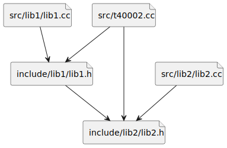

# t40002 - Cyclic include graph diagram test case
## Config
```yaml
diagrams:
  t40002_include:
    type: include
    generate_links:
      link: 'https://github.com/bkryza/clang-uml/blob/{{ git.commit }}/{{ element.source.path }}#L{{ element.source.line }}'
      tooltip: '{{ abbrv(trim(replace(element.comment.brief.0, "\n+", " ")), 256) }}{{ element.name }}'
    # Provide the files to parse in order to look
    # for #include directives
    glob:
      - src/t40002.cc
      - src/lib1/lib1.cc
      - src/lib2/lib2.cc
    include:
      # Include only files belonging to these paths relative to relative_to
      paths:
        - .
    exclude:
      paths:
        # Exclude single header relative to relative_to
        - include/lib2/lib2_detail.h
    plantuml:
      before:
        - "' t40002 test include diagram"
  t40002_include_no_packages:
    type: include
    generate_packages: false
    glob:
      - src/t40002.cc
      - src/lib1/lib1.cc
      - src/lib2/lib2.cc
    include:
      paths:
        - .
    exclude:
      paths:
        - include/lib2/lib2_detail.h
    plantuml:
      before:
        - "' t40002 test include diagram"
```
## Source code
File `tests/t40002/src/t40002.cc`
```cpp
#include "../include/lib1/lib1.h"
#include "../include/lib2/lib2.h"

namespace clanguml::t40002 {

int foo() { return lib1::foo() + lib2::foo(); }

}
```
File `tests/t40002/src/lib1/lib1.cc`
```cpp
#include "../../include/lib1/lib1.h"

#include <string>

namespace clanguml::t40002::lib1 {

int foo0() { return 0; }

int foo1() { return 1; }

int foo() { return foo1(); }

}
```
File `tests/t40002/src/lib2/lib2.cc`
```cpp
#include "../../include/lib2/lib2.h"
#include "../../include/lib2/lib2_detail.h"

namespace clanguml::t40002::lib2 {

int foo0() { return 0; }

int foo1() { return 1; }

int foo() { return foo1(); }

int foo22() { return 22; }

} // namespace clanguml::t40002::lib2
```
File `tests/t40002/include/lib1/lib1.h`
```cpp
#pragma once

#include "../lib2/lib2.h"

#include <string>

namespace clanguml::t40002::lib1 {

int foo0();

int foo1();

int foo();

}
```
File `tests/t40002/include/lib2/lib2_detail.h`
```cpp
#pragma once

namespace clanguml::t40002::lib2::detail {

int foo22();

}
```
File `tests/t40002/include/lib2/lib2.h`
```cpp
#pragma once

#include "lib2_detail.h"

namespace clanguml::t40002::lib2 {

int foo2();

int foo3();

int foo();

}
```
## Generated PlantUML diagrams


## Generated Mermaid diagrams


## Generated JSON models
```json
{
  "diagram_type": "include",
  "elements": [
    {
      "display_name": "src",
      "elements": [
        {
          "display_name": "src/t40002.cc",
          "file_kind": "implementation",
          "id": "11915602319277933652",
          "name": "t40002.cc",
          "type": "file"
        },
        {
          "display_name": "src/lib1",
          "elements": [
            {
              "display_name": "src/lib1/lib1.cc",
              "file_kind": "implementation",
              "id": "11951305658985723216",
              "name": "lib1.cc",
              "type": "file"
            }
          ],
          "id": "10277941644399287283",
          "name": "lib1",
          "type": "folder"
        },
        {
          "display_name": "src/lib2",
          "elements": [
            {
              "display_name": "src/lib2/lib2.cc",
              "file_kind": "implementation",
              "id": "14095000166128931568",
              "name": "lib2.cc",
              "type": "file"
            }
          ],
          "id": "11177797676640886425",
          "name": "lib2",
          "type": "folder"
        }
      ],
      "id": "11100957978370531577",
      "name": "src",
      "type": "folder"
    },
    {
      "display_name": "include",
      "elements": [
        {
          "display_name": "include/lib1",
          "elements": [
            {
              "display_name": "include/lib1/lib1.h",
              "file_kind": "header",
              "id": "17548393712337957522",
              "is_system": false,
              "name": "lib1.h",
              "type": "file"
            }
          ],
          "id": "13501402687592147456",
          "name": "lib1",
          "type": "folder"
        },
        {
          "display_name": "include/lib2",
          "elements": [
            {
              "display_name": "include/lib2/lib2.h",
              "file_kind": "header",
              "id": "15757398685574731504",
              "is_system": false,
              "name": "lib2.h",
              "type": "file"
            }
          ],
          "id": "9988244964011575444",
          "name": "lib2",
          "type": "folder"
        }
      ],
      "id": "7915299339925655008",
      "name": "include",
      "type": "folder"
    }
  ],
  "name": "t40002_include",
  "relationships": [
    {
      "destination": "17548393712337957522",
      "source": "11915602319277933652",
      "type": "association"
    },
    {
      "destination": "15757398685574731504",
      "source": "11915602319277933652",
      "type": "association"
    },
    {
      "destination": "17548393712337957522",
      "source": "11951305658985723216",
      "type": "association"
    },
    {
      "destination": "15757398685574731504",
      "source": "14095000166128931568",
      "type": "association"
    },
    {
      "destination": "15757398685574731504",
      "source": "17548393712337957522",
      "type": "association"
    }
  ]
}
```
```json
{
  "diagram_type": "include",
  "elements": [
    {
      "display_name": "src/t40002.cc",
      "file_kind": "implementation",
      "id": "11915602319277933652",
      "name": "src/t40002.cc",
      "type": "file"
    },
    {
      "display_name": "src/lib1/lib1.cc",
      "file_kind": "implementation",
      "id": "11951305658985723216",
      "name": "src/lib1/lib1.cc",
      "type": "file"
    },
    {
      "display_name": "src/lib2/lib2.cc",
      "file_kind": "implementation",
      "id": "14095000166128931568",
      "name": "src/lib2/lib2.cc",
      "type": "file"
    },
    {
      "display_name": "include/lib1/lib1.h",
      "file_kind": "header",
      "id": "17548393712337957522",
      "is_system": false,
      "name": "include/lib1/lib1.h",
      "type": "file"
    },
    {
      "display_name": "include/lib2/lib2.h",
      "file_kind": "header",
      "id": "15757398685574731504",
      "is_system": false,
      "name": "include/lib2/lib2.h",
      "type": "file"
    }
  ],
  "name": "t40002_include_no_packages",
  "relationships": [
    {
      "destination": "17548393712337957522",
      "source": "11915602319277933652",
      "type": "association"
    },
    {
      "destination": "15757398685574731504",
      "source": "11915602319277933652",
      "type": "association"
    },
    {
      "destination": "17548393712337957522",
      "source": "11951305658985723216",
      "type": "association"
    },
    {
      "destination": "15757398685574731504",
      "source": "14095000166128931568",
      "type": "association"
    },
    {
      "destination": "15757398685574731504",
      "source": "17548393712337957522",
      "type": "association"
    }
  ]
}
```
## Generated GraphML models
```xml
<?xml version="1.0"?>
<graphml xmlns="http://graphml.graphdrawing.org/xmlns" xmlns:xsi="http://www.w3.org/2001/XMLSchema-instance" xsi:schemaLocation="http://graphml.graphdrawing.org/xmlns http://graphml.graphdrawing.org/xmlns/1.0/graphml.xsd">
 <key attr.name="id" attr.type="string" for="graph" id="gd0" />
 <key attr.name="diagram_type" attr.type="string" for="graph" id="gd1" />
 <key attr.name="name" attr.type="string" for="graph" id="gd2" />
 <key attr.name="using_namespace" attr.type="string" for="graph" id="gd3" />
 <key attr.name="id" attr.type="string" for="node" id="nd0" />
 <key attr.name="type" attr.type="string" for="node" id="nd1" />
 <key attr.name="name" attr.type="string" for="node" id="nd2" />
 <key attr.name="stereotype" attr.type="string" for="node" id="nd3" />
 <key attr.name="url" attr.type="string" for="node" id="nd4" />
 <key attr.name="tooltip" attr.type="string" for="node" id="nd5" />
 <key attr.name="is_system" attr.type="boolean" for="node" id="nd6" />
 <key attr.name="type" attr.type="string" for="edge" id="ed0" />
 <key attr.name="access" attr.type="string" for="edge" id="ed1" />
 <key attr.name="label" attr.type="string" for="edge" id="ed2" />
 <key attr.name="url" attr.type="string" for="edge" id="ed3" />
 <graph id="g0" edgedefault="directed" parse.nodeids="canonical" parse.edgeids="canonical" parse.order="nodesfirst">
  <node id="n0">
   <data key="nd2">src</data>
   <data key="nd1">folder</data>
   <graph id="g1" edgedefault="directed" parse.nodeids="canonical" parse.edgeids="canonical" parse.order="nodesfirst">
    <node id="n1">
     <data key="nd1">file</data>
     <data key="nd2"><![CDATA[t40002.cc]]></data>
     <data key="nd3">source</data>
     <data key="nd4">https://github.com/bkryza/clang-uml/blob/9da36481b9eb7954b18a7dfc14bfe75f3b26702c/tests/t40002/src/t40002.cc#L0</data>
     <data key="nd5">t40002.cc</data>
    </node>
    <node id="n2">
     <data key="nd2">lib1</data>
     <data key="nd1">folder</data>
     <graph id="g2" edgedefault="directed" parse.nodeids="canonical" parse.edgeids="canonical" parse.order="nodesfirst">
      <node id="n3">
       <data key="nd1">file</data>
       <data key="nd2"><![CDATA[lib1.cc]]></data>
       <data key="nd3">source</data>
       <data key="nd4">https://github.com/bkryza/clang-uml/blob/9da36481b9eb7954b18a7dfc14bfe75f3b26702c/tests/t40002/src/lib1/lib1.cc#L0</data>
       <data key="nd5">lib1.cc</data>
      </node>
     </graph>
    </node>
    <node id="n4">
     <data key="nd2">lib2</data>
     <data key="nd1">folder</data>
     <graph id="g3" edgedefault="directed" parse.nodeids="canonical" parse.edgeids="canonical" parse.order="nodesfirst">
      <node id="n5">
       <data key="nd1">file</data>
       <data key="nd2"><![CDATA[lib2.cc]]></data>
       <data key="nd3">source</data>
       <data key="nd4">https://github.com/bkryza/clang-uml/blob/9da36481b9eb7954b18a7dfc14bfe75f3b26702c/tests/t40002/src/lib2/lib2.cc#L0</data>
       <data key="nd5">lib2.cc</data>
      </node>
     </graph>
    </node>
   </graph>
  </node>
  <node id="n6">
   <data key="nd2">include</data>
   <data key="nd1">folder</data>
   <graph id="g4" edgedefault="directed" parse.nodeids="canonical" parse.edgeids="canonical" parse.order="nodesfirst">
    <node id="n7">
     <data key="nd2">lib1</data>
     <data key="nd1">folder</data>
     <graph id="g5" edgedefault="directed" parse.nodeids="canonical" parse.edgeids="canonical" parse.order="nodesfirst">
      <node id="n8">
       <data key="nd1">file</data>
       <data key="nd2"><![CDATA[lib1.h]]></data>
       <data key="nd3">header</data>
       <data key="nd4">https://github.com/bkryza/clang-uml/blob/9da36481b9eb7954b18a7dfc14bfe75f3b26702c/tests/t40002/include/lib1/lib1.h#L0</data>
       <data key="nd5">lib1.h</data>
      </node>
     </graph>
    </node>
    <node id="n9">
     <data key="nd2">lib2</data>
     <data key="nd1">folder</data>
     <graph id="g6" edgedefault="directed" parse.nodeids="canonical" parse.edgeids="canonical" parse.order="nodesfirst">
      <node id="n10">
       <data key="nd1">file</data>
       <data key="nd2"><![CDATA[lib2.h]]></data>
       <data key="nd3">header</data>
       <data key="nd4">https://github.com/bkryza/clang-uml/blob/9da36481b9eb7954b18a7dfc14bfe75f3b26702c/tests/t40002/include/lib2/lib2.h#L0</data>
       <data key="nd5">lib2.h</data>
      </node>
     </graph>
    </node>
   </graph>
  </node>
  <edge id="e0" source="n1" target="n8">
   <data key="ed0">association</data>
  </edge>
  <edge id="e1" source="n1" target="n10">
   <data key="ed0">association</data>
  </edge>
  <edge id="e2" source="n8" target="n10">
   <data key="ed0">association</data>
  </edge>
  <edge id="e3" source="n3" target="n8">
   <data key="ed0">association</data>
  </edge>
  <edge id="e4" source="n5" target="n10">
   <data key="ed0">association</data>
  </edge>
 </graph>
</graphml>

```
```xml
<?xml version="1.0"?>
<graphml xmlns="http://graphml.graphdrawing.org/xmlns" xmlns:xsi="http://www.w3.org/2001/XMLSchema-instance" xsi:schemaLocation="http://graphml.graphdrawing.org/xmlns http://graphml.graphdrawing.org/xmlns/1.0/graphml.xsd">
 <key attr.name="id" attr.type="string" for="graph" id="gd0" />
 <key attr.name="diagram_type" attr.type="string" for="graph" id="gd1" />
 <key attr.name="name" attr.type="string" for="graph" id="gd2" />
 <key attr.name="using_namespace" attr.type="string" for="graph" id="gd3" />
 <key attr.name="id" attr.type="string" for="node" id="nd0" />
 <key attr.name="type" attr.type="string" for="node" id="nd1" />
 <key attr.name="name" attr.type="string" for="node" id="nd2" />
 <key attr.name="stereotype" attr.type="string" for="node" id="nd3" />
 <key attr.name="url" attr.type="string" for="node" id="nd4" />
 <key attr.name="tooltip" attr.type="string" for="node" id="nd5" />
 <key attr.name="is_system" attr.type="boolean" for="node" id="nd6" />
 <key attr.name="type" attr.type="string" for="edge" id="ed0" />
 <key attr.name="access" attr.type="string" for="edge" id="ed1" />
 <key attr.name="label" attr.type="string" for="edge" id="ed2" />
 <key attr.name="url" attr.type="string" for="edge" id="ed3" />
 <graph id="g0" edgedefault="directed" parse.nodeids="canonical" parse.edgeids="canonical" parse.order="nodesfirst">
  <node id="n0">
   <data key="nd1">file</data>
   <data key="nd2"><![CDATA[src/t40002.cc]]></data>
   <data key="nd3">source</data>
  </node>
  <node id="n1">
   <data key="nd1">file</data>
   <data key="nd2"><![CDATA[src/lib1/lib1.cc]]></data>
   <data key="nd3">source</data>
  </node>
  <node id="n2">
   <data key="nd1">file</data>
   <data key="nd2"><![CDATA[src/lib2/lib2.cc]]></data>
   <data key="nd3">source</data>
  </node>
  <node id="n3">
   <data key="nd1">file</data>
   <data key="nd2"><![CDATA[include/lib1/lib1.h]]></data>
   <data key="nd3">header</data>
  </node>
  <node id="n4">
   <data key="nd1">file</data>
   <data key="nd2"><![CDATA[include/lib2/lib2.h]]></data>
   <data key="nd3">header</data>
  </node>
  <edge id="e0" source="n0" target="n3">
   <data key="ed0">association</data>
  </edge>
  <edge id="e1" source="n0" target="n4">
   <data key="ed0">association</data>
  </edge>
  <edge id="e2" source="n3" target="n4">
   <data key="ed0">association</data>
  </edge>
  <edge id="e3" source="n1" target="n3">
   <data key="ed0">association</data>
  </edge>
  <edge id="e4" source="n2" target="n4">
   <data key="ed0">association</data>
  </edge>
 </graph>
</graphml>

```
